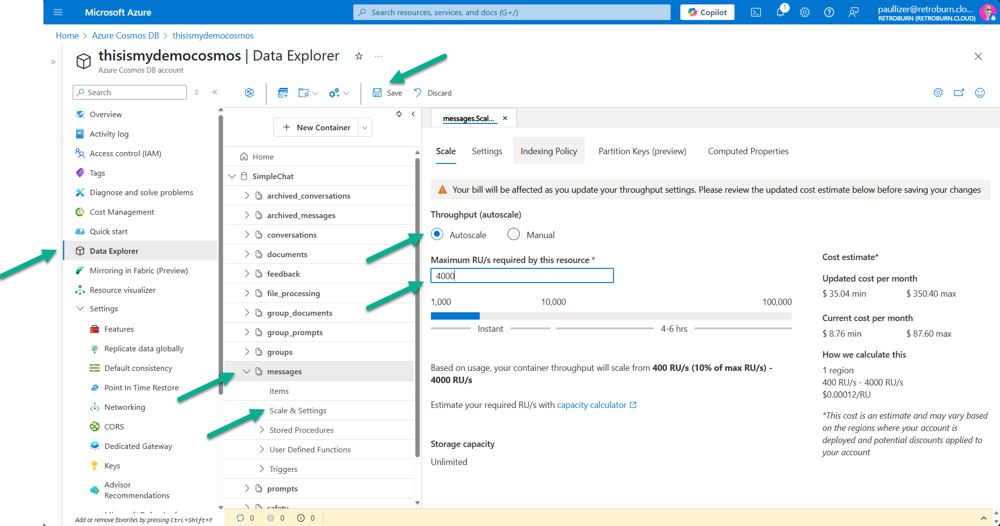

As load grows, Simple Chat usually hits one of four pressure points first: the App Service web tier, Cosmos DB throughput, Azure AI Search capacity, or rate limits on AI services. Treat each one independently so you do not pay to over-scale the wrong component.

<section class="latest-release-card-grid">
    <article class="latest-release-card">
        
<i class="bi bi-window-stack"></i>

        <h2>App Service</h2>
        
Scale up when single requests need more memory or CPU. Scale out when concurrent users, long chats, and upload traffic rise.

    </article>
    <article class="latest-release-card">
        
<i class="bi bi-database"></i>

        <h2>Cosmos DB</h2>
        
Watch RU consumption and move to container-level autoscale for the busiest containers so chat and document traffic do not fight each other.

    </article>
    <article class="latest-release-card">
        
<i class="bi bi-search"></i>

        <h2>Azure AI Search</h2>
        
Replicas lift query throughput, partitions lift storage and indexing throughput, and higher tiers raise the service ceiling when S1 runs out.

    </article>
    <article class="latest-release-card">
        
<i class="bi bi-cpu"></i>

        <h2>AI Services</h2>
        
OpenAI, Document Intelligence, Speech, Content Safety, and Video Indexer are usually quota-driven. Route them through APIM if you need retries, load balancing, or consistent policy enforcement.

    </article>
</section>

    <h2>General scaling principle</h2>
    
Use Azure Monitor and Application Insights to decide when to scale. Track CPU and memory, request latency, queue depth, RU consumption, search query latency, and rate-limit responses before changing service sizes.

## Azure App Service

The App Service hosts the Python backend and is the first place to look when the UI feels slow or request concurrency rises.

- Scale up by moving the App Service Plan to a larger SKU when individual requests are memory-heavy or CPU-heavy.
- Scale out by increasing instance count or using autoscale when you need more concurrent request capacity.
- Enable Redis-backed session storage before serious horizontal scaling so user sessions are not pinned to a single instance.
- Treat Redis as a prerequisite for clean high-availability behavior, not as an afterthought.

## Azure Cosmos DB

Cosmos DB stores settings, conversation history, document metadata, and related operational records. The core scaling lever is RU/s.

- Prefer autoscale so throughput can move between 10% and 100% of the configured maximum.
- Start with database-level throughput during setup, then move critical containers to container-level autoscale once real usage patterns are visible.
- Good starting points for heavier containers are `messages`, `documents`, and `group_documents` at 4000 RU/s max.
- Lower-volume containers such as `settings`, `feedback`, and `archived_conversations` can usually begin around 1000 RU/s max.
- Watch for HTTP 429 responses and sustained RU saturation before increasing limits.

If users are distributed across regions, consider global replication as a latency and availability tool. Multi-region deployment improves failover posture, but it also requires testing around consistency and application behavior.

## Azure AI Search

Azure AI Search usually becomes the next limiter once retrieval traffic and indexed data volume climb.

- Increase replicas to improve query throughput and basic high availability.
- Increase partitions to support larger indexes and faster indexing throughput.
- Plan partition count before the index becomes large because major partition changes often imply re-indexing.
- Move from S1 to S2, S3, or higher tiers when storage, replica, partition, or feature limits become the real constraint.

For production, monitor query latency and indexing backlog rather than scaling on intuition.

## Azure AI and Cognitive Services

Azure OpenAI, Document Intelligence, Content Safety, Speech, and Video Indexer are API-driven services with quota and rate-limit ceilings.

- Monitor tokens-per-minute, requests-per-minute, transactions-per-second, and backend throttling responses.
- Request quota increases when the service is healthy but the regional quota is the limiter.
- Use Azure API Management when you need retry policy, request shaping, throttling, or distribution across multiple backends.

### APIM as the scaling control plane

APIM is the recommended pattern when Simple Chat needs a stable gateway in front of AI services.

- It can spread traffic across multiple Azure OpenAI deployments or regions.
- It can rate-limit callers before they hit backend service quotas.
- It can retry transient failures such as HTTP 429 responses.
- It gives operations teams one place to apply auth, policy, and logging rules.

Simple Chat already supports APIM-backed configuration for GPT, embeddings, image generation, Content Safety, Document Intelligence, and Azure AI Search through Admin Settings.

For a strong Azure OpenAI pattern, review the [AzureOpenAI-with-APIM repository](https://github.com/microsoft/AzureOpenAI-with-APIM).
