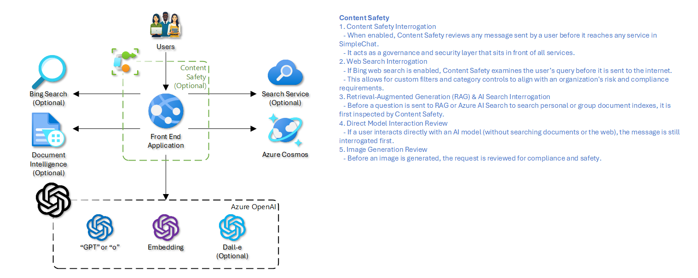
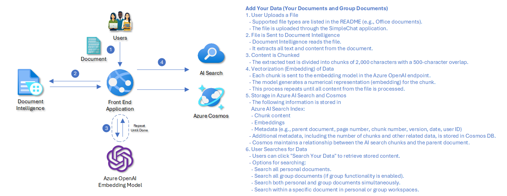

These flows are the fastest way to understand where Simple Chat applies safety checks, where Azure services participate, and where document-grounded answers actually come from.

<section class="latest-release-card-grid">
    <article class="latest-release-card">
        

            
        

        <h2>Content Safety</h2>
        
User prompts can be screened before the system touches retrieval, direct model calls, or image generation. Unsafe prompts are blocked before they propagate.

    </article>
    <article class="latest-release-card">
        

            
        

        <h2>Add Your Data</h2>
        
Uploads are extracted, chunked, embedded, and indexed so chat can retrieve the right fragments later with citations and metadata.

    </article>
</section>

    <h2>Why these two flows matter</h2>
    
The first flow protects the front door. The second flow determines whether retrieval answers are useful, traceable, and fast. Most production issues map back to one of these two paths.

## Content Safety Workflow

1. A user sends a message from the chat interface.
2. If Content Safety is enabled, the message is evaluated before it reaches the target backend service.
3. Azure AI Content Safety evaluates configured categories such as hate, sexual content, violence, and self-harm, and can also apply custom blocklists.
4. If the message passes, the system routes it to the intended destination.
5. If the message fails, the request is blocked and the user receives a generic notification. Details can be logged for administrators when that feature is enabled.

When a prompt is considered safe, it can continue into one of several paths:

- Retrieval-backed chat that queries Azure AI Search.
- Direct GPT interaction against Azure OpenAI.
- Image generation against a configured DALL-E deployment.

The default flow protects the inbound user message. Downstream services may still apply their own filtering behavior after that point.

## Add Your Data Workflow

This workflow covers what happens when users upload content into personal or group workspaces for Retrieval-Augmented Generation.

1. Users upload one or more supported files through the application UI.
2. The backend determines file type and chooses the correct extraction path.
3. Text is extracted through Azure AI Document Intelligence, Azure Video Indexer, Azure Speech Service, or internal parsers depending on the content type.
4. Extracted content is chunked into retrieval-friendly segments while preserving structural context such as pages, timestamps, tables, or sequence.
5. Each chunk is embedded through the configured Azure OpenAI embedding model.
6. The chunk text, embedding vector, and retrieval metadata are written to Azure AI Search.
7. Parent document records and processing metadata are written to Cosmos DB so the system can relate the original file to its indexed chunks.
8. Once indexing completes, the document becomes available to hybrid retrieval in chat and workspace search.

Typical chunk metadata includes document identity, filename, workspace scope, sequence numbers, page references, timestamps, and optional classification or extraction metadata.
