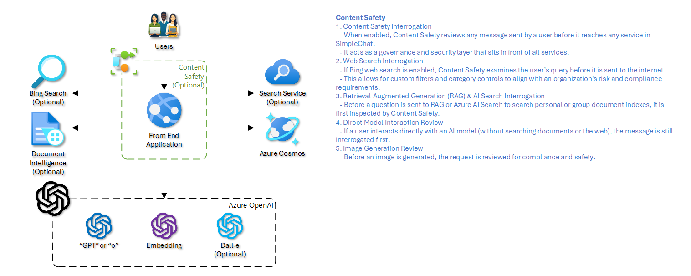

# Simple Chat - Application workflows

- [Content Safety](#content-safety)
- [Add your data (RAG Ingestion)](#add-your-data)

- [Return to Main](../README.md)

## Content Safety - Workflow

 

1.  **User Sends Message**: A user types a message in the chat interface.
2.  **Content Safety Interrogation (If Enabled)**:
    *   Before the message reaches *any* backend service (AI model, Search, Image Gen, etc.), it is sent to the configured **Azure AI Content Safety** endpoint.
    *   Content Safety analyzes the text for harmful content based on configured categories (Hate, Sexual, Violence, Self-Harm) and severity thresholds.
    *   Custom blocklists can also be applied.
3.  **Decision Point**:
    *   **If Safe**: The message proceeds to the intended service (e.g., Web Search, RAG, Direct Model Interaction, Image Generation).
    *   **If Unsafe**: The message is blocked. The user receives a generic notification (or configured message). Details of the violation may be logged (if configured) and potentially viewable by users with the `SafetyAdmin` role.
4.  **Service Interaction (If Safe)**:
    *   **Web Search**: The query is sent to Bing Search (if enabled).
    *   **RAG / AI Search**: The query is used to search Azure AI Search indexes (personal/group).
    *   **Direct Model Interaction**: The message is sent directly to the Azure OpenAI GPT model.
    *   **Image Generation**: The prompt is sent to the Azure OpenAI DALL-E model (if enabled).
    *   *Note:* Responses from these services are typically *not* sent back through Content Safety by default in this flow, though Azure OpenAI itself has built-in content filtering.

## Add your data (RAG Ingestion)

This workflow describes how documents uploaded via "Your Workspace" or "Group Workspaces" are processed for Retrieval-Augmented Generation.

 

1.  **User Uploads File(s)**:
    *   User selects one or more supported files via the application UI (e.g., PDF, DOCX, TXT, MP4, MP3).
    *   Files are sent to the backend application running on Azure App Service.
2.  **Initial Processing & Text Extraction**:
    *   The backend determines the file type.
    *   The file is sent to the appropriate service for text extraction:
        *   **Azure AI Document Intelligence**: For PDFs, Office Docs, Images (OCR). Extracts text, layout, tables.
        *   **Azure Video Indexer**: For videos. Extracts audio transcript and frame OCR text (if enabled).
        *   **Azure Speech Service**: For audio files. Extracts audio transcript (if enabled).
        *   **Internal Parsers**: For plain text, HTML, Markdown, JSON, CSV.
3.  **Content Chunking**:
    *   The extracted text content is divided into smaller, manageable chunks based on file type and content structure.
    *   Chunking strategies vary (see [Advanced Chunking Logic](#advanced-chunking-logic) under Latest Features) but aim for semantic coherence and appropriate size (~400-1200 words, depending on type), often with overlap between chunks to preserve context. Timestamps or page numbers are included where applicable.
4.  **Vectorization (Embedding)**:
    *   Each text chunk is sent to the configured **Embedding Model** endpoint in **Azure OpenAI**.
    *   The model generates a high-dimensional **vector embedding** (a numerical representation) for the semantic content of the chunk.
    *   This process repeats for all chunks from the uploaded file(s).
5.  **Storage in Azure AI Search and Cosmos DB**:
    *   For each chunk, the following are stored in the appropriate **Azure AI Search Index** (`simplechat-user-index` or `simplechat-group-index`):
        *   Chunk content (text).
        *   Vector embedding.
        *   Metadata: Parent document ID, user/group ID, filename, chunk sequence number, page number (if applicable), timestamp (if applicable), classification tags (if applicable), extracted keywords/summary (if applicable).
    *   Metadata about the **parent document** (e.g., original filename, total chunks, upload date, user ID, group ID, document version, classification, processing status) is stored in **Azure Cosmos DB**.
    *   Cosmos DB maintains the relationship between the parent document record and its constituent chunks stored in Azure AI Search.
6.  **Ready for Retrieval**:
    *   Once indexed, the document content is available for hybrid search (vector + keyword) when users toggle "Search Your Data" or perform targeted searches within workspaces.
