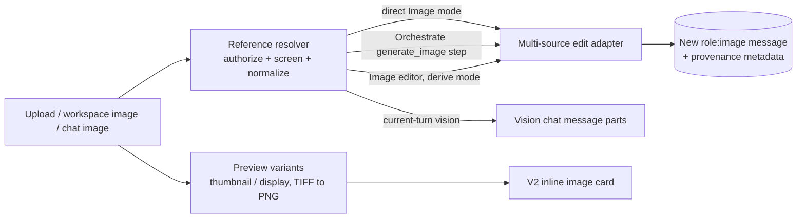

# Chat Image Uploads and Reference Images

## Overview

Before this change, uploading an image in chat got it processed into the workspace, but the V2
thread showed only a file-name chip. The image itself never appeared. Image generation also had
no access to the picture. The image model received only the text extracted from it, so these
requests could not work:

- "Make a cartoon of my house" with a photo of the house.
- "Create a new image using my face" with a portrait.
- "Turn this landscape map into an architectural diagram" with the map.

This feature makes uploaded images visible and usable:

- **Inline display.** An uploaded PNG, JPG, BMP, or TIFF image is drawn in the thread with a
  full-size viewer, instead of appearing as a file name.
- **Reference images in Image mode.** Images attached while **Image** is on are sent to the image
  model as visual input, alongside the prompt.
- **Use as reference.** Any uploaded or generated image in the conversation can be added to the
  next image request.
- **Edit an upload.** The image editor can turn an uploaded image into a new AI image, optionally
  guided by a selected region. The original upload is never changed.
- **Orchestrate.** Planned image steps can use attached and conversation images as references.
- **Current-turn vision.** Images attached to a message are shown to a vision-capable chat model
  as pixels, not only as their extracted text.

**Implemented in version: 0.261.192**

### What this deliberately does not do

- **No HEIC/HEIF conversion.** The only maintained Python HEIC decoder ships binary wheels that
  bundle a GPL-licensed encoder, so it is not added. HEIC previews are served as-is and render in
  Safari. Other browsers show the file card with a hint to convert the image to JPG or PNG. HEIC
  can't be used as a reference or as vision input.
- **No classic interface changes.** The routes are shared, so a TIFF uploaded without workspaces
  now renders in the classic interface too. The reference and editing controls are V2 only.
- **No shared (collaborative) conversation support.** Shared conversations keep the file chip,
  and reference affordances are hidden there.
- **Only the first page of a multi-page TIFF** is displayed or sent.
- **No history vision.** Only images attached to the message being answered are sent as pixels.
  Earlier images stay in history as their extracted text.

### Dependencies

None added. Pillow is already pinned and handles detection, TIFF conversion, thumbnails, and
normalization. No npm package, CDN asset, or model catalog download was introduced.

## Architecture



### Format helpers

`functions_image_formats.py` is the single place bytes are inspected and converted.

| Function | Purpose |
|---|---|
| `detect_image_format` | Identifies the format from the bytes with Pillow, plus an ISO-BMFF `ftyp` brand check for HEIC/HEIF. The file extension is never trusted alone. |
| `to_browser_image(bytes, variant)` | `display` converts TIFF to PNG and passes browser formats through. `thumbnail` limits the long edge to 1,024 pixels. HEIC is returned unchanged as `image/heic`. |
| `normalize_model_image` | Prepares model input: applies EXIF orientation (which also drops EXIF and GPS metadata), converts CMYK, palette, and 16-bit modes, downscales to 2,048 pixels, and encodes PNG when there is transparency or JPEG otherwise. |

Decoding is capped at 64 megapixels and 64 MB, and Pillow's decompression-bomb error is handled
as a clean rejection.

### Preview routes

| Route | Purpose |
|---|---|
| `GET /api/image/<message_id>?variant=thumbnail\|display` | Previews an image attached to a conversation. Workspace-backed uploads are read through `read_available_document_bytes`, which enforces authorization and content screening. Without `variant`, the route behaves exactly as before. |
| `GET /api/workspace_documents/image_preview?doc_id=&scope=&scope_id=&variant=` | Previews a workspace image that is not attached to the conversation, such as a picker selection or a reference thumbnail. It enforces the per-scope workspace setting and refuses non-image documents with `415`. |

Both return `Cache-Control: no-store, private` and `X-Content-Type-Options: nosniff`.

When the preview returns `409` (for example `document_under_review`) or `503`, the inline card
polls the document status. It shows "Processing image…" while the workspace is still working on
the file and retries the preview once the document is ready. A document that stays held shows
"Unavailable pending review.", and one that fails processing falls back to the file card.

When workspaces are off, the legacy upload path stores a PNG display copy for TIFF so it renders.
The original bytes still feed text extraction and image analysis.

### Reference resolver

`functions_image_references.py` turns a request's references into model-ready sources.

```jsonc
"image_references": [
  {"type": "message", "message_id": "<conversation id>_image_<timestamp>_<suffix>"},
  {"type": "document", "document_id": "<id>", "scope": "personal|group|public", "scope_id": null}
]
```

- **Message references** must belong to the current conversation, after the route has already
  authorized the conversation. Generated and legacy-upload `role: 'image'` messages load through
  `load_current_image_bytes`, so the version currently on screen is used. Workspace uploads
  (`role: 'file'`) load through `read_available_document_bytes(purpose='model')`.
- **Document references** check the scope's workspace setting and then read through
  `read_available_document_bytes` with the scope's group or public workspace id.
- Every source is normalized, and the total is kept within a 50 MB budget by downscaling further
  when needed.
- The returned provenance holds the type, ids, scope, and a sanitized file name. It never holds
  bytes.

| Error code | Status | Meaning |
|---|---|---|
| `invalid_image_references` | 400 | The list is malformed: an unknown type or scope, an invalid id, or a group or public reference without its `scope_id`. |
| `unsupported_image_operation` | 400 | The image model can't use references, or a region was selected with more than one reference or on a model without masking. References are never silently dropped. |
| `too_many_reference_images` | 400 | More references than the model accepts. |
| `unsupported_reference_format` | 415 | A HEIC/HEIF image, or a document that is not an image. |
| `document_under_review` | 409 | The document is held until content screening and review are complete. Other screening errors keep their own codes. |
| `image_reference_not_found` | 404 | Missing, or not accessible to this user. The response is the same either way, so existence isn't revealed. |

### Model limits

`static/json/model_capabilities.json` records how many references each image operation accepts.
The capability resolver projects `max_reference_images` and `input_fidelity` into
`/api/v2/bootstrap` under `capabilities.image_edit`. The application also caps every request at
10 references.

| Image operation profile | References accepted | Effective limit |
|---|---|---|
| OpenAI Responses image tool, OpenAI Images, Azure OpenAI Images (GPT Image) | 16 | 10 |
| FLUX.2 pro | 8 | 8 |
| FLUX.2 flex | 10 | 10 |
| MAI Image, FLUX Kontext | 1 | 1 |
| Generation-only models (for example DALL·E 3) | 0 | References unavailable |

`input_fidelity: "high"` is sent only for models the catalog marks as supporting it (GPT Image 1
and 1.5). It asks the model to preserve faces and fine detail more closely.

### Multi-source edit adapter

`edit_image` in `functions_image_adapters.py` accepts a list of sources and keeps accepting a
single source for existing callers.

| API family | How references are sent |
|---|---|
| Responses image tool | One `input_image` part per reference, with the tool set to edit |
| Images API | `images.edit(image=[...])` |
| FLUX.2 | `input_image`, `input_image_2`, and so on |
| MAI Image, FLUX Kontext | Exactly one reference |

A mask is accepted only with exactly one reference.

### Direct Image mode

`POST /api/chat` and `POST /api/chat/stream` read `image_references`, `image_mask`, and
`image_mask_regions`.

- With references, the request becomes a source-image edit. Without them, text-only generation
  is unchanged.
- References are resolved before the user message is saved, so a refused reference leaves no
  orphaned message behind.
- The user message and the generated image both record `metadata.image_references` (and
  `metadata.image_reference_mask` when a region was used).
- The prompt numbers the references in the order they were attached (image 1, image 2, and so
  on), so an instruction can refer to them by position.
- Retrying or editing a message that used references resolves and authorizes them again. The
  selection mask is not saved, so a retry edits the whole image and says so.

Stream thoughts report what happened:

- "Using N reference image(s)"
- "Editing the selected region of the reference image"
- "The original selection mask isn't saved, so this retry edits the whole image"

Image mode sends `hybrid_search: false`, so an attached image is not also treated as a document
search request.

### Current-turn vision

`functions_chat_vision.py` collects the images attached to the message being answered:

- Uploads since the last assistant reply (workspace `role: 'file'` images and legacy
  `role: 'image'` uploads).
- Image documents the user explicitly selected for this message.

Up to four images, normalized to 2,048 pixels within a 20 MB budget, are appended to the final
user message as `image_url` parts. History stays text-only. The thought "Including N image(s) from
this message" is shown.

Vision is used only when all of these are true:

- The request is answered by a model directly, not by an agent, Orchestrate, or Image mode.
- The provider accepts OpenAI-style image parts (Azure OpenAI, Foundry, and OpenAI or Gemini
  OpenAI-compatible connections), or is Anthropic, whose adapter converts the parts.
- `is_vision_capable_model` recognizes the model.

HEIC images and images that fail to load are skipped with a debug log; the turn never fails
because of them. If the model call fails with images attached, it is retried once without them.

### Orchestrate

Orchestrate's image style rule no longer forces illustrations. Planned images follow the style
the user asks for, including photorealistic, and are captioned **AI-generated image**. A
generated image is never presented as a real photograph or as found on the web.

With **Image** on, the composer sends the message's images as `image_references` seeds, the same
list direct Image mode sends. Planning turns them into two candidate lists, computed on the
server and stored in the run's seeds so plan editing and revisions keep them:

- `image_reference_documents` holds selected workspace documents that are reference-capable
  images (PNG, JPG, BMP, or TIFF), read from the authorized source manifest. HEIC images,
  conversation-scoped files, and documents the user can't read are not offered.
- `image_reference_messages` holds image messages from this conversation that the user
  referenced, such as a generated image chosen with **Use as reference**.

A ready workspace upload arrives twice: as a selected document and as its upload message. It is
offered once, as the document. A plan that uses the upload as a reference therefore also counts
as using the selected document.

The `generate_image` step accepts `reference_document_ids` and `reference_message_ids`:

- The planner sees them only when candidates exist and the image model can use references. Each
  is an enum of the candidate ids, capped at the model's reference limit.
- Validation rejects unknown, duplicate, and over-limit ids. It runs again against the run's
  seeds before the step executes.
- The step resolves its references through the same resolver as direct Image mode, so
  authorization, screening, and normalization are identical.
- Referenced documents become the step's result sources, taken from the executor's authorized
  source manifest, so lineage and screening withdrawal cover the generated image. A conversation
  image message has no document lineage, as in direct Image mode.

Planning stops with a clear message instead of ignoring a reference:

- "The configured image model cannot use reference images. Remove them and retry." when the
  request carries references the configured model can't use, for example after an administrator
  changes the image model. The composer doesn't send references to such a model.
- "A reference image could not be opened. Review your image selection." when a referenced image
  is missing, unreadable, or in an unsupported format.

In the composer, images added with **Use as reference** show the hint "Planned image steps can
use these references". The plan card shows each reference on its image step as a chip with a
thumbnail and name. In **Review**, a reference can be removed from the step and restored before
approval. With every reference removed, the image is generated from its prompt alone.

## Usage

### See an uploaded image

Upload a PNG, JPG, BMP, or TIFF file in a personal V2 conversation with workspaces enabled. The
thread shows the image. Select it to open the full-size viewer. While the workspace is still
processing the file, the card shows "Processing image…".

### Create an image from your own picture

1. Turn on **Image**.
2. Attach the picture with **Attach a reference image**, paste it, or drop it on the composer.
   You can also pick workspace images with **Documents**, which shows only images in this mode.
   It lists your most recent images first; search by name to find an older one.
3. Describe what to create, for example "a cartoon of this house at sunset".
4. Send. The sent message shows the reference thumbnails, followed by the new image.

The composer shows how many references are attached and how many the model accepts, for example
"1 / 10 reference images". When the image model can't use references, the upload and Documents
controls stay disabled and the composer explains why.

### Reuse an image already in the conversation

Select **Use as reference** under an uploaded or generated image, or in the full-size viewer.
Image mode turns on and the image is added to the next request. Explicit references are dropped
if you switch to another conversation, because they only apply to the conversation they came
from.

### Edit an uploaded image into a new one

Select **Edit** under an uploaded image. The editor opens in "Create image from reference" mode:

- Describe the change.
- On a model that supports masking, optionally select a region.
- Select **Create new image**.

The editor closes and the conversation shows your instruction with the reference thumbnail,
followed by the new image. The upload is unchanged. Generated images keep the existing in-place
editor with history and restore.

### Use your pictures in an orchestrated plan

1. Turn on **Orchestrate** and **Image**.
2. Attach the pictures, pick workspace images with **Documents**, or select **Use as reference**
   on an image in the conversation.
3. Describe the whole task, for example "research craftsman architecture and create a cartoon of
   my house in that style".
4. Check the plan's **Generate image** step. It lists the reference images it will use. Remove
   any you don't want before approving.

If the plan runs without asking for approval, the references are used as planned.

## Testing and validation

| Test | Coverage |
|---|---|
| `functional_tests/test_image_format_conversion.py` | Detection, TIFF conversion, thumbnails, normalization, HEIC handling, decode caps |
| `functional_tests/test_chat_image_upload_preview_route.py` | Preview variants, screening and authorization, non-image refusal |
| `functional_tests/test_image_reference_resolver.py` | Parsing, conversation scoping, workspace flags, limits, budget, error codes |
| `functional_tests/test_chat_image_reference_request.py` | Request parsing, mask rules, prompts, thoughts |
| `functional_tests/test_image_chat_route_integration.py` | Route wiring, persistence of provenance, retry replay |
| `functional_tests/test_image_edit_provider_operations.py` | Multi-source requests per API family and mask rules |
| `functional_tests/test_image_provider_capabilities.py` | Reference limits and input fidelity projection |
| `functional_tests/test_chat_vision_current_turn.py` | Current-turn collection, explicit selection, gating, message shape |
| `functional_tests/test_orchestration_image_references.py` | Seeds, candidates (enriched metadata, scopes, upload folding, batching, model gating), schema constraints, approval edits, execution revalidation, lineage, readiness |
| `functional_tests/test_v2_image_reference_logic.mjs` | Reference normalization, draft merging, composer gating |
| `ui_tests/test_v2_chat_image_uploads.py` | Inline card, processing state, viewer, HEIC fallback |
| `ui_tests/test_v2_image_reference_generation.py` | Image-mode uploads, HEIC rejection, request body, Use as reference, conversation switching, capability gating |
| `ui_tests/test_v2_image_editor.py` | Derive mode controls and the direct Image-mode request with a mask |
| `ui_tests/test_v2_orchestration_plan_editor.py` | Reference image chips on a planned image step, removal and restore |

### Known limitations

- HEIC/HEIF previews render in Safari only.
- An inline preview waits up to three minutes for processing and screening. A preview that is
  still unavailable after that, or whose stored image can't be read, shows the file card or
  "Unavailable pending review" until the conversation is reopened.
- In Image mode, **Documents** looks for images among recent documents only: up to 200 in your
  personal workspace, 200 across your groups, and the 50 newest public workspace documents. It
  lists up to 12 images from each. Search by name to find an older personal or group image.
- A workspace upload must finish processing before the message can be sent.
- Provider safety systems may refuse some edits, for example of real people. How closely a face is
  preserved depends on the model.
- Orchestrate reasoning steps still read the extracted text. Only planned image steps use pixels.
- Orchestrate offers only the images you attach, select, or reference as reference images. An
  image the planner finds through document search is not offered.
- Image proposals do not use references.
