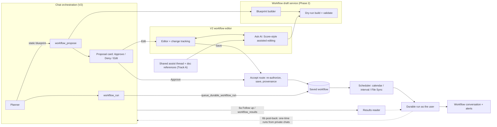

# Chat orchestration workflows roadmap

Prepared: **2026-09-28**. Repository: **microsoft/simplechat**.

Planned against version: **0.261.143** (`application\single_app\config.py`). This roadmap is documentation only, so it
doesn't change the version. Each phase records the version it ships in.

Planning branch: `paullizer-orchestration-workflows-capability`.

Status updated: **2026-10-01**, with `paullizer-react-v2-ui` at 0.261.213. The PRs for this work target that branch
(§10).

This is the master plan for letting chat orchestration propose, create, run and hand off saved workflows. It's the
durable copy of the approved plan. GitHub tracks the work in the umbrella issue
[#1543](https://github.com/microsoft/simplechat/issues/1543), with one sub-issue per phase and track item. Each phase
after Phase 0 is its own change and PR, planned on its own when it starts (§10).

Dependencies: V2 chat orchestration (`functions_orchestration*.py`), durable workflows (M5B and M5C;
[the M5C handover](WORKFLOW_M5C_COMPLETION_AND_NEXT_STEPS.md)), the notifications container
(`functions_notifications.py`), and the V2 UI (`application\v2_ui`).

## Roadmap status

| Phase | Name | Issue | Depends on | Status |
|---|---|---|---|---|
| 0 | Tracking: roadmap doc + GitHub issues | [#1543](https://github.com/microsoft/simplechat/issues/1543) (umbrella) | — | **Done** ([#1557](https://github.com/microsoft/simplechat/pull/1557)) |
| 1 | Calendar schedules (day, time, timezone) | [#1544](https://github.com/microsoft/simplechat/issues/1544) | — | **Done**: [#1561](https://github.com/microsoft/simplechat/pull/1561), v0.261.193 |
| 2 | Workflow draft service (dry-run build, blueprint builder, provenance) | [#1545](https://github.com/microsoft/simplechat/issues/1545) | 1 | **Done**: [#1566](https://github.com/microsoft/simplechat/pull/1566), v0.261.202. It also took gotcha 13 and Phase 1's two V2 editor follow-ups |
| 3 | AI workflow assistant (Score-style assisted editing in the V2 editor) | [#1548](https://github.com/microsoft/simplechat/issues/1548) | 3a: — · 3b: 2, A2 · 3c: 3a, 3b, A1 | **3a done**: [#1569](https://github.com/microsoft/simplechat/pull/1569), v0.261.203. **3b done**: [#1577](https://github.com/microsoft/simplechat/pull/1577), v0.261.208. **3c done**: [#1593](https://github.com/microsoft/simplechat/pull/1593), v0.261.213. Phase 3 is complete |
| 4 | Orchestration proposes workflows (`workflow_propose` + Approve / Deny / Edit card) | [#1547](https://github.com/microsoft/simplechat/issues/1547) | 2 | **Done**: [#1580](https://github.com/microsoft/simplechat/pull/1580), v0.261.207, behind **Propose Workflows From Chat** (off by default). It includes personal File Sync authoring in the V2 editor (gotcha 58) |
| 5 | Orchestration runs existing workflows (`workflow_run`, start-and-link) | [#1551](https://github.com/microsoft/simplechat/issues/1551) | 4 | **Done**: [#1594](https://github.com/microsoft/simplechat/pull/1594), v0.261.212, behind **Run Workflows From Chat** (off by default) |
| 6 | Results back in chat: 6a results reader + **Follow up**; 6b post-back delivery, run card and chat-list indicator; 6c in-plan wait (later) | [#1546](https://github.com/microsoft/simplechat/issues/1546) | 6a: 4 · 6b: 5, 6a, N1 | **6a in review**: [#1592](https://github.com/microsoft/simplechat/pull/1592). 6b and 6c not started |
| 7 | Hand-off of big one-time jobs | [#1549](https://github.com/microsoft/simplechat/issues/1549) | 4, 6b | Not started |
| 8 | Follow-ons: group workflows, #1347 parity, plan-replay task | [#1550](https://github.com/microsoft/simplechat/issues/1550) | 4+ | Not started |
| A1 | Shared AI-assist thread: immediate send, Cancel/Retry, one component for every assist editor | [#1552](https://github.com/microsoft/simplechat/issues/1552) | — | **Done**: [#1564](https://github.com/microsoft/simplechat/pull/1564), v0.261.200 |
| A2 | `#` document references in AI-assist inputs: plan editor now, workflow assistant via Phase 3. Not the artifact editors (Mermaid, chart, image) | [#1556](https://github.com/microsoft/simplechat/issues/1556) | A1 | **Done**: [#1568](https://github.com/microsoft/simplechat/pull/1568), v0.261.201. It merged into A1's branch and landed with #1564 |
| N1 | V2 notifications: bell and panel with deep links; the existing Desktop notifications preference works in V2 | [#1554](https://github.com/microsoft/simplechat/issues/1554) | — | **Done**: [#1563](https://github.com/microsoft/simplechat/pull/1563), v0.261.195 |
| N2 | Animated workflow alerts in V2: a notice with a visual bell jingle that opens into the full alert; two entrance styles tried in a dev-only lab, one ships | [#1553](https://github.com/microsoft/simplechat/issues/1553) | N1 | **Done**: [#1567](https://github.com/microsoft/simplechat/pull/1567), v0.261.199. Style A, the sidebar callout, shipped |
| P | Document provenance: hidden origin IDs on saved documents, a removable `workflow` tag, "Open the run / chat" links | [#1555](https://github.com/microsoft/simplechat/issues/1555) | — | **Done**: [#1562](https://github.com/microsoft/simplechat/pull/1562), v0.261.194 |
| — | `#` references + document search in the orchestration question card | — | — | **Already done** (`7c355534f`). No new work; A1's Playwright run includes a regression check |

Track A (AI-assist UX) is independent of the workflow phases, and both of its parts have landed (#1564). Phase 3
shipped as three PRs: 3a (change tracking), 3b (the assist endpoint) and 3c (the **Ask AI** tab, which also works on
a proposal opened with **Edit**). Phase 5 (#1594) lets a plan start a saved workflow and link to the run, and 6a
(#1592), the results reader and **Follow up**, is in review. Tracks N (V2 notifications) and P (document provenance)
are independent too, and all three of their items have landed, so 6b can rely on the V2 bell for undeliverable
results.

Repository follow-ups found along the way, not tied to one phase:

- The generated release-notes pages under `docs/explanation/release-notes/` are stale, so
  `test_docs_release_notes_integrity.py` fails on the base, with 149 stale releases at 0.261.213. The PRs above leave
  them alone; regenerate them once, in a docs-only change, after the in-flight PRs land.
- Other docs pages have pre-existing broken relative links (`test_docs_link_integrity.py`).
- **Fixed in [#1576](https://github.com/microsoft/simplechat/pull/1576)** (#1571): the PR guardrail workflows (broken
  access control, XSS sinks, Swagger routes, Python syntax, the malicious-PR review and CodeQL) now run on PRs into
  `paullizer-react-v2-ui` too, and `scripts/check_xss_sinks.py` checks the V2 app's `.ts` and `.tsx` code with a
  React-aware rule set.
- **Fixed in [#1579](https://github.com/microsoft/simplechat/pull/1579)** (#1572): under pytest, a test function that
  returns `False` now fails instead of passing with a warning (`functional_tests/conftest.py`). Its sweep found 443
  such tests in 202 files that pytest had been reporting as passed (`PYTEST_RETURN_FALSE_GUARD_FIX.md`). A guard
  failure isn't necessarily a product bug, because many of those tests need Azure configuration or setup that only
  their `__main__` runner does, so the files still need triage. Tests that need that setup, such as the eight
  `ui_tests/test_v2_orchestration_*` files, still run as `python <file>`.
- Two functional tests take about ten minutes each and are CPU-bound in
  `functions_workflow_node_results._cached_children`:
  `test_workflow_flow_inspection.py::test_exact_repeat_round_1001_is_lifetime_not_current_batch_or_live_revision` and
  `test_workflow_repeat_execution.py::test_real_thousand_round_batch_then_lifetime_round_1001`. Separately,
  `test_workflow_document_picker_recent_targets.py` leaves a stub `functions_search` module in `sys.modules`, which
  breaks later tests in the same process, such as `test_orchestration_research_pre_effect.py`.
- **Fixed in [#1578](https://github.com/microsoft/simplechat/pull/1578)** (#1573): the Flow canvas no longer rebuilds
  every node on each render. Its handlers are stable and an unchanged node keeps its object
  (`lib/workflowFlowNodeReuse.ts`), so React Flow keeps the measured handles and the edges stay attached
  (`V2_WORKFLOW_FLOW_CANVAS_STABLE_RERENDERS_FIX.md`).
- `test_v2_admin_settings_schema.py` fails on `paullizer-react-v2-ui`, because `m365_trusted_download_hosts` has a
  `[]` default on a string field. It appears to pass under `python -O`, because that check is a bare `assert` in
  `__main__`.
- Other failures on `paullizer-react-v2-ui` that the phase PRs report and leave alone:
  - `test_v2_prompt_composer_card.py`: two tests fail with `NameError: prepared_chat_image_references`. #1585 made
    the shipping-persistence block in `route_backend_chats.py` read that name, and the test's extracted copy of the
    block doesn't define it.
  - `ui_tests/test_v2_orchestration_auto_open.py` passes 1 of 5, even as `python <file>`, because its `_plan()`
    fixture has no `turn_id` or `conversation_id`, which `orchestrationController` needs before it accepts a plan.
  - `test_v2_chat_context_picker.py` still expects `onPickerOpenChange={setPickerOpen}` in `Composer.tsx`.
  - `test_block_revision_assist.py` reads `ASSIST_SYSTEM_PROMPT`, which is now `CHART_ASSIST_SYSTEM_PROMPT`.
  - `test_workflow_runtime_integration.py`: four tests fail because each run ends `failed` with a `NameError` for
    `WORKFLOW_SCHEDULED_TRIGGER_TYPES`. The test's copy of the runner keeps only literal constants, and the runner
    imports that name.
  - `test_orchestration_failure_telemetry.py` fails only after `test_orchestration_elicitation_context.py` in the
    same process. That file reimports `functions_orchestration_context` and `functions_orchestration_planner` while
    its stubs are installed, and leaves those copies in `sys.modules`.
  - Single tests: `test_document_removal_is_not_lost_when_editor_opens` in
    `test_orchestration_plan_revision_routes.py`, `test_run_record_keeps_the_turn_and_question_ids` in
    `test_orchestration_turn_recovery_identifiers.py`, and `test_revoked_record_refresh_clears_the_previous_page` in
    `ui_tests/test_v2_workflow_loops.py`.

## 1. Goal

Let chat orchestration decide that a **saved workflow** is the better way to satisfy a request, and then help the user
set one up. That covers:

- **Recurring** requests: "every Monday read my email and tell me what to do this week"
- **Event-driven** requests: "review new documents from File Sync"
- **Too big or long for a chat plan**

Orchestration limits: 8 steps by default / 30 hard; 180 s per step; 900 s per run by default / 7,200 s max; sequential;
no loops. Durable workflows have For each / Repeat, 50–100 tasks, leases, approval and recovery gates, and 24-hour
deadlines.

Separately, make workflows easy to shape and change through an AI assistant side channel modeled on Score's assisted
editing: every AI change is highlighted, each AI turn can be undone, and saving AI changes asks for confirmation. Along
the way, fix the input experience in the existing AI-assist side channels so your message appears in the thread
immediately. The plan editor and the workflow assistant also get `#` document references.

Finally, get results back to you in a way that works for long runs. A run started from chat posts its answer back into
that chat when it finishes, even hours later with the browser closed. You can ask follow-up questions about any run's
results from chat, and documents that workflows and chats create record where they came from.

## 2. Confirmed decisions

1. **Scope: everything, phased.** Propose + create, run existing workflows, results back in chat (instead of keeping
   the plan waiting; see #11), and hand-off with results posted back.
2. **Calendar schedules first**, as their own change.
3. **Personal workflows only in v1.** Group workflows are a follow-on (Phase 8).
4. **Result delivery and notifications.**
   - Recurring and event-driven runs post to the workflow's own conversation (unread dot). Workflow alerts follow the
     workflow's own alert settings, as today.
   - A one-time run started from a private chat (run or hand-off) posts its result back into that chat when it
     finishes (Phase 6b).
   - A delivered result uses the same signals as a normal reply: the unread dot (which also shows on pinned chats), the
     existing "AI responded" notice, and the opt-in desktop notification. No new pop-ups or toasts.
   - The bell gets a new notice only when a result can't be delivered (chat deleted, made shared, or access lost).
   - Never post into shared or collaborative chats.
5. **Consent**
   - Creating a workflow from chat always shows a card that needs a manual decision:
     - **Approve**: *Create & start* or *Create paused*
     - **Deny**
     - **Edit**: opens the V2 workflow editor prefilled; saving there counts as approval
   - This applies even if plan approval is Auto.
   - Plans that **run** a saved workflow or **hand off** work are forced to **manual plan approval**, whatever the
     admin's approval mode.
6. **AI workflow assistant**: confirmed as Phase 3. It adopts Score's assisted-editing pattern (§5):
   - AI edits are applied automatically to the unsaved draft
   - AI changes and your own edits are highlighted differently
   - each AI turn can be undone
   - a Changes tab lists every unsaved change
   - saving asks you to confirm the AI changes

   The pattern applies to workflows only. The Mermaid, chart and image editors keep their preview and revision list.
7. **Tracking location**: a committed roadmap doc
   (`docs/explanation/features/CHAT_ORCHESTRATION_WORKFLOWS_ROADMAP.md`), plus an umbrella GitHub issue with one issue
   per phase and per track item (Phase 0).
8. **Assist UX track (A1, A2)**: in scope as its own track, independent of the workflow phases.
   - A1 (immediate send, Cancel and Retry, one shared thread) applies to all four assist editors.
   - `#` document references and document search go only where the assistant shapes **work that uses documents**: the
     workflow assistant and the plan editor.
   - The Mermaid, chart and image editors edit an **artifact**, so they don't get `#` references. The same rule applies
     to any future assist editor.
   - Web search, image generation, uploads and `/` prompts stay out of every assist input.
9. **Orchestration question card**: no new work. It already supports `#` references, **Add context**, **Attach file**
   and `/` prompts. A1 changes `ComposerEditor`, so A1's Playwright run includes a question-card regression check.
10. **How the workflow assistant uses a `#` document**: the assistant decides from the wording of the request, and the
    change highlights show where the document went (§5, "How `#` documents are used"). For example:
    - "Compare every new document against #checklist" makes it a reference the review task reads on every run.
    - "Investigate #incident-report" binds it to one task.
    - If the wording is ambiguous, the assistant asks before changing anything.
11. **The plan doesn't wait for a run.** An orchestration run lasts 900 s by default (7,200 s at most); a durable
    workflow can run for 24 hours. The plan ends right after the run starts ("Started Weekly digest. I'll post the
    results here."), and the server posts the results later. No connection stays open, and closing the browser doesn't
    matter. An in-plan wait for quick runs (6c) is a later option.
12. **What gets posted**: an AI answer to the original request, based on the run's result, headed "Results from Weekly
    digest · you asked at 8:55 AM", with **Follow up** and **Open run**. If composing fails, the trimmed result is
    posted with a note. A failed run posts a short failure note with **Open run** and **Retry**.
13. **How the run card checks**: adaptive while the chat is on screen (every 15 s at first, easing to every 5
    minutes), paused while the tab is hidden, an immediate check when you come back, and **Check now** with a "Checked
    9:07" time. One exception: if desktop notifications are on and a run is in flight, a hidden tab keeps one check
    every 5 minutes so the OS notification can fire.
14. **Follow up** puts a run-result chip in the composer ("Weekly digest · Mon 9:02 AM"). Answers come from that run's
    stored result, never from a re-run, modeled on saved-analysis follow-ups. The planner can also find and read past
    runs ("what did my Monday digest find last week?") through a read-only `workflow_results` capability. Private chats
    only.
15. **Document provenance** (Track P): documents saved by a workflow get a removable `workflow` tag plus hidden origin
    IDs (workflow, run, task, output). Documents saved from a chat get hidden origin IDs (conversation, message,
    orchestration run) and an "Open the chat" link, with no visible tag.
16. **V2 notifications** (Track N): a V2 bell and panel with deep links, and the existing Desktop notifications
    preference made to work in V2. Independent of the workflow phases. N2 adds the workflow-alert pop-up (#17).
17. **Animated workflow alerts** (N2): V2 gets classic's workflow-alert pop-up as a small animated notice (a visual
    bell jingle, no sound) that opens into the full alert card, styled by priority and type.
    - Only alerts whose workflow asks for a pop-up. Notify-only alerts and chat post-backs never pop up.
    - Two entrance styles are prototyped in a dev-only alert lab: a callout that drops down from under My Workspace,
      and a pill that slides down from the top center. We review them together and ship one.
    - Info, low and medium tuck into the bell after about 8 seconds (paused on hover or focus). High and critical stay
      until you open or close them.
    - Built after N1; independent of the workflow phases.

## 3. Evaluation (why this is feasible, and the catch)

Existing building blocks:

- Capability registry, gates, and planner projection: `functions_orchestration_registry.py`
- Proposal cards with an idempotent approve route: image proposals, `route_backend_chats.py:17098-17260`
- Elicitation for clarifying questions
- Plan editing with a manual approval hold: `route_backend_orchestration.py:2068-2170`
- Explicit-identity save helpers: `save_personal_workflow(user_id, data, actor_user_id)` at `functions_personal_workflows.py:814`
- Idempotent durable queue: `queue_durable_workflow_run(..., actor_user_id, trigger_source, request_id, invocation_metadata)`
  (`functions_workflow_runtime.py:128`). Run ID = `uuid5(request_id)`.
- Inbound MCP already lists and runs personal workflows without a browser session (`functions_mcp_server_tools.py:638-790`)
- Delegated M365 **Run as** with revision-bound approval and `waiting_m365` resume
- File Sync triggers
- Alert rules, and `create_notification(..., idempotency_key)`

**The catch:** schedules support only seconds, minutes, or hours (max 59/59/24). There's no day-of-week, time-of-day,
or timezone.

- `functions_personal_workflows.py:55, 143-161` — schedule units and normalization
- `compute_next_run_at` just adds a delta (`~724-740`)
- The V2 editor matches this (`workflowEditor.ts:107,1038`; `WorkflowEditorDialog.tsx:504`)

So "every Monday 8 AM" can't be represented, and neither can any interval longer than 24 hours. That's why Phase 1
comes first.

## 4. Architecture overview



## 5. AI workflow assistant (Score-style assisted editing)

**Yes, build it.** It's the natural **Edit** experience for proposals, and it's valuable for every workflow, since v2/v3
definitions are hard to author by hand.

Score's assisted editing is a better model for workflows than SimpleChat's block-revision assist. A workflow is a
structured, long-lived draft that you review field by field before you save it. Sources in Score: `paullizer/score`,
`docs/assisted-editing.md` and `src/features/assist/*`. Port the pattern, not the code: the stack and conventions
differ, and Score itself ported the idea from SimpleChat.

It follows the existing "ask AI to change this" pattern:

- **Diagrams and charts:** `functions_block_revision_assist.py` (profiles registry) and
  `/api/message/<id>/block-revision/assist` (`route_backend_chats.py:26686`). This is a scoped model call using:
  - the current source
  - the artifact's own side-conversation turns
  - the originating request, **not** the whole chat

  Output is untrusted, validated, and stored as a restorable revision.
- **Images:** `functions_image_edit.py`
- **Plans:** `functions_orchestration_plan_revisions.py`. Editing acquires a durable manual approval hold.
- **Workflows today:** only `POST /api/workflows/draft-instructions` (instructions text only). But the V2 editor already
  has a structured edit engine: `WorkflowEditCommand` (`workflowAuthoring.ts:33`), `applyWorkflowEdit` (`:372`),
  `workflowEditImpact` (`:257`), plus local undo/redo checkpoints (`WorkflowAuthoringHistory.tsx`).

### Where it lives

- An **Ask AI** tab in the V2 workflow editor's side panel, for new drafts, proposal drafts (Phase 4 **Edit**) and
  existing workflows.
- **Ask AI about this task** on a task or flow node. A focus chip scopes the turn to that item.
- **Draft with AI** on an empty task. Reuse `POST /api/workflows/draft-instructions` where it fits.

### What the user sees (the Score pattern)

- **AI edits are applied to the unsaved draft automatically**, and every change stays highlighted until Save:
  - **AI assist** changes are blue and **your edits** are violet.
  - Each highlighted field has a text badge and a **Previously:** disclosure, so color is never the only cue.
  - Each field has its own **Revert**.
  - Removed tasks and nodes stay visible as **Removed · Restore** rows.
  - Fields in a newly added item show who wrote them, without a per-field revert.
- **Each assistant turn** shows:
  - an outcome: **Changed**, **Explained** or **Question**
  - a change card listing what changed, with **Jump to** links
  - any warnings
  - **Undo this change**, which reports "N reverted, M skipped because they changed later"
- **Changes tab** with two lists:
  - every unsaved change: before → after, author, **Jump**, **Revert**
  - the session history, with **Restore to here** (which never deletes anything)
- **Save confirmation**:
  - When AI changes are present, the first Save opens the Changes tab and asks you to **Confirm and save**.
  - It calls out consequences, such as "Saving requires re-approving Run as".
  - Saves with only your own edits stay one click.
- **Quick actions**:
  - Explain this workflow
  - Tighten task instructions
  - Add a schedule
  - Alert me only when urgent
  - Check what's needed to run (agents, M365 connection, sources)
- **While a turn runs**, the editor is locked and shows an elapsed timer with **Cancel**. The conversation uses the
  shared assist thread from Track A1, so your message appears immediately.

### How it fits the existing editor (no second undo stack)

`WorkflowAuthoringSession` (`WorkflowAuthoringHistory.tsx`) already provides checkpointed undo/redo, grouped typing,
confirmation of restore impact, and an `authoredFields` allowlist. Extend it rather than replace it:

- **History actions**: `WorkflowHistoryAction` gains `origin: 'user' | 'ai' | 'restore'` and `turnId`. A new
  `applyAssist(candidate, {turnId, label})` method runs through the normal transaction path (eligibility, impact,
  overflow).
- **Change tracking**: a new `lib/workflowChangeTracking.ts`, following the semantics of Score's `changeTracking.ts` and
  `useEditSession.ts`:
  - field and item descriptors keyed by **stable IDs**: workflow fields, `task:<id>:*`, `node:<id>:*`, and reference
    inputs by ID
  - diffing against the opened baseline
  - an attribution map per checkpoint
  - per-turn undo that skips keys changed later
- **UI components**: a new `WorkflowChangedField` wrapper and a **Changes** panel component.
- **Long text** such as task instructions: start with the **Previously** disclosure. Later, add a word-level inline diff
  using a small local helper or a bundled npm package; Vite bundles it locally, never from a CDN. V2 has no diff library
  today.

### How `#` documents are used

The assistant works out how a `#` document should be used from the wording of the request, the way a person reading
it would. The highlights then show exactly where the document went, and you can revert or change that like any other
change.

| The request says | What the assistant does | Where it lands in the draft |
|---|---|---|
| "Use #onboarding-SOP to design the steps" | Reads it now to shape the workflow | Nowhere. The reply says it was read as context. |
| "Compare every new document against #checklist" | Makes it a reference that the review task reads every time it runs | A `reference_inputs` entry that the review task uses |
| "Summarize #Q3-budget every Friday" | Gives it to the one task that needs it | A `reference_inputs` entry selected only by that task (`reference_ids`); other tasks use none |
| "Investigate #incident-report" or "compare #v2 with #v1" | Makes it the target of one task's document action | That task's `document_action` (Analyze, Search or Comparison) with `target_mode: selected` |
| "Review each of #a, #b and #c" | Loops over them | A For each node with a `documents` iterable (definition v3) |
| Ambiguous | Asks a **Question**, such as "Should every step use #checklist, or only the review step?" | Nothing changes until you answer |

Existing behavior this builds on (verified):

- **Shared references** are `reference_inputs[]` entries: `{id, name, document_id, scope_type, scope_id}`.
  - A workflow can have up to 100 (`MAX_DEFINITION_REFERENCES`).
  - IDs and aliases must be unique.
  - Aliases follow `_name()`: they start with a letter, use letters, numbers, `_` or `-`, and are up to 64 characters
    (`functions_workflow_definitions.py:108-112, 209-241`).
- **Per task**, `reference_ids` selects which shared references a task reads: omitted means all, `[]` means none, and
  a list means only those. This is "Shared reference use" in `WorkflowTaskFields.tsx`.
- **Save authorizes** every reference (`authorize_workflow_reference`, `functions_personal_workflows.py:854-855`).
- **Every run re-authorizes** each reference as it loads it ("source authorization is not cached",
  `functions_workflow_bindings.py:176-200`). A durable, structured run pauses at `shared_references` if one can't load
  (`functions_workflow_runner.py:10651-10673`).

Rules for the assistant:

- **No raw document IDs.** The model never sees or emits them. New `#` documents get request-local handles (`ref_1`,
  `ref_2`, …), and references already in the draft are shown by alias. Operations use those names; the server maps
  them back and rejects anything else.
- **The server creates** each reference's `id` and alias from the file name, made unique and valid under `_name()`.
- **Context-only documents** are never written into the draft. Because they leave nothing to highlight, the reply
  names them and says how they were used.
- **Excerpts** the model reads are bounded and untrusted: they can inform the design, but they can't give instructions.
- **Group workflows**: the v1 assistant is personal-only (decision #3), and a group workflow's references must belong
  to that group. Ask AI is hidden for group workflows until Phase 8.

### Contract

- **Request**:
  - `submission_id`
  - `base`: the workflow ID plus its saved `modified_at`, or null for a new draft
  - `instruction`: 1–2,000 characters; longer input is rejected, not truncated
  - `conversation`: up to 20 completed turns (failed or cancelled turns are never replayed)
  - `focus`: a task or node ID, or null
  - `draft`
  - `references`: the Track A2 `#` documents
- **Model output**: strict JSON with `outcome`, a plain-text `reply`, and typed **operations** over an allowlist:
  - name and description
  - trigger and schedule
  - alerts
  - runner and agent
  - tasks: add, remove, reorder, instructions, inputs
  - document bindings by request-local handle (see "How `#` documents are used")

  Structural For each / If edits come later.
- **Never allowed**: `m365_run_as_user_id`, `is_enabled`, sharing or ownership, or anything tied to an approval. The
  assistant explains what the user needs to do instead.
- **Server**:
  1. Apply the operations to the submitted draft (a plain structural apply, with no normalization).
  2. Validate a normalized copy through the Phase 2 dry-run build: authorized agents, documents and sources; limits;
     calendar rules.
  3. Allow one correction round. If it still fails, return 502 and leave the draft unchanged.
  4. Return:
     - the **applied candidate**, not the normalized one, so highlights show only real changes
     - per-change summaries with target IDs for **Jump to**
     - warnings: Run-as re-approval, "email needs an agent with the M365 action", missing M365 connection
- **Client**:
  1. Diff the submitted draft against the candidate to find the keys to highlight. Never trust key lists from the
     model.
  2. Reject a candidate that touches anything outside `authoredFields`.
  3. Call `applyAssist`.
- **Statuses**, as in Score:
  - 200: changed, explained, or clarify
  - 400
  - 403 or 404
  - **409 when the saved workflow changed after the editor opened**; the draft is kept
  - 429 with `Retry-After`
  - 502
  - 503
- **Deadlines**: about 150 s on the server and 170 s in the browser, below App Service's 230 s request limit.
- **Scoped context**: the model sees only the following, all presented as **untrusted material**, never as
  instructions:
  - the draft
  - this editor's recent turns
  - the instruction
  - the originating request or description
  - authorized reference excerpts

### Operations and controls

- **Setting**: the key is to be decided. Default on when `allow_user_workflows` is on.
- **Rate limit**: 1 request in flight and about 20 per 10 minutes per user.
- **Telemetry**: content-free, via `log_event`: outcome, operation count, correction count, turns sent or dropped,
  duration, and error category. Instructions, drafts, replies and document text are never logged.
- **Storage**: the conversation is session-only in v1, so no new container is needed. The saved workflow remains the
  permanent record.
- **Route**: `POST /api/user/workflows/assist`, with `@swagger_route(security=get_auth_security())`, `login_required`,
  `user_required`, `enabled_required('allow_user_workflows')` and `workflow_user_required`, plus route policy tests. The
  route never writes.

### Where the Score pattern doesn't apply

- **Mermaid, chart and image editors** keep their preview and revision list. They edit a single source or pixels, not
  fields.
- **The orchestration plan editor** is a candidate for `ChangedField`-style highlighting later, once the workflow
  version proves out. Plans are short-lived and already have server-side revisions.

## 6. Roadmap detail

### Phase 0 — Tracking

- Commit `docs/explanation/features/CHAT_ORCHESTRATION_WORKFLOWS_ROADMAP.md` (this document). It's a durable copy of
  the approved master plan with the status table. The folder is excluded from the published docs site, and the M5B and
  M5C handovers are the precedent. It's docs-only, so there's no version bump.
- Create an umbrella GitHub issue plus one issue per phase and per track item (A1, A2, N1, N2, P), using
  `.github/prompts/create-github-issue.prompt.md` with a duplicate search. Cross-link #1347, #1493, #949, #1082, #1509,
  and #1021, and link every issue to the roadmap doc.
- **Done when** the roadmap doc is committed and the issues link to each other.
- **Status: done.** The duplicate search found no existing issue. The umbrella
  [#1543](https://github.com/microsoft/simplechat/issues/1543) has the 13 phase and track issues as sub-issues (numbers
  in the status table), with GitHub blocked-by links that match the "Depends on" column. Every issue is labeled
  `enhancement` plus its priority, assigned to `paullizer`, and on the Simple Chat Roadmap project as Pending
  Evaluation. Priorities and sizes:
  - P1: the umbrella (XL), Phases 1 (L), 2 (L), 3 (XL), 4 (XL), 5 (L), 6 (XL) and 7 (L), A1 (M), A2 (M) and N1 (M).
    A2 is P1 because Phase 3 depends on it.
  - P2: Phase 8 (XL), N2 (M) and P (L).

### Track A — AI-assist UX (independent; can ship first)

#### A1 — Shared assist thread and immediate send

- **The bug (confirmed in all four editors)**:
  - The diagram and chart editors (`DiagramEditor.tsx:162-172`, `ChartEditor.tsx:211-221`) await `askBlockRevision`,
    which only merges the server's stored turns *after* the response (`chatStore.ts:3376-3406`). They clear the input
    only on success.
  - The image editor (`ImageEditor.tsx:161-181`) behaves the same way and has no transcript at all.
  - The plan editor keeps a store-backed instruction. `submitPlanRevision` only sets `submitting`
    (`orchestrationController.ts:1364-1420`).
  - The plan editor sends on Ctrl/⌘+Enter; the others send on Enter.
  - `blockRevisions.ask` silently truncates instructions to `MAX_INSTRUCTION_LENGTH`.
  - There's no shared component: each editor duplicates its own composer.
- **The fix**: one V2 `AssistThread` component plus a `useAssistThread` hook, following the semantics of Score's
  `useAssistConversation`:
  - On submit, clear the input and immediately append **your turn** and a pending **AI turn** ("Working… 12 s ·
    Cancel").
  - The response fills in the AI turn. On failure, the AI turn shows the error with **Retry** and **Edit and resend**
    (which puts your text back in the input).
  - Only completed exchanges are replayed to the model.
  - Enter sends and Shift+Enter adds a newline; Ctrl/⌘+Enter is kept as an alias. The thread uses `role="log"` with
    `aria-live="polite"`.
  - A character counter replaces silent truncation.
  - Optimistic turns reconcile with the server-stored turns by a client `submission_id`, so nothing is duplicated or
    orphaned. This covers the shared-chat collaboration path too.
- **Built on `ComposerEditor`** in a new restricted mode: `#` documents and tags plus **Add context** only; uploads and
  `/` prompts are hidden. The mode is off by default and stays off in the Mermaid, chart and image editors. A2 turns it
  on in the plan editor, and Phase 3 turns it on in the workflow assistant.
- **Migrate** `DiagramEditor`, `ChartEditor`, `ImageEditor` (which gains a small transcript) and
  `OrchestrationPlanEditor`.
- **Done when**, in all four editors:
  - your message moves into the thread immediately and the input clears
  - Cancel and Retry work
  - existing revision behavior is unchanged
- **Shipped** in [#1564](https://github.com/microsoft/simplechat/pull/1564) (v0.261.200). Choices made there that
  later phases build on:
  - A retry reuses its submission ID only while the request is unchanged, and otherwise gets a fresh one, because the
    server ties an ID to the first request it saw.
  - Cancel discards the plan revision on the server. In the block and image editors it aborts the request, and a late
    result is recognized by its submission ID.
  - Input over the 2,000-character limit is refused, not cut short.
  - The restricted `#` mode stays off in the diagram, chart and image editors. A2 turned it on in the plan editor.
- **Follow-ups** from #1564:
  - Shared diagram and chart saves are last-writer-wins (an upsert without an etag), so in a shared chat a retry that
    races its own first attempt can replace it. An etag-guarded save for shared block edits would close this.
  - An image revision refused after the model call leaves the generated image unused in blob storage.
  - A small window between the image route's reload and its save can still return 500 on a concurrent write. Retry
    recovers.
  - The image editor's transcript lives in memory for the tab. Store it on the server if it should survive a reload.

#### A2 — `#` document references in AI-assist inputs

- **Picker**: the normal composer's `#` picker is already reusable:
  - `searchContextCandidates()` (`lib/contextMentions.ts:208-275`) covers personal, group and public documents plus
    tags
  - `DocumentPickerPopover` and `ContextChips`
  - keyboard navigation in `ComposerEditor.tsx:429-480`
- **Server**: factor a scope-only reference authorizer out of `resolve_elicitation_references`
  (`functions_orchestration_context.py:346`), which today requires an owned conversation.
  - Surfaces without a conversation, such as the workflow editor, accept only personal, group and public documents and
    tags, never chat attachments.
  - The elicitation path stays byte-for-byte the same.
- **Plan editor**: `#` references in **Ask AI** flow into the plan's seeds by reusing `merge_elicitation_context`. That
  function is already used for questions scoped to the editor (`functions_orchestration_plan_editing.py:354-372`).
- **Workflow assistant (Phase 3)**: uses the same authorizer. It decides how each document is used from the wording
  of the request (§5, "How `#` documents are used").
- **Not planned**: the Mermaid, chart and image editors edit an artifact, so they don't get `#` references
  (decision #8).
- **Done when**:
  - a user can `#` a document in the plan editor's Ask AI and the revised plan uses it
  - unauthorized or stale references are rejected with a clear message
- **Shipped** in [#1568](https://github.com/microsoft/simplechat/pull/1568) (v0.261.201), which merged into A1's
  branch and landed with #1564. A `#` reference keeps the composer's meaning: a plan with no document or tag selection
  is narrowed to the referenced items, and the editor says so when a revision narrows a search that was unrestricted
  (gotcha 60). Choices that Phase 3 builds on:
  - The authorizer for surfaces without a conversation is `resolve_scope_references`
    (`functions_orchestration_context.py`). It accepts documents and tags only: no whole workspaces, chat attachments
    or `chat` scope. The plan editor applies the conversation's workspace lock, and the workflow assistant is expected
    to pass `allowed_workspaces`.
  - Limits: 20 distinct references per request (at most 100 entries before deduplication) and 100 per plan; IDs up to
    512 characters and labels up to 200.
  - Errors: 400 `reference_unavailable`, `reference_limit` or `invalid_request`; 503 `reference_check_failed`, which is
    safe to retry.
  - A revision widens the scope back to cover every source the current plan uses, each authorized again, so it never
    narrows an existing source away.
- **Follow-ups** from #1568:
  - Answering an editor question merges references with the same narrowing hazard that A2's widening fixes for Ask
    AI. It predates A2.
  - `searchContextCandidates` attributes the tag vocabulary to the first group or public workspace, and tags match by
    name across the plan's workspaces. The server refuses a misattributed tag with a clear message.
  - The Escape guard for `#` pickers applies only to the plan editor dialog; generalize it.
  - When the re-check before planning refuses a stored reference, the plan editor shows the question card's wording,
    "The answers were not valid."
  - In `ComposerEditor`, a text change without key events, such as a mouse paste or dictation, can undo the first arrow
    key or Escape in an open `#` list.

#### Already done: `#` references in the orchestration question card

On this branch, the question (elicitation) card already renders `ComposerEditor` for every field. That includes:

- `#` documents and tags
- **Add context** (document search)
- **Attach file**
- `/` prompts

This is in `ElicitationCard.tsx`, commit `7c355534f` (2026-09-06). The backend reauthorizes each reference and seeds it
into the run: `normalize_elicitation_answer` → `resolve_elicitation_references` → `merge_elicitation_context`. If a
deployment shows a plain text box, it predates that commit.

### Track N — V2 notifications (independent)

#### N1 — Bell, panel and desktop notifications

- V2 has no bell. Its sidebar is the only navigation surface, with no top bar by design
  (`components/layout/Sidebar.tsx`), so the bell goes in the sidebar, with a dot on the icon when the rail is
  collapsed.
- An unread count from `/api/notifications/count`, refreshed on focus and visibility and with backoff while visible.
- A panel over `/api/notifications` with read, dismiss, mark-all-read and deep links. It reuses the link spellings
  `conversationUrl.ts:46` already handles, plus the new run deep link (6b).
- It covers what V2 misses today: workflow alerts (N2 adds the pop-up), Microsoft 365 approval requests, "AI
  responded" notices, document processing, share requests, and undeliverable results.
- Make the existing **Desktop notifications** preference work in V2. The toggle in `PreferencesTab.tsx:299-306` does
  nothing today.
  - Raise an OS notification when a reply finishes while the tab is hidden or unfocused, or when the tracker sees a
    delivered result.
  - Honor the admin setting and the user preference as classic does (`static/js/chat/chat-desktop-notifications.js`).
  - Ask for permission on a user gesture, and dedupe by message ID.
- **Done when** V2 shows the unread count and panel, links open the right chat or run, and a desktop notification fires
  once per reply, only when enabled.
- **Shipped** in [#1563](https://github.com/microsoft/simplechat/pull/1563) (v0.261.195). The bell sits in the rail
  header beside the brand mark, with a dot when the rail is collapsed. The unread-count poller never raises OS
  notifications, so a notification never duplicates the bell.
- **Follow-ups** from #1563:
  - Point `v2WorkflowRunPath` (`lib/notificationLinks.ts`) at a V2 run page. It returns null today, so workflow-activity
    links still open the classic page. This belongs to 6b, not a small change after N2: the only notices that link to
    `/workflow-activity` are Microsoft 365 pending actions, which V2 can't act on yet, and N2's alert cards already
    open P's workflow links (gotcha 61).
  - For 6b: announce delivered results with `announceCompletedReply({ source: 'workflow' })`, and give any new
    undeliverable-result notification type a label in `describeType`.
  - V2 still has no pages for approvals, Microsoft 365 pending actions or workflow activity, and no personal-document
    deep link.
  - `get_unread_notification_count` doesn't pass `user_roles`, so role-assigned notices are listed but not counted.
    Classic behaves the same way.
  - V2 doesn't play the chat completion sound (`enable_chat_completion_audio_cues`).

#### N2 — Animated workflow alerts

Classic pops up a workflow-alert modal (`templates/base.html` ~315-650, `static/js/notifications.js` ~440-1180). V2
has nothing, so a workflow alert in V2 is silent until N1's bell. N2 brings the pop-up to V2 as a small animated notice
that opens into the full alert.

- **When it appears.**
  - Only for alerts whose workflow asks for a pop-up (`delivery: popup`). Notify-only alerts stay in the bell, and chat
    post-backs (6b) never pop up (decision #4).
  - Only in a visible tab, and each alert in only one tab. A tab claims the alert in `localStorage` before showing it,
    and other tabs just update the bell. (Classic remembers shown alerts per tab in `sessionStorage`, so every tab
    pops the same alert.)
  - Not while a dialog is open. The notice waits for it to close, and the bell count still updates.
  - It reuses N1's poller, with no new route. It fetches `/api/notifications/workflow-alerts` on first load, when the
    unread count rises, and when the tab comes back. The count route stops at 10, so a rise beyond that can't be
    seen: while the count is at 10 it fetches on every poll, and a slow safety fetch runs at least every 5 minutes
    (gotcha 59).
- **The notice.** Two entrance styles were tried in the lab. The review picked **A, the sidebar callout**: on a 360 px
  phone B covered the whole page header, title and actions included, and high and critical notices stay up until
  acted on. B is deleted before N2 merges.
  - **A. Sidebar callout.** It drops down from under **My Workspace**, where workflows live, with a notch pointing at
    the item. It overlays the items below for a moment instead of pushing them, so the conversation list never jumps.
    With the rail collapsed, including mobile's 68 px rail, it flies out to the right of the My Workspace icon.
  - **B. Top-center pill.** It slides down from the top of the content column, below the classification banner.
  - Both show:
    - a bell icon that rings (a short visual swing, no sound)
    - the workflow name, a priority tag ("High") and the alert title
    - "+2 more" when other alerts are waiting
  - A close button hides the notice for now. The alert stays unread in the bell.
  - **How long it stays.**
    - Info, low and medium tuck into the bell after about 8 seconds. Hovering over or focusing the notice pauses the
      timer.
    - High and critical stay until you open or close them.
    - Tucking animates the notice into the sidebar bell, which rings once as its count goes up.
- **Opening it.** Clicking the notice grows it into the full alert card, animating from the notice's box to the card's.
  The card uses the shared `Modal` shell, so Escape and the backdrop work like every other V2 dialog. It's styled by
  priority and type and shows:
  - a header band: the priority icon and label, "Alert" or "Run failed", the workflow name, the alert title, and when
    it triggered ("2 min ago · Mon 9:02 AM")
  - **Why you're seeing this**: the trigger reason and the matched rules (rule name, severity, reason)
  - the summary, the detail behind **Show more**, and the error for a failed run
  - enrichment labels as chips, plus the trigger source, runner and agent
  - actions:
    - the alert's own links, such as **Open conversation**
    - **Open workflow** (My Workspace → Workflows), built from P's run-link parameters (`lib/workflowRunLink.ts`). It
      also expands the run when the alert carries a run ID, and it's hidden when the workflow's scope is unknown
    - **Ask about this** (the Follow up chip), once 6a ships
    - **Mark read** and **Dismiss**, as in classic
  - "1 of 3" with **Next** when several alerts are waiting, and **Mark all read** for the waiting alerts
- **Priority styling.** The colors map `WORKFLOW_ALERT_PRIORITY_CONFIG` (`functions_notifications.py:38-59`) to V2
  tokens:
  - info and low: `info`
  - medium: `warn`
  - high: `danger`
  - critical: a solid `danger` header
  - Failed runs use the failed-run icon at any priority, as in classic.
  - The label and icon carry the meaning, never color alone.
- **Alert storms.** Alerts from the same workflow group into one entry with a count ("Failed 5 times since 9:00").
  Only one notice is on screen at a time, highest priority first.
- **Motion.**
  - CSS keyframes animate the entrance and the bell swing. The Web Animations API animates the grow and the tuck.
  - Only transform and opacity animate, and there's no new dependency.
  - The global reduced-motion rule (`theme.css:380`) only covers CSS. The code checks `prefers-reduced-motion` itself
    and uses a fade instead.
- **Accessibility.**
  - The notice never takes focus, so typing isn't interrupted.
  - Screen readers announce it politely (critical alerts assertively). It sits in the tab order next to its anchor,
    and every alert is also in the bell panel.
  - The card moves focus in when it opens and hands it back when it closes, following V2's dialog convention
    (`AdminModal.tsx:5`).
  - Contrast holds in light, dark and reduced-transparency modes.
- **Untrusted text.** Alert summaries and details can quote email or web content. They render as plain text, and links
  open only same-origin paths through N1's link resolver.
- **The alert lab.**
  - A dev-only route (`/v2/dev/alert-lab`), registered only when `import.meta.env.DEV`, so production builds drop it.
    It's V2's first dev-only code path.
  - Sample alerts cover every priority, both categories, long and short text, missing links, and a storm.
  - Controls switch the entrance style, theme, rail state, viewport and reduced motion.
  - It runs on the Vite dev server (proxying to local Flask), inside the real app shell.
  - We review Playwright screenshots and short recordings of both styles together, pick one, and delete the other.
    Recordings stay out of the repo.
- **Done when**:
  - the chosen style works with the rail expanded, collapsed, and on mobile
  - every priority and category looks right in both themes
  - notify-only alerts never pop up, and each alert shows once across tabs
  - the timers, grouping and actions work, and reduced motion is respected
  - the production bundle contains no lab code
- **Shipped** in [#1567](https://github.com/microsoft/simplechat/pull/1567) (v0.261.199), with style A. Choices that
  later phases build on:
  - Closing the notice or the card never marks an alert read. The alerts stay claimed, so they don't pop up again.
  - **Open workflow** carries the run through P's link parameters. The alert's own "Open workflow" conversation link is
    labelled **Open workflow conversation** in V2, so the two don't clash.
  - The workflow-alerts route takes `since_hours`, bounded to 1–1,440 (the alert TTL); V2 asks for 24.
  - The alert lab stays at `/v2/dev/alert-lab`, registered only in development builds.
- **Follow-ups** from #1567:
  - **Open run** (6b): have `v2WorkflowRunPath()` return the run page's path; the card then shows Open run in place
    of Open workflow.
  - **Ask about this** (6a): have `workflowAlertFollowUpAction` return `{ label, run }`.
  - Claims are per browser profile, and classic tabs keep their own pop-ups, so a user with classic and V2 both open
    can see an alert in each.
  - In a quiet tab an alert can take up to 5 minutes to appear, because of N1's poll backoff. Focusing the tab reads at
    once.
  - The light-theme primary button contrast is 4.49:1, just under 4.5:1. It's a design-token issue shared by every V2
    primary button.
  - The media slot `guides/manage-notifications-v2-alert-notice.png` is outstanding.

### Track P — Document provenance (independent)

- **P1: origin stamping.**
  - A hidden, server-written `origin` on each document version:
    - workflow: `kind: workflow`, workflow ID, run ID, task ID, output key, definition revision
    - chat: `kind: chat`, conversation ID, message ID, and the orchestration run and step when there is one
  - Stamped where documents are created:
    - generated-artifact publication through `queue_generated_document_processing()`
      (`functions_simplechat_operations.py:2666-2737`, called from `functions_artifact_publication.py`)
    - workflow saved outputs (`materialize_workflow_saved_output`, `functions_workflow_runner.py:11386-11408`)
    - chat uploads, which already store `conversation_id` and `chat_message_id` (`functions_documents.py:10634-10681`)
  - Documents saved by a workflow also get a removable `workflow` tag, mirroring workflow conversations. The tag
    definition is created in the target workspace (`get_or_create_tag_definition`), so `#workflow` scopes search with
    no index change.
  - Chat-created documents get no visible tag (decision #15).
  - Client metadata edits can't change `origin`. A new version keeps its tags but gets its own origin.
- **P2: UI.**
  - Document details show "Created by Weekly digest · run Mon 9:02 AM" (opens the run) or "Created in chat · Monday
    planning" (opens the chat at that message). Links re-check access and fall back to plain text when access is gone.
  - Filter documents by origin workflow, run or chat through a Cosmos query.
  - Search-index provenance fields are a later change (index schema and deployer update).
- **Done when** each creation path stamps the right origin, only workflow documents get the tag, clients can't edit the
  origin, and the links open the right run or chat.
- **Shipped** in [#1562](https://github.com/microsoft/simplechat/pull/1562) (v0.261.194). Two things differ from the
  plan above:
  - Chat links open the conversation, not the message, because V2 can't scroll to a message yet.
  - There's no new run route. Run links reuse `/workspace/workflows` and `/groups/<id>/workflows` with `workflow_id`
    and `run_id` query parameters (`lib/workflowRunLink.ts`). A link with a run expands it in the run history.
- The origin filters are `origin_workflow_id`, `origin_run_id` and `origin_conversation_id` on the existing personal,
  group and public list routes. In group and public workspaces the `workflow` tag needs the publisher's `manage_tags`
  permission. Without it the tag is skipped and the origin is still stamped.
- **Follow-ups** from #1562:
  - origins for File Sync, workspace uploads, the external public API and SimpleChat action uploads
  - provenance in the classic document details
  - a V2 filter UI for the origin filters, and cross-scope filters (for example a group workflow's documents in a
    public workspace)
  - message anchors for chat links in V2
  - opening a run older than the 10 most recent in the V2 run history
  - search-index origin fields, only if a search use case appears (gotcha 48)
  - backfilling origins for older documents
  - whether to hide the legacy `conversation_id` and `chat_message_id` on chat uploads from other workspace members,
    as `origin` is

### Phase 1 — Calendar schedules

- **Backend**: add `schedule.kind = 'calendar'`:
  - `frequency`: daily, weekdays, weekly, or monthly
  - `days_of_week`, `day_of_month`
  - `time_of_day` as `HH:MM`
  - IANA `timezone`

  Add it to personal and group normalization (`_normalize_schedule`) and `compute_next_run_at`.
- **DST-safe `zoneinfo`**: `tzdata==2026.3` is already pinned. Nonexistent local times move forward; ambiguous ones use
  the first occurrence; month-end days are handled.
- **Keep the legacy interval dict byte-identical.** `schedule` is in the M365 Run-as fingerprint
  (`functions_m365_workflow_binding.py:18-35`).
- **Catch-up**: unchanged. Run once, then schedule the next occurrence after now (`background_tasks.py:667-704`).
- **Optional admin minimum** for new interval schedules. It's 1 s today.
- **UI**:
  - V2 editor schedule fields.
  - Classic UI routes calendar workflows to V2 through `workflowNeedsNativeEditor` (`workspace_workflows.js:4046-4058`).
  - The MCP workflow summary shows the schedule.
- **Docs**: `docs/guides/create-a-workflow.md`, `docs/admin/workflow.md`, a feature doc, and release notes.
- **Done when** "Mondays 08:00 America/New_York" can be saved, edited in V2, and runs at the right UTC instant across
  DST, while existing interval workflows and their approvals are unchanged.
- **Shipped** in [#1561](https://github.com/microsoft/simplechat/pull/1561) (v0.261.193):
  - Monthly is included. A day the month doesn't have clamps to its last day.
  - The admin minimum is `workflow_min_schedule_interval_seconds` (default 1, range 1–86,400). It applies only to a new
    or changed interval schedule, and the scheduler never reads it.
  - Gotcha 13 moved to Phase 2. The runner gives the model no current date or time, and adding one to every run would
    change existing prompts.
  - Two V2 editor follow-ups also moved to Phase 2: keep a schedule the editor doesn't understand unchanged and
    read-only instead of coercing it, and label the `interval` trigger "Schedule".

### Phase 2 — Workflow draft service (shared foundation)

- **Dry-run build**: factor normalization and reference authorization out of `save_personal_workflow` (`:814`) and
  `save_group_workflow` (`:451`). The build does no Cosmos writes and creates no workflow conversation. The save
  functions become build + persist, with unchanged behavior and parity tests.
- **Blueprint schema**: closed Draft 2020-12, bounded:
  - `name`, `description`
  - `trigger`: manual, calendar, interval, or `file_sync{source_ids}`
  - `tasks[≤5]`: `{title, instructions, runner: agent(agent_ref) | model, inputs}`
  - `alerts`, `run_as: self | none`, `durable: true`

  There are **no free-form destinations, endpoints, deployments, or secrets.**
- **Deterministic builder**: maps a blueprint to a v2 task-based definition.
  - Digest defaults: alert `every_run` with `info` or `low` severity (the bell), so runs aren't silent.
  - File Sync defaults: `wait_mode: complete`, `continue_mode: changed`, `use_changed_documents`.
- **Provenance**: `origin{source, conversation_id, orchestration_run_id, proposal_id, created_at, edited}`. It's outside
  the fingerprint allowlist.
- **Limits**: a per-user cap on orchestration-created workflows, and a minimum cadence for them.
- **Relative time (gotcha 13, from Phase 1)**: runs of a workflow with a calendar schedule get one line with the current
  date and time in the schedule's timezone, from one helper that Phase 4's preview can reuse. Workflows with manual or
  interval schedules keep byte-identical prompts, and the line never enters the definition or the fingerprint.
- **Phase 1 editor follow-ups**: the V2 editor keeps a schedule it doesn't understand unchanged and read-only, and the
  `interval` trigger is labeled "Schedule".
- **Done when** a blueprint validates with zero writes, invalid or forbidden input is rejected with clear codes, and
  save behavior is byte-for-byte unchanged.
- **Shipped** in [#1566](https://github.com/microsoft/simplechat/pull/1566) (v0.261.202). Choices that later phases
  build on:
  - Digest alerts are stored as two notify-only rules (`alert_mode: rules`): **Run completed** at the chosen severity
    and **Run had errors** at `low`. A stored `every_run` mode would always pop up.
  - Blueprint intervals are minutes (1–59) or hours (1–24). A model can't choose seconds or name a model; the model
    runner is `inherit`, the default model.
  - Created workflows are paused unless the caller enables them, and they're durable, with chat capabilities off and
    `error_handling: halt`.
  - The payload dry runs (`dry_run_personal_workflow`, `dry_run_group_workflow`) return the save routes' codes. When
    the user edits a proposal before accepting it, `create_personal_workflow_from_payload` creates the edited workflow
    under the proposal's ID and origin.
  - The limits are `chat_orchestration_max_workflows_per_user` (default 20, range 1–100) and
    `chat_orchestration_min_workflow_interval_seconds` (default 3,600, range 60–86,400). The cadence floor applies only
    when a workflow is created, and the cap is soft: simultaneous accepts can exceed it by the number in flight.
  - The run-time line is added only when the stored trigger is scheduled (interval or File Sync) and its schedule is a
    calendar schedule. The line is part of a task's input digest, so after an upgrade from 0.261.193 through 0.261.201,
    a durable calendar run that was still in progress pauses once when it resumes, with "The saved task inputs
    changed".
  - Phase 1's editor follow-ups are done: the V2 editor opens a schedule it can't show exactly as read-only and keeps
    it unchanged (`V2_WORKFLOW_UNSUPPORTED_SCHEDULE_FIX.md`), and the scheduled trigger option is **Schedule**.
- **Follow-ups** from #1566:
  - For Phase 4: capability-aware agent matching (does the agent have the email, OpenAPI or MCP action a task
    needs?), URL Access for workflows created from chat, a file-name-to-handle alias generator, and a structured-output
    variant of the schema for the planner.
  - For #1547: whether an accepted proposal stays spent after its workflow is deleted.
  - Check that the default model is available when drafting, and that a blueprint whose tasks need Microsoft 365 sets
    `run_as: self`.
  - The scheduler reads a stored schedule's kind and unit exactly, while saves canonicalize them, so a kind of
    ` Calendar ` is never scheduled and a unit of ` Minutes ` runs as hours. Normalizing in `compute_next_run_at` would
    remove the difference. The workflow list normalizes before it describes a schedule, so it labels
    `{unit: ' Minutes ', value: 2}` "Every 2 minutes".
  - `normalizeWorkflowDefinition` still reads an unknown `trigger_type` as manual, the same kind of substitution the
    unsupported-schedule fix removed.
  - Pre-existing: a `DocumentHeldError` raised during a save surfaces as a 500 from the save routes.

### Phase 3 — AI workflow assistant

Phase 3 ships as three PRs. 3a needs nothing else, 3b needs Phase 2 and A2, and 3c needs 3a, 3b and A1.

- **3a — Change tracking in the editor.** This is useful even without AI. All of it builds on
  `WorkflowAuthoringSession`:
  - stable-ID descriptors
  - diffing against the opened baseline
  - attribution
  - `WorkflowChangedField` highlights
  - **Removed · Restore** rows
  - the **Changes** tab
  - Revert

  Manual edits are highlighted as "Edited" too.
- **3b — Assist endpoint**:
  - the §5 contract with allowlisted operations
  - apply, then dry-run validation, with one correction round
  - 409 when the base is stale
  - limits and telemetry
  - `#` references through the A2 authorizer, as request-local handles placed by intent (§5)
- **3c — Ask AI tab**:
  - built on the A1 assist thread
  - a change card per turn, with **Jump to** and **Undo this change**
  - focus on one task
  - quick actions
  - **Draft with AI** on an empty task
  - the editor locked while a turn runs, with Cancel
  - save confirmation
- **Also**: the admin setting, the rate limit, docs (admin + guide + features.yml + inventory regen), functional and
  route tests, and Playwright coverage.
- **Done when**:
  - A user can type "run this at 7 AM on weekdays and only alert me when something is urgent" and then:
    - see exactly which fields the AI changed, highlighted with their previous values
    - undo that turn, or revert a single field
    - save through the normal path after confirming the AI changes, including the Run-as re-approval warning when it
      applies
  - "Compare every new document against #checklist" adds `#checklist` as a shared reference that the review task
    uses, "investigate #incident-report" binds it to one task only, and an ambiguous request gets a question instead.
- **3a shipped** in [#1569](https://github.com/microsoft/simplechat/pull/1569) (v0.261.203). What 3b and 3c build on:
  - An AI candidate enters the editor only through `WorkflowAuthoringSession.applyAssist(candidate, {turnId, label})`
    (`WorkflowAuthoringHistory.tsx`). It refuses the fields in `ASSIST_FORBIDDEN_FIELDS` (`is_enabled`,
    `m365_run_as_user_id`, `definition_version`, `id`, `user_id`, `group_id` and `url_access_enabled`), any change to a
    task's `approval`, and an ID that changes meaning. 3b's server enforces the same lists.
  - `revertTurn` reverts a key only while it still holds the value the turn left, and returns the reverted and skipped
    key lists. An unknown or evicted turn returns `unavailable`.
  - Fix: the alert fields and `file_sync` became authored fields. Before, the editor refused alert edits and group File
    Sync edits on structured (v3) workflows (`STRUCTURED_WORKFLOW_ALERT_FILE_SYNC_EDITS_FIX.md`).
  - The schedule and trigger form one tracked key, `schedule`. File Sync has no inline highlight: it's listed in the
    **Changes** tab, and Jump goes to its section. The Flow canvas lists removed blocks in a **Removed blocks** strip
    above the canvas.
  - A workflow that's never been saved points out only AI changes, and a read-only editor (viewers, active runs,
    unsupported definitions or schedules) tracks nothing.
  - History is recorded for every definition version, and Undo/Redo stays v3-only.
  - The **Review before saving** step for AI changes can't be reached until 3c.
- **Follow-ups** from #1569: a word-level diff for long text (§9); inline File Sync highlights, now that Phase 4's
  personal File Sync authoring has landed; inline removed rows on the Flow canvas if the canvas gains room.
- **3b shipped** in [#1577](https://github.com/microsoft/simplechat/pull/1577) (v0.261.208): the server-only endpoint
  `POST /api/user/workflows/assist`, behind the admin setting `enable_workflow_ai_assistant` (on by default). What 3c
  builds on:
  - A request carries the instruction, up to 20 completed earlier turns, an optional `focus`, the editor's draft, the
    `#` references and, optionally, the browser's time zone. `base` is `{workflow_id, definition_revision}`, the save
    route's conflict token, so a stale base is a 409 and the client keeps its draft. A new draft sends `base: null`.
  - The answer is `changed`, `explained` or `question`. It carries the applied, un-normalized `candidate` for
    `applyAssist` (gotcha 25), one summary per change with `target.focus_key` for **Jump to**, and warnings such as
    `run_as_reapproval`. The endpoint never writes a workflow, run or document.
  - Everything the model can name is a request-local handle (gotcha 28), and the operations are a closed allowlist.
    A `#` document is a bound input placed by intent (§5) and never narrows a search, and `#` tags are refused. An
    ambiguous placement gets a **Question** that changes nothing.
  - On structured (v3) drafts the assistant can change names, descriptions, schedules, alerts, runners,
    instructions, shared references and document targets, but not the flow graph.
  - The server mirrors 3a's lists, `workflowAssistViolation` and `workflowForSave` in Python, including Phase 4's
    personal File Sync, and Node parity tests replay its candidates through the real editor code.
  - The limits are fixed: one request in flight and 20 per 10 minutes per user (a Cosmos limiter that fails closed),
    a 150-second deadline, and one correction round before 502 `assistant_output_invalid`.
- **Follow-ups** from #1577: 3c's client rules are listed in its PR body. Later: File Sync operations; porting
  `flowUnsupportedReason`, so a draft with a publication the editor can't save gets `draft_has_errors`; eliding very
  large drafts; structured build errors from Phase 2's dry run; and an optional global in-flight cap.
- **3c shipped** in [#1593](https://github.com/microsoft/simplechat/pull/1593) (v0.261.213), which completes Phase 3.
  The V2 editor gains an **Ask AI** tab after **Changes**:
  - It shows only when `enable_workflow_ai_assistant` is on and the editor can change a personal workflow, so group
    workflows, readers, unsupported drafts and active runs don't get it. It also works on a Phase 4 proposal opened
    with **Edit**. There's no new admin setting.
  - An answer goes through 3a's `applyAssist` as one AI change, and the tab never saves. The candidate is rebased
    onto the live draft first (`rebaseAssistCandidate`), because JSON drops `undefined` (gotcha 25).
  - The card lists changes from the editor's own diff, never the server's list. A parity test replays every 3b
    scenario and finds `verifyAssistChanges` equal to the server's `changes[]`.
  - Threads are keyed `workflow:personal:<id>` or `workflow:new:<id>` in A1's in-memory store, and each request
    replays at most the last 10 completed exchanges. Nothing is stored.
  - The editor is locked while a request runs, and **Cancel request** answers "Cancelled. Nothing was changed." If
    the draft changed mid-request, the turn fails and offers Retry; it never merges. A 409 keeps the draft and
    offers **Reload workflow**, which locks the draft while it loads. `Retry-After` is honored.
  - The `#` picker offers documents only, at most 20. The browser's time zone is sent only when the editor's list
    has it.
  - **Draft with AI** fills empty task instructions through `/api/workflows/draft-instructions`, and it shows only
    where Ask AI does.
  - **Jump to** finds a field by `data-workflow-field-key` before the deferred highlight appears, and it clears any
    pending block focus request, so the Flow canvas can't take focus back.
- **Follow-ups** from #1593:
  - A Latest Feature card, once `docs/images/guides/create-a-workflow-ask-ai.png` exists.
  - Settled for personal scope in v0.261.215: `/api/workflows/draft-instructions` refuses personal requests with
    403 `workflow_assistant_disabled` when `enable_workflow_ai_assistant` is off for the person, and the classic
    personal workspace hides its draft controls. Group-scope AI drafting is to be revisited with Phase 7 (#1550).
  - Structural flow edits (For each and If blocks, adding or moving tasks), File Sync operations, and the rest of
    #1577's list.
  - Disable **Reload workflow** during a save, check focus after a reloaded editor closes, and add browser tests
    for hiding Ask AI on active runs and after lost access.

### Phase 4 — Orchestration proposes workflows

- **Prerequisite: personal File Sync in the V2 editor** (gotcha 58). A File Sync proposal's **Edit** must open an
  editor that can show and change it, and the V2 editor authors File Sync for group workflows only. Phase 4 first adds
  it for personal workflows by reusing the group components. If that proves much larger than expected, personal
  `file_sync` proposals are marked unavailable and the authoring becomes its own PR.
- **Planner context**:
  - a metadata-only, bounded workflow catalog (the MCP summary shape; the action-catalog pattern in
    `functions_action_catalog.py:259-298`; inserted at `functions_orchestration_context.py:1558-1595`)
  - a sanitized File Sync source catalog
  - the user's validated browser timezone on RunContext (`_request_identity` has none today, `:780-831`)
- **Deliverable kind `workflow`**:
  - backend enum `functions_orchestration_deliverables.py:52-57`, labels, `compile_deliverables`, and planner guidance
  - closed unavailable reasons
  - V2 `orchestration.ts:303` and `orchestrationPlan.ts:177/218/442`
- **Capability `workflow_propose`** (Render):
  - gates: `enable_chat_orchestration` + `allow_user_workflows` + new `enable_chat_orchestration_workflows`, default
    **False**. The `[]` allowlist means "all", so without it an upgrade would silently enable the capability.
  - a WorkflowUser request gate from RunContext roles
  - `max_per_plan: 1`
  - a **static blueprint input** that can't consume upstream outputs
  - repairable schema codes
  - an adapter that only does the dry run, never touches Flask, and never writes
- **Routes**: accept, status, and draft (for Edit), plus deny persistence. Checks mirror the image-proposal route:
  1. authenticate, then authorize the conversation
  2. load the run and step on the server
  3. confirm the proposal belongs to that run
  4. confirm the **clicker is the requester**
  5. check the role
  6. rebuild and validate
  7. create with a deterministic `uuid5(user, proposal_id)` ID (idempotent)
  8. write provenance

  Status is a point read of that ID, so no new container and no deployer change are needed.
- **V2 card**:
  - Approve (*Create & start* / *Create paused*), Deny, and Edit (opens the editor prefilled; Save goes through the
    accept path)
  - Discloses:
    - schedule and timezone
    - runner and agent
    - actions and effective M365 sources
    - whether it can send
    - Run as
    - alerts
    - runs per month
  - Calls to action: Connect Microsoft 365 and approve Run as
- **Done when** "every Monday read my email…" yields this week's preview plus a card, and Approve creates exactly one
  workflow that runs Monday and notifies. Deny and Edit behave as expected, and reloads show the correct state.
- **Shipped** in [#1580](https://github.com/microsoft/simplechat/pull/1580) (v0.261.207), behind the admin setting
  **Propose Workflows From Chat** (`enable_chat_orchestration_workflows`, off by default). Choices that later phases
  build on:
  - `workflow_propose` is a Reason capability, not Render, because the card is the delivery surface. The step stores a
    small `proposal` result and a server-only sidecar, and no capability may consume the proposal.
  - The planner sees a bounded, metadata-only catalog of the requester's agents, File Sync sources and workflows, plus
    the documents selected or `#`-referenced in this request, each named only by a request-local handle. A failed
    catalog read never breaks planning (`workflow_context_unavailable`). Phase 5's `workflow_run` can reuse the
    workflow handles.
  - Agent matching uses closed action kinds per task. A mismatched runner is repairable when another offered agent
    fits, and the proposal is unavailable (`no_suitable_agent`) when none does. A Microsoft 365 task with
    `run_as: none` is repaired to `self`. A blueprint that still fails after one repair is dropped with everything
    bound to it, and the rest of the plan runs.
  - IDs are deterministic: the proposal ID is a `uuid5` of the producing run and step, and accept creates the
    workflow under an ID derived from the user and the proposal, so it's idempotent. Decisions are stored on the
    producing run's document under an 8-attempt etag compare-and-swap with a 120-second claim window.
  - Only the requester can read or decide a proposal; anyone else gets a non-disclosing 404. Proposals expire 14 days
    after they're created. A denied proposal can't be accepted, and a workflow the requester deleted comes back only
    through **Create again**, which creates it paused. Accept never approves Run as and refuses URL Access.
  - The V2 chat sends the browser's time zone, and every plan path (first plan, regenerate, replan, question-card
    answers, plan-editor revisions and retries) keeps the validated zone. A turn that may propose a workflow writes
    its answer with the local-time line a calendar run uses.
  - The capability is unavailable in shared and collaborative chats (`workflow_shared_conversation`) and at the
    per-user cap (`workflow_quota_reached`, rechecked on accept).
  - **Edit** opens the V2 editor seeded with the proposal, and Save there accepts it. The editor authors personal
    File Sync now, including on structured (v3) drafts (gotcha 58).
- **Follow-ups** from #1580:
  - URL Access for workflows created from chat (v1 refuses it and explains), and a pre-run Run as approval route, so
    the card can approve before the first run.
  - The per-user cap is soft when different proposals are accepted at the same time.
  - A conversation-level status route, if per-run reads prove chatty.
  - V2-native Microsoft 365 connection and approvals pages, to replace the card's classic links.
  - Group blueprint builds (Phase 8), and the scheduler, list-label and unknown-`trigger_type` gaps from #1566.

### Phase 5 — Orchestration runs existing workflows

- `workflow_run` (Gather) for **durable** workflows from the catalog. Non-durable manual runs execute synchronously with
  session roles (`route_backend_workflows.py:2753-2800`), so they get an unavailable reason instead.
- `request_id = uuid5(orchestration_run_id, step_id)` so retries never double-run.
- `trigger_source: 'chat_orchestration'` plus `invocation_metadata`.
- `effects_uncertain` applies.
- New descriptor `approval_floor: 'manual'`, enforced in `functions_orchestration_schema.py:972-1042`. Nothing like it
  exists today.
- Start-and-link result.
- **Done when** "run my weekly digest now" asks for manual approval, queues exactly one run, and links to it.
- **Shipped** in [#1594](https://github.com/microsoft/simplechat/pull/1594) (v0.261.212), behind the admin setting
  **Run Workflows From Chat** (`enable_chat_orchestration_workflow_runs`, off by default), which is independent of
  Propose. Choices that later phases build on:
  - A run also needs `allow_user_workflows`, the WorkflowUser role when `require_member_of_workflow_user` is on, a
    durable workflow, and `workflow_run` in **Capabilities** when that list is narrowed. Paused workflows can run.
  - `workflow_run` is a Gather capability: at most 3 per plan, each naming a different workflow handle from the
    Phase 4 catalog, and no step may consume its output (`workflow_run_consumed`). A step that still fails after one
    repair round is dropped with its bindings, and the server's `workflow_run_notes` say why. With the setting off,
    the capability is dormant, and a golden test pins planning byte for byte.
  - A plan with an enabled `workflow_run` step is always manual, whatever mode was asked for, and records why in
    `approval.floor`. `claim_plan_run` refuses a saved plan that lost the floor (409 `approval_floor_required`),
    and the V2 client guards it too.
  - The request ID comes from the plan's first attempt and the step, and `workflow_run_id_for_request` gives the
    queue and the step one run ID. The step reads the run before it queues, so retries, second tabs and crashes
    link the existing run instead of starting another, and an orphaned run heals.
  - Only starting a new run needs a signed-in session. A background continuation links an existing run but never
    queues one (`external_session_required`). The run records a `chat_invocation`, separate from
    `mcp_invocation`.
  - The registry's `external_effect_capability_ids()` marks a failed or interrupted step `effects_uncertain`, and
    there's no automatic transient retry.
  - The answer gets a server-written note listing what started, what didn't, and why. It promises no post-back.
  - V2's **Started workflows** links come from the requester-only
    `GET /api/v2/orchestration/runs/<run_id>/workflow-runs`, not from message metadata. They're built by
    `workflowRunHref` in Track P's `lib/workflowRunLink.ts`, which `scripts/check_xss_sinks.py` approves as a
    same-origin builder. `workflow_run_catalog_entry` lives in `functions_orchestration_schema.py` for 6a and 6b.
- **Follow-ups** from #1594:
  - **Create & run now** on the proposal card; non-durable runs; group workflows (Phase 8).
  - The catalog scans 500 workflows and offers the top 20. Scanning further, and cleaning up orphaned runs in the
    queue.
  - The alert text shows the raw trigger ("completed from the chat_orchestration trigger",
    `functions_workflow_runner.py`), and V2 run history doesn't show the trigger.
  - Phase 4's proposal log fields aren't allowlisted.
  - A run waiting on Microsoft 365 is finished in Workflows, not in chat.

### Phase 6 — Results back in chat

An orchestration run can't wait for a long workflow: its deadline is 900 s by default and 7,200 s at most, while a
durable run can take 24 hours. So the plan ends as soon as the run starts, and the server posts the results into the
chat later (decision #11). Nothing stays connected, and closing the browser doesn't matter.

**The experience**, for example:

1. 8:55 AM: "Run my weekly digest and tell me what needs action today." You approve the plan; run plans always need
   manual approval.
2. The plan ends with "Started Weekly digest. I'll post the results here when it finishes," plus a live run card.
3. You pin the chat and go elsewhere. Its row in the chat list shows a small spinner ("Weekly digest running").
4. 9:02 AM: the run finishes. The server posts an AI answer to your 8:55 request, based on the run's result, and marks
   the chat unread, exactly as a normal reply does.
5. You come back. The pinned chat has the unread dot, the card says **Finished**, and the new message starts "Results
   from Weekly digest · you asked at 8:55 AM".
6. **Follow up** puts a "Weekly digest · Mon 9:02 AM" chip in the composer, and your questions are answered from that
   run's stored result.

```text
┌ ⟳ Weekly digest · Running ───────────────────┐  ┌ ⏸ Weekly digest · Needs you ─────────────────┐
│ Step 3 of 5 · Summarizing email · 6 min      │  │ Reconnect Microsoft 365 to continue.         │
│ Results will be posted in this chat.         │  │ [Reconnect]  [Open run]                      │
│ [Open run] [Cancel]  Checked 9:07 · Check now│  └──────────────────────────────────────────────┘
└──────────────────────────────────────────────┘
┌ ✓ Weekly digest · Finished 9:02 AM ──────────┐  ┌ ✕ Weekly digest · Failed 9:04 AM ────────────┐
│ Results are posted below.                    │  │ The "Mail triage" agent is unavailable.      │
│ [Jump to results] [Follow up] [Open run]     │  │ [Retry]  [Open run]  [Edit workflow]         │
└──────────────────────────────────────────────┘  └──────────────────────────────────────────────┘

↳ Results from Weekly digest · you asked at 8:55 AM
  <AI answer to the original request, based on the run's result>
  [Follow up]  [Open run]
```

#### 6a — Results reader and Follow up

- **One server reader** for workflow results in chat.
  - It authorizes through `authorize_workflow_run_read` and `authorize_workflow_task_result_read`
    (`functions_workflow_results.py:358-530`).
  - It reads the authoritative output and named outputs in bounded pages from the result store.
  - It returns a snapshot descriptor: run, status, completed time, and result SHA-256.
  - Personal workflows only.
- **Follow up**, modeled on saved-analysis follow-ups (`functions_saved_analysis.py`, V2 `lib/savedAnalysis.ts`, and
  `analysis_result_context` in `route_backend_chats.py:15618-15851`):
  - the delivered message carries a `workflow_result` descriptor: workflow, run, result SHA-256, completed time and
    availability
  - the composer chip reads "Answering from the Weekly digest run of Mon 9:02 AM — not re-running the workflow"
  - the request sends `workflow_result_context`. Other sources are off for that turn, reads are paged and bound to the
    SHA, and later turns inherit the context through message lineage.
  - unavailable states (401/403/404/409) get clear messages, as saved analyses do
  - if the run's output is itself a saved analysis (an Analyze task, `functions_workflow_runner.py:6551`), the existing
    Analyze follow-up is reused instead
  - entry points: the delivered message, the run card, the recurring-workflow card, and **Ask in chat** on a run in the
    V2 Workflows page, which opens a new chat with the chip
- **Planner capability `workflow_results`** (Gather, read-only) for questions like "what did my Monday digest find
  last week?". It lists the user's runs by workflow, date and status from the Phase 4 catalog, then reads through the
  same reader. Results are untrusted evidence.
- Follow up and `workflow_results` are unavailable in shared and collaborative chats.
- **Done when** Follow up answers only from the stored run result, a changed result or lost access shows the
  unavailable message, "what did my digest find last Monday?" reads the right run, and shared chats can't read workflow
  results.
- **In review** in [#1592](https://github.com/microsoft/simplechat/pull/1592), behind the new admin setting
  **Use Workflow Results In Chat** (`enable_chat_workflow_results`, off by default). The `workflow_results` planner
  capability will be a separate PR after #1592 merges, under the same setting.

#### 6b — Post-back delivery, run card and chat-list indicator

**Server**

- When `workflow_run` starts a run from a private chat, the run gets a `chat_delivery` record: origin conversation,
  request message, orchestration run and step, requester, request time, model selection, `status: pending`, and
  `expires_at` (the durable deadline plus grace). It lives on the run (`personal_workflow_runs`, partition
  `/user_id`), so there's no new container and no deployer change.
- The plan's answer message carries `workflow_run_link` metadata, which renders the card. The orchestration run then
  completes normally. A run waiting for delivery never counts as an active plan.
- Workflow finalization triggers delivery right away. A background sweep with a distributed lock picks up anything
  missed.
- **Delivery steps**:
  1. Claim `chat_delivery` with a lease.
  2. Re-check that the chat still exists, is personal and private, and belongs to the requester, and that the
     requester can still read the run.
  3. If a reply is streaming in that chat, wait for the next sweep.
  4. Read a bounded excerpt through the 6a reader.
  5. Compose the answer with the request's model (re-authorized). Fall back to the default model, then to the trimmed
     result with a note. Run output is fenced as untrusted content.
  6. Apply the same content-safety handling as other replies.
  7. Create the message with a deterministic ID, `uuid5(run_id, conversation_id)`. A conflict means it was already
     delivered.
  8. Call `mark_conversation_unread` and `create_chat_response_notification` with an idempotency key (a new
     pass-through parameter).
  9. Record `delivered` and the message ID.
- A failed or cancelled run posts a short, uncomposed note ("Weekly digest failed: …") with **Open run** and **Retry**.
- **Can't deliver** (chat deleted, made shared, access lost, or expired): don't post. Create one bell notice ("Results
  from Weekly digest are ready") that links to the run. The result is still in the workflow's own conversation.
- Waiting states (approval, Microsoft 365 reconnect) show on the card only. The existing Microsoft 365 approval notices
  already cover them.
- **Status route**: one batched, owner-only read of the user's chat-linked runs, optionally filtered to one
  conversation, as a single-partition query. It returns:
  - status, step x of y, the current step label, and elapsed time
  - the waiting reason and its action
  - delivery state and the delivered message ID
  - a sanitized error

**V2**

- **`WorkflowRunCard`** under the plan's answer, with the states above. Actions reuse existing routes:
  - Cancel: `/runs/<run_id>/cancel` (`route_backend_workflows.py:1815`)
  - Retry: `/resume-failed` (1902)
  - Approve: `/runtime/decision` (1518)
  - Reconnect Microsoft 365, and Open run
- **Checking** (decision #13): one tracker in the app shell, modeled on `startImageApprovalTracking`
  (`lib/imageProposalResume.ts:258`), so the chat list stays current from any page.
- When a delivery lands in the open chat, the chat re-reads its messages through the normal path (after any active
  stream ends) and marks them read.
- **Chat-list indicator**: `WorkflowRunningTag`, built like `GeneratingImagesTag` (`ConversationRail.tsx:99-121`), with
  a spinner and a tooltip. It gives way to the normal unread dot on delivery. Unlike image generation, there's no
  "running elsewhere" toast.
- **Recurring-workflow card**: once a Phase 4 proposal is approved, its card shows the schedule and timezone, the next
  run and the last run's status, with **Open latest results**, **Follow up** and **Open workflow**. It's checked on
  open only. Scheduled results stay in the workflow's own conversation (decision #4).
- **Run deep link**: a new V2 route, for example `/workspace/workflows/:workflowId/runs/:runId`, that opens the run
  inspector. None exists today (`App.tsx:183-187`). Pointing `v2WorkflowRunPath` at it also moves Microsoft 365
  pending-action links and N2's alert buttons; see gotcha 61. Phase 5's **Started workflows** links use
  `workflowRunHref` (`lib/workflowRunLink.ts`), so point it there too, or route both through one helper.
- **Done when**:
  - a run started from a private chat posts exactly one answer, through restarts, retries and concurrent sweeps
  - closing the browser, reloading, or pinning the chat and coming back later all work: the unread dot appears, with
    no extra pop-ups
  - the card moves through Running, Needs you, and Finished or Failed on the agreed cadence, and Check now works
  - a deleted or shared chat, or lost access, gets no post and exactly one bell notice
  - a delivery never lands mid-stream

#### 6c — In-plan wait (later, optional)

- Only if planners need a workflow's output in later steps of the same plan. It would add a `saved_workflow_run` wait
  kind by generalizing `_native_wait_claimable` (`functions_orchestration_continuation.py:128-151`), for quick runs
  only.

### Phase 7 — Hand-off of big one-time jobs

- The planner detects work beyond plan limits and proposes a one-time durable workflow, using v3 For each where needed.
- *Approve & run* starts the one-time workflow. The plan ends there, and Phase 6b posts the summary back into the chat.
- The builder sets the one-time workflow's alerts to notify-only, because the chat post-back is already the signal
  (gotcha #55).
- One-time lifecycle: auto-disable after completion, marked in provenance.
- **Done when** a 200-document review is handed off, runs durably, and posts one summary back.

### Phase 8 — Follow-ons (separately scoped)

- **Group workflows**: group roles, eligible Run-as members, `allow_group_workflows` and group assignment.
- **#1347**: the SimpleChat action creates task-based workflows through the draft service.
- **Plan-replay workflow task (M5C O2)**: replays a frozen, approved orchestration plan. This closes the vocabulary gap
  (web search, deep research, render_file, images) but needs a delegated-identity design for scheduled orchestration.
- **#949** generic Monitor triggers remain a separate design.

## 7. Cross-cutting rules

- **Untrusted output.** The planner and the assistant are untrusted. Only server-side deterministic builders create
  definitions, and creation happens only in request-thread routes with fresh authorization.
- **Idempotency** everywhere a side effect happens: deterministic workflow IDs, run `request_id`s, and notification
  keys.
- **Workflow results in chat** are private-chat only, re-authorized on every read and every delivery, and treated as
  untrusted content.
- **Every new route** needs `@swagger_route(security=get_auth_security())` plus auth decorators and route policy tests.
- **Settings safety.** Every new `enable_*` key defaults off and is documented: the `docs/admin/*` table,
  `docs/_data/features.yml`, and `python .\scripts\build_docs_inventory.py`. Settings sent to the frontend are
  sanitized, except on admin routes.
- **Version** bump in `config.py` (third segment) per code change. Functional tests carry version headers and use
  `assert_app_version_at_least`. Feature docs go in `docs/explanation/features/`. Release notes are updated per phase.

## 8. Gotchas register

1. **Schedule gap.** No weekly, daily-at-a-time, or timezone support. The 1 s minimum is a runaway risk.
2. **Workflows can't call actions directly.**
   - The model runner loads **core plugins only**: Time, Fact Memory, Doc Search, Math, Text, Tabular, Charts
     (`functions_workflow_runner.py:8733` → `semantic_kernel_loader.py:1219-1254`).
   - Email, OpenAPI, and MCP need an agent runner whose agent has that action. The chat preview can use `action_invoke`
     directly, but the workflow needs a suitable agent. If none exists, the proposal is unavailable.
3. **Vocabulary mismatch.** Workflows have no web search, deep research, image generation, or render_file except
   through agent actions. Phase 8 plan-replay addresses this.
4. **M365 setup.**
   - Key Vault key `M365_WORKFLOW_TOKEN_KEY_SECRET_NAME` and the `/api/m365/connections/callback` redirect
   - Profile → Connect Microsoft 365 with offline consent
   - Run as = self
   - Approval of the exact revision
   - Any material edit invalidates approval. The first run pauses in `waiting_m365` and notifies. Large mailboxes can
     hit extended-analysis approval waits.
5. **Persistent prompt injection.** Email, documents, or web content could shape standing instructions. Mitigations:
   - a static blueprint
   - no free-form destinations
   - full disclosure on the card
   - a mandatory manual decision
   - M365 outgoing-delivery review
   - caps
6. **Auto plan approval.** The card is always a second gate. Run and hand-off plans are forced to manual.
7. **Thread and identity boundary.** The executor has no Flask context, and agent execution needs the context bootstrap
   (`agent_execution_context.py:173-225`). Creating in the accept route avoids this.
8. **Shared conversations.** Only the requester can act on the card. Never post private results into shared chats.
9. **Silent workflows.** Results land in the workflow's conversation, and the default alert setting can be silent, so
   the builder sets alerts explicitly.
10. **Duplicates.** The planner reads the workflow catalog, and the card warns about similar workflows.
11. **Cost.** There's no cumulative spend cap (deferred in M5C) and no per-user workflow cap. Add caps and a minimum
    cadence, and show runs per month.
12. **Authorization drift over months.** `_authorize_execution` re-checks at run time. Failure alerts must surface
    removed agents or sources.
13. **Relative time.** "This week" must resolve in the schedule's timezone at run time. Phase 1 deferred it, and Phase 2
    adds the current date and time for calendar-scheduled workflows only (§6).
14. **Brittle LLM definitions.** Keep blueprints and change sets small, use deterministic builders, allow one repair,
    and fall back to Edit.
15. **Fingerprint sensitivity.** Don't reshape the legacy `schedule`. Assistant edits trigger re-approval, and the UI
    warns first.
16. **Classic UI** can't edit v2/v3 or calendar workflows, so it routes to V2. Orchestration and the assistant are
    V2-only.
17. **Stale proposals.** Agents and sources change, and accept re-validates. Consider expiring proposals. An old card
    can recreate a deleted workflow, but only with an explicit click.
18. **Admin capability options test.** `functional_tests\test_orchestration_actions_admin.py:157-160` must match new
    registry IDs.
19. **Optimistic turns vs. stored turns.** Block-revision turns are stored on the message, and shared chats have a
    collaboration path. Plan-editor turns come from the server's editor state. Reconcile by `submission_id` so turns
    never duplicate, and a failed request never leaves an orphaned user turn in stored history.
20. **Silent truncation.** `blockRevisions.ask` slices instructions to `MAX_INSTRUCTION_LENGTH`. Show a counter and
    reject over-limit input instead, as Score does.
21. **Keyboard inconsistency.** The plan editor sends on Ctrl/⌘+Enter; the others send on Enter. Standardize on Enter
    and keep Ctrl/⌘+Enter as an alias.
22. **`ComposerEditor` is shared** by the main composer and the question card. Add the restricted mode as a prop rather
    than forking it, and cover all three surfaces in Playwright.
23. **Reference authorization outside a conversation.** `resolve_elicitation_references` requires an owned
    conversation. The scope-only variant must reject chat attachments and must not weaken the elicitation path.
24. **Group or public documents bound into a personal workflow.** Membership can change later. Runs already
    re-authorize every reference as they load it (`functions_workflow_bindings.py:176-200`), and durable, structured
    runs pause at `shared_references`. Verify that the failure alert names the reference that was lost.
25. **Highlight noise.** If the assistant returned a normalized draft, filled-in defaults would appear as AI changes.
    Return the applied, un-normalized candidate and diff it on the client.
26. **Two undo stacks.** Extend `WorkflowAuthoringSession`; don't add Score's `useEditSession` alongside it.
27. **Request time.** App Service ends requests at 230 s, so keep the assist deadline around 150 s on the server and
    170 s in the browser. Document excerpts sent to the model are untrusted, bounded, and never logged.
28. **Model-supplied document IDs.** The model may bind only documents the user `#` referenced, or ones already in the
    draft. Use request-local handles, and let the server create reference IDs and aliases. Save-time authorization is
    the backstop, not the only check.
29. **Group workflows in the shared editor.** The V2 editor also opens group workflows, whose references must belong to
    that group (`normalize_workflow_references`). The v1 assistant is personal-only, so hide Ask AI for group
    workflows until Phase 8.
30. **Wrong placement.** If the assistant gives a document to every task when you meant one, the highlight on each
    task's "Shared reference use" shows it. Revert or a follow-up ("only the review step") fixes it, and per-turn undo
    covers placement because it's an ordinary operation.
31. **Orchestration deadlines.** 900 s by default and 7,200 s at most, against 24-hour durable runs. That's why the plan
    doesn't wait (decision #11).
32. **No live updates in personal chats.** The collaboration event stream serves shared chats only
    (`chatStore.ts:1216-1262`), so the card checks and the app-shell tracker are how the page learns about a delivery.
33. **One published message per orchestration run.** `ExecutionLease.publish_message` accepts only
    `orchestration_answer_message_id(run_id)` (`functions_orchestration_recovery.py:583`), so delivery needs its own
    guarded create.
34. **Headless posts don't mark chats unread.** Only the stream route calls `mark_conversation_unread` and
    `create_chat_response_notification` (`route_backend_chats.py:25686-25700`). Delivery must do both, idempotently.
35. **The chat changes after the run starts.** It may be deleted, made shared, or no longer accessible. Then don't
    post; send one bell notice instead. The result stays in the workflow's conversation.
36. **Authorization drift at delivery.** Re-check chat ownership and run read access at delivery, and withhold (and
    name) any source the requester can no longer read.
37. **Exactly once.** A lease on `chat_delivery`, a deterministic message ID, create-if-absent, and an idempotent
    notice. Retries and concurrent sweeps must still produce one message.
38. **Mid-stream delivery.** Posting while a reply streams breaks message order, so wait for the next sweep.
39. **Stale context.** Results can arrive hours later, after the chat has moved on. Label them ("you asked at 8:55 AM"),
    link back to the request, and never merge them into another answer.
40. **Result size.** Results can reach 500 MB. Compose from a bounded excerpt and link to the run for the rest.
41. **Prompt injection through results.** Run output can contain email or web text. Fence it as untrusted data when
    composing and when answering follow-ups; it can't trigger tools or change instructions.
42. **Deleted or retracted request.** If content review retracted the original request, or it was deleted, compose from
    the plan step's goal only, or post the trimmed result.
43. **Model at delivery.** The request's model may be gone. Fall back to the default model, then to the trimmed result.
44. **Hidden-tab timers.** Browsers throttle hidden tabs, so the 5-minute hidden check (desktop notifications only) must
    tolerate delay. The server delivers regardless.
45. **No result retention.** Results have no TTL, so Follow up works until the run is deleted. Retention is an open
    decision.
46. **V2 notification gaps.** There's no bell, and the Desktop notifications toggle does nothing. Until N1 ships,
    undeliverable notices appear only in the classic UI. N1 (#1563) resolved this.
47. **Tags vs. origin.** Users can remove the `workflow` tag, so the hidden `origin` is authoritative and protected. Tag
    definitions are per workspace, and each version gets its own origin.
48. **Search index.** It has no provenance fields. v1 filters in Cosmos; index fields need an index schema and deployer
    change.
49. **Alerts while you're working.** The notice never takes focus or blocks typing, and it waits while a dialog is
    open. High and critical alerts stay on screen, but only as the small notice.
50. **Alert storms.** A workflow on a short schedule can alert on every run. Group alerts by workflow with a count, and
    show one notice at a time.
51. **Several tabs.** Classic pops each alert in every tab. N2 claims each alert once across tabs, and only a visible
    tab can claim one. With classic and V2 open side by side, both can still show it.
52. **Reduced motion and the Web Animations API.** The global CSS rule doesn't reach `element.animate()`, so the grow
    and tuck animations check the media query in code.
53. **Old alerts on sign-in.** Unread pop-up alerts from days ago would all pop at once. Pop up only recent ones (§9)
    and leave the rest in the bell.
54. **Unbounded alert query.** `get_unread_workflow_priority_notifications` (`functions_notifications.py:1013`) reads
    every workflow alert from the last 60 days (the notification TTL) and filters in Python. Classic calls it every
    20–40 s whenever anything is unread. N2 fetches when the count rises and on every poll while the count sits at 10
    (gotcha 59), and a small server change bounds the query.
55. **Two signals for one run.** A run started from chat posts back to the chat (6b), and the workflow's own alert rules
    still apply. The builder makes one-time hand-off workflows notify-only. Recurring workflows keep the rules the
    user approved.
56. **Layout.** The pill sits below the classification banner, in the content column. The callout overlays instead of
    pushing, so the conversation list never jumps.
57. **Dev-only code in production.** The alert lab is V2's first `import.meta.env.DEV` code path. Check that the
    production bundle doesn't contain it.
58. **Personal File Sync in V2.** The V2 editor authors File Sync for group workflows only. Orchestration builds v2
    task-based definitions, which classic routes to V2 (gotcha 16), so a personal File Sync workflow created from chat
    would have no editor that can change its sources. Phase 4 adds personal File Sync to the V2 editor first, or marks
    personal `file_sync` proposals unavailable. **Resolved in #1580**: the V2 editor authors personal File Sync,
    including on structured (v3) drafts.
59. **The unread count stops at 10.** `get_unread_notification_count` (`functions_notifications.py`) returns
    `min(total, 10)`, so a trigger that waits for the count to rise goes blind once 10 are unread. N2 fetches alerts on
    every poll while the count is at 10, plus a slow safety fetch.
60. **`#` in the plan editor narrows the search.** Plan-editor references keep the composer's meaning.
    `merge_elicitation_context` turns a plan with no document or tag selection into one limited to the referenced
    items, so unbound document-search steps search only those, and a referenced tag filters every search step. A2
    tells the user when a revision narrows a search that was unrestricted. Adding a reference *without* narrowing
    needs fallback lists materialized for the empty case, per-reference authorization in the plan validator and the
    executor, and per-step tag binding, which doesn't exist today. Decide it with 3b, where workflow references are
    bound inputs by construction. **Settled in #1577** for the workflow assistant: a `#` document is a bound input
    and never narrows a search.
61. **Run links for Microsoft 365 pending actions.** When 6b gives `v2WorkflowRunPath` (`lib/notificationLinks.ts`)
    a V2 run page, every `/workflow-activity` link moves to V2. The only notices with those links are Microsoft 365
    pending actions (`functions_m365_runtime.py`), and V2 can't approve or cancel them yet. Keep a notice whose
    metadata has `m365_pending_action_id` on the classic page, as the chat link rule for `m365_pending_action` does,
    until V2 renders pending actions. `v2WorkflowRunPath` also needs the workflow's scope, from the link's query or
    the notice's `workflow_scope` and `workflow_group_id` metadata: personal runs belong under `/workspace/workflows`,
    group runs under the group's workflows page, and an unknown scope keeps the classic link. Once it returns a path,
    N2's alert card shows **Open run** instead of **Open workflow**, so the run link has to lead somewhere the
    workflow link doesn't.
62. **Result answers outside the message list.** Answers built from stored results (saved analysis or workflow
    results) are masked when messages are read, but some reads skip that sanitizer: collaboration copies and their
    `last_message_preview`, the collaboration metadata route (pending invitees included), summaries, reply
    previews and MCP reads. #1592 stores collaboration copies with workflow-result answers withheld and clears the
    saved summary; saved-analysis answers are still copied as stored. Owner-only raw reads still return the stored
    answer: classic `/conversation/<id>/messages`, the personal `/api/message/<id>/metadata`, personal summaries
    and MCP personal reads. 6b's posted answer carries the same `workflow_result` lineage, so it inherits both.
63. **Retry and Edit of a result-backed turn.** Retry and Edit don't carry the result context, so a retried answer
    replays as an ordinary question. #1592 refuses both on Follow up turns (`workflow_result_retry_unsupported`);
    saved-analysis follow-ups still replay. 6b's posted answer needs the same decision.

## 9. Open decisions (settle at each phase's start)

| Phase | Decision | Recommendation |
|---|---|---|
| 1 | Include monthly? Admin minimum interval for new interval schedules? | **Settled in #1561**: monthly is included (day of month, clamped), and `workflow_min_schedule_interval_seconds` applies only to new or changed interval schedules. |
| 2 | Per-user cap and minimum cadence defaults for orchestration-created workflows | **Settled in #1566**: a cap of 20 (range 1–100) and a minimum interval of one hour (range 1 minute to 1 day), both admin-editable. The interval floor applies only when a workflow is created. |
| A1 | Keep `/` prompts in assist inputs? Should the image editor's transcript be local only, or stored? | **Settled in #1564**: `/` prompts are hidden, and the image transcript stays in memory for the tab (up to 20 exchanges). |
| A2 | Add a "search all my documents" toggle to the plan editor? | A later option, not part of A2. Grounding diagrams and charts in documents is decided: not planned (decision #8). |
| 3 | Setting key and default for the assistant; persist the side-channel transcript? | **Settled in #1577**: `enable_workflow_ai_assistant`, on by default, effective only when personal workflows are on and the user passes the WorkflowUser role rule. The transcript isn't stored: the client sends up to 20 completed turns with each request. |
| 3 | Inline word diff for long text: a local helper or a bundled npm package? | **Deferred in #1569**: long text shows its previous value under **Previously**. When the word diff is added, start with a small local helper. |
| 4 | Proposal expiry; where Deny state persists | **Settled in #1580**: proposals expire 14 days after they're created, and every decision, Deny included, is stored on the producing run's document. |
| 6a | How long run results stay available for Follow up | Until the run is deleted; add an admin retention setting later |
| 6b | How long to keep trying to deliver | The durable deadline plus 24 hours, then the undeliverable notice |
| 6b | Run deep-link route | P (#1562) already opens a run with `?workflow_id=…&run_id=…` on the workflows pages. Reuse it unless 6b needs a separate run page. Either way, point both builders at it: `v2WorkflowRunPath` (`lib/notificationLinks.ts`), after the checks in gotcha 61, and `workflowRunHref` (`lib/workflowRunLink.ts`), which Phase 5's links use. Or route both through one helper. |
| 6c | Add an in-plan wait? | Only if planners need a workflow's output later in the same plan |
| N1 | Where the bell sits in the sidebar | **Settled in #1563**: beside the brand mark in the header row, with a dot when collapsed |
| N2 | Which entrance style ships | **Settled in the lab review**: A, the sidebar callout. It was judged with the rail collapsed and on a 360 px phone, not only on an expanded desktop |
| N2 | How old an unread alert can be and still pop up | **Settled in #1567**: 24 hours; older ones stay in the bell |
| N2 | Keep the alert lab after the choice? | **Settled in #1567**: kept, dev-only, at `/v2/dev/alert-lab`, as the test bed for later alert changes |
| P | Search-index provenance fields | **Deferred in #1562** until a search use case appears. It needs the index schema and deployer change |
| — | Detached orchestration answers don't mark the chat unread today (gotcha #34) | A small, separate fix that reuses 6b's helper |
| 7 | Auto-archive vs. disable one-time workflows | Disable and label; the user can delete |

## 10. How to resume in a new conversation

1. Open this document and the umbrella issue, [#1543](https://github.com/microsoft/simplechat/issues/1543).
2. Pick the first phase whose dependencies are done. Settle its open decisions (§9), then plan that phase alone.
3. Use one branch and PR per phase, or per part where a phase is split (Phase 3). At the end of each, update the roadmap
   status table, the phase issue, the release notes, and the `config.py` version.
4. Base every PR on `paullizer-react-v2-ui`. The repository's default branch is `Development`, so set the base
   explicitly. Merging into `paullizer-react-v2-ui` doesn't close issues, because `Closes #N` only fires on the default
   branch.
5. When a PR builds on another that hasn't merged yet, branch from that PR's head, open it against that PR's branch,
   and register the pair as a native GitHub stack once both are open. A native stack needs both heads in this
   repository, so when a head is pushed to a fork, the PR's base branch alone keeps the order. Keep branches current by
   merging the base branch in rather than rebasing, so no branch needs a force-push.
6. PRs open at the same time reserve the next free third-segment versions in their intended merge order. If the order
   changes, renumber before merging.
7. `paullizer-react-v2-ui` has no required reviews or branch rules, so a mergeable PR into it can be merged as soon as
   its checks pass. Open PRs as drafts, and mark them ready only after review.

## 11. Validation per phase

- **Functional tests**:
  - calendar next-run: DST, weekly, monthly day 31, catch-up, unchanged legacy fingerprints
  - dry-run parity: identical output, zero writes
  - builder: valid input, and invalid or forbidden fields rejected
  - assistant: change-set validation, escalation attempts rejected, re-approval warnings
  - registry and admin option equality
  - adapter never touches Flask
  - accept route: authorization, requester-only, disabled settings, idempotency, provenance
  - `workflow_run` idempotent `request_id` and approval floor
  - results reader and Follow up:
    - authorization and SHA binding
    - unavailable states
    - shared chats blocked
    - `workflow_results` finds the right run
  - post-back delivery:
    - exactly one message across retries, restarts and concurrent sweeps
    - re-authorization at delivery
    - the undeliverable notice, and expiry
    - no post mid-stream
    - the chat marked unread, with an idempotent notice
    - the failed-run note
  - status route: owner-only, single partition, sanitized errors
  - provenance:
    - every creation path stamps the origin
    - the `workflow` tag appears on workflow documents only
    - clients can't edit the origin
    - links re-check access
  - the bounded workflow-alerts query returns the same alerts as before, notify-only excluded
  - assist thread:
    - the user turn appears before the request completes
    - no duplicate turn after reconciling
    - Retry, Edit and resend, and Cancel work
  - scope-only reference authorizer:
    - unauthorized, stale and chat-attachment references are rejected
    - the elicitation path is unchanged
  - workflow reference binding:
    - placement follows the request: every task, one task, a document action, or For each
    - unknown handles and raw document IDs from the model are rejected
    - the server creates unique, valid aliases
    - context-only documents are never written into the draft
    - Ask AI is hidden for group workflows
  - workflow change tracking:
    - stable-ID diffing and attribution
    - per-turn undo skips keys changed later
    - Revert
    - save confirmation when AI changes exist
    - candidates that touch fields outside `authoredFields` are rejected
- **Route policy tests** in `functional_tests/route_tests/` for every new route.
- **V2**: `npm run typecheck` + `npm run build`, plus Playwright ui_tests for:
  - the proposal card
  - the assistant panel
  - the four migrated assist editors
  - the question card (regression)
  - the run card states, Check now, and the chat-list indicator
  - the Follow up chip
  - the V2 bell and panel, and desktop notifications
  - workflow alerts, with the notification routes stubbed through `page.route`:
    - the chosen style with the rail expanded, collapsed, and on mobile
    - every priority and the failure category, in light and dark
    - tuck timing, the hover pause, and high and critical staying
    - open → card → Mark read, Dismiss and links; Escape and focus return
    - reduced motion (emulated), one tab only, and notify-only never popping up
- **Docs**: `test_docs_app_surface_coverage.py`, `test_docs_site_quality.py`.
