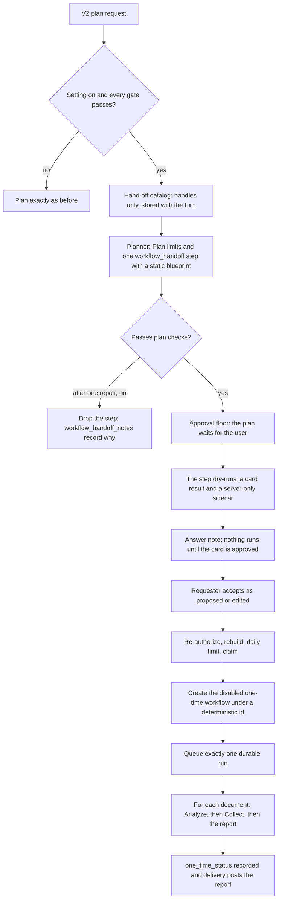

# Chat orchestration workflow hand-off

Implemented in version: **0.261.239**.

Application version tracking: `application\single_app\config.py`.

Related issue: #1549, part of #1543. Builds on
[Chat orchestration workflow proposals](CHAT_ORCHESTRATION_WORKFLOW_PROPOSALS.md)
(#1547),
[Chat orchestration workflow runs](CHAT_ORCHESTRATION_WORKFLOW_RUNS.md) (#1551),
[Workflow result delivery to chat](CHAT_WORKFLOW_RESULT_DELIVERY.md),
[Durable workflow execution](WORKFLOW_DURABLE_EXECUTION.md) and
[Serial For each and exact Collect](WORKFLOW_FOR_EACH_COLLECT.md). The
[Chat orchestration workflows roadmap](CHAT_ORCHESTRATION_WORKFLOWS_ROADMAP.md)
describes all the phases.

This is the server half of Phase 7. The V2 hand-off card, where the user
accepts, edits or declines a hand-off, is a separate change.

## Overview and dependencies

Some requests are bigger than one chat plan: "Review every contract in the
Legal workspace and list the ones that renew this year." A chat plan has a step
limit, a per-step document limit and a run-time limit, so it can't review
hundreds of documents one at a time. Until this version, a request like that
had to fit inside one plan.

With **Hand Off Large Work From Chat** on, the planner can hand that work to a
one-time durable workflow instead. The workflow reviews each document with
Analyze inside a For each, collects every finding, and writes one report. The
user approves the plan, then approves a hand-off card. Accepting the card
creates the workflow turned off, so it never runs on a schedule, and queues
exactly one durable run. When the run finishes, workflow result delivery posts
the report back into the conversation.

What this version adds:

- **The `workflow_handoff` capability** ("Hand off large work"). At most one
  step per plan, whose only input is a static blueprint: a loop over documents
  or a workspace query, and two tasks.
- **Hand-off planning context.** A catalog of the documents named this turn,
  the workspaces the conversation may search, and the requester's agents, all
  by handle. The planner never sees an id.
- **Plan limits in the planner prompt.** When hand-off is offered, the prompt
  lists the budgets the plan checks enforce, and a plan over them fails with a
  new `plan_budget_exceeded` code whose repair message names hand-off.
- **A dry-run step.** The step builds the workflow without saving it, keeps a
  card for the user and a server-only sidecar, and the answer says nothing runs
  until the user approves the card.
- **A For each builder** (`functions_workflow_handoff_builder.py`) that turns a
  blueprint into a `definition_version` 3 durable, manual, one-time workflow,
  and discloses how many documents the run covers.
- **Requester-only routes** to read a plan's hand-offs, accept one as proposed
  or edited, decline one, and read its editor draft.
- **One durable run per hand-off.** The workflow id and the run's request id
  come from the hand-off, so a retry, a second tab or a crash finds the
  workflow and its run instead of making new ones.
- **A one-time lifecycle.** The workflow records how its run ended in
  `one_time_status`, and the result reader opens only the hand-off's own run.
- **The admin setting** `enable_chat_orchestration_workflow_handoff`, off by
  default, and the daily limit **Hand-Offs From Chat Per User Per Day**
  (`chat_orchestration_max_workflow_handoffs_per_day`).

Dependencies:

- Chat orchestration (`enable_chat_orchestration`), in a private conversation.
- Personal workflows (`allow_user_workflows`). When
  `require_member_of_workflow_user` is on, the requester also needs the
  `WorkflowUser` app role.
- **Propose Workflows From Chat** (`enable_chat_orchestration_workflows`), **Run
  Workflows From Chat** (`enable_chat_orchestration_workflow_runs`) and **Use
  Workflow Results In Chat** (`enable_chat_workflow_results`), each stored as
  exactly `true`.
- Durable workflow execution and the background workflow scheduler, which run
  the queued workflow, and workflow result delivery, which posts the report.
- The **Analyze** document action. With it turned off, a hand-off is refused
  with `handoff_analyze_unavailable`.
- When **Capabilities** (`chat_orchestration_enabled_capabilities`) is narrowed,
  it must include **Hand off large work** (`workflow_handoff`).

## Technical specifications

### Architecture



### When hand-offs are offered

A request can hand work off only when all of these hold:

- `enable_chat_orchestration` is on and
  `enable_chat_orchestration_workflow_handoff` is exactly `true`. A stored
  string such as `"true"` leaves hand-off off.
- Workflow proposals and workflow runs from chat are both on, each exactly
  `true`, and `allow_user_workflows` is on.
- **Use Workflow Results In Chat** is on, because the report comes back through
  result delivery.
- **Capabilities** includes `workflow_handoff`, when that list is narrowed.
- The requester has the `WorkflowUser` role, when
  `require_member_of_workflow_user` is on.
- The conversation is the requester's own private conversation.
- The hand-off planning context was built for this turn.

| Reason | Meaning |
| --- | --- |
| `workflow_handoff_disabled` | The setting, proposals, runs, personal workflows or the capability list keeps hand-off off. |
| `workflow_results_disabled` | **Use Workflow Results In Chat** is off. |
| `workflow_role_required` | The requester needs the `WorkflowUser` role. |
| `workflow_shared_conversation` | The conversation isn't the requester's own private conversation. |
| `workflow_context_unavailable` | The turn's hand-off planning context is missing or couldn't be read. |

The capability is dormant and silent, unlike `workflow_run`. With its setting
off it's skipped before any other check. With the setting on and a gate
failing, it's left out of the planner's capabilities with no reason, so the
planner never learns hand-off exists. The routes report the reason instead. If
the access check raises, the request plans without hand-off and the log says
why.

With the setting off, or on with another gate off, planning is byte-identical
to the base: the planning context and its reads, the planner's messages, plans,
errors and logs, the capability list, and every Phase 4 card, status, draft,
accept and deny. `test_orchestration_workflow_handoff_off_golden.py` checks
this against a fixture captured on the unmodified base.

### Hand-off planning context

The V2 plan route builds the workflow planning context only when proposals,
runs or results from chat are on. It adds the hand-off part only when the
requester is known, the conversation is private, and the hand-off gate passes.
The part is stored with the turn and stands alone: hand-off needs none of the
proposal, run or results catalogs.

The planner sees `workflow_planning.handoff`:

- `time_zone` and `request_local_time`, the requester's time zone and local
  time.
- `max_loop_items`, the most documents one hand-off may cover.
- `documents_max`, 25, the most documents a hand-off can name.
- `catalog`, with `documents`, `scopes` and `agents`, each by handle.

The catalog holds:

- **Documents**: the first 25 documents named this turn, as workflow proposals
  list them.
- **Scopes**: the workspaces the conversation may search, as
  `{handle, name, scope}`, at most 100. They follow the conversation's document
  scope (all, personal, group or public), each workspace kind must be turned
  on, and a conversation locked to workspaces keeps only those. Group and public
  workspaces are read again, and one that can't be read is left out. A
  workspace without a name shows as "Your personal workspace", "A group
  workspace" or "A public workspace".
- **Agents**: the requester's agents, as `{handle, name, description, local}`.
  `local` is true for a local agent that doesn't need Run as.

The catalog is trimmed to 12,000 characters: agents first, then scopes down to
one, then documents. A handle is a short slug of the name and a digest, such as
`scope-legal-3f2a91` or `doc-renewals-9c04be`, so it never contains an id. The
map from each handle to its document, workspace or agent stays with the turn on
the server, and the planner never sees it.

### The capability and the plan checks

The registry's `workflow_handoff` descriptor:

- Label **Hand off large work**, role Reason, result contract
  `workflow-handoff-v1`, and one `handoff` output (`structured-v1`).
- One input, `blueprint`, which must be static: no `depends_on` and no input
  bindings.
- Low cost and at most one step per plan. A second step fails the work limit
  (`result_step_limit`, "The plan exceeds a capability work limit.").
- A manual approval floor.
- No external effects, because the step only dry-runs, and no transient retry.

Each rule below fails with code `workflow_handoff_invalid` and the rule name:

| Rule | Fails when |
| --- | --- |
| `workflow_handoff_exclusive` | The plan also has a `workflow_propose` or `workflow_run` step. It's checked first. |
| `workflow_handoff_static_input` | The step has `depends_on` or input bindings. |
| `workflow_handoff_consumed` | Another step depends on the hand-off or binds its output, or `final_response` selects it. |
| `workflow_handoff_invalid` | The step's arguments aren't exactly `{blueprint}`. |
| A draft code, such as `reference_unknown` | The blueprint breaks a draft rule. The rule is the first error's code. |
| `handoff_agent_unsupported` | A task names an agent that isn't local. |
| `workflow_context_unavailable` | The turn has no hand-off planning context, or the check couldn't run. |

The exclusive rule's message explains the fix: "A plan with a workflow_handoff
step hands the whole request to that workflow. Remove every workflow_propose and
workflow_run step, or remove the workflow_handoff step." A blueprint failure
lists the draft errors as "The workflow_handoff blueprint breaks these rules:"
followed by each code, path and message.

When the request offered hand-off, a plan over its budget fails with
`plan_budget_exceeded`:

| Rule | Message |
| --- | --- |
| `plan_step_budget` | "The complete plan exceeds the available step budget. Reduce the plan, or hand the work off with one workflow_handoff step." |
| `plan_document_budget` | "The complete source selection exceeds the document limit. Reduce the plan, or hand the work off with one workflow_handoff step." |

When it didn't, the budget checks keep their old codes and messages.

The planner gets one repair round for `workflow_handoff_invalid` and
`plan_budget_exceeded`, and the repair message names hand-off. A
`workflow_context_unavailable` failure isn't repaired. After the repair:

- A hand-off step that still fails is dropped, with any binding or
  `final_response` that names it. The server records why in the plan's
  `workflow_handoff_notes`, which the model can't write, and the plan's repairs
  say "No workflow was handed off." followed by the reason.
- A plan that still exceeds its budget fails with "The request needs more
  documents or steps than one chat plan allows. Please retry with a smaller
  request, or ask to hand the work off to a workflow."
- A plan edit is never degraded. It fails with "The plan could not prepare the
  workflow hand-off you asked for. Please retry, or create the workflow in
  Workflows."

### The planner prompt

When hand-off is offered, the planner's instructions say to hand off only work
beyond the plan limits, never work one plan can do, and never repeated or
scheduled work. The planner plans at most one hand-off step, never with a
proposal or run step, with nothing that consumes it, and never says the work
was done, started or scheduled. For a request that's only a hand-off, the plan
declares no deliverables and no `final_response`. If the plan is refused for a
missing `final_response`, the repair adds "This plan hands work off: remove the
answer deliverable, and do not answer the handed-off part now."

A **Plan limits** section lists the same budgets the plan checks use: the step
limit, the run time, each document action's per-step limit, and "One
workflow_handoff step reviews at most 25 named documents, or at most N documents
from a workspace query." It also lists the agents that can run hand-off tasks,
or says to leave out `runner` when none can. A limit that can't be read is left
out of the section.

### The blueprint

The step's only argument is `{"blueprint": {...}}`, checked against the closed
schema `urn:simplechat:workflow-handoff-blueprint:1`:

```json
{
  "name": "Contract renewals",
  "description": "Find the contracts that renew this year.",
  "loop": {
    "source": "workspace_query",
    "scopes": ["scope-legal-3f2a91"],
    "selection": "all_matches",
    "tags": ["contract"]
  },
  "tasks": [
    {"title": "Review one contract", "instructions": "Read the contract and record its renewal date and terms."},
    {"title": "Write the report", "instructions": "List the contracts that renew this year, with their dates."}
  ]
}
```

- `tasks` has exactly two tasks. The first runs once per document and the
  second writes the report. Instructions must stand on their own, because the
  run never sees the conversation.
- A task's optional `runner` is `{"type": "agent", "agent_ref": <handle>}` for
  a local agent, or `{"type": "model"}`. Without one, the task runs on the
  default model.
- `loop.source` is `documents`, with 1 to 25 document handles, or
  `workspace_query`, with 1 to 100 workspace handles in `scopes` and a
  `selection`:
  - `all_matches` reviews every match, up to the hand-off's limit. It takes no
    `count`.
  - `best_n` reviews the `count` best matches for `content`, and needs both.
  - `tags` (up to 100, each up to 256 characters) and `content` (up to 4,000
    characters, matched as keywords) narrow the query.
- The blueprint names handles only, never ids, models, endpoints or URLs.

The draft service also refuses a hand-off when the administrator's task limit
is below two (`handoff_unavailable`), when document analysis is off
(`handoff_analyze_unavailable`, "Document analysis is turned off, so this work
cannot be handed off."), and when the loop can cover more documents than the
limit (`handoff_loop_limit`).

### The workflow a hand-off builds

The builder makes a `definition_version` 3 workflow:

- A `root` flow with a For each (`each`) over the named documents or the
  workspace query, keyed by `source_identity`, with `max_items` set to the
  disclosed N.
- In its body, an Analyze document action on the current document
  (`target_mode` `current_item`, `analysis_mode` `combined`) that runs the first
  task and saves its findings as records.
- A Collect (`collect`) that requires complete coverage and allows no partial
  result.
- A report task (`report-node`) that runs the second task over the saved
  records and returns text. The flow's one output is `report`.

Every hand-off workflow is durable, manual and turned off. It halts on the first
error with no retries, has a 24-hour deadline, sends bell alerts on every run at
info, and uses no Microsoft 365 actions, Run as or chat capabilities.

The loop limit is the administrator's **Workflow Loop Item Limit**
(`workflow_max_loop_items`, default 500), never above 2,000. Each document costs
two execution admissions, its loop item and its task, plus three for the For
each, the Collect and the report, and a reserve of 997, so the largest
hand-off fits a run's 5,000 admissions.

The disclosure says what the run covers, in counts and names, never ids:

| Loop | `limit_behavior` | Text |
| --- | --- | --- |
| Named documents | `exact` | "3 documents" |
| `best_n` query | `best_n` | "up to 50 best-matching documents" |
| `all_matches` query | `pause` | "up to 500 matching documents. If more match when the run starts, it pauses before reviewing any; cancel it and ask again with a narrower request." |

A query's disclosure also carries `scope_count` and `scope_names`, the
workspaces it searches.

### Approval floor

`plan_approval_floor` gives a plan with an enabled hand-off step the floor
`{mode: manual, reason: workflow_handoff}`. `normalize_plan` saves a plan with a
hand-off step as manual, whatever approval mode the user chose, and the run
record copies that mode. When the plan is run, `claim_plan_run` refuses a run
record or plan whose approval mode no longer matches the floor with
`approval_floor_required`.

### The workflow_handoff step

The step re-checks, before and after it builds anything, that the run's
requester is running it, the plan isn't a legacy plan, the run isn't cancelled,
it may still write to the run, and the attempt hasn't changed.

It checks the blueprint against the turn's handles and agents, then dry-runs the
workflow without saving it. It saves:

- **The card**, as the step's `handoff` output:
  `{version, handoff_id, name, summary, disclosure, status, reason, created_at}`.
  `status` is `ready`, `invalid` or `unavailable`. The summary has the name, a
  description of up to 1,000 characters, each task's title, runner kind and
  agent name, the alerts, and `durable` and `one_time`, but never instructions
  or ids.
- **The sidecar**, on the step record only: the blueprint and its digest, the
  handles it uses, the dry run's outcome, the disclosure, the loop limit, the
  model selection, the time zone and the summary. It never reaches a stream, a
  public step record, the reply or a later plan.

`handoff_id` comes from the run and the step, so recovery rebuilds the same card
with the same id and expiry. A hand-off expires 14 days after it was prepared.
The step's summary is "Prepared a one-time workflow hand-off for your
approval.", or "Prepared a one-time workflow hand-off that cannot be handed off
as planned." with the reason:

| Reason | Text |
| --- | --- |
| `workflow_handoff_invalid` | "The hand-off was planned in a way SimpleChat can't run. Ask again, naming the documents or the workspace to review." |
| `workflow_context_unavailable` | "Your documents and workspaces could not be checked for this request. Ask again in a new message." |
| `handoff_loop_limit` | "The request covers more documents than one hand-off can review. Ask again with a narrower request." |
| `handoff_agent_unsupported` | "A hand-off runs its tasks on the default model or on a local agent. Ask again without naming that agent." |
| `handoff_unavailable` | "Handing work off to a workflow isn't available with this deployment's workflow settings." |
| `handoff_sources_unavailable` | "A document, workspace or agent the hand-off named is no longer available to you. Ask again in a new message." |
| `handoff_prepare_failed` | "The hand-off couldn't be prepared. Ask again in a new message." |

### The answer's note

Each completed hand-off step adds a line to the answer:

```text
Prepared a one-time workflow for this request. Nothing runs until you approve it on the hand-off card.
```

A hand-off that can't be accepted says "No workflow was handed off." followed by
its reason, and so does each entry in `workflow_handoff_notes`. Lines are
de-duplicated and separated by blank lines. A failed step is left to the
failure text. The note also keeps a plan that only hands work off from falling
back to "content is prepared".

### Accepting a hand-off

An accept goes through these checks in order:

1. The request has only `conversation_id`, `mode` (`as_proposed` or `edited`)
   and, for an edit, `workflow`.
2. The hand-off opens for this requester: a canonical id, the requester's own
   hand-off, every gate, the run and step that produced it, a sidecar that
   matches them, and a response content review didn't remove.
3. If its workflow already exists, the accept finishes: it queues the run if it
   wasn't queued, and never creates a second workflow.
4. A declined, expired or busy hand-off, one whose workflow was deleted, or one
   that wasn't prepared ready (`handoff_invalid` or `handoff_unavailable`) is
   refused.
5. An edit is compared with the proposed workflow. A material change marks the
   workflow as edited, and a comparison that fails counts as edited.
6. The daily limit is checked.
7. The hand-off is claimed (`creating`) for 120 seconds, so a second accept
   gets `handoff_busy`. A claim older than that gives way.
8. The workflow is created turned off, under an id derived from the hand-off,
   with `origin.one_time`. If creating fails, the claim is released.
9. The decision is recorded as `created`, the run is queued, and the decision is
   recorded as `queued`.

The accept rebuilds the workflow from the blueprint with fresh authorization of
every document, workspace and agent. It keeps the disclosed N: if the
administrator lowered the loop limit below it since, the accept is refused with
`handoff_limit_changed`, and a raised limit never widens it.

An edited workflow is checked like a save, then must still be a hand-off: turned
off, manual, `definition_version` 3 and durable, with no Microsoft 365, only
local agents, and its For each over named documents or a workspace query. Its
documents and workspaces are authorized again. URL Access and server fields are
dropped, and a different `id` is a conflict.

The run's request id comes from the user and the hand-off, so its run id is
fixed. If that run already exists and has ended, or is the workflow's active
run, the accept reports it and queues nothing. If the workflow is running a
different run, the accept is refused with `handoff_run_conflict` and the reason
`workflow_already_running`. A run under that id that belongs to another
workflow or user, or a workflow that isn't durable, gives `handoff_unavailable`.
The run is queued with trigger `chat_orchestration` and a `chat_invocation`
that names the conversation, user message, orchestration run, first attempt,
step, requester, request time and `handoff_id`. It also carries the result
delivery record, so the report is posted back into the chat.

A hand-off workflow doesn't count toward the **Workflows Created From Chat Per
User** limit (`chat_orchestration_max_workflows_per_user`). Instead, the
**Hand-Offs From Chat Per User Per Day** limit counts the hand-off workflows the
user created in the last 24 hours.

### The one-time lifecycle

The workflow's `origin.one_time` is set only by the server. A client can't set
it on a save or a dry run, and a v3 save that sends a top-level `one_time` is
refused. Editor saves keep it, and the first material edit marks the origin as
edited. It's outside the definition revision and the Microsoft 365 fingerprint.

A hand-off create and a proposal create never adopt each other's workflow, even
under concurrency. A Phase 4 accept on a hand-off workflow is refused with
`proposal_kind_mismatch` ("This is a workflow hand-off, not a workflow
proposal."). A `workflow_run` step won't start a one-time workflow, with the
reason `workflow_one_time`: "It was created for a single run. Open it in
Workflows to run it again."

When the hand-off's own run ends, the workflow records
`one_time_status: {state, run_id, completed_at}`. Only a run whose
`chat_invocation.handoff_id` matches the workflow's hand-off records it. It's
runtime progress, outside the definition revision and the Microsoft 365
fingerprint, so it doesn't change `modified_at` or `is_enabled`. A failure to
record it never stops the run from finishing.

A workspace query that matches more documents than its limit pauses before
reviewing any. The run's deadline doesn't expire that pause. The run status
shows it as needing the user. Cancel it and ask again with a narrower request.

### Routes

All four routes need a signed-in user with **Enable Personal Workflows** on
and, when **Require WorkflowUser App Role** is on, the `WorkflowUser` role.
Those checks refuse first, with their own bodies (see [Errors](#errors)). Each
request then re-checks every hand-off gate. Only the requester can see or act
on a hand-off. Anyone else gets `run_not_found`, the same as for a run that
doesn't exist, and so does a conversation the user can't open. A request
without `conversation_id` gets `invalid_request`.

| Method and path | Body | Returns |
| --- | --- | --- |
| `GET /api/v2/orchestration/runs/<run_id>/workflow-handoffs?conversation_id=` | none | `{run_id, handoffs: [{handoff_id, step_id, state, reason, created_at, expires_at, actions, summary, disclosure, workflow?, run?, chat_delivery?}]}` |
| `POST /api/v2/orchestration/runs/<run_id>/workflow-handoffs/<handoff_id>/accept` | `{conversation_id, mode, workflow?}` | 201 when this request created the workflow, otherwise 200: `{handoff_id, state: queued, created, workflow: {id, name, is_enabled}, run: {id, status}, chat_delivery}` |
| `POST /api/v2/orchestration/runs/<run_id>/workflow-handoffs/<handoff_id>/deny` | `{conversation_id}` | 200 `{handoff_id, state: denied}` |
| `GET /api/v2/orchestration/runs/<run_id>/workflow-handoffs/<handoff_id>/draft?conversation_id=` | none | `{handoff_id, workflow, url_access_note}` |

A hand-off's `state` is `pending`, `creating`, `created`, `queued`, `denied`,
`expired`, `unavailable` or `invalid`:

- `actions` is `accept`, `edit` and `deny` for a pending hand-off, `accept` for
  a created one whose run wasn't queued, and `deny` for one that can't be
  accepted but isn't decided or expired.
- When a gate is closed or content review removed the response, every hand-off
  is `unavailable` with that reason, and no workflow is read.
- `summary` and `disclosure` are null when a gate is closed, the response was
  removed, or the blueprint doesn't match its digest.
- Once the workflow exists it decides the state. A deleted workflow gives the
  reason `workflow_deleted` with no actions. `run` and `chat_delivery` appear
  only for a queued hand-off.

Declining is idempotent. A hand-off whose workflow exists, or was created or
queued, can't be declined. The draft is the workflow as the editor shows it,
without server fields, the origin or the conversation id, so the user can edit
it before accepting. It's offered only for a pending hand-off: once the
workflow exists, the draft route returns `handoff_accepted`.

### Errors

A hand-off refusal has the body `{error, code, errors, state?, reason?}`.
`errors` lists at most ten `{code, message, path}` entries. A message that's
empty or looks like an id is replaced, a path that isn't a short, plain JSON
pointer is blanked, and an unknown code is reported as `invalid_workflow`.

| Code | Status | Message |
| --- | --- | --- |
| `invalid_request` | 400 | "The request is not valid." |
| `handoff_edit_invalid` | 400 | "The edited workflow is not valid. Review the task, runner and document inputs." |
| `workflow_handoff_disabled` | 403 | "Workflow hand-off is not available here." |
| `workflow_role_required` | 403 | "You need the workflow role to hand work off to a workflow." |
| `workflow_shared_conversation` | 403 | "Workflow hand-off is available only in your own private chats." |
| `handoff_results_off` | 403 | "Workflow hand-off needs workflow results in chat, which is turned off." |
| `handoff_access_lost` | 403 | "You no longer have access to a document, workspace or agent this workflow uses." |
| `run_not_found` | 404 | "Run not found." |
| `handoff_not_found` | 404 | "Workflow hand-off not found." |
| `handoff_unavailable` | 409 | "This workflow hand-off is no longer available." |
| `handoff_expired` | 409 | "This workflow hand-off expired. Ask again to get a new one." |
| `handoff_denied` | 409 | "This workflow hand-off was declined." |
| `handoff_accepted` | 409 | "This workflow hand-off was already accepted." |
| `handoff_busy` | 409 | "This workflow hand-off is being accepted. Try again in a moment." |
| `handoff_kind_mismatch` | 409 | "This is not a workflow hand-off." |
| `handoff_run_conflict` | 409 | "The workflow was created, but its run could not be started." |
| `workflow_deleted` | 409 | "The workflow this hand-off created was deleted." |
| `handoff_limit_changed` | 409 | "The document limit changed since this hand-off was prepared. Ask again to get a new one." |
| `handoff_invalid` | 422 | "This workflow hand-off is not valid. Ask again to get a new one." |
| `handoff_agent_unsupported` | 422 | "A hand-off workflow can use only your own agents." |
| `handoff_daily_limit` | 429 | "You reached the daily limit for workflow hand-offs. Try again later." |
| `handoff_queue_failed` | 503 | "The workflow was created, but its run could not be queued. Try again." |
| `service_unavailable` | 503 | "The service is temporarily unavailable. Try again." |

A Phase 4 proposal id sent to a hand-off route gets `handoff_kind_mismatch`. A
storage error other than "not found" returns 503, never a missing workflow. If
the workflow was created but its run wasn't queued, the error carries
`state: created`, and a retry queues the same run.

These refusals come from checks outside the hand-off service and keep their
own bodies:

- No signed-in user: 401 `{"error": "Unauthorized", "message": "Authentication
  required"}`, or `{"error": "User not authenticated"}` when the session has no
  user id.
- **Enable Personal Workflows** off: 400
  `{"error": "Allow User Workflows is disabled."}`.
- The `WorkflowUser` role required but missing: 403 `{"error": "Forbidden",
  "message": "Personal workflows require the WorkflowUser app role."}`.
- A run whose plan uses the removed legacy plan contract: 409
  `{"error": "This plan was created by an earlier orchestration version and
  can't be opened or rerun. Start a new request.", "code": "legacy_plan"}`.

### Result reading and delivery

When the run finishes, workflow result delivery reads it with the workflow
result reader and posts the report into the conversation. The reader opens a
hand-off run only when all of these hold:

- The run was started by chat orchestration for a one-time workflow whose
  hand-off id matches the run's `chat_invocation`.
- The run id is the one the hand-off derives.
- The run has exactly one output, the report node's text, with a well-formed
  SHA-256 result reference.
- The node lineage still matches the saved flow. An edited or re-enabled
  workflow fails closed.

Anything else is `workflow_result_unsupported`. Excerpts are bounded and carry
no references or ids, and a large report is paged once.

A cancelled hand-off posts its note once. A paused hand-off that's never
resumed gets the expired notice when its delivery window, the run's deadline
plus 24 hours, closes. If one document's findings are too large for the report
task's model, the report fails with `indivisible_record`, and so does the run.

### What the browser can see

- The planner, the plan and stream frames carry handles, never document,
  workspace or agent ids.
- The public step record and the run summary are allowlists, so the sidecar
  never reaches the browser.
- The card carries counts, workspace names, task titles, runner kinds and agent
  names, never instructions or document, workspace or agent ids.
- The draft leaves out the model selection and the handle map.
- Refusals use fixed messages, and logs carry hashed ids.

### Limits

- One hand-off step per plan, with exactly two tasks.
- At most 25 named documents, or 2,000 documents from a workspace query, lower
  if the administrator's loop item limit is lower.
- At most 100 workspaces per query, and 100 workspaces in the catalog.
- **Hand-Offs From Chat Per User Per Day**
  (`chat_orchestration_max_workflow_handoffs_per_day`), 1 to 100, default 5, in
  any rolling 24 hours. A stored value outside that range fails closed.

### Logging

Logs never carry blueprint text, document, workspace or agent names, or ids.
Orchestration run, step, conversation, hand-off and workflow ids are logged
only as SHA-256 hashes.

- `[ORCHESTRATION_WORKFLOW_HANDOFFS]` (stage `workflow_handoff`): "Prepared a
  workflow hand-off." with `status`, `reason` and `error_codes`; "A workflow
  hand-off could not be prepared."; "Hand-off loop limit is misconfigured;
  handing work off is unavailable."; "A workflow hand-off could not be
  dry-run."; "Hand-off model selection could not be captured; delivery uses the
  default model."; "A recovered workflow hand-off could not be read." and "A
  recovered workflow hand-off could not be described."; "Hand-off blueprint
  could not be checked; handing work off is unavailable for this plan."; and
  "Hand-off note could not be written."
- `[ORCHESTRATION_WORKFLOW_HANDOFF_DECISIONS]` (stage
  `workflow_handoff_decision`): "A workflow hand-off created its workflow."
  with `created`, `mode` and `edited`; "A workflow hand-off run was queued."
  and "A workflow hand-off run was queued for an existing workflow." with
  `queued` and `chat_delivery`; "A workflow hand-off run was not queued." with
  `code`; "A workflow hand-off was declined."; "A workflow hand-off did not
  match the run that produced it." with `code` `handoff_integrity_mismatch`;
  and warnings when an edit can't be compared, the daily count or a hand-off
  workflow or run can't be read, a claim isn't released, or a decision isn't
  recorded.
- `[WorkflowHandoffDrafts]`: each hand-off dry run or create, accepted or
  rejected, with `operation`, `created` and `error_codes`.
- `[ORCHESTRATION_WORKFLOWS]` (stage `workflow_planning`): "Workflow hand-off
  planning context built." with `document_count`, `scope_count`, `agent_count`
  and `duration_ms`; "The hand-off planning context could not be read; handing
  work off is unavailable for this turn." and "Workflow hand-off access could
  not be checked; handing work off is unavailable for this request." with
  `reason` `workflow_context_unavailable` and `error_type`.
- `[ORCHESTRATION_PLANNER]` (stage `plan_normalization`): "Planning without a
  workflow hand-off that could not be prepared." with `reason`
  `workflow_handoff_dropped`, `validation_code`, `validation_rule`,
  `note_count` and `remaining_count`.
- `[ORCHESTRATION_REGISTRY]`: "Could not check workflow hand-off access."
- `[ORCHESTRATION_EXECUTOR]`: "A recovered workflow hand-off could not be
  described."
- `[ORCHESTRATION]` (stage `workflow_handoff`): "A workflow hand-off request
  could not be completed." before a route returns 503.
- `[WORKFLOW_STORE]`: "Error counting hand-off workflows."
- `[WORKFLOW_RUNTIME]`: "A one-time workflow status was not recorded." with
  `error_type`.

### Files

All paths are under `application/single_app/`.

| File | Purpose |
| --- | --- |
| `functions_orchestration_workflow_handoffs.py` | Plan checks, dropping, the step's adapter, the card, the sidecar and its rebuild, and the answer's note. |
| `functions_orchestration_workflow_handoff_decisions.py` | The status, accept, deny and draft logic: access, the claim, the create, the queue and the daily limit. |
| `functions_workflow_handoff_builder.py` | The pure v3 For each builder, the loop limit and the disclosure. |
| `functions_workflow_drafts.py` | The blueprint schema and checks, the hand-off dry run and create, and edited payload checks. |
| `functions_workflow_definitions.py`, `functions_workflow_definition_store.py` | `origin.one_time` as a server-only field, and `one_time_status` outside the revision. |
| `functions_workflow_runtime.py` | Recording `one_time_status` when the hand-off's run ends. |
| `functions_workflow_result_reader.py` | Opening only a hand-off's own report. |
| `functions_workflow_limits.py` | The hand-off limits. |
| `functions_personal_workflows.py` | Counting recent hand-offs, and leaving them out of the workflows-per-user count. |
| `functions_orchestration_workflow_context.py` | The gates and the hand-off planning context. |
| `functions_orchestration_registry.py` | The `workflow_handoff` descriptor, its gates and reasons. |
| `functions_orchestration_schema.py` | The plan rules, the budget codes and the approval floor. |
| `functions_orchestration_planner.py` | The instructions, Plan limits, repair and drop, and `workflow_handoff_notes`. |
| `functions_orchestration_deliverables.py`, `functions_orchestration_services.py` | The planner's facts and recipe, and keeping hand-off results out of later plans. |
| `functions_orchestration_adapters.py`, `functions_orchestration_executor.py`, `functions_orchestration_execution.py`, `functions_orchestration_recovery.py`, `functions_orchestration_runs.py` | The adapter entry, the sidecar on the step record, recovery, the note in the reply, and recording decisions. |
| `functions_orchestration_workflow_proposals.py`, `functions_orchestration_workflow_runs.py` | Refusing a hand-off workflow in Phase 4 and Phase 5, and the shared delivery seed. |
| `route_backend_orchestration.py` | The four routes and the planning context. |
| `functions_settings.py`, `admin_settings_fields.py`, `route_frontend_admin_settings.py`, `templates/admin/_panes/chat-orchestration.html` | The setting, the limit and their admin controls. |

## Usage

### Enable or configure

1. Turn on **Chat Orchestration**, **Enable Personal Workflows**, **Propose
   Workflows From Chat**, **Run Workflows From Chat** and **Use Workflow Results
   In Chat**. The background workflow scheduler must run for a queued run to
   progress.
2. In **Admin Settings > Orchestration > Chat Orchestration > Capabilities**,
   turn on **Hand Off Large Work From Chat**. It's off by default because a
   hand-off starts background work that keeps running with the user's access
   after the chat turn ends.
3. If the Capabilities list is narrowed, include **Hand off large work**.
4. Under **Limits**, set **Hand-Offs From Chat Per User Per Day** if 5 doesn't
   suit the deployment.

Until the V2 hand-off card ships, users can't accept a hand-off in the browser.
Leave the setting off until then.

See [Orchestration settings](../../admin/orchestration.md).

### What a user does

1. In a private V2 conversation, ask for work too big for one plan, for example
   "Review every contract in the Legal workspace and list the ones that renew
   this year."
2. The plan has one hand-off step and always waits. Approve it.
3. The answer says "Prepared a one-time workflow for this request. Nothing runs
   until you approve it on the hand-off card."
4. The hand-off card shows what the workflow covers. Accept it as proposed,
   edit it first, or decline it.
5. The run appears in the workflow's run history in Workflows. When it
   finishes, the report is posted into the conversation.

## Testing and validation

### Test coverage

| Test | What it covers |
| --- | --- |
| `functional_tests/test_orchestration_workflow_handoff_off_golden.py` | Byte-identical planning and Phase 4 routes with the setting off, or on with another gate off, against a fixture captured on the unmodified base. |
| `functional_tests/test_orchestration_workflow_handoff_capability.py` | The descriptor, the dormant and silent gates, the closed reasons, and every plan rule. |
| `functional_tests/test_orchestration_workflow_handoff_planner.py` | The instructions, Plan limits matching the validator, the catalog, one repair then drop or fail, the server's notes, and the approval floor. |
| `functional_tests/test_orchestration_workflow_handoff_adapter.py` | The dry run, the card and the sidecar, refusals before any write, recovery, and the sidecar kept out of streams, records, replies and later plans. |
| `functional_tests/test_orchestration_workflow_handoff_routes.py` | Every access check, the claim, creating and queueing exactly once through the real queue, edits, the disclosed bound, the daily limit, and the Phase 4 and Phase 5 boundaries. |
| `functional_tests/test_orchestration_workflow_handoff_imports.py` | The new modules load in fresh normal and optimized interpreters in the application's import orders, with no network. |
| `functional_tests/test_workflow_handoff_builder.py` | The v3 For each, the disclosure, every refusal, ids that never match a proposal's, creating at most once, and edited payloads building what a save builds. |
| `functional_tests/test_workflow_handoff_origin.py` | `origin.one_time` as a server-only field on every client path, and hand-off and proposal creates never adopting each other's workflow. |
| `functional_tests/test_workflow_handoff_lifecycle.py` | `one_time_status` on every terminal transition, the over-limit pause, and cancelled and expired hand-offs in chat. |
| `functional_tests/test_workflow_handoff_result_reader.py` | The reader opening only a hand-off's own report, lineage, digests and paging. |
| `functional_tests/test_workflow_handoff_end_to_end.py` | 3-document and 200-document workspace queries through the real durable runtime and runner, ending with one summary posted to chat and no private values in any response or log. |
| `functional_tests/route_tests/test_route_blueprint_policy_inventory.py`, `functional_tests/route_tests/test_route_unauthenticated_policy_contract.py` | The four routes in the route policy. |

### Performance

Hand-off adds no reads unless its setting is on and its gate passes. The
planning context then reads the requester's agents and the group and public
workspaces in scope, at most 100. The step dry-runs once. An accept rebuilds the
workflow, counts the user's recent hand-offs with one query, creates one
workflow and queues one run. The status route reads each hand-off's workflow,
and its run once queued. The report reads saved findings in pages; the
200-document test checks pages of at most 100 records and 128 KiB.

### Known limitations

- There's no hand-off card in V2 yet, so a user can't accept a hand-off in the
  browser.
- The daily limit counts the hand-off workflows that exist. A deleted hand-off
  stops counting, and two accepts at the same moment can both pass the count.
- At most 25 named documents, or 2,000 from a workspace query, and the run has
  a 24-hour deadline.
- A query that matches more than its limit pauses before reviewing anything.
  Cancel it and ask again with a narrower request; the hand-off still counts
  toward the daily limit.
- Only personal workflows, from a private conversation. No group workflows,
  Microsoft 365 actions, Run as or schedules, and only local agents.
- One hand-off per plan, with exactly one review task and one report task.
- A plan refused at run time for losing its approval floor shows Phase 5's text
  about starting a saved workflow.
- When a gate fails, the capability is left out without a reason, so the
  planner can't say why hand-off isn't available.
- If one document's findings are too large for the report task's model, the run
  fails with `indivisible_record`.
