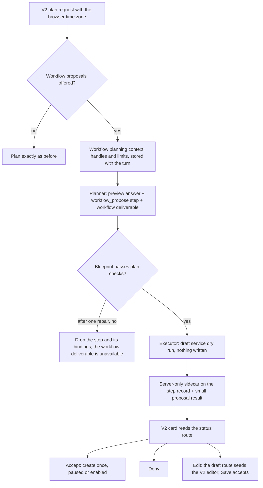

# Chat orchestration workflow proposals

Implemented in version: **0.261.207**.

Application version tracking: `application\single_app\config.py`.

Related issue: #1547, part of #1543. Builds on the
[Workflow draft service](WORKFLOW_DRAFT_SERVICE.md) (#1545) and
[Workflow calendar schedules](WORKFLOW_CALENDAR_SCHEDULES.md) (#1544). The
[Chat orchestration workflows roadmap](CHAT_ORCHESTRATION_WORKFLOWS_ROADMAP.md)
describes all the phases.

## Overview and dependencies

People often ask chat for work that repeats: "Every Monday, read my email and
tell me what I should do this week." Until this version, orchestration could only
answer once, and the user had to rebuild the request as a workflow by hand.

With **Propose Workflows From Chat** on, a plan can handle both parts of such a
request. It answers the current period once, as a preview, and proposes a
personal workflow for the runs to come. The V2 chat shows the proposal as a card
under the answer, with everything the workflow would do. Nothing is created until
the requester chooses **Create & start**, **Create paused**, **Create** or
**Edit** on the card.

What this version adds:

- **The `workflow_propose` capability.** A plan step that describes one personal
  workflow as a closed blueprint and checks it with the workflow draft service's
  write-free dry run. The step never creates anything.
- **The `workflow` deliverable kind.** The plan declares the proposal as
  something the user asked for, so the answer can say a card follows it, and a
  proposal that could not be prepared is reported as not delivered.
- **A workflow planning context.** Request-local handles for the agents, File
  Sync sources and documents the requester may use, and a short list of their
  existing workflows. The map from each handle to its record stays on the server.
- **The browser's time zone** with each V2 plan request, so "Monday at 08:00"
  means 08:00 where the user is.
- **Four requester-only routes** behind the card: status, accept, deny and draft.
- **The V2 proposal card** under the answer that proposed the workflow.
- **Personal File Sync in the V2 workflow editor**, so a proposal that watches
  File Sync can be edited before it is created. See
  [V2 personal workflow File Sync](V2_PERSONAL_WORKFLOW_FILE_SYNC.md).
- **The admin setting** `enable_chat_orchestration_workflows`, off by default.

Dependencies:

- Chat orchestration (`enable_chat_orchestration`) and the V2 interface. The card
  exists only in V2; the classic chat never shows a proposal.
- Personal workflows (`allow_user_workflows`). When
  `require_member_of_workflow_user` is on, the requester also needs the
  `WorkflowUser` app role.
- The workflow draft service (0.261.202), which checks and creates the workflow.
- For tasks that run on an agent: Semantic Kernel (`enable_semantic_kernel`) and
  user agents (`allow_user_agents`). Without them no agent is offered, and every
  task runs on the default model.
- When **Capabilities** (`chat_orchestration_enabled_capabilities`) is narrowed,
  it must include **Propose workflows** (`workflow_propose`).

## Technical specifications

### Architecture

### When proposals are offered

A request can propose a workflow only when all of these hold:

- `enable_chat_orchestration` is on and `enable_chat_orchestration_workflows` is
  exactly `true`. A stored string such as `"false"` leaves proposals off.
- `allow_user_workflows` is on, and the capability allowlist permits
  `workflow_propose`.
- The requester may create personal workflows, including the `WorkflowUser` role
  when it's required.
- The conversation is private to the requester. A shared, collaborative or
  multi-user conversation, or one converted to a collaboration, would put the
  requester's workflows in front of other people.
- The requester is below the per-user cap on workflows created from chat.
- The planning context could be read.

Otherwise the capability is unavailable for that request, with one closed
reason, and the plan goes ahead without it:

| Reason | Meaning |
| --- | --- |
| `workflow_proposals_disabled` | The setting, personal workflows or the capability allowlist is off. |
| `workflow_role_required` | The requester lacks the `WorkflowUser` role that personal workflows require. |
| `workflow_shared_conversation` | The conversation isn't private to the requester. |
| `workflow_quota_reached` | The requester has as many workflows created from chat as the cap allows. |
| `workflow_context_unavailable` | The planning context couldn't be built, for example because a catalog or quota read failed. It fails closed. |

With the setting off, nothing is read and every context builder is called with
exactly the arguments it had before. A golden test captured on the unmodified
base proves the planner's messages, the deliverable brief and the strict-mode
error are byte-identical with the setting off, and with it on while the
capability is unavailable.

### Workflow planning context

`build_workflow_planning_context` builds the context once per turn. It reads and
never writes, and it's stored with the turn, so a replan, an answered question, a
plan editor revision and a retry all use the same one.

| Catalog | What it holds | At most |
| --- | --- | --- |
| Agents | The requester's personal agents and the global agents they may select, each with the action kinds it can use: email, calendar, OneDrive, SharePoint, directory, API calls, MCP tools and other tools. | 25 agents, 8 action kinds each |
| File Sync sources | The sources the requester may use in a personal workflow, as in the V2 editor. | 25 |
| Documents | Only documents the user named in this request: the documents picked in the composer and accepted `#` references. Documents the pipeline found by searching are never offered, and there is never a workspace search or listing. A personal document must be the requester's own. | 25 |
| Existing workflows | The requester's most recently changed personal workflows, with their triggers, so the planner and the card can point out similar ones. | 20, from a scan of at most 500 |

Every entry is named by a handle such as `agent-mail-helper-3f2a1c`: the kind
(`agent`, `doc`, `source` or `workflow`), a slug of the name of up to 40
characters, and a six-character digest of the record's key. A handle always
starts with a letter and matches `^[a-z][a-z0-9_-]{0,63}$`, even for a name that
starts with a digit, isn't Latin or is only punctuation. The planner sees names,
kinds, limits and handles; it never sees record ids, task instructions or
credentials.

The catalog block the planner reads is capped at 12,000 characters. When it's
larger, the least useful entries go first: existing workflows beyond the five
most recent, then documents, then sources, then agents. A failed read of any
catalog makes the capability unavailable for that turn with
`workflow_context_unavailable`. The context build is timed, and its log carries
counts, codes and the duration only.

### Time zone

V2 sends the browser's IANA time zone with each plan request. The server accepts
only an exact name from the workflow schedule time zone list, and uses UTC when
the zone is missing or unknown. The validated zone is stored with the turn and
carried through the first plan, regenerate and replan, the answer to a question
card, plan editor revisions and retries; a request that omits it reuses the
stored zone rather than falling back to UTC.

A calendar trigger without a `timezone` gets the request's zone during plan
validation. In a turn that can propose a workflow, the answer-writing step is
told the user's local time just before the request, with the wording a calendar
workflow's run gives each task. The preview and the later runs therefore read
"this week" the same way. Every other answer is written from exactly the
messages it had before.

### The capability and the deliverable

`workflow_propose` uses the **Reason** role. Render needs a file output, and the
card is the delivery surface. A plan may have one `workflow_propose` step, and it
takes no dependencies or inputs: the blueprint is in its `arguments`, and no
other step may consume its `proposal` output. The step also carries
`task_actions`, the closed action kinds each task needs.

While a plan is validated, the blueprint must pass:

- every rule of the workflow draft service that reads nothing
  (`check_workflow_blueprint`), with the request's time zone and handles;
- handles the planning context offered, and no others;
- an agent for every task that needs actions, which has all of them
  (`agent_capability_mismatch` when it doesn't, `no_suitable_agent` when no agent
  covers them);
- `run_as: self` for a task on an agent with Microsoft 365 actions
  (`run_as_required`).

The planner gets one repair. If the blueprint still fails, the step is dropped
along with every binding, delivery and final-response reference to it, and the
`workflow` deliverable becomes unavailable with `workflow_draft_invalid`. The
preview answer still runs. Plan edits are never degraded; they're refused
instead.

The `workflow` deliverable exists for the planner only while the setting is on.
Only a `workflow_propose` step delivers it, exactly one, and only when the user
asked for it. A second proposal in the same request is unavailable with
`workflow_one_per_request`. V2 labels the deliverable "Workflow proposal" and
shows a prepared one as "Proposed" rather than "Delivered".

### The proposal step

`adapter_workflow_propose` runs the draft service's dry run with the handles
resolved to server records. The dry run writes nothing. The step then stores:

- **a small `proposal` result** for the run, `structured-v1`, holding only the
  name, status, reason, schedule label and creation time. It never appears as an
  output or download chip; the card is the only surface;
- **a server-only sidecar** on the step record, with a digest of the blueprint,
  the handles it used, the time zone, the card's summary (without instructions),
  similar existing workflows, the expiry and any reason codes. It's never
  streamed, listed or stored on the message.

The blueprint itself, with each task's instructions, stays in the producing plan
step's arguments. The routes read it from there and check it against the
sidecar's digest; a blueprint that no longer matches can't be created.

The proposal id is a UUID 5 of the producing run and step, so recovery and
retries always name the same proposal. A proposal expires 14 days after it was
created. When a proposal can't be created as planned, the sidecar keeps one
closed reason, such as `quota_reached`, `no_suitable_agent`,
`file_sync_source_unavailable` or `cadence_below_minimum`, which the card maps to
fixed text.

"Runs per month" on the card uses a 30-day month (22 weekdays). For File Sync
it's the number of checks, and the workflow runs only when a check finds changes.

### Routes

All four routes are personal only, need `conversation_id`, and answer only the
requester of a run in their own private conversation. Anyone else gets 404
`run_not_found`, the same answer as for a run that doesn't exist.

| Method and path | Body | Returns |
| --- | --- | --- |
| `GET /api/v2/orchestration/runs/<run_id>/workflow-proposals?conversation_id=` | none | Every proposal the run shows, with its state, actions, summary (each task's title and full instructions), similar workflows, Microsoft 365 needs and, once created, the workflow's id, name and enabled flag. |
| `POST /api/v2/orchestration/runs/<run_id>/workflow-proposals/<proposal_id>/accept` | `conversation_id`, `mode` (`paused` or `enabled`), optional `create_again`, optional `workflow` (the editor's draft) | `201` when created, `200` when the workflow already exists: `{proposal_id, created, workflow {id, name, is_enabled}, state}`. |
| `POST /api/v2/orchestration/runs/<run_id>/workflow-proposals/<proposal_id>/deny` | `conversation_id` | `200` `{proposal_id, state: "denied"}`. Denying again changes nothing. |
| `GET /api/v2/orchestration/runs/<run_id>/workflow-proposals/<proposal_id>/draft?conversation_id=` | none | The proposal as a workflow editor draft, without an id or server fields, and a note about URL Access. Writes nothing. |

An accept needs `mode`, `workflow`, or both. With a `workflow` draft, the
workflow is enabled when the draft enables it, unless `mode` says otherwise.
Accept records the creation in the activity log; Run as is never approved here.

### States and actions

| State | Meaning | Card actions |
| --- | --- | --- |
| `pending` | Waiting for the requester. | Accept, Edit, Deny |
| `creating` | An accept is in progress. | none |
| `created_enabled` | The workflow exists and is on. | Open workflow |
| `created_paused` | The workflow exists and is paused. | Open workflow |
| `denied` | The requester declined it. | none |
| `deleted` | The requester deleted the workflow it created. | Create again, until it expires |
| `expired` | 14 days passed without a decision. | none |
| `unavailable` | It can't be created, or the requester can't act on it here. | Deny, until it expires, unless access itself is the reason |

The workflow, point-read by the id derived from the proposal, is the authority:
if it exists, the proposal was accepted, whatever the stored decision says.

### Decisions

Decisions are stored on the run that produced the proposal, in its
`workflow_proposal_decisions` map, through the same eight-attempt
compare-and-swap loop as other run updates. Running out of attempts returns 409
`proposal_busy`.

- **Accept** claims the decision as `creating`, creates the workflow through the
  draft service, then records `created`. A claim older than 120 seconds no longer
  blocks another accept. If the create fails, whether the draft service refused
  it or an unexpected error returned 503 `service_unavailable`, the claim is
  released, so an immediate retry isn't `proposal_busy`.
- **Accepting again** returns the same workflow with 200 and `created: false`,
  and records a lost decision if needed. A failed confirmation write is only
  logged: status still shows the workflow from the point read.
- **Create again.** Once the requester deletes the workflow, the proposal is
  `deleted`, and an accept is refused with 409 `workflow_deleted` unless it sends
  `create_again: true`. The new workflow has the same id. The card's **Create
  again** creates it paused. If that create fails, the previous decision is
  restored.
- **Deny** records `denied`. A denied proposal can't be accepted, and an accepted
  one can't be denied (409 `proposal_accepted`).

### Errors

| Code | Status |
| --- | --- |
| `invalid_request` | 400 |
| `run_not_found`, `proposal_not_found` | 404 |
| `workflow_proposals_disabled`, `workflow_role_required`, `workflow_shared_conversation` | 403 |
| `proposal_unavailable`, `proposal_expired`, `proposal_denied`, `proposal_accepted`, `proposal_busy`, `workflow_deleted` | 409 |
| `service_unavailable` | 503 |

A refusal from the draft service keeps its own code: 403 for
`workflows_unavailable` and `not_allowed`, 409 for the cap, conflicts and
unavailable agents, documents or sources, and 400 otherwise.

### Limits

- One proposal per plan, and at most five tasks.
- **Workflows Created From Chat Per User** (`chat_orchestration_max_workflows_per_user`,
  default 20). At the cap, proposals aren't offered, and an accept checks again.
- **Minimum Schedule Interval For Workflows Created From Chat (seconds)**
  (`chat_orchestration_min_workflow_interval_seconds`, default 3,600). The larger
  of it and **Workflow Minimum Schedule Interval** applies. Calendar schedules
  always pass.

### Microsoft 365

A task on an agent with Microsoft 365 actions runs as the requester. The card
says which Microsoft 365 data the workflow uses and whether it can send email or
calendar invitations. Whether Microsoft 365 is connected comes from the stored
connection record only, with no token refresh or Graph call. When it isn't
connected, the card links to the profile's Microsoft 365 connection. Accepting
never approves Run as: the workflow's first run waits for the requester's
approval, as any workflow's does, and the card links to Approvals while a run is
waiting.

### URL Access

A workflow created from chat can't turn on URL Access. The blueprint has no
field for it, and an edited draft that turns it on is refused with
`unsupported_field`. The draft route's note and the editor explain: "Create the
workflow first, then turn on URL Access in the workflow editor."

### Logging

Logs carry ids, counts, codes and timings only: never workflow names, task
instructions or catalog text. Accept records the workflow creation in the
activity log, as a save from the Workflows page does.

### Files

| File | Purpose |
| --- | --- |
| `functions_orchestration_workflow_context.py` | The gate, the time zone, handles and the planning context. |
| `functions_orchestration_workflows.py` | Plan checks, the proposal step's adapter, the sidecar and degrading. |
| `functions_orchestration_workflow_proposals.py` | Status, accept, deny and draft, and the decisions. |
| `functions_workflow_file_sync_sources.py` | The personal File Sync source collector shared by the route and the planning context. |
| `functions_orchestration_registry.py`, `functions_orchestration_schema.py`, `functions_orchestration_deliverables.py` | The capability, its step schema and the `workflow` deliverable. |
| `functions_orchestration_planner.py`, `functions_orchestration_context.py`, `functions_orchestration_composition.py` | Planner instructions and repair, the turn context and the answer's local-time line. |
| `functions_orchestration_runs.py`, `functions_orchestration_executor.py`, `functions_orchestration_execution.py`, `functions_orchestration_recovery.py`, `functions_orchestration_plan_editing.py`, `functions_orchestration_plan_revisions.py` | The decision compare-and-swap, and carrying the zone and planning context through execution, recovery and plan edits. |
| `route_backend_orchestration.py` | The four routes. |
| `functions_settings.py`, `admin_settings_fields.py`, `route_frontend_admin_settings.py`, `templates/admin/_panes/chat-orchestration.html` | The setting and its classic and V2 admin switches. |
| `application/v2_ui/src/components/chat/WorkflowProposalCard.tsx`, `application/v2_ui/src/lib/workflowProposals.ts` | The card and its API client. |
| `application/v2_ui/src/components/workflows/WorkflowEditorDialog.tsx` | `initialDraft` and `onSaveOverride`, so Edit saves through accept. |

## Usage

### Enable or configure

1. Turn on **Chat Orchestration** and personal workflows.
2. In **Admin Settings > Orchestration > Chat Orchestration > Capabilities**, turn
   on **Propose Workflows From Chat**. It's off by default because it lets a
   conversation lead to standing work that runs later, possibly as the user in
   Microsoft 365.
3. Optionally adjust the two limits for workflows created from chat.

See [Orchestration settings](../../admin/orchestration.md).

### What a user does

1. In a private V2 conversation, ask for something recurring, for example
   "Every Monday at 8, read my email and tell me what I should focus on this
   week."
2. The answer covers this week, and a **Proposed workflow** card follows it. The
   card shows when it runs, how often, each task's runner, the Microsoft 365 data
   it uses, its alerts, similar workflows the user already has, and each task's
   full instructions under **Instructions**.
3. The user chooses **Create & start**, **Create paused**, **Edit** or **Deny**.
   A manual workflow offers **Create**, and runs only when started from
   Workflows.
4. **Open workflow** goes to the new workflow in Workflows.

The user guide is [Create a workflow](../../guides/create-a-workflow.md#create-a-workflow-from-chat),
and the card's controls are listed in
[Chat controls](../../reference/chat-controls.md#workflow-proposals-v2-interface).

## Testing and validation

### Test coverage

| Test | What it covers |
| --- | --- |
| `functional_tests/test_orchestration_workflow_setting_off_golden.py` | Byte-identical planning with the setting off, or on while unavailable. |
| `functional_tests/test_orchestration_workflow_planning_context.py` | The gate, handles, catalogs (documents only when the user named them: a `#` reference is kept, and a document only the search probe found is left out of the catalog and the handle map), the character cap, failing reads and every path that keeps the time zone. |
| `functional_tests/test_orchestration_workflow_deliverable.py`, `functional_tests/test_v2_orchestration_workflow_deliverable.mjs` | The `workflow` deliverable on the server and in V2. |
| `functional_tests/test_orchestration_workflow_propose_capability.py` | Plan checks, one repair then degrade, a proposal step the drop left behind still refused, the adapter's owner, plan-contract and cancellation checks, the sidecar kept out of the final frames, the streamed step progress and the step list, and the retained card. |
| `functional_tests/test_orchestration_workflow_proposal_routes.py` | Every route, state, error and compare-and-swap case, including a create that fails unexpectedly and releases its claim so a retry isn't busy. |
| `functional_tests/test_orchestration_workflow_proposal_editor_round_trip.py` | The V2 editor's own draft handling between the draft and accept routes: a proposal saved untouched isn't marked edited and creates what Create would, a real change is recorded as edited, and the payload never carries an id or turns URL Access on. |
| `functional_tests/test_orchestration_workflow_week_preview.py` | The preview-plus-proposal planning pattern, offered only when proposals are, and the answer's local-time line. |
| `functional_tests/test_orchestration_workflow_proposal_done_when.py` | The Monday email example end to end: plan, preview, status, Create & start, the stored workflow, its next run, a second accept and a refused Deny. |
| `functional_tests/test_orchestration_workflow_proposals_admin.py`, `ui_tests/test_admin_orchestration_workflow_proposals.py` | The setting's default, guard and classic and V2 admin switches. |
| `functional_tests/test_orchestration_workflow_proposal_imports.py` | The proposal module loads in fresh normal and optimized interpreters after the web bootstrap, the orchestration routes and the settings module, with every network socket blocked. |
| `functional_tests/test_personal_workflow_file_sync_sources.py`, `ui_tests/test_v2_personal_workflow_file_sync.py` | Personal File Sync in V2. |
| `ui_tests/test_v2_orchestration_workflow_proposal_card.py` | The card: its states and actions, inert instruction text, Edit, bounded polling and the Open workflow link. |

### Performance

Nothing is read unless the gate passes. The catalogs are bounded queries, and
the planner block is capped at 12,000 characters. A status read uses point reads
of the run, the proposal's step record when the run doesn't carry it, and the
created workflow. It reads the stored Microsoft 365 connection record only when
the workflow needs Microsoft 365, and never refreshes a token or calls Graph.
While a card shows `creating`, it checks every three seconds, at most 40 times
or for 120 seconds, and waits while the tab is hidden.

### Known limitations

- **The cap is soft for simultaneous accepts of different proposals.** It's
  checked as each workflow is created, so two different proposals accepted at
  the same moment can both pass it. Accepting the same proposal twice never
  creates a second workflow.
- Proposals are personal only. Group workflows from chat are a later phase
  (#1550).
- Proposals aren't offered in shared or collaborative conversations.
- A proposal made before a conversation is converted to a collaboration becomes
  unavailable.
- URL Access has to be turned on after the workflow is created.
- **A proposal reads only documents the user named in the request**: composer
  picks and accepted `#` references. A document the pipeline found by searching
  isn't offered, even when it grounded that turn's answer, so standing
  instructions never reach a document the user didn't choose. The Phase 4 plan
  said "selected or candidate documents"; this is the narrower reading. To have
  the workflow read another document, choose **Edit** on the card and add it.
- The Microsoft 365 connection and Run as approval links open the classic
  profile and approvals pages.
