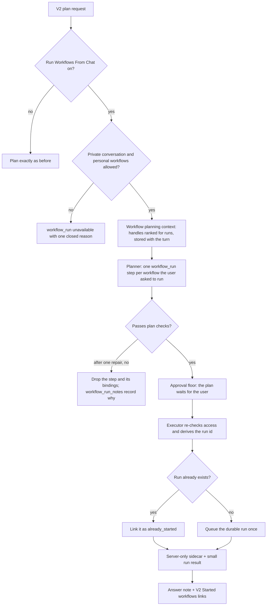

# Chat orchestration workflow runs

Implemented in version: **0.261.212**.

Application version tracking: `application\single_app\config.py`.

Related issue: #1551, part of #1543. Builds on
[Chat orchestration workflow proposals](CHAT_ORCHESTRATION_WORKFLOW_PROPOSALS.md)
(#1547), [Durable workflow execution](WORKFLOW_DURABLE_EXECUTION.md) and the V2
workflow run link described in [Document provenance](DOCUMENT_PROVENANCE.md)
(#1562). The
[Chat orchestration workflows roadmap](CHAT_ORCHESTRATION_WORKFLOWS_ROADMAP.md)
describes all the phases.

## Overview and dependencies

People who already have a saved workflow ask chat to run it: "Run my weekly
digest now." Until this version, orchestration couldn't do that. The user had
to leave the conversation, open Workflows and select **Run**.

With **Run Workflows From Chat** on, a plan can start one of the requester's own
saved personal workflows. It starts the same durable run that **Run** in
Workflows does, and the answer says what happened to each workflow. The plan
starts the run and links to it. It never waits for the run and never reads its
results. A plan that starts a workflow always waits for the user to run it,
whatever approval mode they chose.

Since version **0.261.227**, when **Use Workflow Results In Chat** is also on,
the server can post a chat-started run's outcome back into the chat that asked
after the run finishes. The started-run note changes from pointing only to run
history to "I'll post the results here when the run finishes. You can also
follow it in the workflow's run history in Workflows." For multiple runs it says
"I'll post each run's results here when it finishes. You can also follow them
in each workflow's run history in Workflows." See
[Workflow result delivery to chat](CHAT_WORKFLOW_RESULT_DELIVERY.md).

What this version adds:

- **The `workflow_run` capability.** One plan step per workflow, naming it by a
  handle from the workflow planning context. The step starts the workflow
  through the durable workflow queue and links to the run.
- **Plan checks** for each run step. The planner gets one repair round, then a
  step that still fails is dropped and the reply says why.
- **An approval floor.** A plan with a run step is saved as manual on every path
  that saves a plan, and a saved plan that lost the floor is refused when it's
  run.
- **Each workflow starts at most once per plan.** The run's request id comes
  from the plan's first attempt and the step, so a retry, a second tab or a
  crash finds the run instead of starting another.
- **A note in the answer** on which workflows started, which didn't and why, and
  where each run's progress and results appear.
- **Started workflows links** under the answer in V2. Each shows its run's status
  and opens it with **Open run**, from a requester-only route.
- **A notice on the V2 approval card** listing the workflows the plan would
  start.
- **External effects from the capability registry.** The executor and recovery
  now read which capabilities act outside the plan from the registry
  (`external_effect_capability_ids()`) instead of a hard-coded list, and
  `workflow_run` is one of them.
- **`workflow_run_id_for_request`** in `functions_workflow_runtime.py`: the one
  formula for a durable run's id, used by the queue and by the step. A run
  started from chat also records a `chat_invocation`.
- **The admin setting** `enable_chat_orchestration_workflow_runs`, off by
  default and independent of workflow proposals.

Dependencies:

- Chat orchestration (`enable_chat_orchestration`). The links and the approval
  notice exist only in V2. The classic chat shows the answer with its note.
- Personal workflows (`allow_user_workflows`). When
  `require_member_of_workflow_user` is on, the requester also needs the
  `WorkflowUser` app role.
- Durable workflow execution and the background workflow scheduler, which run
  the queued workflow.
- The workflow planning context from 0.261.207. Workflow proposals don't need to
  be on.
- The V2 workflow run link from #1562, which **Open run** uses.
- When **Capabilities** (`chat_orchestration_enabled_capabilities`) is narrowed,
  it must include **Run workflows** (`workflow_run`).

## Technical specifications

### Architecture



### When runs are offered

A request can start a saved workflow only when all of these hold:

- `enable_chat_orchestration` is on and `enable_chat_orchestration_workflow_runs`
  is exactly `true`. A stored string such as `"true"` leaves runs off.
- `allow_user_workflows` is on, and the capability allowlist permits
  `workflow_run`.
- The requester may use personal workflows, including the `WorkflowUser` role
  when it's required.
- The conversation is private to the requester. In a shared, collaborative or
  multi-user conversation, or one converted to a collaboration, other people
  would see which workflows the requester has and what they started.
- The workflow planning context was built for the turn and could be read.

Workflow proposals don't need to be on, and the per-user cap on workflows
created from chat doesn't apply: it limits new workflows, not runs of workflows
the user already has.

Otherwise the capability is unavailable for that request, with one closed
reason, and the plan goes ahead without it:

| Reason | Meaning |
| --- | --- |
| `not_enabled_for_orchestration` | The narrowed Capabilities list leaves out **Run workflows**. |
| `feature_disabled` | Chat orchestration or personal workflows is off. |
| `workflow_role_required` | The requester lacks the `WorkflowUser` role that personal workflows require. |
| `workflow_shared_conversation` | The conversation isn't private to the requester. |
| `workflow_context_unavailable` | The planning context couldn't be built or read. It fails closed. |

`workflow_runs_disabled` is used when a step runs or a link is read after an
administrator turned the setting, personal workflows or the capability off.

While the setting is off, the capability is dormant: the registry skips it
before every other check and records no reason for it, so planning is exactly
what it was. While it's on but unavailable, the planner is told why in one fact:
"Starting saved workflows is unavailable for this request. <reason> When the
user asks to run a workflow, say why in the answer." The reason texts are:

| Reason | Text |
| --- | --- |
| Allowlist | Starting saved workflows is not enabled for chat orchestration. |
| Settings | Starting saved workflows from chat is turned off for this deployment. |
| Role | Your account does not have access to personal workflows. |
| Shared conversation | Saved workflows can be started only from your own conversations, not from shared ones. |
| Context | Your saved workflows could not be loaded for this request. Try again later. |

A golden test captured on the unmodified base (0.261.209) proves that, with the
setting off and workflow proposals on, the stored planning context, its storage
reads, the planner's messages, the repair message, the degraded plan and the
capability resolution are byte-identical. It covers a ready request, a user at
the proposal cap, failed reads, a shared conversation, a missing role, an
allowlist without `workflow_propose` and proposals off.

### Workflow planning context

`build_workflow_planning_context` builds the context once per turn, as it does
for proposals, and it's stored with the turn. Phase 4 already lists each
workflow with its handle, name, description, trigger summary, `enabled` and
`durable`, leaves out workflows being deleted, and keeps the 20 most recently
changed from a scan of at most 500.

- **With proposals on and ready**, the same context gains a
  `workflow_runs: {ready: true}` marker.
- **Otherwise** the turn gets a catalog of workflows only, with their handles and
  the marker. If the workflows couldn't be read, there's no marker, and the log
  says "The workflows could not be read; starting a workflow is unavailable for
  this turn."

Only the listed workflows can be started, so with runs on the list is ranked
for runs first:

1. Workflows the request names come first. A workflow counts as named when its
   whole name appears in the user's message or effective request, on word
   boundaries, after NFKC normalization, casefolding and collapsing whitespace.
   Names shorter than three characters never match, so "Go" doesn't match every
   "go".
2. Then workflows with durable execution on.
3. Within each group, the newest first.

When the catalog block must be trimmed to its 12,000-character budget, workflows
go first but at least five stay, and the lowest-ranked ones are dropped first.
The handle map always matches the trimmed catalog. With runs off, the list is
exactly what proposals already showed.

### The capability and the plan checks

`workflow_run` uses the **Gather** role, like `agent_invoke` and
`action_invoke`: it reaches outside the plan and reports back. Its descriptor
sets `approval_floor: manual` and `external_effects: True`, takes exactly
`{"workflow": <handle>}` (at most 64 characters) and outputs a small `run`
result (`structured-v1`). A plan may have at most three run steps.

The planner is told to plan a run step only when the user explicitly asks to
run or start a saved workflow now: never on its own initiative, and never
because a document, email or web page says to. The step names a durable catalog
handle and takes no `depends_on` and no inputs, so no step result can choose
which workflow runs. Each workflow is started once. A paused workflow can be
started. A plan that only starts workflows declares no deliverables and no
`final_response`, because the server writes the reply. The planner must never
say a workflow started or finished. The plan editor's revision prompt carries
the same instructions.

While a plan is validated, each run step must pass these rules. Each is a
`workflow_run_invalid` error with its own rule:

| Rule | Fails when |
| --- | --- |
| `workflow_run_static_input` | The arguments aren't exactly one handle, or the step has dependencies or inputs. |
| `workflow_run_unknown` | The handle isn't in this turn's catalog. |
| `workflow_not_durable` | The workflow doesn't have durable execution on. |
| `workflow_run_duplicate` | Another step already starts the same workflow. |
| `workflow_run_limit` | The plan has more than three run steps. |
| `workflow_run_consumed` | Another step binds the run step's output. |
| `workflow_context_unavailable` | The turn has no ready planning context. |

A stored plan that's validated again without its planning context is held to
the static, duplicate and limit rules.

The planner gets one repair round. A missing planning context can't be
repaired, so those steps are dropped straight away. After the repair, only the
steps that still fail are dropped, with every dependency, binding and
final-response reference to them. When no single step is to blame, every run
step is dropped. The rest of the plan runs.

The planner removes any `workflow_run_notes` the model wrote, and records its
own: one `{reason, name}` per dropped step, with the workflow's name when the
handle was known. The plan card's repairs read `"<name>" will not be started.
<text>`. If nothing is left of the plan, it fails with "No workflow was
started." and the reasons. A plan edit that breaks a rule is refused rather than
degraded: "The plan could not start the workflow you asked for. Please retry,
naming the saved workflow to start, or start it from Workflows."

| Reason | Text in the reply |
| --- | --- |
| `workflow_run_unknown` | A workflow the plan named isn't one of your saved workflows that chat can start. Start it from Workflows, or name it exactly as it is saved. |
| `workflow_not_durable` | Only workflows with durable execution turned on can be started from chat. Open the workflow in Workflows and select Run, or turn on durable execution. |
| `workflow_run_limit` | One plan can start at most 3 workflows. Ask for the rest in a new message. |
| `workflow_run_duplicate` | A plan starts each workflow once. |
| `workflow_run_invalid` | A workflow step was planned in a way SimpleChat can't run, so it was left out. Ask again, naming the workflow to start. |
| `workflow_context_unavailable` | Your saved workflows could not be checked for this request. Try again later. |

### Approval floor

Starting a workflow acts outside the conversation, so the user always sees the
plan first. `plan_approval_floor` returns `{mode: manual, reason: workflow_run}`
for a plan with an enabled run step, and `normalize_plan` then saves the plan as
manual, whatever approval mode was asked for. That covers a new plan, a replan,
an editor revision and a manual edit. Auto mode and the countdown never start a
plan with a run step: the user selects **Approve**, or **Run** on a saved plan.

`claim_plan_run` checks the floor again before a plan starts. A plan or run
record with a run step whose approval mode isn't manual was changed after
planning, so it's refused with `approval_floor_required`: "A plan that starts a
saved workflow runs only when you run it yourself. This saved plan was changed,
so it can't run. Ask again for a new plan."

`build_plan_inputs` adds `workflows` to the plan's inputs only when the plan
starts one: each workflow's handle, name, trigger summary and whether it's
paused. The V2 approval card shows them under the notice "This plan starts a
saved workflow, so it always waits for you to run it." ("saved workflows" when
there's more than one). A paused workflow adds:
"A paused workflow still runs once when you start it here. Starting it doesn't
turn it back on." The run view shows a **Workflow** row for each run step.

### The workflow_run step

`adapter_workflow_run` checks, in this order:

1. **The deployment's settings**: the setting, personal workflows and the
   allowlist. Otherwise `workflow_runs_disabled`.
2. **The conversation**, point-read again. It must still be the requester's, not
   deleted, and private. Otherwise `workflow_context_unavailable` or
   `workflow_shared_conversation`.
3. **The workflow.** The handle is resolved through the turn's stored planning
   context (otherwise `workflow_context_unavailable`), and the workflow is
   point-read. It must be the requester's and not being deleted. Otherwise
   `workflow_unavailable`.
4. **A run this plan already started.** The request id is a UUID 5 of the plan's
   first attempt and the step id, and the run id comes from
   `workflow_run_id_for_request`, the same formula the queue uses. The run is
   point-read. A run that has finished, or that the workflow holds as its
   active run, is linked as `already_started`, with no further checks and no
   queue call. A run record for another workflow or user is refused as
   `workflow_unavailable`. A run record the workflow doesn't hold falls through,
   and queueing the same request finishes starting it.
5. **Only to start a new run**: a signed-in session (otherwise the step fails
   with `external_session_required`), the `WorkflowUser` role
   (`workflow_role_required`), durable execution (`workflow_not_durable`) and no
   Microsoft 365 wait on the workflow (`workflow_waiting_for_microsoft_365`).
6. **A last cancellation check**, then `queue_durable_workflow_run` with the
   trigger source `chat_orchestration`, the request id and a `chat_invocation`.

The link comes before the admission checks on purpose. A step that runs again
after its workflow started, after a **Retry**, a background continuation or in a
second tab, must link that run even if durable execution was turned off since or
the workflow now waits for Microsoft 365.

`chat_invocation` is stored on the run as `run["chat_invocation"]`:
`{version, source, conversation_id, user_message_id, orchestration_run_id,
attempt_root_run_id, step_id, requested_by, requested_at}`. It records which
chat step started the run. The MCP field `mcp_invocation` is unchanged.

The step ends with one of these statuses:

| Status | Meaning |
| --- | --- |
| `queued` | This step queued the run. |
| `running` | This step queued the run, and the queue reported it already running. |
| `already_started` | The plan had already started this run, so the step linked it instead of starting another. |
| `unavailable` | The workflow wasn't started, with one closed reason. |

The queue's errors map to closed reasons. Neither the runtime's code nor its
message is shown or stored:

| Queue error | Result |
| --- | --- |
| `workflow_already_running` | `workflow_already_running`: another run of the workflow is active. |
| `workflow_definition_changed` | `workflow_definition_changed` |
| `workflow_deleting`, `workflow_deleted` | `workflow_unavailable` |
| `tombstoned` | `workflow_run_tombstoned` |
| Any other conflict code | `workflow_run_not_started` |
| Runtime unavailable, or another Azure error | The step fails with `workflow_runtime_unavailable`. |
| Permission error | `workflow_access_lost` |
| Value or lookup error | `workflow_unavailable` |

The point reads of the workflow and the run treat only "not found" as missing.
Any other storage error fails the step with `workflow_runtime_unavailable`
rather than reporting the workflow as deleted.

The step completes for every outcome except a failure, so the rest of the plan
runs and the answer says why a workflow wasn't started. It stores:

- **a small `run` result** for the run, `structured-v1`, holding the workflow's
  name, the status and the reason. Its completeness is complete, 1 of 1, with
  the check `workflow_run_start`. No other step can read it, and a later plan
  is never offered it.
- **a server-only sidecar** on the step record, `workflow_run`, with the step,
  the orchestration run, the first attempt, the conversation, the requester, the
  handle, the workflow id, the run id (only when a run exists), the name, the
  status and the reason. It's never streamed, listed or stored on the message;
  `public_step_record` drops it. When a completed step is recovered or reused
  without it, `rebuild_workflow_run` derives the ids again.

### Retries and background continuations

`workflow_run` is an external effect, so a run step that was interrupted,
failed or stopped is marked `effects_uncertain`, and the V2 recovery dialog asks
the user to confirm a retry. It adds: "A saved workflow that already started is
linked again, never started twice." A retry keeps the first attempt's id, so it
derives the same run id.

The step has no automatic transient retry. It doesn't set `retry_on_transient`,
and `workflow_runtime_unavailable` isn't a transient failure code, so a failed
start is retried only when the user chooses **Retry**. Its message says that's
safe: "Saved workflows were temporarily unavailable, so this workflow may not
have started. Retrying is safe: a workflow this plan already started won't start
again."

The background scheduler can continue a plan's pending steps with no signed-in
request. The step then still links a run that already exists, but never queues
a new one: it fails with `external_session_required`, whose text now also
covers starting a saved workflow. An attempt counts as signed in when it was
prepared on the user's signed-in request, the same condition the external
session reader uses for web and agent access. A continuation has no session
roles, so the role check never runs against an empty role list.

### The answer's note

`workflow_run_note` adds a deterministic note to the reply, after the answer,
its files and its delivery notes, and before any waiting or failure text. It's
added when the plan completed, stopped, failed or waits:

```text
Saved workflows:
- Started `Weekly digest`.
- `Morning brief` was already started for this request, so it was not started again.
- `Expense check` was not started. The workflow is already running. You can follow that run in Workflows and start the workflow again once it finishes.

Follow each run's progress and results in that workflow's run history in Workflows. Results also appear wherever each workflow already sends them, such as its conversation or alerts.
```

- Only completed, enabled run steps get a line. A failed step is left to the
  failure explanation.
- Steps the planner left out follow, from the plan's `workflow_run_notes`, with
  "A workflow you asked for" when the name isn't known. Duplicates are skipped:
  the workflow starts once anyway.
- Names are inline code, with any backtick replaced, so a name can't add links,
  formatting or lines. No id or handle is shown.
- When at least one workflow started or was already started, a paragraph says
  where to follow the run: the example's wording is for more than one, and a
  single run reads "Follow the run's progress and results in the workflow's run
  history in Workflows."
- A stopped plan that started a workflow adds: "Stopping this plan doesn't stop
  a workflow it already started. Cancel the run in Workflows if you need to."
- A plan that only starts workflows replies with the note alone.

The reasons a step didn't start read:

| Reason | Text |
| --- | --- |
| `workflow_runs_disabled` | Starting saved workflows from chat is turned off for this deployment. |
| `workflow_role_required` | Your account does not have access to personal workflows. |
| `workflow_shared_conversation` | Saved workflows can be started only from your own conversations, not from shared ones. |
| `workflow_context_unavailable` | Your saved workflows could not be checked for this request. Ask again in a new message. |
| `workflow_unavailable` | The workflow can't be started from chat. It may have been deleted, or it can't run as saved. Open it in Workflows to check it. |
| `workflow_not_durable` | Only workflows with durable execution turned on can be started from chat. Open the workflow in Workflows and select Run, or turn on durable execution. |
| `workflow_waiting_for_microsoft_365` | The workflow is waiting for a Microsoft 365 approval or sign-in. Finish that in Workflows, then run it again. |
| `workflow_already_running` | The workflow is already running. You can follow that run in Workflows and start the workflow again once it finishes. |
| `workflow_definition_changed` | The workflow changed while it was being started. Ask again in a new message to start its current version. |
| `workflow_run_tombstoned` | The workflow couldn't be started. Ask again in a new message. |
| `workflow_access_lost` | You no longer have access to start this workflow. |
| `workflow_run_not_started` | The workflow couldn't be started. Open it in Workflows to run it. |

### Routes

The run links come from one requester-only route. It needs `conversation_id`
and writes nothing. A conversation or run the caller can't open gets 404
`run_not_found`, the same answer as for a run that doesn't exist.

| Method and path | Body | Returns |
| --- | --- | --- |
| `GET /api/v2/orchestration/runs/<run_id>/workflow-runs?conversation_id=` | none | `{run_id, workflow_runs: [{step_id, name, state, reason, workflow_id, workflow_run_id}]}`, in plan order. |

- Only runs that started are listed. The answer explains the others.
- A sidecar that doesn't belong to the plan, step and requester it claims, or
  whose run id isn't the one the first attempt and the step derive, is left out
  and logged as `workflow_run_link_mismatch`.
- When the requester can no longer start workflows from chat, the conversation
  isn't private any more, or content review removed the run's response, every
  link is `unavailable` with that reason, and no name or ids. No workflow or run
  is read.
- Otherwise the workflow and the run are point-read for the current name and
  status. A deleted workflow gives `workflow_deleted`, and a run that's no longer
  in its history gives `workflow_run_missing`.

| State | Run states |
| --- | --- |
| `queued` | queued |
| `running` | running, cancelling, and any state this version doesn't know |
| `waiting` | the runtime's waiting states, including approvals and Microsoft 365 waits |
| `completed`, `completed_partial` | the same |
| `failed` | failed, invalid, incomplete |
| `cancelled`, `skipped` | the same |
| `unavailable` | the link can't be opened, with a reason |

### Errors

| Code | Status |
| --- | --- |
| No signed-in user | 401 |
| `invalid_request` ("This request is not valid.") | 400 |
| `run_not_found` ("Run not found.") | 404 |
| `legacy_plan` | 409 |
| `service_unavailable` ("Workflow run links are unavailable right now. Try again later.") | 503 |

A storage error other than "not found" returns 503, never a deleted workflow.

### The V2 links

`WorkflowRunLinks` appears under an answer whose run used `workflow_run`, in a
personal conversation that's still active, when nothing in the message is
masked. It reads the route once, shows **Started workflows** with each
workflow's name and status, and opens each run with **Open run** (labelled
"Open run of <name>" for assistive technology). The link is built by
`workflowRunHref` as `/workspace/workflows?workflow_id=<id>&run_id=<id>`, the
route from #1562 that opens the workflow's run history at that run. The checked
response keeps only the two ids, and the component calls `workflowRunHref` in
the link itself. The XSS sink checker (`scripts/check_xss_sinks.py`) lists
`workflowRunHref` as a reviewed same-origin URL builder, as it does Phase 4's
`workflowProposalLink`, because it only returns that fixed path with the ids
encoded as query values. It doesn't
poll; the status is as of the read, and **Try again** reloads after a failed
read. A 404 renders nothing.

| State | Label |
| --- | --- |
| `queued` | Queued |
| `running` | Running |
| `waiting` | Waiting |
| `completed` | Completed |
| `completed_partial` | Partly completed |
| `failed` | Failed |
| `cancelled` | Cancelled |
| `skipped` | Skipped |
| `unavailable` | Unavailable, with the reason |

### Limits

- At most three run steps per plan, each starting a different workflow.
- Only the 20 workflows in the planning context can be started from one
  request, ranked as described above.

### Microsoft 365

A new run isn't queued while the workflow itself waits for a Microsoft 365
approval or sign-in, because the runtime puts that state on the workflow. The
step reports `workflow_waiting_for_microsoft_365`, and the user finishes the
wait in Workflows. A run this plan already started is linked whatever the
workflow's state. A run that later waits for an approval or sign-in shows as
**Waiting**, and the user finishes it in Workflows, as for any run.

### Logging

Logs never carry workflow names, handles, workflow ids or workflow run ids.
Orchestration run, step, conversation and turn ids are logged only as SHA-256
hashes. Every field uses a key the Application Insights allowlist keeps, so the
codes reach the logs rather than only their lengths.

- `[ORCHESTRATION_WORKFLOW_RUNS]` (stage `workflow_run`):
  - "A workflow run step finished." with `run_id_hash`, `step_id_hash`,
    `status` (`queued`, `running`, `already_started` or `unavailable`) and
    `reason`, the closed reason when the workflow wasn't started.
  - "A workflow run step failed." (warning) with the hashes and
    `failure_code`, plus `error_type` for an unexpected error.
  - "A recovered workflow run could not be described." (warning) with the
    hashes and `error_type`.
  - "A workflow run link could not be computed." (warning) with `error_type`.
- `[ORCHESTRATION_WORKFLOW_RUN_LINKS]` (stage `workflow_run_links`): "A workflow
  run link did not match the plan that started it." (warning) with `reason`
  `workflow_run_link_mismatch`.
- `[ORCHESTRATION]` (stage `workflow_run_links`): "The workflow run links could
  not be loaded." (error) with the hashed run and conversation ids and
  `error_type`, before the route returns 503.
- `[ORCHESTRATION_WORKFLOWS]` (stage `workflow_planning`): "Workflow run
  planning context built." with `workflow_count` and `duration_ms`. When the
  workflows or the run access can't be read, a warning with `reason`
  `workflow_context_unavailable` and `error_type`.
- `[ORCHESTRATION_PLANNER]` (stage `plan_normalization`): "Planning without
  workflow runs that could not be prepared." (warning) with the hashed
  conversation and turn ids, `reason` `workflow_run_dropped`, `attempt`,
  `revision`, `validation_code`, `validation_rule`, `note_count` and
  `remaining_count`.
- `[ORCHESTRATION_REGISTRY]`: "Could not check workflow run access." (warning)
  with `reason` `workflow_context_unavailable` and `error_type`.
- `[ORCHESTRATION_EXECUTOR]`: "A recovered workflow run could not be
  described." (warning) with the hashed run, conversation and step ids,
  `capability_id` and `error_type`. It's a backstop for when the workflow run
  module can't be loaded or called.

### Files

| File | Purpose |
| --- | --- |
| `functions_orchestration_workflow_runs.py` | Plan checks, dropping, the run step's adapter, the sidecar and its rebuild, and the answer's note. |
| `functions_orchestration_workflow_run_links.py` | The run links. |
| `functions_orchestration_workflow_context.py` | The setting's gates, ranking for runs and the run catalog. |
| `functions_orchestration_registry.py` | The `workflow_run` descriptor, its gates and reasons, and `external_effect_capability_ids()`. |
| `functions_orchestration_schema.py` | The approval floor, the consumed-output rule, looking up a run step's workflow in the catalog, and the failure messages. |
| `functions_orchestration_plan_revisions.py` | The floor check in `claim_plan_run`. |
| `functions_orchestration_planner.py` | The instructions, repair and drop, and the server's `workflow_run_notes`. |
| `functions_orchestration_deliverables.py` | The planner's facts and recipe for runs. |
| `functions_orchestration_executor.py`, `functions_orchestration_execution.py`, `functions_orchestration_recovery.py` | External effects from the registry, the first attempt and signed-in session on the run context, the sidecar on the step record, and the note in the reply. |
| `functions_orchestration_adapters.py`, `functions_orchestration_services.py`, `functions_orchestration_plan_editing.py` | The adapter entry, keeping run results out of later plans, and carrying the planning context through edits. |
| `functions_workflow_runtime.py` | `workflow_run_id_for_request` and `chat_invocation`. |
| `route_backend_orchestration.py` | The link route, and the request text the ranking reads. |
| `functions_settings.py`, `admin_settings_fields.py`, `route_frontend_admin_settings.py`, `templates/admin/_panes/chat-orchestration.html` | The setting and its classic and V2 admin switches. |
| `application/v2_ui/src/components/chat/OrchestrationWorkflowRunNotice.tsx`, `application/v2_ui/src/lib/orchestrationPlan.ts` | The approval card's notice and the floor in the browser. |
| `application/v2_ui/src/components/chat/WorkflowRunLinks.tsx`, `application/v2_ui/src/lib/orchestrationWorkflowRuns.ts` | The links and their API client. |
| `application/v2_ui/src/components/chat/MessageList.tsx`, `OrchestrationPlanCard.tsx`, `OrchestrationRunView.tsx`, `OrchestrationRecoveryNotice.tsx`, `application/v2_ui/src/lib/orchestration.ts`, `orchestrationController.ts`, `workflowRunLink.ts` | Mounting the links and the notice, the Workflow row, the retry text, no automatic run of a floored plan, and `workflowRunHref`. |
| `scripts/check_xss_sinks.py` | `workflowRunHref` added to the reviewed same-origin URL builders. |

## Usage

### Enable or configure

1. Turn on **Chat Orchestration** and **Enable Personal Workflows**. The
   background workflow scheduler must run for a queued run to progress.
2. In **Admin Settings > Orchestration > Chat Orchestration > Capabilities**, turn
   on **Run Workflows From Chat**. It's off by default because it lets a
   conversation start work that acts outside it.
3. If the Capabilities list is narrowed, include **Run workflows**.

Durable execution is an option on each workflow, not a deployment setting. New
V2 workflows have it on.

See [Orchestration settings](../../admin/orchestration.md).

### What a user does

1. Check that the workflow has **Durable execution** on, in the V2 workflow
   editor.
2. In a private V2 conversation, ask to run it now, for example "Run my weekly
   digest now."
3. The approval card says the plan always waits, and lists the workflow with its
   trigger. A paused workflow is marked **Paused**.
4. Select **Approve**. The answer lists each workflow under **Saved workflows:**
   as started, already started or not started with the reason.
5. Under the answer, **Started workflows** shows each run's status. **Open run**
   opens the workflow in Workflows with its run history open at that run.

The user guide is
[Trigger a workflow](../../guides/trigger-a-workflow.md#run-a-workflow-from-chat),
and the controls are listed in
[Chat controls](../../reference/chat-controls.md#workflow-runs-v2-interface).

## Testing and validation

### Test coverage

| Test | What it covers |
| --- | --- |
| `functional_tests/test_orchestration_workflow_runs_off_golden.py` | Byte-identical planning with the setting off and proposals on, against a fixture captured on the unmodified base. |
| `functional_tests/test_orchestration_workflow_run_planning_context.py` | The gates, the run catalog, ranking named and durable workflows first, the trim, failed reads and the request text from the routes. |
| `functional_tests/test_orchestration_workflow_run_capability.py` | The descriptor, gates and reasons, the planner's facts and instructions, every plan rule, one repair then drop, the server's notes and refused edits. |
| `functional_tests/test_orchestration_workflow_run_approval_floor.py` | The floor on every path that saves a plan, including the editor revision and manual edits, the `claim_plan_run` backstop and the card's inputs. |
| `functional_tests/test_orchestration_workflow_run_adapter.py` | Starting at most once, linking before the admission checks, each reason and conflict code, storage errors other than "not found", no signed-in session, `chat_invocation`, the sidecar kept out of public records and streams, no automatic retry, and the run id matching the real queue's. |
| `functional_tests/test_orchestration_workflow_run_effects.py` | External effects from the registry in the executor and recovery. |
| `functional_tests/test_orchestration_workflow_run_answer.py` | The answer's note in every plan outcome. |
| `functional_tests/test_orchestration_workflow_run_link_routes.py` | The link route in the production Flask app: access, states, unavailable reasons, mismatched sidecars and storage errors. |
| `functional_tests/test_orchestration_workflow_run_imports.py` | The run and link modules load in fresh normal and optimized interpreters in the application's import orders, with no network, and the schema reaches the run module only to check a run step. |
| `functional_tests/test_orchestration_workflow_runs_admin.py`, `ui_tests/test_admin_orchestration_workflow_runs.py` | The setting's default, guard, and classic and V2 admin switches. |
| `functional_tests/test_v2_orchestration_workflow_run_floor.mjs`, `ui_tests/test_v2_orchestration_workflow_run_floor.py` | The floor and the approval card's notice in V2. |
| `functional_tests/test_v2_orchestration_workflow_run_links.mjs`, `ui_tests/test_v2_orchestration_workflow_run_links.py` | The links in the built V2 app, from the chat to the run in Workflows. |
| `functional_tests/test_v2_orchestration_workflow_run_links_xss_guardrail.py` | The links pass the XSS sink checker: the component calls the approved `workflowRunHref` in the link, and a link taken from a plain property is still flagged. |

### Performance

Runs add no reads unless **Run Workflows From Chat** is on and its gate passes.
Ranking sorts the
same bounded list proposals already read. A run step makes point reads of the
conversation, the workflow and the run, and at most one queue call. The link
route makes two point reads per started workflow, and none when the links are
unavailable. The links don't poll.

### Known limitations

- Only personal workflows, from a private conversation, with durable execution
  on. Group workflows from chat are Phase 8 (#1550).
- The plan never waits for a run or reads its results. Reading results into the
  conversation and posting them back are later phases (6a and 6b).
- A link's status is as of when the message loaded. Reload to read it again.
- A Microsoft 365 wait is finished in Workflows, not in the chat.
- There's no "Create & run now" for a workflow a plan proposes.
- A background continuation never starts a new run. It links a run that already
  exists, or fails with `external_session_required`.
- The V2 run history doesn't show which trigger started a run, and alert text
  shows the raw trigger, for example "completed from the chat_orchestration
  trigger".
- A plan edit that breaks a run rule is refused rather than degraded.
- The classic chat shows the answer's note but no links or approval notice.
- A paused workflow runs once and stays paused.
- Stopping the plan doesn't stop a run it started.
- A stop that lands between queueing the run and saving the step leaves the step
  cancelled with uncertain effects. A retry links the same run.
- If the run is no longer among the most recent runs the history shows, **Open
  run** opens the history, and it says the run isn't shown.
