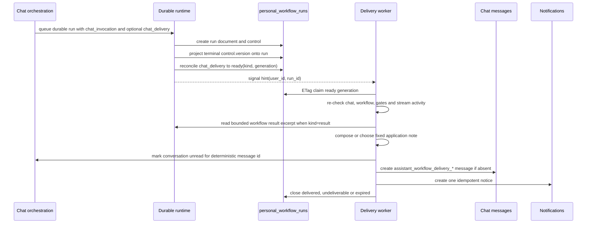

# Workflow result delivery to chat

Implemented in version: **0.261.218**.

Application version tracking: `application\single_app\config.py`.

Related issue: #1546 (part 6b-1), part of #1543. Builds on
[Chat orchestration workflow runs](CHAT_ORCHESTRATION_WORKFLOW_RUNS.md)
(#1594), [Workflow results in chat](CHAT_WORKFLOW_RESULTS_FOLLOW_UP.md)
(#1546 part 6a), and the V2 workflow run link described in
[Document provenance](DOCUMENT_PROVENANCE.md) (#1562). The
[Chat orchestration workflows roadmap](CHAT_ORCHESTRATION_WORKFLOWS_ROADMAP.md)
describes all the phases; this is the server-side part of Phase 6b.

## Overview and dependencies

A chat orchestration plan can start one of the requester's saved personal
workflows and then finish immediately. Before this version, the user had to open
Workflows later to see what the run produced. With **Use Workflow Results In
Chat** on, the server posts that run's terminal outcome back into the same
private chat that asked for it, even if the run finishes hours later.

The delivery is server-side. It ships no V2 run-card UI in this pull request.
6b-2 polls the status route documented below and decides how to render cards,
Retry and Open run.

What this version adds:

- a `chat_delivery` run record seeded into the run's first durable write when a
  chat plan starts a personal durable workflow and the role-aware **Use Workflow
  Results In Chat** gate passes.
- runtime projection reconciliation that moves that record from pending to ready
  at the terminal durable runtime generation, reopens it only for a later resume
  generation, expires old in-flight records, and signals a worker without
  blocking the run.
- an idempotent delivery worker that re-checks chat ownership, privacy,
  workflow access and the gate; defers while a chat may be mid-stream; composes
  a bounded result summary; posts one deterministic message per generation;
  marks the chat unread; and sends one bell notification.
- fixed application notes for failures, cancellations, skipped runs, saved
  analyses, content-blocked results and results that cannot be shown in chat.
- undeliverable notices when the chat cannot accept the post any more, such as
  a deleted chat, a shared chat or lost access. Deleted workflows and missing
  runtime controls close silently.
- classic Retry/Edit refusal for any message a workflow run posted.
- an owner-only status route for 6b-2:
  `GET /api/v2/orchestration/workflow-runs/status[?conversation_id=...]`.

Dependencies:

- Personal workflows (`allow_user_workflows`). When
  `require_member_of_workflow_user` is on, the requester also needs the
  `WorkflowUser` app role.
- Chat orchestration run steps (`enable_chat_orchestration_workflow_runs`) from
  Phase 5. Delivery never starts a workflow by itself.
- Durable execution. Chat-started workflow runs eligible for delivery are the
  durable runs started by Phase 5.
- Workflow results in chat (`enable_chat_workflow_results`), off by default.
  The role-aware gate `is_chat_workflow_results_enabled_for_user` is checked at
  start and again at delivery.
- The background task host and the durable workflow scheduler. The worker uses a
  hint queue for prompt delivery and a locked sweep as the backstop.

## Technical specifications

### Architecture and flow



The plan does not wait for the workflow. Its started-run note explains where the
result will appear. When every run that answer started carries a delivery seed,
the note uses these fixed strings from the contract module:

- `I'll post the results here when the run finishes. You can also follow it in the workflow's run history in Workflows.`
- `I'll post each run's results here when it finishes. You can also follow them in each workflow's run history in Workflows.`

Linked or rebuilt runs keep the older Phase 5 note text, because only a fresh
start that recorded this chat's delivery sets the sidecar `chat_delivery: true`.

### The `chat_delivery` record

The run document holds a `chat_delivery` object. It contains only IDs, statuses,
model identity fields, roles, timestamps, lease data and closed reason codes. It
never stores result text, prompt text, model output or exception text.

| Field | Meaning |
| --- | --- |
| `version` | Contract version, currently `1`. |
| `status` | `pending`, `ready`, `delivering`, `delivered`, `undeliverable` or `expired`. |
| `generation` | Durable runtime control `version` for the terminal projection being delivered, or `null` before one is ready. |
| `expires_at` | Delivery deadline. Runtime `deadline_at + 24h` when available, otherwise seed time plus the admitted deadline, capped at 86,400 seconds, plus 24 hours. |
| `time_zone` | Request time zone, or planning time zone, or `UTC`. |
| `model_selection` | Bounded request model identity: `model_deployment`, `model_id`, `model_endpoint_id`, `model_provider`, `reasoning_effort` and up to 10 group ids. |
| `requester_roles` | Up to 20 role names, each up to 64 characters, captured at start for headless gate checks. |
| `lease_id`, `lease_expires_at` | The ETag claim fence. Leases last 300 seconds. |
| `attempts`, `next_attempt_at`, `first_deferred_at` | Retry and chat-settling state. Backoff is 30s, 1m, 2m, 4m, 8m, 15m, 15m, 15m; at 8 attempts the record closes. |
| `phase` | `claimed`, `publishing`, `unread_marked`, `message_created`, `notified` or `null`. |
| `message_id`, `planned_at` | The deterministic message id and the planned unread/message time. |
| `kind` | `result`, `failed`, `cancelled`, `status`, `content_blocked`, `analysis`, `expired` or `skipped`. |
| `notice_kind` | `chat_response`, `undeliverable`, `expired`, `none` or `null`. |
| `outcome_reason` | Closed code such as `chat_unavailable`, `access_lost`, `workflow_deleted`, `runtime_missing`, `delivery_failed`, `expired_before_delivery`, `content_blocked`, `results_off`, `result_unavailable` or `deadline_exceeded`. |
| `run_status` | Runtime state observed for the generation. |
| `delivered_at`, `created_at`, `updated_at` | UTC timestamps written in the delivery format. |
| `history` | Up to five summaries of older generations, with codes and ids only. |

The origin fields stay in `chat_invocation`: `conversation_id`,
`user_message_id`, `orchestration_run_id`, `attempt_root_run_id`, `step_id`,
`requested_by` and `requested_at`.

### Generation and reopen rule

A delivery generation is the durable runtime control `version` at the terminal
projection. The message id, notification idempotency key and status row all use
that generation.

A `delivered` or `undeliverable` record reopens only when the live control's
`version` is greater than the record's `generation` and the control is not
`deleted`. Durable resume is the normal source of that version bump. The resume
route keeps the same `run_id` and expects the client body
`{expected_version, request_id}`.

Tombstone deletion is the only non-resume write that bumps a terminal control's
version. It sets `deleted: true`, so it does not reopen delivery. A deleted
control closes a pending or ready record silently as `workflow_deleted`. A
missing control closes within one sweep as `runtime_missing`, also silently.
Expired records never reopen. An already delivered record stays delivered when a
control is deleted later.

### Guarded save and exactly-once delivery

There are two layers that keep delivery exactly once:

1. `save_personal_workflow_run` uses a guarded, merge-preserving ETag path for
   runs that carry `chat_delivery`, and for the double-fault case where a
   chat-started run lacks `chat_invocation`. The stored `chat_delivery` always
   wins over an incoming stale copy. The stored `chat_invocation` and stored
   cancellation request are preserved where needed.
2. The worker's side effects are idempotent. It claims with ETag and a lease,
   checks for the deterministic message before composing, uses one message id
   per `(run_id, conversation_id, generation)`, treats message-create 409 as
   success, marks unread under an ETag guard, and sends notifications with
   deterministic keys.

The deterministic message id is:

```text
assistant_workflow_delivery_{sha256(canonical_json([run_id, conversation_id, generation]))[:40]}
```

The thread id is `uuid5(NAMESPACE_URL, message_id)`.

### Worker phases

For each due generation the worker:

1. **Claims and reconciles.** It point-reads the run, reads the runtime control
   with deleted controls allowed, reconciles the delivery record, and ETag
   replaces the record to `delivering` with a fresh lease and `phase: claimed`.
2. **Skips ahead if the message exists.** After it reads settings and the
   workflow, and before any other check, it point-reads the deterministic
   message id unless the record already says the message was created. If the
   message exists, because a crash lost the phase write or a stale save reverted
   the record, it records `message_created` and goes straight to the notice: no
   compose, no unread mark and no second message. A failed read retries later.
3. **Re-checks.** It requires the original conversation to exist, belong to the
   requester, not be deleted or `orchestration_deleted`, and still be private.
   It requires the workflow to exist and not be `deleting`, and it re-checks
   personal workflow access from live settings and the stored requester roles.
4. **Defers while the chat may be busy.** It checks shared stream activity,
   fresh user messages and newest-message read failures. Soft activity signals
   stop delaying after 15 minutes; a failed newest-message read still defers and
   consumes an attempt.
5. **Builds content.** Result generations read bounded excerpts and may compose;
   failed, cancelled, skipped, status, analysis and content-blocked paths use
   fixed application text.
6. **Marks unread before creating the message.** The helper re-reads the
   conversation, re-checks owner/privacy/delete state, raises `last_updated` to
   the planned message time and writes unread fields with ETag. Retries keep
   `skip_if_read_since`, so a user who already read the chat is not re-marked.
7. **Creates the message.** It freshly reads the newest message, places the
   delivery after it by timestamp, carries the previous thread id, and creates
   the assistant message. A 409 counts as success.
8. **Notifies.** Delivered messages use the existing chat-response notification
   helper. Undeliverable and expired runs use the new
   `workflow_chat_delivery` notification type. Keys make each notice exactly
   once.
9. **Finishes.** It closes the record as `delivered`, `undeliverable` or
   `expired`, and reconciles with the live control in that final write so a
   resume that landed mid-delivery can reopen the next generation.

If attempts are exhausted before a claim can be completed, the worker closes the
record silently as `delivery_failed`. If a message was already created, it
finishes as delivered instead of sending an undeliverable notice.

### Compose, fencing and token logging

For `kind: result`, the worker reads the result with `include_excerpts=True` and
an initial 48 KB excerpt budget. If the prompt does not fit a model's window, it
steps down through the same 6a budget ladder: 24 KB, 12 KB and 6 KB. If no
budget fits, it posts the fixed status note instead of result text.

The question is the original user message if it still exists and was not
retracted. Otherwise the worker uses the fixed fallback:

```text
Summarize what this workflow run produced.
```

No chat history is sent. The dropped plan-step-goal fallback is not in the
implementation.

The model chain is:

1. the request's stored model selection, re-authorized for the requester with a
   headless execution identity for the conversation;
2. the default model, skipped when it resolves to the same binding;
3. a trimmed fallback if no model answers: the fixed sentence
   `I couldn't summarize the result, so here's the start of it:`, then the first
   2,000 characters of the excerpt in a code block whose fence is longer than
   any run of backticks in the data.

The worker calls 6a's `build_workflow_result_messages` with a fresh fence nonce
on every attempt. The result is fenced as untrusted data. It then calls the
model with `temperature=0.3` and `max_tokens=1500`, clips the reply at 12,000
characters, and appends 6a's disclosure line.

The final composed or trimmed text is content-checked as `chat_output`. A
blocked result posts the fixed `content_blocked` note instead, records a
best-effort content incident without excerpt text, and does not retract the
message. Fixed notes are application-written and are not model-checked.

When a model returns usage, the worker logs token usage like 6a Follow up:
`token_type='chat'`, `workspace_type='personal'`, `additional_context` of
`{'workflow_result_delivery': True}`, and idempotency key
`workflow_result_delivery:{message_id}:{attempt}`. It does not log a chat
activity user message. Token logging failures never fail delivery.

### Labels and application-owned texts

The label line is:

```text
Results from `{workflow name}` · you asked on {formatted requested_at}
```

Workflow names are cleaned to one line, capped at 80 characters and rendered as
inline code with backticks replaced by apostrophes. If no name remains, the
label uses `` `Workflow` ``. The timestamp uses the same formatter as 6a and the
record's time zone.

Fixed note bodies from `delivery_note_text` are:

| Kind | Exact text pattern |
| --- | --- |
| `failed` | `` `{name}` failed: {closed reason text}. `` |
| `cancelled` | `` `{name}` was cancelled. `` |
| `status` | `` `{name}` finished. Open the run to see its results. `` |
| `content_blocked` | `` `{name}` finished, but its results can't be shown here. Open the run to see them. `` |
| `analysis` | `` `{name}` finished with a saved analysis. Ask a follow-up question about it here. `` |
| `skipped` | `` `{name}` didn't run: no new or changed files were detected. `` |

The failed reason comes only from a closed map: `failed`, `invalid`,
`incomplete`, `skipped`, `deadline_exceeded`, `execution_budget_exceeded`,
`repeat_iteration_limit`, `m365_authorization` and `authorization`. Unknown
failure codes use `the run stopped before it finished`.

Notice titles and messages are fixed:

| Case | Type | Title or preview | Message | Key |
| --- | --- | --- | --- | --- |
| Delivered | `chat_response_complete` through `create_chat_response_notification` | `Results from "X" are in your chat` as a non-empty preview | Existing helper message, opening the chat | `workflow-chat-delivery:{run_id}:{generation}` |
| Undeliverable completed/partial/status/content-blocked/analysis | `workflow_chat_delivery` | `Results from "X" are ready` | `The chat that started this run can't show it anymore. Open the run in Workflows to see the details.` | `workflow-chat-delivery-notice:{run_id}:{generation}` |
| Undeliverable failed | `workflow_chat_delivery` | `"X" didn't finish` | Same undeliverable message | Same undeliverable key |
| Undeliverable cancelled | `workflow_chat_delivery` | `"X" was cancelled` | Same undeliverable message | Same undeliverable key |
| Undeliverable skipped | `workflow_chat_delivery` | `"X" didn't run` | Same undeliverable message | Same undeliverable key |
| Expired | `workflow_chat_delivery` | `"X" didn't finish in time to post to chat` | `The run didn't finish in time to post to the chat. Open it in Workflows to see where it stands.` | `workflow-chat-delivery-notice:{run_id}:expired` |

Undeliverable and expired notices link to
`/workflow-activity?workflowId=...&runId=...&scope=personal` and carry metadata
`{workflow_id, run_id, workflow_scope: 'personal', delivery_status}`. Until 6b-2
adds a V2 case, the V2 bell labels the new type generically as `Notification`.

### Message shape and placement

The delivered message document is an assistant message shaped like a normal chat
answer:

```json
{
  "id": "assistant_workflow_delivery_...",
  "conversation_id": "...",
  "role": "assistant",
  "content": "Results from `Weekly digest` ...",
  "timestamp": "2026-01-05T02:37:11.000001",
  "model_deployment_name": "gpt-4o",
  "augmented": false,
  "hybrid_citations": [],
  "hybridsearch_query": null,
  "agent_citations": [],
  "web_search_citations": [],
  "user_message": null,
  "metadata": {
    "workflow_delivery": {"version": 1},
    "token_usage": {},
    "user_info": {"user_id": "..."},
    "thread_info": {"thread_id": "...", "previous_thread_id": "...", "active_thread": true, "thread_attempt": 1}
  }
}
```

The worker reads the newest message with `ORDER BY c.timestamp DESC`; a failed
read defers rather than treating the chat as empty. The delivery timestamp is
later than the newest timestamp by one microsecond when necessary, so loaders
sort it last. The message does not carry `metadata.orchestration`; it is not an
orchestration answer.

### Retry and Edit refusal

`is_workflow_delivery_message(message)` is true when the id starts with
`assistant_workflow_delivery_` or `metadata.workflow_delivery` is present.
Classic Retry and Edit refuse those messages before replay work begins:

| Operation | Response |
| --- | --- |
| Retry | HTTP 400 `{"error": "A workflow run posted this message, so it can't be retried here. To run the workflow again, open the run in Workflows.", "code": "workflow_delivery_retry_unsupported"}` |
| Edit | HTTP 400 `{"error": "A workflow run posted this message, so it can't be edited. Ask a new question instead.", "code": "workflow_delivery_edit_unsupported"}` |

V2 orchestration retry/edit routes take an orchestration run id, not a message
id, so a delivery message id is not a delivery trigger there and returns the
existing 404 path.

### Masking and lineage

A delivered result answer and an analysis note carry the same lineage keys as a
6a Follow up answer:

- `metadata.workflow_result`: the reader's public descriptor snapshot.
- `metadata.workflow_result_contexts`: an array containing the context built
  from that descriptor.

Those keys make later chat turns inherit the result lineage and make shared
sanitizers withhold the delivered content when the run is gone, the result
changed, source access is lost, storage cannot confirm access, or the chat is no
longer private. Status, failed, cancelled, skipped and content-blocked notes
carry no result text and no 6a lineage keys.

Every delivered message carries `metadata.workflow_delivery`, described in the
message metadata contract below. The id prefix is a second marker and survives
content-review retraction.

### Expiry, deferral, sweep and lease

A record can become `expired` when the runtime pauses with `deadline_exceeded`,
or when `now > expires_at` and the run is still non-terminal. The worker posts
nothing and sends one expired notice. If a run finished but stayed undelivered
past `expires_at`, it becomes `undeliverable` with
`expired_before_delivery` and a ready notice. Expired records never reopen.

The worker delays delivery while the chat may still be receiving the
orchestration answer or a user reply: shared stream activity is active and fresh
within 90 seconds, the newest message is a user message less than 10 minutes
old, or the newest-message read fails. The first uncounted deferral records
`first_deferred_at` and retries after 30 seconds. After 15 minutes, soft
activity signals are ignored and delivery continues; read failures still defer
and count as attempts.

`signal_workflow_chat_delivery(user_id, run_id)` puts a bounded in-process hint
onto a 256-entry queue and wakes the delivery loop. Hints are point reads plus
an ETag claim, so they do not need the distributed sweep lock.

`run_workflow_chat_delivery_loop(app)` runs inside the Flask app context when an
app is provided. On each wake it processes hints and, every 30 seconds, attempts
to acquire the distributed lock `workflow_chat_delivery_sweep` for 120 seconds.
With the lock it runs one cross-partition sweep over due `chat_delivery`
records. The sweep uses `TOP 25`, processes at most 8 runs or 90 seconds, and
uses a 120-second `_ts` grace so normal runtime projection can win. A claim
lease lasts 300 seconds. A slow model call may be duplicated after lease expiry,
but only the worker that still owns the lease can persist the message phase.

### Terminal-write coverage

| # | Terminal or reopen write | Coverage |
| --- | --- | --- |
| 1 | Runner cancellation saves and cancellation merge writes | Guarded save preserves delivery; runtime projection reconciles and signals; sweep catches pending terminal rows after grace. |
| 2 | Runner failure saves (`failed`) | Guarded save, projection trigger and sweep backstop. |
| 3 | Runner success and partial success saves (`completed`, `completed_partial`) | Guarded save, projection to `ready` with `kind: result`, signal and sweep. |
| 4 | Runner final exception save (`failed`) | Guarded save, projection and sweep. |
| 5 | Non-terminal runner progress saves | Guarded save preserves `chat_delivery` and `chat_invocation`, including the double-fault path. |
| 6 | Durable projection `_project_runtime_run` | Keeps stored delivery, reconciles under ETag and signals when a generation becomes ready. |
| 7 | Runtime deadline expiry on the control | Next continue projects `paused` + `deadline_exceeded`; sweep also catches `expires_at`. |
| 8 | Durable cancel and reject decisions | Projection maps the terminal state to cancelled or failed note kinds and signals. |
| 9 | Scheduler continuations | Covered through durable projection. |
| 10 | Personal cancel routes | Save through the guarded path; sweep catches pending terminal rows. |
| 11 | `runtime/resume` | Control version increases; projection reopens delivered or undeliverable records when `version > generation` and not deleted. |
| 12 | `runtime/decision` approve/reject | Approve returns to running; reject terminal states are handled through projection. |
| 13 | `resume-failed` | Not a trigger. It returns 409 for durable runs, and any non-durable replacement would have no `chat_invocation`. |
| 14 | Workflow deletion | Deleted workflow with a run present closes silently as `workflow_deleted`; deleted runs have nothing to deliver. |
| 15 | MCP and group workflow saves | Out of scope because they do not carry `chat_delivery`; group runs are for a later phase. |
| 16 | Signal failure | Projection never fails because the signal is non-raising; the sweep catches up later. |

## Status route contract for 6b-2

### Route, decorators and query parameters

Path:

```text
GET /api/v2/orchestration/workflow-runs/status[?conversation_id=<id>]
```

Decorators, in order:

1. `@bp.route(..., methods=["GET"])`
2. `@swagger_route(security=get_auth_security())`
3. `@login_required`
4. `@user_required`
5. `@enabled_required('allow_user_workflows')`
6. `@workflow_user_required`

The optional `conversation_id` may appear once. It is trimmed and must match
`[A-Za-z0-9_-]{1,128}`. Missing means global mode. Empty, repeated, too long or
malformed values return HTTP 400:

```json
{"error": "The conversation ID is not valid.", "code": "invalid_conversation_id"}
```

An invalid server-side user id or storage/settings failure returns HTTP 503:

```json
{"error": "Workflow run status isn't available right now. Try again later.", "code": "workflow_run_status_unavailable"}
```

### Query modes and limits

All reads are owner-only by construction: the query uses
`partition_key=<session user_id>`, filters `c.user_id = @user_id`, filters
`c.trigger_source = 'chat_orchestration'`, and requires
`IS_DEFINED(c.chat_invocation)`. It projects the needed fields only; it does not
use `SELECT *`.

| Mode | Query limit | Returned rows | Filter | Order |
| --- | --- | --- | --- | --- |
| With `conversation_id` | `TOP 21` | Up to 20 | That chat's started runs | `ORDER BY c.chat_invocation.requested_at DESC` |
| Without `conversation_id` | `TOP 51` | Up to 50 | Non-terminal runs, open delivery records, or deliveries from the last 10 minutes | Same order |

`truncated` is true when the query returned more than the public limit. The
runs container uses the default indexing policy; every chat invocation writer
sets `requested_at`.

For in-flight rows, the route may do at most 10 live runtime reads per request.
It may do at most 20 workflow document reads per request, cached per distinct
workflow and counted separately. When a live read fails or the cap is reached,
the row falls back to stored projection values with `live: false` and fixed
closed codes.

`available` reflects the Phase 5 `workflow_run_settings_gate` at request time.
Rows are still returned when `available` is `false`, so an in-flight card does
not vanish when an administrator changes the setting mid-run.

### Response example

```json
{
  "available": true,
  "runs": [
    {
      "workflow_id": "wf_123",
      "workflow_scope": "personal",
      "run_id": "run_123",
      "workflow_name": "Weekly digest",
      "conversation_id": "conv_123",
      "orchestration_run_id": "orch_123",
      "step_id": "step_2",
      "requested_at": "2026-01-05T02:30:00Z",
      "status": "running",
      "phase": "running",
      "runtime_version": 3,
      "step_index": 2,
      "step_count": 5,
      "step_label": null,
      "started_at": "2026-01-05T02:30:15Z",
      "completed_at": null,
      "elapsed_seconds": 416,
      "waiting": null,
      "delivery": {
        "status": "pending",
        "generation": 3,
        "message_id": null,
        "delivered_at": null,
        "reason": null
      },
      "error": null,
      "error_code": null,
      "retry_blocked": null,
      "actions": {
        "cancel": true,
        "retry": false,
        "approve": false,
        "open_run": true
      },
      "live": true
    }
  ],
  "checked_at": "2026-01-05T02:37:11Z",
  "truncated": false
}
```

### Field rules

| Field | Rule |
| --- | --- |
| `workflow_id`, `run_id`, `conversation_id`, `orchestration_run_id`, `step_id` | Bounded identifiers from the projected run row. Rows missing required ids are omitted. |
| `workflow_scope` | Always `personal`. |
| `workflow_name` | Cleaned to one line and capped at 80 characters, or `Workflow`. |
| `requested_at`, `started_at`, `completed_at`, `checked_at` | Seconds-precision UTC strings when known. `completed_at` is null for non-terminal rows. |
| `runtime_version` | Live runtime version when a live read succeeded, otherwise the run's `runtime_version`, otherwise the stored projection version. This is the `expected_version` for resume. |
| `step_index`, `step_count` | From live progress, stored runtime progress, or stored run progress. |
| `step_label` | Always `null` in this implementation. |
| `elapsed_seconds` | From `started_at` to `completed_at` for terminal rows, or to `checked_at` for active rows. Null when `started_at` is missing. |
| `live` | True only when a live runtime read succeeded for an in-flight row. |

Status mapping:

| Runtime state | `status` | `phase` |
| --- | --- | --- |
| `queued` | `queued` | `running` |
| `running`, `cancelling`, `waiting_recovery` and unknown states | `running` | `running` |
| Other waiting states | `waiting` | `needs_you` |
| `completed` | `completed` | `finished` |
| `completed_partial` | `completed_partial` | `finished` |
| `failed`, `invalid`, `incomplete`, `skipped` | `failed` | `failed` |
| `cancelled` or `canceled` | `cancelled` | `cancelled` |
| Non-terminal row with delivery `expired`, or paused with `deadline_exceeded` | `expired` | `failed` |

Waiting mapping:

| Runtime state | `waiting.reason` | `waiting.action` | `waiting.gate_id` |
| --- | --- | --- | --- |
| `waiting_approval` | `approval` | `approve` | Runtime gate id or null |
| `awaiting_sign_in` | `microsoft_365_reconnect` | `reconnect` | Runtime gate id or null |
| Other Microsoft 365 waiting states | `microsoft_365_approval` | `open_run` | Runtime gate id or null |
| `waiting_output` | `output_review` | `open_run` | Runtime gate id or null |
| `waiting_recovery` | `recovery` | `open_run` | Runtime gate id or null |
| `paused` with `deadline_exceeded` | `deadline_exceeded` | `open_run` | Runtime gate id or null |
| Other `paused` | `paused` | `open_run` | Runtime gate id or null |

Delivery mapping:

| Stored delivery state | Row `delivery.status` | Other fields |
| --- | --- | --- |
| Missing or invalid | `not_applicable` | Null generation, message, delivered time and reason. |
| `ready` | `pending` | The generation is included when known. |
| `pending`, `delivering`, `undeliverable`, `expired` | Same value | `reason` is returned only when it is one of the closed delivery reason codes. |
| `delivered` | `delivered` | `message_id` is returned only when it starts with `assistant_workflow_delivery_`; `delivered_at` is seconds precision. |

`error` and `error_code` are fixed and never come from the run's raw error text
or exception text. `expired` returns `It reached its time limit.` with
`deadline_exceeded`. Failed rows use the same closed failure map as notes.

`retry_blocked` is null or one of these codes, checked in this order:
`retry_unavailable`, `workflow_deleted`, `not_resumable`,
`deadline_exceeded`, `workflow_definition_changed` or
`workflow_already_running`. The implementation also returns
`retry_unavailable` for failed workflow reads, workflow-read cap exhaustion,
missing definition revisions, or revision-computation failures. `skipped` and
`cancelled` are never retryable.

`actions` mapping:

| Action | True when |
| --- | --- |
| `cancel` | The row is non-terminal, not expired and not `cancelling`. |
| `retry` | State is `failed`, `invalid` or `incomplete`, and `retry_blocked` is null. |
| `approve` | Waiting action is `approve`, a `gate_id` is present, and the row is not expired. |
| `open_run` | Always true. |

6b-2 must treat the row as a snapshot. Retry buttons should still handle a 409
from resume, including `workflow_definition_changed`,
`workflow_already_running`, `workflow_deleting`, `stale_version`,
`invalid_state`, `deadline_exceeded` and `request_conflict`, plus 400, 403, 404
and 503 responses.

### Personal run routes used by 6b-2

6b-2 calls existing personal durable run routes:

- `GET /api/user/workflows/<workflow_id>/runs/<run_id>/runtime`
- `POST /api/user/workflows/<workflow_id>/runs/<run_id>/runtime/decision`
- `POST /api/user/workflows/<workflow_id>/runs/<run_id>/runtime/resume` with
  body `{expected_version, request_id}`, where `request_id` is a UUID generated
  by the client for that resume request.
- `POST /api/user/workflows/<workflow_id>/runs/<run_id>/cancel`

The older `POST /api/user/workflows/<workflow_id>/runs/<run_id>/resume-failed`
route is not used for delivery. It returns 409 for durable runs and would create
a new run id for non-durable runs.

## Message metadata contract

### `metadata.workflow_delivery`

Every posted delivery message, including fixed notes, carries:

```json
{
  "version": 1,
  "kind": "result",
  "workflow_id": "wf_123",
  "workflow_scope": "personal",
  "run_id": "run_123",
  "generation": 3,
  "run_status": "completed",
  "orchestration_run_id": "orch_123",
  "step_id": "step_2",
  "requested_at": "2026-01-05T02:30:00Z"
}
```

This metadata is a snapshot. 6b-2 uses it to identify delivery messages, hide
plain Retry and Edit, render **Open run**, and join the live status row by
`run_id`, `orchestration_run_id` and `step_id`. The Retry/Edit refusal checks
this key, and also checks the `assistant_workflow_delivery_` id prefix.

### Delivered result answer

A delivered composed or trimmed result has:

- `metadata.workflow_delivery.kind: "result"`;
- `metadata.workflow_result`: the 6a public descriptor snapshot;
- `metadata.workflow_result_contexts`: contexts used by Follow up and masking;
- `metadata.token_usage`: usage values when the model returned them;
- `metadata.user_info.user_id`;
- `metadata.thread_info` with deterministic thread id and previous thread id;
- optional content-check metadata attached by the existing chat content checker.

6b-2 reads `metadata.workflow_result` for Follow up and reads the live status
row's `actions.retry` to decide whether to show Retry on a delivery note or
card. The metadata alone never makes Retry available.

### Fixed note kinds

| Note kind | 6a lineage keys | Why |
| --- | --- | --- |
| `analysis` | `workflow_result` and `workflow_result_contexts` | Saved-analysis results have no excerpts, but Follow up and masking should work from the descriptor. |
| `failed` | None | No result text is available. |
| `cancelled` | None | No result text is available. |
| `skipped` | None | No result text is posted. |
| `status` | None | The result cannot be shown here or the gate is off. |
| `content_blocked` | None | The model or trimmed result was blocked, so no result text is posted. |

The snapshot rule applies to every kind. If the workflow is later edited,
deleted, resumed or blocked by another active run, 6b-2 must use the status row
and route responses as the live truth.

## Configuration

| Setting or constant | Value or behavior |
| --- | --- |
| `enable_chat_workflow_results` (**Use Workflow Results In Chat**) | Off by default. Checked before seeding delivery and again before reading result text. Uses `is_chat_workflow_results_enabled_for_user(settings, user_roles)`. |
| `allow_user_workflows` | Required by route decorators, worker access checks and the 6a gate. |
| `require_member_of_workflow_user` | Enforced through roles captured at start; role revocations after start are not visible to the headless worker. |
| `enable_chat_orchestration_workflow_runs` | Phase 5 gate that allows a plan to start a saved workflow. |
| `CHAT_DELIVERY_VERSION` | `1` |
| `DELIVERY_MESSAGE_ID_PREFIX` | `assistant_workflow_delivery_` |
| `NOTIFICATION_TYPE` | `workflow_chat_delivery` |
| `WORKFLOW_SCOPE` | `personal` |
| `DELIVERY_GRACE_SECONDS` / `DEFAULT_DEADLINE_SECONDS` / `MAX_DEADLINE_SECONDS` | `86400` / `86400` / `86400` |
| `LEASE_SECONDS` / `SWEEP_INTERVAL_SECONDS` / `SWEEP_LOCK_SECONDS` | `300` / `30` / `120` |
| `SWEEP_TOP` / `SWEEP_MAX_RUNS` / `SWEEP_MAX_SECONDS` / `SWEEP_TS_GRACE_SECONDS` | `25` / `8` / `90` / `120` |
| `MAX_ATTEMPTS` / `BACKOFF_SECONDS` | `8` / `(30, 60, 120, 240, 480, 900, 900, 900)` |
| `DEFER_RETRY_SECONDS` / `DEFER_MAX_SECONDS` | `30` / `900` |
| `STREAM_META_FRESH_SECONDS` / `RECENT_USER_MESSAGE_SECONDS` | `90` / `600` |
| `HINT_QUEUE_MAX` / `HISTORY_MAX` | `256` / `5` |
| `COMPOSE_TEMPERATURE` / `COMPOSE_MAX_TOKENS` / `REPLY_MAX_CHARS` | `0.3` / `1500` / `12000` |
| `TRIMMED_FALLBACK_CHARS` / `EXCERPT_BUDGET_BYTES` | `2000` / `48 * 1024` |
| Status-route `CONVERSATION_LIMIT` / `GLOBAL_LIMIT` | `20` / `50` |
| Status-route `LIVE_READ_LIMIT` / `WORKFLOW_READ_LIMIT` | `10` / `20` |
| Status-route `RECENT_DELIVERY_SECONDS` | `600` |

## File structure

| File | Purpose |
| --- | --- |
| `application\single_app\functions_workflow_chat_delivery.py` | Pure delivery contract: constants, text builders, metadata, seed, merge, reconcile, message ids, notification keys and hint queue. |
| `application\single_app\functions_workflow_chat_delivery_worker.py` | Delivery worker: claim, re-checks, deferral, compose, content safety, unread mark, message create, notices, sweep and outcomes. |
| `application\single_app\functions_workflow_chat_delivery_status.py` | Owner-only status route payload, queries, live-read caps and row shaping for 6b-2. |
| `application\single_app\functions_orchestration_workflow_runs.py` | Seeds delivery at Phase 5 start and changes the started-run note only when every started run will post back. |
| `application\single_app\functions_workflow_runtime.py` | Accepts `chat_delivery` in the durable queue, finalizes it into the first run write, reconciles projections and signals delivery. |
| `application\single_app\functions_personal_workflows.py` | Guarded save for chat-started runs that preserves stored delivery records. |
| `application\single_app\functions_notifications.py` | Adds `workflow_chat_delivery` and idempotency pass-through for chat response notices. |
| `application\single_app\functions_conversation_unread.py` | Adds `mark_conversation_unread_guarded`. |
| `application\single_app\route_backend_conversations.py` | Refuses Retry and Edit on delivery messages. |
| `application\single_app\route_backend_orchestration.py` | Adds the V2 status route. |
| `application\single_app\background_tasks.py` | Registers the delivery loop in the background task host and scheduler host. |
| `application\single_app\config.py` | Tracks version `0.261.218`. |

## Usage

### Enable or configure

1. Turn on **Enable Personal Workflows**. If **Require WorkflowUser App Role** is
   on, assign the `WorkflowUser` role to the people who should use this.
2. Turn on **Run Workflows From Chat** under **Admin Settings > Orchestration**
   so chat plans can start saved workflows.
3. Turn on **Use Workflow Results In Chat** under **Admin Settings > Workflow**
   so chat-started workflow results can be posted back.
4. Make sure the workflow has **Durable execution** on. Non-durable runs are not
   started by Phase 5 and are not delivery candidates.

### What users see

A user asks in a private chat, "Run my weekly digest now," with orchestration on.
After approval, the answer lists the workflow as started and says:

```text
I'll post the results here when the run finishes. You can also follow it in the workflow's run history in Workflows.
```

Later, when the run completes, the server posts a new assistant message at the
end of that chat, with a label such as:

```text
Results from `Weekly digest` · you asked on Sun Jan 4, 2026, 9:30 PM EST
```

The chat is marked unread and the user receives one bell notification. If the
chat was deleted, shared or no longer belongs to the requester, no message is
posted; the user receives one workflow notice that links to the run. If the
workflow was deleted or the runtime control is missing, the record closes
silently because the run link would be dead or unknowable.

## Testing and validation

When this documentation was written, these workflow chat delivery tests existed
under `functional_tests\`:

- `test_workflow_chat_delivery_control_pins.py`
- `test_workflow_chat_delivery_loop.py`
- `test_workflow_chat_delivery_notice_and_unread.py`
- `test_workflow_chat_delivery_off_golden.py`
- `test_workflow_chat_delivery_refusals.py`
- `test_workflow_chat_delivery_save_guard.py`
- `test_workflow_chat_delivery_status_route.py`
- `test_workflow_chat_delivery_worker.py`

Route-policy changes are covered by:

- `functional_tests\route_tests\test_route_blueprint_policy_inventory.py`
- `functional_tests\route_tests\test_route_unauthenticated_policy_contract.py`

The docs inventory was regenerated with `scripts\build_docs_inventory.py`, and
the documentation coverage and site-quality tests were run. Mutation testing
results for the delivery implementation are recorded in the pull request.

## Known limitations and residual risks

- A third consecutive storage read failure in the double-fault guarded-save path
  can still wipe `chat_delivery`. In that case no message is posted, and the
  status route reports the run as `not_applicable`.
- Mark-before-create has small windows: the chat may look unread just before the
  message exists, a permanent create failure can leave a dangling unread mark,
  and a chat deleted between mark and create can leave an orphaned message.
- A crash after unread is marked but before the message is created can cause a
  second compose call and possibly a second content-safety incident. The first
  composed text is not persisted.
- Version-1 runtime controls do not always have `deadline_at`. Their expiry is
  computed from the admitted deadline; a run that finishes after `expires_at`
  gets a ready notice rather than a chat post.
- Role revocations after start are not seen by the headless worker, because it
  has no live browser session. It uses the roles captured at start, as durable
  background execution already does.
- Owner-visible run history can show the raw `chat_delivery` record. That record
  contains roles, model ids, lease ids and codes, but never result text.
- The workflow's own alert rules still fire for the same run, so a user may get
  both a workflow alert and a chat post.
- Group workflow delivery, in-plan waiting for run completion, and a reusable
  generic unread helper beyond this scenario are out of scope for this phase.

## Deviations from the plan

The implementation differs from the approved plan in these documented ways:

- The delivered bell preview is fixed non-empty text (`Results from "X" are in your chat`), never result text.
- The worker marks the chat unread before creating the message, and keeps
  `skip_if_read_since` for retries after a read.
- The plan-step-goal question fallback was dropped; the worker uses the original
  user message or the fixed generic instruction.
- Prompt size is pre-checked before compose, and the excerpt budget steps down
  from 48 KB to 24 KB, 12 KB and 6 KB.
- Attempt exhaustion before a claim can complete closes silently at 8 attempts.
- Notices use deterministic idempotency keys. An excerpt that still cannot fit
  becomes a status note.
- The note kind is derived from the terminal run state. Expired records never
  reopen.
- The delivery loop runs inside the Flask app context. Workflow reads in the
  worker are direct container reads.
- Retry/Edit refusal payloads are `{error, code}` with HTTP 400.
- Status-route errors are `{error, code}`. `cancelling` and `waiting_recovery`
  report as running. Unknown runtime states fall back to stored status and then
  to `running` / `running`.
- `step_label` is always `null` in the status route. The workflow-read cap is
  20, separate from the 10 live runtime reads.
- `expired` applies only to non-terminal status rows. Status-route timestamps
  have seconds precision.
- The definition revision for retry eligibility is computed from the editor form
  exactly as durable resume does. Approve requires a `gate_id`.
- An invalid user id returns 503. `available: false` still returns stored rows.
  An empty `conversation_id=` returns 400.
- Rebuilt or linked runs keep the older Phase 5 follow-up note text.
- The workflow notice link is the classic
  `/workflow-activity?workflowId=...&runId=...&scope=personal` path.
- The V2 bell shows the generic `Notification` label for
  `workflow_chat_delivery` until 6b-2 adds a specific case.

## Related

- [Chat orchestration workflow runs](CHAT_ORCHESTRATION_WORKFLOW_RUNS.md)
- [Workflow results in chat](CHAT_WORKFLOW_RESULTS_FOLLOW_UP.md)
- [Workflow settings](../../admin/workflow.md)
- [Orchestration settings](../../admin/orchestration.md)
- [Trigger a workflow](../../guides/trigger-a-workflow.md)
- [Ask about workflow results](../../guides/ask-about-workflow-results.md)
