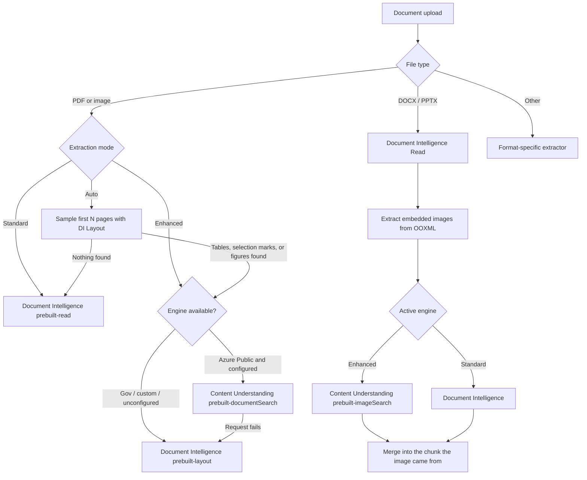

# Content Understanding Enhanced Extraction

## Overview

SimpleChat extracts document content in two tiers. **Standard** extraction always uses Azure
Document Intelligence `prebuilt-read`. **Enhanced** extraction uses **Azure AI Content
Understanding** (`prebuilt-documentSearch`), which returns layout-aware markdown *plus*
AI-generated descriptions of figures, charts, and diagrams — structure that Document Intelligence
does not produce.

Enhanced extraction always degrades gracefully: when Content Understanding is unavailable or
unconfigured, Enhanced automatically uses Document Intelligence `prebuilt-layout` instead.

**Implemented in version: 0.250.221** (EMF/WMF diagram support added in 0.250.223; figure chunk association fixed in 0.250.228)

**Tracking issue:** [#1277](https://github.com/microsoft/simplechat/issues/1277)

### Dependencies

| Dependency | Purpose | Required |
| --- | --- | --- |
| Azure Document Intelligence | Standard extraction, Auto-mode sampling, Enhanced fallback | Yes |
| Microsoft Foundry resource with Content Understanding | Enhanced extraction and figure descriptions | Only for Enhanced in Azure commercial clouds |
| Foundry model deployment defaults (a completion model and an embedding model) | Required by `prebuilt-documentSearch` | Only for Enhanced |

No new Python package is required. The client uses `requests`, already pinned in
`application/single_app/requirements.txt`.

## Architecture



### Engine resolution

`resolve_enhanced_extraction_engine()` in `functions_settings.py` returns
`(engine, reason)` and is the single source of truth:

1. If `AZURE_ENVIRONMENT` is not `public`, return Document Intelligence with a reason naming the
   cloud. Content Understanding is only offered in 12 Azure commercial regions.
2. If Content Understanding is not configured (missing endpoint, or key auth without a key), return
   Document Intelligence with a "not configured" reason.
3. Otherwise return Content Understanding with an empty reason.

The resolved engine and any fallback reason are persisted on each document as `extraction_engine`
and `extraction_engine_reason`, and are surfaced in workspace tooltips.

### Content Understanding REST flow

| Step | Call |
| --- | --- |
| Submit | `POST {endpoint}/contentunderstanding/analyzers/{analyzerId}:analyzeBinary?api-version=2025-11-01` with raw file bytes and `Content-Type: application/octet-stream`. Optional `&range=1-3` for page sampling. |
| Poll | `GET` the `Operation-Location` response header until `status` is `Succeeded`, `Failed`, or `Canceled`. |
| Auth | `Ocp-Apim-Subscription-Key: <key>` or `Authorization: Bearer <token>` for the `https://cognitiveservices.azure.com/.default` scope. |

Per-page content is reconstructed by slicing the content-level `markdown` string with each page's
`spans` (`{offset, length}`). Figure descriptions from `figures[]` are attributed to the page whose
span range contains the figure offset, and are skipped when the description is already inlined in
that page's markdown.

`extract_content_with_content_understanding()` returns the same
`[{"page_number": int, "content": str}]` shape as `extract_content_with_azure_di()`, so downstream
chunking is unchanged.

## Configuration

All settings live in **Admin Settings → Extract**.

| Setting | Key | Default |
| --- | --- | --- |
| Enable Enhanced extraction | `enable_enhanced_extraction` | `False` |
| PDF and Image Extraction Mode | `document_intelligence_pdf_image_extraction_mode` | `read` |
| Auto Sample Pages | `document_intelligence_auto_sample_pages` | `3` |
| Extract mathematical formulas | `enable_document_intelligence_formula_extraction` | `False` |
| Content Understanding Endpoint | `azure_content_understanding_endpoint` | `""` |
| Authentication Type | `azure_content_understanding_authentication_type` | `key` |
| Content Understanding Key | `azure_content_understanding_key` | `""` |
| API Version | `azure_content_understanding_api_version` | `2025-11-01` |
| Document Analyzer | `azure_content_understanding_analyzer_id` | `prebuilt-documentSearch` |
| Image Analyzer | `azure_content_understanding_image_analyzer_id` | `prebuilt-imageSearch` |
| Analyze images in Office files | `enable_office_embedded_image_analysis` | `True` |
| Minimum Image Size (pixels) | `office_embedded_image_min_pixels` | `150` |
| Maximum Images Per Document | `office_embedded_image_max_per_document` | `25` |

The extraction mode values are unchanged (`read`, `layout`, `auto`) so existing documents and search
index projections need no migration. `layout` now means "Enhanced", which routes to Content
Understanding when available.

### Upgrade behavior

`enable_enhanced_extraction` is new and defaults to `False`, so `get_settings()` backfills it on
first read: if the stored settings document has no `enable_enhanced_extraction` key and its
`document_intelligence_pdf_image_extraction_mode` is `layout` or `auto`, the toggle is set to `True`
and persisted. Deployments already using Enhanced or Auto therefore keep working across the upgrade
rather than silently downgrading to Standard.

### Enabling Enhanced extraction

1. Turn on **Enable Enhanced extraction**. The mode selector defaults to **Auto**.
2. In Azure commercial clouds, the **Azure AI Content Understanding** block appears. In Azure
   Government and custom clouds, a notice explains that Enhanced uses Document Intelligence Layout
   and there is nothing more to configure.
3. Create a **Microsoft Foundry** resource in a supported region: East US, East US 2, West US,
   West US 3, South Central US, North Europe, West Europe, Sweden Central, UK South, Australia East,
   Japan East, or Southeast Asia.
4. On the [Content Understanding settings page](https://contentunderstanding.ai.azure.com/settings),
   add the Foundry resource and leave *Enable autodeployment for required models if no defaults are
   available* checked. `prebuilt-documentSearch` requires default completion and embedding model
   deployments; without them, analysis requests fail.
5. Copy the endpoint (`https://<resource>.services.ai.azure.com`) and a key from
   **Resource Management → Keys and Endpoint**, or select **Managed Identity** and assign the app's
   identity the **Cognitive Services User** role on the Foundry resource.
6. Use **Test Content Understanding Connection** to verify before saving.

The in-app help modals (`documentIntelligenceExtractionHelpModal` and
`contentUnderstandingSetupHelpModal`) contain the same guidance.

## Extraction Modes

| Mode | Stored value | Engine | Best for |
| --- | --- | --- | --- |
| Standard | `read` | Document Intelligence `prebuilt-read` | Plain-text PDFs and images. Fastest, cheapest. |
| Enhanced | `layout` | Content Understanding `prebuilt-documentSearch`, falling back to Document Intelligence `prebuilt-layout` | Tables, page structure, forms, checkbox states, and figure descriptions. |
| Auto | `auto` | Detector + one of the above | Mixed corpora where per-document cost matters. |

Auto samples the first `document_intelligence_auto_sample_pages` pages with Document Intelligence
Layout, which is the cheaper detector, and upgrades to Enhanced when the sample contains:

- selection marks or checkbox states,
- markdown table structure, or
- figures or images (new in this version).

Images are always treated as Enhanced in Auto mode because they are single-page inputs that benefit
most from figure and spatial analysis.

## Images Inside Office Files

Content Understanding accepts DOCX, DOC, and PPTX as input, but its figure analysis only applies to
PDFs and images. SimpleChat therefore extracts embedded images from the OOXML package and analyzes
them separately.

- Sources scanned: `word/media/*`, `ppt/media/*`, `xl/media/*`.
- Accepted raster formats: PNG, JPG/JPEG, BMP, TIF/TIFF, HEIF/HEIC.
- Accepted vector formats: **EMF and WMF**. Word stores pasted diagrams, SmartArt, Visio drawings,
  and charts as metafiles, so these are frequently the most information-dense figures in a
  document. Neither analysis engine accepts a metafile, so they are rasterized to PNG first.
- Filtering: assets under 2 KB or smaller than `office_embedded_image_min_pixels` in either dimension
  are skipped as icons, bullets, or spacers. Byte-identical images are analyzed once, so a logo
  repeated in a header does not multiply cost. `office_embedded_image_max_per_document` caps the
  total.
- Ordering is natural, so `image2.png` precedes `image10.png`.
- For PPTX, each image is attributed to the slide that references it via
  `ppt/slides/_rels/slideN.xml.rels`.
- Each analyzed image is merged into the chunk containing the text it appears with, under a heading
  such as `### Embedded image 2 of 5: image2.png on slide 3`, so a figure stays searchable and
  citable alongside its surrounding content instead of becoming a separate chunk at the end of the
  document.
- Legacy `.doc` and `.ppt` files are OLE compound documents rather than zip packages, so their
  pictures are carved out by metafile signature instead of being enumerated from media parts. The
  carve validates the record type, signature position, and declared length before accepting a blob,
  so a coincidental byte sequence is not mistaken for an image.

Embedded image analysis never fails a document. Individual image failures are logged and skipped.

### Metafile rasterization

`functions_emf_render.py` renders EMF and WMF in-process, on top of Pillow only. This matters
because the application container is Linux distroless — no shell and no package manager — so an
external converter such as LibreOffice or Inkscape is not an option, and Pillow's own metafile
handler is Windows-only because it is backed by GDI.

The renderer covers the record subset Office actually emits for diagrams: path construction,
filled and stroked polygons, Bezier curves, rectangles and ellipses, pen and brush objects, world
transforms, and text runs. Records outside that subset are skipped rather than failing the render,
so output degrades in fidelity instead of disappearing. It is a description aid for search and
citation, not a pixel-accurate GDI reimplementation.

Text drawn inside a metafile is also recovered and attached to the chunk, so figure labels such as
service and resource names stay searchable even when the vision engine returns no description.

### Where a figure ends up

Figures, equations, and tables stay in the chunk containing the text they appear with. Chunk ids are
derived from the page number (`{document_id}_{page_number}`), so two chunks sharing a page number
would overwrite each other in the search index; image content is therefore merged into the existing
chunk rather than emitted as an additional one.

| Source | How placement is resolved |
| --- | --- |
| PDF via Content Understanding | The service reports a span for each figure, which is matched against the per-page spans. Already page-accurate. |
| PDF via Document Intelligence Layout | Tables and figures are inlined into that page's markdown by the service. |
| Equations | Returned inline in the page markdown by both engines, so they inherit the right page. |
| PPTX | The slide that references the image, mapped onto the chunk covering that slide. |
| DOCX | The image's position in reading order, taken from `word/document.xml`, mapped proportionally onto the word-count chunks. |
| Legacy `.doc` / `.ppt` | No position is recoverable from a carved metafile, so the image anchors to the final chunk rather than creating a page beyond the document. |

Word has no fixed pages until it is rendered, so DOCX placement is a best-effort mapping onto the
word-count chunks rather than an exact paragraph match. Position is mapped proportionally because the
extractor's word count will not match the raw document body exactly, and an absolute offset would
drift and cluster every image toward the front of the document.

Merged chunks are held under a size budget derived from the chunk size cap. In the rare case where a
figure-dense chunk would exceed it, the remaining images for that chunk are appended instead, which
keeps chunks from growing unbounded.

### Confirming that embedded images were processed

Processing reports counts rather than staying silent, because a document whose images were all
skipped otherwise looks identical to a document with no images:

- `office_embedded_image_candidates` — image parts found in the package
- `office_embedded_image_count` — images successfully analyzed
- `office_embedded_image_skipped` — images skipped

Status messages name the engine, report progress per image, and list skip reasons, for example
`Analyzed 4 of 6 embedded image(s) with Content Understanding. Skipped: 2 too small.`

## API

Content Understanding reuses the existing admin test-connection endpoint. No new Flask route is
added.

```
POST /api/admin/settings/test_connection
{
  "test_type": "content_understanding",
  "endpoint": "https://your-resource.services.ai.azure.com",
  "authentication_type": "key",
  "key": "...",
  "api_version": "2025-11-01",
  "analyzer_id": "prebuilt-documentSearch",
  "image_analyzer_id": "prebuilt-imageSearch"
}
```

Responses call out the common setup failures specifically: a non-public cloud, a missing analyzer,
rejected credentials with the required RBAC role, and missing Foundry model deployment defaults.

The "Change Extraction" action now accepts PDFs **and** images. It rejects a target of Enhanced when
Enhanced extraction is disabled.

## File Structure

| File | Role |
| --- | --- |
| `application/single_app/functions_content_understanding.py` | Content Understanding REST client, page reconstruction, image analysis, connection test |
| `application/single_app/functions_office_media.py` | Embedded image extraction from OOXML packages |
| `application/single_app/functions_emf_render.py` | In-process EMF/WMF rasterizer, no system packages required |
| `application/single_app/functions_content.py` | `extract_content_with_extraction_engine()` engine dispatch with fallback |
| `application/single_app/functions_documents.py` | Ingestion pipeline, Auto-mode detection, embedded image chunks |
| `application/single_app/functions_settings.py` | Settings, normalizers, engine resolution |
| `application/single_app/route_backend_settings.py` | Test-connection handler |
| `application/single_app/route_frontend_admin_settings.py` | Settings persistence and template context |
| `application/single_app/templates/admin_settings.html` | Admin UI and setup guide modals |
| `application/single_app/static/js/admin/admin_settings.js` | Admin UI wiring and test button |

## Security

- `azure_content_understanding_key` is stripped from user-facing settings by
  `sanitize_settings_for_user()`, which removes any field whose name contains `key`.
- The key is registered in `ADMIN_SETTINGS_FORM_SECRET_FIELDS`, so the admin form renders a redacted
  placeholder and an unchanged placeholder resolves back to the stored secret on save.
- Managed identity uses `DefaultAzureCredential` with the environment-appropriate
  `cognitive_services_scope`. Tokens are cached and refreshed with a five-minute buffer.
- `extraction_engine_reason` is server-generated, capped at 240 characters, and HTML-escaped
  everywhere it is rendered.
- Uploaded Office files are untrusted input. `functions_office_media.py` generates its own output
  file names rather than reusing archive entry names, so a crafted entry cannot escape the
  extraction directory. Entries are read by streaming in bounded chunks rather than trusting the
  declared `ZipInfo.file_size`, which an archive can understate — CPython decompresses before
  truncating to it, so a 64 KB entry claiming 4 KB can otherwise spike memory past 140 MB. The
  module also whitelists the compression methods real OOXML packages use and caps how many archive
  entries and relationship parts it will inspect. PowerPoint slide relationship parts are parsed
  with `defusedxml` so entity-expansion payloads are rejected.

## Testing and Validation

| Test | Coverage |
| --- | --- |
| `functional_tests/test_content_understanding_extraction_engine.py` | Page reconstruction from spans, figure attribution, description de-duplication, mermaid retention when a description is already inlined, missing-page fallback, model-deployment error guidance, Government cloud gating, engine resolution behavior across cloud and configuration states, effective-mode toggle behavior, limit normalizers, the upgrade migration, and the settings/admin surface contract |
| `functional_tests/test_office_embedded_image_extraction.py` | Real DOCX and PPTX zip round-trips: extraction, size and duplicate filtering, per-document cap, slide attribution, natural ordering, graceful handling of legacy and missing files, path-traversal defense against crafted entry names, and rejection of zip bombs and entity-expansion relationship parts |
| `functional_tests/test_document_intelligence_pdf_image_extraction_mode.py` | Updated for the new engine split |
| `functional_tests/test_document_intelligence_auto_reprocess_contract.py` | Updated for PDF and image extraction changes |

## Known Limitations

- **Azure Government is not supported** by Content Understanding. Enhanced silently uses Document
  Intelligence Layout there, so figure descriptions are unavailable.
- `prebuilt-documentSearch` invokes a language model per document, so Enhanced is meaningfully more
  expensive than Document Intelligence Layout. Auto is the recommended default.
- Content Understanding limits documents to 200 MB and 300 pages.
- There is no APIM passthrough option for Content Understanding yet.
- Content Understanding markdown is denser than Document Intelligence Read output because it
  includes HTML tables and figure descriptions, so chunks are larger.
- Metafile rasterization covers the drawing records Office emits for diagrams. Gradients, complex
  clipping regions, and embedded bitmap blits inside a metafile are not reproduced, and text is
  drawn with a default font rather than the original typeface, so a rasterized diagram is a
  faithful-enough likeness rather than an exact reproduction. The text drawn inside the metafile is
  extracted separately and attached to the chunk, so labels remain accurate regardless.
- Equations authored in modern Word are stored as OMML markup rather than images, so they are not
  covered by embedded image analysis. Legacy Equation Editor and MathType objects are stored with a
  metafile preview and are covered.
- Formula extraction requires the billed Document Intelligence add-on and applies to the Layout
  model only, so it has no effect while extraction is set to Standard.
