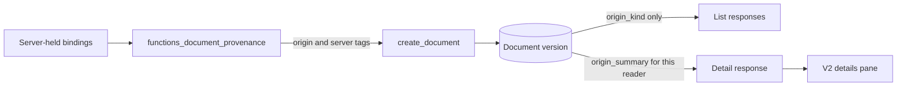

# Document provenance

Implemented in version: **0.261.194**.

Provenance described as record-keeping only, never access, in version: **0.261.232**.

Application version tracking: `application\single_app\config.py`.

Tracking: issue #1555, Track P of the
[chat orchestration workflows roadmap](CHAT_ORCHESTRATION_WORKFLOWS_ROADMAP.md) (#1543).

## Overview and purpose

When a workflow saved a report to a workspace, or a chat published a generated
file, the workspace document kept no reliable link to the run or conversation
that produced it. Document provenance records that link on the document itself.

Each document version that a workflow or a chat creates now carries a hidden,
server-owned `origin` record. That gives users three things:

- The V2 document details pane shows **Created by Weekly report · run
  5/2/2026, 9:00:00 AM** or **Created in chat · Budget review**, and links back
  to that run or conversation.
- Documents saved by a workflow get a removable `workflow` tag, so they are
  easy to pick out and filter in the workspace.
- The document list routes can answer "which documents did this workflow run,
  or this chat, create?" with a scoped, parameterized query.

Provenance is only useful if it can be trusted, so three rules shape the design:

- The origin comes only from bindings the server already holds: the generated
  artifact's source binding, its workflow or orchestration producer, the
  publication receipt, and chat-upload metadata. It never comes from client
  input or model output.
- No client can set or change an origin through any route.
- A reader learns only what they may already open. Someone who can see a shared
  document but not the creator's private workflow, run, or chat sees only
  "Created by a workflow" or "Created in a chat", with no names, titles, or IDs.

Chat-created documents get no visible tag (roadmap decision 15), so everyday
chat work doesn't clutter workspace tags.

## Dependencies

- The personal, group, and public workspace document containers in Cosmos DB.
  The origin is a field on the existing document records. There are no new
  containers, composite indexes, search-index fields, deployer changes, or
  admin settings.
- Generated artifact publication (`functions_artifact_publication.py`),
  including [saved workflow output publication](WORKFLOW_SAVED_OUTPUT_PUBLICATION.md).
- Chat uploads into personal or group workspaces (`route_frontend_chats.py`).
- Existing settings decide who may open an origin: user workflows for personal
  workflows, `enable_group_workspaces` plus the group's workflow setting for
  group workflows, and `enable_collaborative_conversations` for shared
  conversations.
- The V2 UI (`application/v2_ui`) shows provenance. The classic UI doesn't yet.

## Technical specifications

### Architecture

`functions_document_provenance.py` owns the feature.

| Responsibility | Functions |
| --- | --- |
| Validate and build origin records | `validate_origin`, `build_workflow_origin`, `build_chat_origin` |
| Stamp a new document version | `apply_document_provenance`, called by `create_document` |
| Derive a published artifact's origin and tag | `derive_publication_origin`, `publication_origin_fields` |
| Stamp a chat upload | `chat_upload_origin` |
| Resolve what one reader may see | `resolve_origin_summary` |
| Build list filters | `origin_list_filter` |
| Refuse client origin fields | `reject_origin_fields` |

`create_document` takes `origin` and `server_tags` keyword arguments, and
`update_document` refuses every origin field. The shared document route guards
in `content_screening/access.py` (`register_document_api_guards`) reject client
origin fields on mutating requests, remove the raw origin from every response,
and attach the reader's summary to detail reads.



### The origin record

Each origin is a small versioned object. Optional fields are left out when the
server can't prove them.

Workflow origin:

| Field | Required | Meaning |
| --- | --- | --- |
| `version` | Yes | Schema version, currently `1`. |
| `kind` | Yes | `workflow`. |
| `workflow_scope` | Yes | `{"type": "personal" or "group", "id": ...}`: where the workflow lives. |
| `workflow_id` | Yes | The workflow that produced the document. |
| `run_id` | No | The producing run. |
| `task_id`, `node_id` | No | The producing task or engine node. |
| `output_key` | No | The saved output name, when the source receipt names the same workflow and run. |
| `definition_revision` | No | The run's definition revision digest, recorded only when the durable runtime journal of a version-3 workflow proves it. |

Chat origin:

| Field | Required | Meaning |
| --- | --- | --- |
| `version` | Yes | `1`. |
| `kind` | Yes | `chat`. |
| `conversation_id` | Yes | The conversation that produced the document. |
| `message_id` | No | The artifact's message ID, or the chat upload's server-generated file message ID. |
| `orchestration_run_id`, `orchestration_step_id` | No | The orchestration run and step that produced the artifact. A step is kept only with its run. |
| `collaboration_conversation_id` | No | The shared conversation, when the chat is part of a collaborative conversation. |

`validate_origin` refuses unknown fields, unsupported versions or kinds, and any
value that isn't a non-empty, trimmed string of up to 1,024 characters with no
control characters. `definition_revision` must be a 64-character lowercase hex
digest. `create_document` validates the origin before it archives the previous
version, so a malformed origin can't leave a document half-updated.

### Where origins are recorded

| Creation path | Origin | `workflow` tag |
| --- | --- | --- |
| A workflow Publish task saves an output to a workspace (`generated_artifact_source.kind` is `workflow_saved_output`) | `workflow`, with the binding's scope and the producer's workflow, run, task, and node | Yes, when allowed |
| A workflow task output is published from its workflow conversation | `workflow` | Yes, when allowed |
| Any other artifact published inside a workflow conversation | `workflow`; the run is recorded only when the per-run conversation ID proves it | Yes, when allowed |
| An orchestration output published from a chat | `chat`, with the orchestration run and step | No |
| Any other chat artifact publication | `chat` | No |
| A file uploaded in chat and saved to a personal or group workspace | `chat`, with the conversation, the file message ID, and any shared conversation | No |
| Workspace uploads, the external public documents API, File Sync, and SimpleChat action uploads | None | No |

Workflow runs publish through the chat artifact pipeline inside their own
workflow conversation. Those documents are stamped `workflow`, not `chat`,
because `derive_publication_origin` checks the workflow bindings first:

1. A `workflow_saved_output` source binding.
2. A workflow producer. It must sit in a workflow conversation; otherwise no
   origin is recorded.
3. A workflow conversation (`chat_type` is `workflow`). Its run is recorded
   only when the conversation ID equals the per-run conversation ID derived
   from the workflow and run, so a reused conversation never names the wrong
   run.
4. An orchestration producer or an `orchestration_retained_output` binding,
   recorded as a chat origin with the orchestration run and step.
5. Otherwise, the chat that holds the artifact.

Provenance never blocks publication. If the origin can't be derived, or its
values aren't valid, the document is saved without one and a warning is logged
with `log_event`.

Publication stamps the origin when it creates the destination document.
Approval, content screening, and `queue_generated_document_processing` all work
on that same document and never re-create it, so the origin survives them. The
create stage runs once per publication receipt, so a replayed publication
doesn't restamp the origin or add the tag twice.

The chat upload route builds its origin only from the conversation it has
already authorized and the file message ID it generates. It never reads origin
values from the request.

### The `workflow` tag

Only workflow origins get a tag. `publication_origin_fields` creates the tag
definition in the destination workspace with `get_or_create_tag_definition`,
and `create_document` adds `workflow` to the document's tags without
duplicating it.

- Personal destinations always get the tag.
- Group and public destinations get it only when the publishing user may manage
  tags there (`manage_tags`, checked through
  `require_group_document_management_context` or
  `require_public_document_management_context`). If they can't, the tag is
  skipped and logged at INFO, and the origin is still recorded. Publishing
  never grants anyone tag rights they don't already have.
- If the tag definition can't be saved, the tag is skipped with a warning.

It's an ordinary tag, so users can remove it. Removing it doesn't change the
origin.

### Versions

Each document version holds only its own origin. `apply_document_provenance`
removes any origin fields carried over from the previous version, then stamps
the origin its creator supplied, if any.

- Tags carry forward to a new version, as before, so a new version keeps the
  `workflow` tag. If a user removed it, it stays removed.
- A new version uploaded by hand has no origin.
- A new version published by a workflow or chat gets that publication's origin.

### Protection against client input

- `update_document` refuses `origin`, `origin_kind`, and `origin_summary` and
  raises `DocumentOriginError`. No update path writes an origin.
- Every `POST`, `PUT`, `PATCH`, and `DELETE` on the guarded document blueprints
  is checked. A JSON or form body that names an origin field at any depth gets
  `400` with `error_code: document_origin_server_managed`. Matching ignores case,
  underscores, and hyphens, so `originKind` and `Origin-Summary` are refused too.
- The guarded blueprints cover personal documents, group documents, public
  documents, public document management and collaboration, public document
  reads, search, and the bearer-token external public documents API
  (`route_external_public_documents.py`). That includes metadata updates, bulk
  tag operations, and uploads that accept client metadata, for both classic and
  V2 callers.

### What responses carry

- Every document API response carries at most `origin_kind` (`workflow` or
  `chat`), recomputed from the stored origin. The raw `origin` is a private
  field that the document response projection always removes, including on the
  external API. Held or pending documents carry neither.
- A single-document read that asks for it with `origin_summary=1` (or `true`)
  also gets `origin_summary`:
  - `GET /api/documents/<document_id>`
  - `GET /api/group_documents/<document_id>?group_id=<group_id>`
  - `GET /api/public-workspaces/<workspace_id>/documents/<document_id>`
- List responses and the external API never carry a summary, so lists don't
  make a lookup per row.

### Origin summaries

`origin_summary` is `{kind, label, href?, run_started_at?}`, resolved for the
requesting user:

| Origin | Reader | Summary |
| --- | --- | --- |
| Workflow | May open the workflow: its owner with user workflows enabled, or a group member when group workspaces and the group's workflows are enabled | "Created by *workflow name*", linking to the workflow |
| Workflow with a run | Also allowed to read that run, which must belong to the workflow | The link also selects the run, and `run_started_at` is included |
| Chat | Owns the conversation | "Created in chat · *conversation title*", linking to the conversation |
| Chat in a shared conversation | Participates, with collaborative conversations enabled | The shared conversation's title and link |
| Either | Anyone else, or when the origin was deleted or can't be read | "Created by a workflow" or "Created in a chat", with no link |

Labels have control characters removed, whitespace collapsed, and a 200-character
cap. A missing name shows as "Untitled workflow" or "Untitled conversation".

The links are V2 routes: `/workspace/workflows?workflow_id=...&run_id=...`,
`/groups/<group_id>/workflows?workflow_id=...&run_id=...`, and
`/chat?conversationId=...`.

### Provenance is not access

Since **0.261.232**, provenance describes where content came from. It never
decides who can read that content. Two kinds of provenance are kept for display,
filtering and audit: a document's `origin` record, and the source lists stored
with saved Analyze, orchestration and workflow results.

- A saved result takes its access from its conversation, orchestration run or
  workflow.
- A published document takes its access from its destination workspace.
- Reading a source document again, for example to open a citation or run a new
  Analyze, is an input read. It has its own access and screening check.

See [Upload-only content screening](UPLOAD_ONLY_CONTENT_SCREENING.md).

### Origin filters on list routes

Three query parameters narrow the existing document lists:

| Parameter | Matches |
| --- | --- |
| `origin_workflow_id` | Documents a workflow created. |
| `origin_run_id` | Documents one run created. Requires `origin_workflow_id`. |
| `origin_conversation_id` | Documents a chat created, including through its shared conversation. Can't be combined with a workflow filter. |

They work on:

- `GET /api/documents`
- `GET /api/group_documents?group_id=<group_id>`: needs one explicit group.
  Without it the route returns `400` "Origin filters require a single
  group_id." Group membership is checked before the origin.
- `GET /api/public-workspaces/<workspace_id>/documents`

The reader must be able to open the named workflow, run, or conversation, or the
route returns `404` "Origin not found." A parameter that's malformed or repeated
returns `400`. A workflow filter looks for the reader's personal workflow first,
then the workflow in the requested group, so on the public workspace list it
matches only the reader's own workflows.

The conditions are added to each list's own parameterized, partition-scoped
Cosmos query (`@origin_*` parameters), so they only ever narrow it. Only current
versions match. An origin-filtered personal list reads the documents container
directly, because the document access index holds no origin fields.

### V2 UI

The document details pane shows an **Origin** section for any document with an
`origin_kind`, in personal, group, and public workspaces.

- It shows the plain-text fallback while it asks the detail read for the
  summary, then shows the summary's label. For a workflow run it adds the run
  time in the reader's locale.
- It shows a link only when the `href` matches one of the three routes above.
  Anything else stays plain text.
- If the read fails, an alert offers **Retry origin**.
- The older "Uploaded through chat" line is hidden for documents with an
  origin. It still shows for chat uploads saved before this version.

A workflow link with a `run_id` opens the Workflows section, expands that
workflow's run history, and scrolls to and highlights the run. If the run isn't
among the 10 most recent runs shown, the history says so. A workflow link
without a run opens the workflow editor. A chat link opens the conversation. It
doesn't scroll to the exact message yet.

## Usage

There's nothing to configure. Origins are recorded automatically when:

- a workflow's Publish task saves an output to a workspace,
- a chat, an orchestration, or a workflow run publishes a generated file to a
  workspace, or
- a file uploaded in chat is saved to the personal or group workspace.

To see where a document came from, open its details in the V2 workspace. To
list the documents one run created, call a list route with both workflow
parameters:

```text
GET /api/documents?origin_workflow_id=<workflow_id>&origin_run_id=<run_id>
```

To find a workflow's saved documents in the workspace, filter by the
`workflow` tag.

## Testing and validation

| Test | Covers |
| --- | --- |
| `functional_tests/test_document_provenance_origin.py` | Origin validation and derivation, the `workflow` tag and role rules, the client guard, per-reader summaries and fallbacks, and filter authorization. |
| `functional_tests/test_document_provenance_publication.py` | Every publication path through the real publication module: chat and orchestration artifacts, workflow task and saved outputs, a workflow run publishing through the chat pipeline, replays, and group approval keeping the origin. |
| `functional_tests/test_document_provenance_versions_and_guards.py` | Per-version origins with carried-forward tags, refusing a malformed origin before archiving, the guard on every mutating route (including the external API), response projection, and scoped list queries. |
| `ui_tests/test_v2_document_provenance.py` | The V2 details pane for both kinds: a run link expanding its run, a run outside the recent runs, a chat link, the no-access fallback (including for a group member), unsafe links and markup shown as text, and retrying a failed read. |

`functional_tests/test_group_document_management.py` also gives its real
document definitions the provenance helpers they now import.

Performance: list reads do no extra lookups. Only a detail read that asks for a
summary reads the origin's conversation, or its workflow and run, to check
access.

## Known limitations and follow-ups

- The classic UI doesn't show provenance yet.
- A chat link opens the conversation but doesn't scroll to the message.
- Workspace uploads, File Sync, the external API, and SimpleChat action
  uploads don't record origins. File Sync provenance is a planned follow-up.
- A run link can only expand runs among the 10 most recent in the history.
- There's no V2 control for the origin filters yet, and they don't search
  across workspaces or the search index.
- Documents created before this version have no origin. There's no backfill,
  and the older chat-upload fields (`conversation_id`, `chat_message_id`, and
  related) are unchanged.
