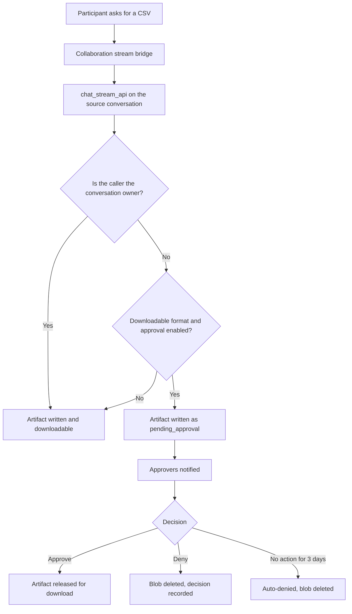

# Shared Conversation File Approvals

## Overview

Files that a participant asks the assistant to generate inside a shared (collaborative)
conversation are saved into the conversation owner's storage scope. This feature lets those
requests succeed by creating the file immediately and holding it in a `pending_approval` state
until an authorized approver releases it, instead of refusing the request outright.

- **Implemented in version:** **0.260.006**
- **Depends on:** Collaborative conversations (`enable_collaborative_conversations`), generated
  chat artifacts, notifications
- **Related fix:** `docs/explanation/fixes/SHARED_CONVERSATION_FILE_GENERATION_FORBIDDEN_FIX.md`

## Technical Specifications

### Architecture

A collaborative conversation is backed by a hidden **source conversation**
(`conversation_kind: 'collaboration_source'`) whose `user_id` is always the shared conversation
creator. Every participant streams through that source conversation, so any artifact they cause
to be written lands under the owner's conversation.

### Approval scope

Only downloadable deliverables are gated. Generated images and charts are inline conversation
rendering and are never gated.

| Gated | Not gated |
|-------|-----------|
| `csv`, `xlsx`, `xls`, `xlsm`, `docx`, `pdf`, `json`, `xml` | images, charts, plain assistant text |

### Approvers

| Conversation type | Who can approve |
|-------------------|-----------------|
| Personal shared conversation | The conversation owner |
| Group shared conversation | Any group `Owner`, `Admin`, or `DocumentManager` |

The requester can never approve their own file — the requester check is applied before the
scope branch, so a group `Admin` or `DocumentManager` who is only a participant still needs a
different approver. A staged file is not downloadable by anyone, including the requester, until
it is released.

Every route that streams a stored artifact blob enforces the gate, not just the generated
artifact download: `/api/chat_artifacts/download`, `/api/chat_artifacts/promote`, and
`/api/enhanced_citations/tabular` all call
`assert_generated_file_approval_allows_download` before reading blob content. This matters
because the source conversation owner is not necessarily an approver — a plain group `User` can
create a group shared conversation while approval belongs to that group's document roles.

### Approval states

`pending_approval` -> `approved` | `denied` | `auto_denied`

State is stored on the artifact message `metadata` under
`generated_artifact_approval_*` fields, so it travels with the artifact and cannot be bypassed
by calling the download route directly. A decision is single-use; re-applying one raises a
`ValueError`.

### Configuration

| Setting | Default | Description |
|---------|---------|-------------|
| `require_shared_conversation_file_approval` | `True` | When disabled, participant-generated files are saved and downloadable immediately. |

The toggle is exposed in **Admin Settings -> Shared Conversation File Approvals**. It contains
no sensitive terms, so it passes through `sanitize_settings_for_user()` and is readable by the
chat UI.

### API endpoints

| Method | Route | Purpose |
|--------|-------|---------|
| `GET` | `/api/collaboration/file-approvals` | List staged files the caller may release |
| `POST` | `/api/collaboration/file-approvals/<source_conversation_id>/<artifact_message_id>/approve` | Approve one staged file |
| `POST` | `/api/collaboration/file-approvals/<source_conversation_id>/<artifact_message_id>/deny` | Deny one staged file |

Every route carries `@swagger_route(security=get_auth_security())`, `@login_required`, and
`@user_required`. The approver is re-authorized from the stored approval scope on every call,
so a client can never nominate itself as the approver. The listing endpoint narrows candidates
to the caller's own approval scopes inside the query, so the row cap cannot truncate another
user's items ahead of the caller's.

### File structure

| File | Purpose |
|------|---------|
| `functions_generated_file_approvals.py` | Approval states, gating decision, approver resolution, client payloads, expiry query |
| `functions_simplechat_operations.py` | Staging on artifact write, approval resolution, notifications, auto-deny sweep |
| `functions_collaboration.py` | `build_conversation_participation_context` shared authorization helper |
| `route_backend_collaboration.py` | Approval list and decision endpoints |
| `route_enhanced_citations.py` | Download-time approval enforcement |
| `static/js/chat/chat-file-approvals.js` | Inline approve/deny card and pending state |
| `background_tasks.py` | 3-day auto-deny sweep |

### Expiry

Staged files auto-deny after **3 days**, matching `functions_approvals.TTL_AUTO_DENY_DAYS`. The
sweep runs on the existing approval expiration loop and deletes the stored blob so unapproved
content does not linger in storage.

## Usage Instructions

### Enabling

The feature is on by default. To disable it, clear **Require approval for participant-generated
files** in Admin Settings.

### Participant workflow

1. A participant asks the assistant for a file in a shared conversation.
2. The assistant answers normally and the file is created.
3. The artifact card shows *"This file is waiting for the conversation owner to approve it."*
   No download button is offered.
4. When approved, the participant receives a notification and the file becomes downloadable.

### Approver workflow

1. A notification appears in the bell: *"File approval requested."*
2. Opening the conversation shows an inline card with **Approve** and **Deny** buttons on the
   pending artifact.
3. Approving releases the file for everyone in the conversation. Denying deletes the stored file
   and records who declined it.

### Group workspace documents

Saving a generated **document into a group workspace** is a different operation: it feeds the
group search index and still requires the `Owner`, `Admin`, or `DocumentManager` role. Users
without that role now receive an actionable message naming who can complete the request rather
than a bare permission error. Requesting the same content as a downloadable file in the
conversation goes through the approval flow instead.

## Testing and Validation

- `functional_tests/test_shared_conversation_file_approval_fix.py` (16 checks) covers format
  scoping, owner bypass, the admin toggle, staged download refusal for all callers, personal and
  group approver resolution, the requester self-approval guard across every group role, approval
  enforcement on every artifact blob reader, scoped approval listing, single-use decisions, and
  the wiring of each authorization gate.
- `functional_tests/route_tests/` confirms the new routes carry the required security
  decorators and unauthenticated-access policy.

### Known limitations

- Workspace document writes are not staged, only chat deliverables. Holding a workspace document
  back would require withholding search indexing, which is tracked as follow-up work.
- Participants can already upload files into a shared conversation without approval, so the
  policy is intentionally asymmetric between uploading and generating.
- While a background export is still running, the live status poll may briefly offer a download
  control. The download itself is refused with *"This file is waiting for owner approval"* and
  the card corrects itself on reload.
