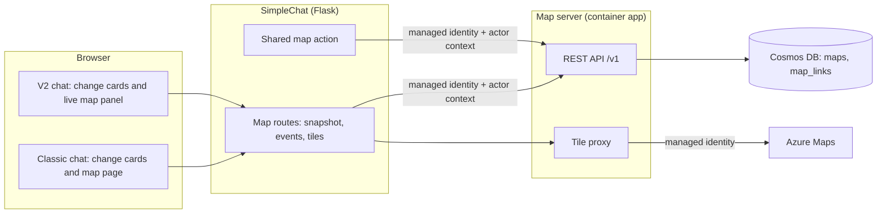

# Shared map server design

Prepared: **2026-10-04**. Repository: **microsoft/simplechat**.

Planned against version: **0.261.233** (`application\single_app\config.py`). This design is documentation only, so it
doesn't change the version. Each build phase records the version it ships in.

Planning branch: `paullizer-map-server`. Status: **Phase 1 (map server core) built in 0.261.254**, scoped as a proof
of concept. No GitHub issue.

Dependencies: the Azure Maps action (`semantic_kernel_plugins/azure_maps_openlayers_plugin.py`,
`functions_azure_maps.py`), the Simple Chat action (`semantic_kernel_plugins/simplechat_plugin.py`,
`functions_simplechat_operations.py`), the workflow visualization mirror (`functions_workflow_runner.py`), and the V2
UI (`application\v2_ui`).

## Why

Agents draw maps today with `create_map_visualization`. Each call returns a self-contained snapshot: a `map_payload`
holding every marker, path and area, a view, and a tile URL that wraps the action's Azure Maps key in an encrypted,
expiring token. The snapshot is stored in that message's `agent_citations`, and each message draws its own map.

That works for a one-off map. It doesn't work when a team builds up a picture over a long conversation, such as an
investigation, an incident response, a field survey or a logistics plan:

- Nothing connects one message's map to the next. To show the whole picture, the model has to send every point again,
  which costs tokens and lets points drift, drop out or change between messages.
- Nobody can tell what was learned when. A map shows the current points, not which stage of the work found them.
- People read a long thread of separate maps instead of one current picture.
- A workflow's map reaches its created conversation as a copy, not as something the team keeps adding to.

The shared map server keeps **one persistent map per piece of work**, a common operating picture that agents add to over
time. Every addition is tagged with the **phase** of the work that produced it. Each message shows what it changed, and
one live map shows everything, filterable by phase and replayable in order.

## Decisions

Made 2026-10-04:

1. **Standalone service.** The map server is its own deployable service with a REST API. SimpleChat reaches it through
   a new action and never calls Azure Maps directly for shared maps.
2. **Ownership.** A map belongs to a person or a group, and can be linked to any number of conversations in that scope.
   A workflow run and the team's conversation can build one map, and the map outlives any one conversation.
3. **Messages show a change card; the conversation has one live map.** A message no longer embeds a full map. It shows
   what it added, updated or retracted and in which phase, and opens the live map at that point.
4. **Design first.** This document is reviewed before any code is written.

Made 2026-10-04 in review. This is a proof of concept, so version 1 stays small:

5. **SimpleChat only.** SimpleChat is the map server's only client. Version 1 has no MCP endpoint and no other clients.
6. **Only agents write.** Agents, including workflow runs, create maps, start phases, link conversations, and add,
   update or retract features. People view the map, and the panel has no editing.
7. **No sharing.** A map stays in its owner's scope. It isn't shared across groups or with other users, and it links
   only to conversations in its own scope.
8. **No deletion rules yet.** Retention, archiving and deleting maps are out of scope for now.
9. **Black background without Azure Maps.** When map tiles aren't available, the map draws its features on a plain
   black background. No other basemaps are offered.
10. **Agents use the shared map instead of the Azure Maps action.** An agent that maps its work gets the Shared map
    action in place of the Azure Maps action (`create_map_visualization`). The Azure Maps action stays in SimpleChat
    for agents that don't use shared maps.

## Concepts

| Concept | What it is |
|---|---|
| Map | A titled, persistent picture owned by a user or a group. It has phases, features, a change log, a monotonically increasing `version`, a basemap, and links to conversations. |
| Phase | A named, ordered, colored stage of the work, such as "Initial enrichment" or "Follow-up". One phase is current; writes without a phase go to it. A phase records who started it and when, and can be closed. |
| Feature | One thing on the map: a point, a path or an area, with a label, category, time observed, source record, optional photo and labelled fields. It records the phase that added it and who added it. |
| Change | One entry in the map's append-only log: what was added, updated or retracted, by whom, in which phase, from which conversation, message or workflow run, and the map version after the change. |
| Link | A map shown in a conversation. Linking lets the conversation's participants view the map; it doesn't change who can edit it. A map links only to conversations in its own scope. |

Features are never deleted by agents. They're **retracted**, with a reason, so the history stays explainable and an
earlier version of the map can still be shown.

## Architecture



- **Service.** Python with FastAPI: async, with a generated OpenAPI document. An MCP endpoint can be mounted in the same
  app later. Source in `application/map_server/`, its own container image.
- **Hosting.** Azure Container Apps or an App Service container, with a managed identity. Ingress is internal when
  SimpleChat can reach the environment's network, and external otherwise. Either way every request needs an Entra token
  from an allowed caller.
- **Browser traffic goes through SimpleChat.** The browser talks only to SimpleChat, which checks access and proxies
  map reads, live events and tiles to the map server. This keeps the map server private, needs no CORS or CSP change,
  and works in deployments that use private endpoints. A direct browser-to-server option is listed under alternatives.

## Authentication and authorization

### SimpleChat to the map server

SimpleChat calls the map server with its managed identity and an app role on the map server's app registration
(proposed name `MapServer.ActOnBehalf`). Each call carries an **actor context**: the user ID and display name, the scope
it acts in (`user:<id>` or `group:<id>`), and the conversation, message or workflow run it came from.

The map server accepts an actor context only from callers holding that role. SimpleChat owns users, groups and
conversations, so it checks membership and roles before it calls. The map server then checks that the asserted scope
matches the map's owner scope.

On-behalf-of token exchange isn't enough by itself: scheduled workflow runs have no user session to exchange, and group
membership lives in SimpleChat. It can be added later for interactive calls.

### Why the generic MCP action isn't enough

SimpleChat's MCP action sends one fixed credential per action: a bearer token, key, basic credentials or the managed
identity. The server can't tell which user or group is calling, so it can't enforce per-user or per-group access, and
every write would be attributed to SimpleChat. MCP tool results also pass through the action's result text policy, so a
structured change card can't be returned reliably.

### Access rules

- **Personal map.** Its owner can view it, and agents write to it for the owner.
- **Group map.** Group members can view it. Agents write for the person who invoked them, so a write needs that person's
  group role to allow contributing, the same roles that can add content to the group workspace.
- **Linked conversation.** Everyone who can open a linked conversation can view the map while the link exists. A
  personal map links only to its owner's conversations, and a group map only to that group's conversations.
- **Scope follows the conversation.** A map opened for a group conversation is a group map, and one opened for a
  personal conversation is a personal map.
- **Workflow runs.** A run acts as the workflow's Run-as user. A run that creates a group conversation opens the map for
  that conversation, so it writes to the group's map, and the Run-as user needs a contributing role in that group.

### Tiles

The map server fetches Azure Maps tiles with its managed identity, caches them, and SimpleChat proxies them to the
browser. No Azure Maps key reaches the browser or a token. Today's tile URL carries the key in an encrypted, expiring
token that's refreshed whenever messages load; shared maps don't need that.

The map viewer's background is black. When Azure Maps isn't configured or a tile can't be fetched, the features still
draw, on black.

## Data model

Cosmos DB for NoSQL, in its own database (`mapserver`), so deployments reuse an account type they already run.

**Container `maps`, partition key `/map_id`.** Every item for one map shares a partition, so reads and writes for a map
never cross partitions. Items carry a `type` discriminator and a `schema_version`:

- `map`: title, description, `owner_scope`, basemap (an Azure Maps tileset), `current_phase_id`, `version`, counts,
  created and updated stamps, and two short lists kept on the map so they change under its ETag:
  - `phases`: name, description, color, order, status, started by and at, started and closed versions. Up to 50.
  - `links`: the conversations the map is linked to, with who linked them and when. Up to 50.
- `feature`: the current state of one feature (example below).
- `feature_rev`: an earlier state of an updated feature, valid from one version to another, so the map can be shown as
  of an earlier version.
- `change`: one log entry, with `version`, action, phase, actor, origin (conversation, message, run), the IDs it
  added, updated or retracted, and up to five labels.

Features are separate items, not embedded in the map document, so a large map never nears the 2 MB item limit and each
feature updates on its own. At about 2 KB a feature, a map with 10,000 features and its log is well under the 20 GB
logical partition limit.

**Container `map_links`, partition key `/scope_key`.** Small rows that answer "which maps can I see here" in one
partition: `user:<id>` and `group:<id>` rows for ownership, and `conversation:<id>` rows for links. Each row holds the
`map_id`. A row is written before the map changes and every read checks the map itself, so a failed write can leave an
extra row but never hides a map or shows one outside its scope.

```json
{
  "type": "feature",
  "schema_version": 1,
  "id": "F-0007",
  "map_id": "map-3f6c1a9e2b7d4c8e0a15",
  "kind": "point",
  "geometry": { "type": "Point", "coordinates": [-73.9368, 40.7393] },
  "label": "Storage facility gate",
  "category": "location",
  "description": "Entry recorded by the facility's gate log.",
  "observed_at": "2026-10-04T06:36:00-04:00",
  "phase_id": "P2",
  "last_phase_id": "P2",
  "source": { "system": "records", "record_id": "R-004512" },
  "dup_key": "point|records|R-004512",
  "media": { "image_url": "https://example.org/still.png", "caption": "Gate camera" },
  "fields": [{ "label": "Unit", "value": "214" }],
  "style": {},
  "status": "active",
  "created_version": 7,
  "version_start": 7,
  "retracted_version": null,
  "retract_reason": null,
  "revision": 1,
  "created_by": { "user_id": "user-123", "agent": { "name": "Field analyst" }, "conversation_id": "conv-1" },
  "created_at": "2026-10-04T10:22:41Z"
}
```

### Versions and concurrency

Each write is one Cosmos transactional batch in the map's partition. It replaces the map document with the next
`version` on the condition that its ETag hasn't changed, writes the features and any `feature_rev` items, and creates the
`change`. When another write lands first the ETag check fails, and the write starts again from a fresh read, up to six
times, so versions never skip or repeat. Linking or unlinking a conversation also goes through the ETag check but
doesn't add a version, because the map's content doesn't change.

Showing the map **as of version N** means: features with `created_version <= N` that weren't retracted at N, each in
the state it had at N. A feature updated after N is shown from the `feature_rev` that was current at N.

### Duplicates

A feature is a duplicate when it repeats the `kind`, `source.system` and `source.record_id` of an active feature on the
same map. The caller chooses whether a duplicate is skipped or updates the existing feature. Features without a source
record are never treated as duplicates.

### Limits

These are checked on the server:

- Up to 40 features per call, configurable up to 49. A Cosmos transactional batch holds 100 operations, and updating a
  feature takes two: its revision and its new state.
- Up to 10,000 active features, 50 phases and 50 linked conversations per map.
- Labels up to 160 characters and descriptions up to 1,000.
- Up to 12 labelled fields, with 60-character labels and 300-character values.
- Photos must be https links of up to 2,048 characters, with captions up to 200. This matches the current map action.
- Up to 2,000 vertices per path or area.
- Latitude between -90 and 90, longitude between -180 and 180.

## Map server API (version 1)

| Method and path | Purpose |
|---|---|
| `POST /v1/maps` | Create a map (title, owner scope, basemap, optional first phase, optional conversation to link). |
| `GET /v1/maps?scope=` | List maps for a scope, read from `map_links`. |
| `GET /v1/maps/{id}` | Map, phases, counts and current version. |
| `PATCH /v1/maps/{id}` | Title, description or basemap, with `If-Match`. |
| `POST /v1/maps/{id}/links`, `DELETE /v1/maps/{id}/links/{conversation_id}` | Link or unlink a conversation. |
| `POST /v1/maps/{id}/phases` | Start a phase and make it current. |
| `PATCH /v1/maps/{id}/phases/{phase_id}` | Rename a phase or change its description or color. A phase closes when the next one starts. |
| `POST /v1/maps/{id}/features:batch` | Add features to a phase, with a duplicate rule. Returns the new version and what changed. |
| `PATCH /v1/maps/{id}/features/{feature_id}` | Update a feature, with `If-Match`. |
| `POST /v1/maps/{id}/features/{feature_id}:retract` | Retract a feature with a reason. |
| `GET /v1/maps/{id}/features` | Features, filtered by phase, category, `since_version`, `as_of_version` or bounding box. Paged. |
| `GET /v1/maps/{id}/snapshot` | A render-ready payload, as of a version and for chosen phases, in the shape today's `map_payload` uses, so existing renderers can draw it. |
| `GET /v1/maps/{id}/changes` | The change log since a version. Paged. |
| `GET /v1/maps/{id}/events` | Server-sent events, one per change: version, phase and counts. |
| `GET /v1/tiles/{tileset}/{z}/{x}/{y}` | Cached Azure Maps tiles. Answers 404 when Azure Maps isn't configured. |

## SimpleChat integration

### New action type: Shared map

A native action type, `shared_map`, with a definition schema, the admin and workspace action forms, and a reference page
at `docs/reference/actions/shared-map.md`. It's configured with the map server URL, the audience for its managed
identity token, a default basemap and limits.

The action resolves the user, group and conversation from the invocation, the same way the Simple Chat action's
`*_for_current_user` operations do. The model never supplies a user or group. It can only name a map or a conversation
the acting user can open, and the action checks that before every call.

| Function | What it does |
|---|---|
| `open_map(title, conversation_id, create_if_missing)` | Use the map linked to a conversation: this one by default, or one the run created. Otherwise find a map with that title in the conversation's scope, or create one, and link it. |
| `start_phase(name, description)` | Start the next phase. |
| `add_to_map(features_json, phase, on_duplicate)` | Add points, paths and areas. `features_json` accepts today's `locations_json`, `paths_json` and `areas_json` shapes, so agent instructions carry over. |
| `update_map_feature(feature_id, changes_json)` | Correct a feature. |
| `retract_map_feature(feature_id, reason)` | Retract a feature. |
| `get_map_summary()` | Phases, counts, recent changes and categories, so an agent can see what's already known before adding. |
| `show_map(as_of, phases)` | Point the conversation at the live map, at a version or for chosen phases. |

The function descriptions teach the working pattern:

- Start a phase when the work moves to a new stage.
- Add each place once, with its source record.
- Update a feature instead of adding it again.
- Retract a feature instead of deleting it.

Each write returns a small result with `render_type: "shared_map_change"`: map ID and title, version, phase (name and
color), counts added, updated and retracted, a few labels, and the change ID. It carries no feature data, so it stays
small in `agent_citations`. Because it has a `render_type`, the workflow visualization mirror
(`_is_visualization_citation`) already copies it into conversations a workflow creates.

`create_map_visualization` stays as it is for agents that don't use shared maps (decision 10).

### SimpleChat routes

These are new Flask routes. Each one carries `@swagger_route(security=get_auth_security())`, requires sign-in, checks
access, and is added to the route policy tests.

- `GET /api/conversations/<conversation_id>/maps` lists the maps linked to a conversation the user can open.
- `GET /api/maps/<map_id>/snapshot` proxies a snapshot after checking scope membership or a conversation link.
- `GET /api/maps/<map_id>/events` proxies the event stream, using the existing streaming response pattern.
- `GET /api/maps/<map_id>/tiles/<tileset>/<z>/<x>/<y>` proxies tiles.

The routes are read-only. Agents link maps to conversations through the action.

### V2 UI

- **Change card** (`SharedMapChangeCard.tsx`). It shows the map title and a phase chip in the phase's color, with
  counts such as "+12 places, 1 route updated, 2 retracted" and a few labels. **Open map at this point** opens the panel
  at that version. It replaces the full inline map in each message.
- **Live map panel** (`SharedMapPanel.tsx`). A docked panel, with a full-screen operations view, showing the
  conversation's linked map.
  - It renders with the vendored OpenLayers that `loadOpenLayers` already loads.
  - Each phase is a layer with its own toggle and color. You can show one phase, every phase up to one, or what one
    phase added compared with the one before.
  - A legend lists the categories.
  - A timeline replays the map by version or by time observed.
  - A feature popup shows its photo, fields, source, phase and who added it.
  - Changes made since you last looked are highlighted.
  - Live updates arrive as server-sent events, the same way `collaborationEvents.ts` follows collaboration conversations.
- **Conversation header.** A map button, with a badge when the map changes.

The panel is view-only. All feature text is rendered as text, never as HTML.

### Classic UI

The change card renders as a compact card that opens a full-page viewer at `/maps/<map_id>`. The docked panel is V2
only.

### Workflows

A run writes as its Run-as user. When it creates a conversation through the Simple Chat action, it opens the map for
that conversation, so the map takes the conversation's scope. The run's change cards, mirrored into that conversation,
open the same live map. A scheduled workflow can start a phase per run, named by the agent or after the run time.

## Phases

Phases are what turn a series of updates into an operating picture you can explain.

- **Ordered and named.** An agent starts a new phase when the work changes stage. Phases keep their order, so later
  work never hides earlier work.
- **Attributed.** Every feature records the phase that added it, and every change records the phase it happened in. An
  update in phase 3 to something first found in phase 1 shows up in both places.
- **Viewable.** You can show each phase as a layer, show the map as it stood at the end of a phase, or compare what one
  phase added with the one before it.

## Security

- No Azure Maps key in the browser, in tokens or in messages.
- Inputs are validated on the server: coordinates, https-only photos with the current action's unsafe-character check,
  and length and count limits.
- Access is checked on every read and write in SimpleChat and again in the map server. Map and feature IDs aren't
  secrets.
- The change log records the actor, the user it acted for, and the conversation or run, for audit.
- Ingress is internal where SimpleChat can reach it, and external otherwise. Every request except the health check needs
  an Entra token from an allowed caller.
- Errors return a stable code and a safe message, never exception text, and request bodies are capped at 1 MB.
- The map server logs to standard output with `[MAP_SERVER]`, `[MAP_SERVER_AUTH]`, `[MAP_SERVER_STORE]` and
  `[MAP_SERVER_TILES]` tags. It doesn't use SimpleChat's `log_event`, which needs SimpleChat's own configuration.

## Deployment

- A new image, `simplechat-map-server`, in the same environment as SimpleChat.
- The map server's managed identity needs data access to the `mapserver` database and read access to Azure Maps.
- SimpleChat gets settings for the map server URL and token audience, and its identity gets the map server's app role.
- The admin setting `enable_shared_maps` is off by default. It's documented on the relevant admin settings page and
  claimed in `docs/_data/features.yml`, per the documentation coverage rules.
- For the proof of concept, a script deploys the map server next to SimpleChat. Deployer modules for Bicep, Terraform
  and azd come later.

## Build plan

Each phase is its own change and PR, and records the version it ships in.

| Phase | Scope | Depends on |
|---|---|---|
| 0 | This design, reviewed and agreed. **Done.** | None |
| 1 | Map server core: data model, REST API, actor-context and role checks, Cosmos store, tile proxy, OpenAPI, local run, deploy script, tests. **Built in 0.261.254.** | 0 |
| 2 | Shared map action, read-only SimpleChat routes, change cards in V2 and classic, workflow linking, admin setting, docs. | 1 |
| 3 | V2 live map panel: phase layers, timeline replay, live updates. | 2 |

### Later

Out of scope for the proof of concept:

- An MCP endpoint (Streamable HTTP at `/mcp`) for clients outside SimpleChat, with tools that mirror the REST API.
- Editing the map from the panel.
- Sharing maps across groups or with other users.
- Retention, archiving and deletion.
- Rate limiting per caller and per person.
- Other basemaps, including for clouds without Azure Maps.
- GeoJSON and KML export, a static map image for documents, geocoding and routing.
- Deployer modules and private networking.

## Phase 1 as built

Phase 1 shipped in version **0.261.254**. The map server reports its own version, starting at `0.1.0`.

### Code layout

All under `application/map_server/`:

| Path | What it holds |
|---|---|
| `mapserver/app.py` | FastAPI app factory (`create_app`), routes, error handlers, the request guard and the event stream. |
| `mapserver/auth.py` | Entra token validation (`TokenValidator`) and the actor context (`Actor`, `X-Map-Actor`). |
| `mapserver/engine.py` | Map operations, access checks, versioned writes and as-of reads. |
| `mapserver/validation.py` | Normalizes features, enforces limits, and keeps photos and source links to safe https URLs. |
| `mapserver/store.py`, `mapserver/cosmos_store.py` | The storage interface, an in-memory store and the Cosmos DB store. |
| `mapserver/tiles.py` | The Azure Maps tile proxy and its cache. |
| `mapserver/settings.py`, `mapserver/models.py`, `mapserver/errors.py` | Configuration, request bodies and error codes. |
| `Dockerfile`, `requirements.txt` | The image, built from the repository root with the same Azure Linux pattern as SimpleChat. |
| `deploy/Deploy-MapServer.ps1` | The proof-of-concept deployment to Azure Container Apps. |

### Calling the map server

Every request except `GET /healthz` sends:

- `Authorization: Bearer <token>`: an Entra token for the map server's audience, from a caller holding the
  `MapServer.ActOnBehalf` app role, or from an object ID in `MAP_SERVER_ALLOWED_CALLER_IDS`.
- `X-Map-Actor: <base64url JSON>`: the person the caller acts for, as `user_id`, `display_name`, `scope` (`user:<id>` or
  `group:<id>`), `access` (`read` or `write`), and optionally `conversation_id`, `message_id`, `run_id` and
  `agent` (`id`, `name`). The map server reads it only after the token passes, and refuses unknown fields.

Tiles need only the token.

### Configuration

| Variable | Purpose |
|---|---|
| `MAP_SERVER_TENANT_ID`, `MAP_SERVER_AUDIENCES` | Required. The tenant and the accepted token audiences, such as `api://<app id>,<app id>`. |
| `MAP_SERVER_REQUIRED_ROLE` | The app role callers need. Defaults to `MapServer.ActOnBehalf`. |
| `MAP_SERVER_ALLOWED_CALLER_IDS` | Optional object IDs allowed without the role, for tenants where the role can't be assigned. |
| `MAP_SERVER_ISSUERS`, `MAP_SERVER_AUTHORITY_HOST`, `MAP_SERVER_JWKS_URL` | Optional overrides. By default the v1 and v2 issuers of the tenant are accepted. |
| `MAP_SERVER_STORE` | `cosmos` (default) or `memory`. |
| `MAP_SERVER_COSMOS_ENDPOINT` | Required for the Cosmos store. The managed identity signs in unless `MAP_SERVER_COSMOS_KEY` is set. |
| `MAP_SERVER_COSMOS_DATABASE`, `MAP_SERVER_MAPS_CONTAINER`, `MAP_SERVER_LINKS_CONTAINER` | Default to `mapserver`, `maps` and `map_links`. |
| `AZURE_CLIENT_ID` | The user-assigned managed identity's client ID. |
| `AZURE_MAPS_CLIENT_ID` or `AZURE_MAPS_KEY` | Azure Maps with the managed identity, or with a key. Without either, tiles answer 404 and the viewer stays black. |
| `MAP_SERVER_DEFAULT_BASEMAP` | Defaults to `microsoft.base.road`. |
| `MAP_SERVER_MAX_FEATURES_PER_CALL`, `MAP_SERVER_MAX_ACTIVE_FEATURES`, `MAP_SERVER_TILE_CACHE_ENTRIES` | Limits: 40, 10,000 and 1,024 by default. |
| `MAP_SERVER_EVENTS_POLL_SECONDS`, `MAP_SERVER_EVENTS_KEEPALIVE_SECONDS`, `MAP_SERVER_EVENTS_MAX_SECONDS` | Event stream timing: 2, 15 and 600 seconds by default. |
| `MAP_SERVER_LOCAL_DEV_KEY` | Local runs only. A shared key of at least 32 characters, accepted only with `MAP_SERVER_STORE=memory`. |

### Running it locally

```powershell
cd application\map_server
python -m pip install -r requirements.txt
$env:MAP_SERVER_STORE = 'memory'
$env:MAP_SERVER_LOCAL_DEV_KEY = [Convert]::ToBase64String((1..32 | ForEach-Object { Get-Random -Maximum 256 }))
python -m mapserver
```

The server listens on `http://127.0.0.1:8080`. Send the developer key as the bearer token. The API description is at
`/openapi.json`. There's no `/docs` page, because FastAPI's page loads its scripts from a CDN.

### Deploying the proof of concept

```powershell
./application/map_server/deploy/Deploy-MapServer.ps1 -ResourceGroup <rg> -RegistryName <acr> `
    -ContainerAppsEnvironment <environment> -CosmosAccountName <cosmos> -SimpleChatPrincipalId <object id> `
    -MapsAccountName <maps account>
```

The script uses your Azure CLI sign-in and can be run again safely. It builds the image in the registry from a staged
context, creates the `mapserver` database and containers, and creates a managed identity with AcrPull, Cosmos DB data
access and Azure Maps Data Reader. It then registers the API with its app role, assigns the role to SimpleChat's
identity, deploys the container app, and prints the URL and token audience SimpleChat needs in Phase 2. If you can't
assign app roles in the directory, it allowlists SimpleChat's object ID instead.

## Testing and validation

- **Map server.** `functional_tests/test_map_server_api.py` and `functional_tests/test_map_server_storage_tiles_events.py`
  cover validation, duplicates, versioning, as-of reconstruction, access checks, the REST contract, the Cosmos batch and
  query shapes, tiles and live events. A concurrency test shows that several writers on one map never skip or repeat a
  version.
- **SimpleChat.** Functional tests for the action against a fake map server, route policy tests for the new routes, and
  UI tests for the change card and the live panel.
- **Docs.** The documentation coverage and site quality tests.

## Alternatives considered

- **Built into SimpleChat.** Simpler to secure and deploy. Not chosen (decision 1): a separate service can serve other
  clients later without moving the data.
- **Only the generic MCP action.** It can't carry the user or group, and can't return a structured change card. Not
  chosen.
- **Browser talks to the map server directly.** It would remove a proxy hop, but needs public ingress or private DNS for
  every user, CORS, a CSP change (`frame-src` is `'self' blob:` today), and a second token flow. Not chosen.
- **PostGIS for storage.** It has richer spatial queries, but adds a database type that deployments don't run today.
  Cosmos supports the bounding-box and point queries needed, with spatial indexing if they're needed later.

## Open questions

None. Decisions 5 to 10 settled the review questions.

## Related

- [Azure Maps OpenLayers action reference](../../reference/actions/azure-maps-openlayers.md)
- [MCP action reference](../../reference/actions/mcp.md)
- [Simple Chat action reference](../../reference/actions/simplechat.md)
- [V2 inline media and agent-posted messages](V2_INLINE_MEDIA_AND_AGENT_MESSAGES.md)
