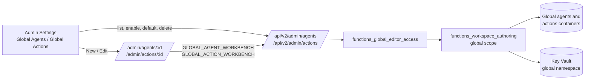

# V2 Admin Global Agents and Actions

## Overview

V2 Admin Settings can now list, create, edit, enable, disable, delete, and choose
the default among the organisation's global agents, and list, create, edit,
enable, disable, and delete global actions. Both use the full-page agent and
action editors that personal and group workspaces already use, so a global agent
gets the same model, action, knowledge, instruction, advanced, and template
sections, and a global action gets the same connector catalogue, MCP presets,
connection tests, and credential handling.

Before this change the Agents & Actions group had no way to see or author global
agents and actions in V2. The only global control was a **Global agent
delegation** card that created **Call agent** actions on its own. That card is
removed: a Call agent action is an ordinary global action with the **Call agent**
type, and a global agent attaches it in its editor like any other action.

**Implemented in version:** 0.261.271 (`application/single_app/config.py`)

**Dependencies:** `functions_workspace_authoring.py` (the shared editor engine),
`functions_global_editor_access.py`, `route_backend_v2_admin_agents_actions.py`,
`route_backend_agents.py`, `route_backend_plugins.py`, `admin_settings_nav.py`,
`admin_settings_fields.py`, and `application/v2_ui`.

## Technical specifications

### Architecture

The editors are driven by workbench adapters. `GLOBAL_AGENT_WORKBENCH`
(`lib/agentWorkbench.ts`) and `GLOBAL_ACTION_WORKBENCH` (`lib/actionWorkbench.ts`)
sit beside the personal and group adapters and point the unchanged editors at the
admin routes. `AdminAgentEditorPage` and `AdminActionEditorPage`
(`pages/AdminGlobalEditorPages.tsx`) frame them; a non-administrator gets an
access notice and the editors never mount.

On the server, `functions_workspace_authoring.py` gained a global scope. It reads
and writes the global containers with a mandatory conditional write (`_etag`),
masks stored secrets, stores credentials under the global Key Vault name
`{record id}--agent|action|action-addset--global--{name}`, refuses a duplicate name
case-insensitively, stamps the stored shape the classic saves write
(`is_global`, `is_group`, and for actions `scope`/`scope_id` of `global`),
validates Call agent targets and agent bindings for the global scope, and bumps
the agent catalogue. `functions_global_editor_access.py` orchestrates each route
and follows a renamed default agent so the default survives a rename.

### API endpoints

Every route requires an administrator (`@admin_required`, registered on an
admin-only blueprint), refuses a query string, and answers with `no-store`.

| Method | Route | Purpose |
|---|---|---|
| GET | `/api/v2/admin/agents` | Global agents (secrets masked) and `selected_agent_name` |
| POST | `/api/v2/admin/agents` | Create a global agent with the editor-allocated id |
| GET, PATCH, DELETE | `/api/v2/admin/agents/<agent_id>` | Read, update, or delete one; the default agent cannot be deleted |
| GET | `/api/v2/admin/agent-options` | Agent types, global model connections, and template submission permission |
| GET | `/api/v2/admin/actions` | Global actions (secrets masked) |
| POST | `/api/v2/admin/actions` | Create a global action; the server allocates the id |
| GET, PATCH, DELETE | `/api/v2/admin/actions/<action_id>` | Read, update, or delete one |
| GET | `/api/v2/admin/actions/types` | The action types the deployment provides, with their schemas |
| GET | `/api/v2/admin/action-options` | Key Vault reminder defaults |

Reads return `{record, revision, secret_paths, read_only}`. Writes send
`{updates, expected_revision, clear_secret_paths, removed_paths}`, the same
editor contract the personal and group routes use; a stale revision is a 409.

A global agent the server refuses, because a value is invalid or its assigned
knowledge cannot be resolved, is a 400 with **Invalid agent configuration.** The
response never carries the exception's text. The reason, such as a field over its
length limit or a workspace that no longer exists, is logged as a warning, "Global
agent save refused: invalid payload" or "Global agent save refused: assigned
knowledge", with its `error` in the event's properties.

The lists reuse the classic routes for state changes the editor contract does not
model: `PATCH /api/admin/agents/<name>/enabled` (which hands the default to another
enabled agent when the default is disabled), `POST /api/admin/agents/selected_agent`,
and `PATCH /api/admin/plugins/<name>/enabled`.

### Scope rules the editors apply

| Area | Global behaviour |
|---|---|
| Assigned knowledge | `GET /api/agents/assigned-knowledge/catalog?agent_scope=global`: public workspaces only |
| Model & connection | Global model connections; a global agent may carry its own connection |
| Call agent targets | `GET /api/plugins/agent-targets?scope=global`: global agents only, matching the server's save-time check |
| Connection tests, MCP discovery | `action_scope: 'global'`, so stored credentials resolve from the global namespace |
| MCP preconfigurations | The global set |
| Identities | `/api/admin/workspace-identities/global/identities` |
| Instruction drafting | `agent_scope: 'global'` |
| Templates | Publishing sends `source_scope: 'global'`, which an administrator's submission approves at once |

`CallAgentActionConfiguration` now derives its target scope from the editor
(global, group, or personal) instead of always reading personal targets.

### Configuration and navigation

`ADMIN_NAV` adds `organization-agents-section` (**Global Agents**) after Agent
Runtime. The id avoids the word `global` because the V2 capability fallback
matches section-id words, and `global` would claim
`enable_appinsights_global_logging`. The V1 Global Agents heading carries the same
id so the navigation map stays valid.

`admin_settings_fields.py` declares three components:

| Section | Component | Depends on |
|---|---|---|
| `organization-agents-section` | `global-agents-manager` | `enable_semantic_kernel` |
| `actions-config` | `global-actions-manager` | `enable_semantic_kernel` |
| `agent-template-approvals-section` | `agent-template-approvals-link` | section condition `enable_agent_template_gallery` |

The components save records directly, so nothing reaches the settings draft or
the save bar. Because opening an editor replaces the Admin Settings page, the page
asks before leaving for a global editor while settings are unsaved (the same
**Discard unsaved changes?** prompt the editors use), and the approvals link opens
in a new tab.

### Shared editor design

The agent and action editors are one implementation for personal, group, and
global records, so a change to them changes all three. `WorkspaceEditorFrame`
lays them out as Admin Settings is laid out:

- A section rail on the left, with an icon per section, marks the section in view
  as the pane scrolls. Below the `lg` breakpoint it becomes the **Jump to section**
  list. Choosing a section pins it: while it is pinned, the frame keeps it at the
  top as lists above or inside it finish loading. Scrolling, clicking or typing
  anywhere in the editor releases it, and so do saving, a field failing validation,
  and focus moving anywhere but the section itself, so holding the section never
  scrolls a save error or an invalid field back out of view. `initialSection` opens
  the editor at a section this way, which is how `?templates=1` shows the gallery.
- Each section is a card with an icon tile, a title, and a line on what it holds.
  **Advanced** is a collapsible card.
- The fields are Admin Settings rows, built from `components/workspace/EditorLayout.tsx`:
  `EditorFieldRow` and `EditorRow` for a setting, `EditorFieldset` for a group of
  choices, `EditorSwitch` for a switch, with `lead` and `EditorDependents` for a
  switch and the settings that depend on it, and `EditorGroup`, `EditorPanel`, and
  `EditorPanelFieldset` for collapsible groups and titled panels. `AgentField` and
  `ActionField` render through `EditorFieldRow`, so every existing field took the new
  layout without changing its label, help, or error wiring.

A row puts its label and help beside the control once it is at least 50rem wide, with
the grid Admin Settings rows use. Unlike an Admin Settings row, an editor row measures
its own width (one shared `ResizeObserver`, applied before paint) and is marked
`data-wide`, because editor fields sit inside panels, groups, and fieldsets where the
card's width would overstate the room a row has. Neither rows nor editor cards are CSS
size containers: in Chromium 145 a size container could be left with a stale, collapsed
layout when React added an editor section after it, which hid the **Action type** row
once a new action's type was chosen. On the solid surface of a panel or group, rows and
outlined buttons use the strong edge colour so they stay visible in the light theme.

The Global Agents and Global Actions lists use the AI Connections list rows: an
Enabled or Disabled badge (`AdminListPill`), a Default agent badge, and icon buttons
whose accessible names are the same as the text buttons they replace, such as
**Make Policy advisor the default agent** and **Disable Ticket search**. Search
appears once a list has four or more entries.

### Classic interoperability

The classic Admin Settings tables and the V2 editors work on the same records, so
either can edit what the other saved. The V2 editor stores a new credential under a
fresh Key Vault name (`{id}--agent--global--editor-…`), while the classic editor
reuses a name built from the record's name. A classic edit that keeps a credential
keeps whichever reference is stored. `delete_global_agent` now reads the stored
document rather than the masked one, so the classic delete removes the credential
the agent actually holds; it used to rebuild the classic name from the
`Stored_In_KeyVault` placeholder, fail when that secret did not exist, and leave the
agent undeletable. Global actions and group agents already read the stored
document.

### Frontend routes

| Route | Page |
|---|---|
| `/v2/admin/agents` | Admin Settings, opened on Global Agents |
| `/v2/admin/actions` | Admin Settings, opened on Global Actions |
| `/v2/admin/agents/<id or new>` | Global agent editor (`?templates=1` opens the gallery) |
| `/v2/admin/actions/<id or new>` | Global action editor (`?returnTo=` an agent editor attaches the new action there) |

### File structure

- `application/single_app/functions_global_editor_access.py` (new)
- `application/single_app/route_backend_v2_admin_agents_actions.py` (new)
- `application/v2_ui/src/components/admin/GlobalAgentsManager.tsx` (new)
- `application/v2_ui/src/components/admin/GlobalActionsManager.tsx` (new)
- `application/v2_ui/src/components/admin/AgentTemplateApprovalsLink.tsx` (new)
- `application/v2_ui/src/components/admin/AdminListPill.tsx` (new)
- `application/v2_ui/src/components/workspace/EditorLayout.tsx` (new)
- `application/v2_ui/src/components/workspace/WorkspaceEditorFrame.tsx` (redesigned)
- `application/v2_ui/src/pages/AdminGlobalEditorPages.tsx` (new)

## Usage instructions

1. Turn on **Enable Agents** under Admin Settings › Agents & Actions.
2. Under **Global Agents**, choose **New agent** or **Start from a template**. Pick
   a model, attach actions, assign public knowledge if it should be grounded,
   write instructions, and save. The editor returns you to the list.
3. With Workspace Mode off, choose **Make default** on the agent that should answer
   chats.
4. Under **Global Actions**, choose **New action** and pick a connector type. For a
   Call agent action, pick the **Call agent** type and a global target agent.
5. Disable an agent or action to keep its configuration without offering it, or
   delete it after confirming. The default agent cannot be deleted.

See [Agents & Actions settings](../../admin/agents-actions.md) for the
administrator reference.

## Testing and validation

| Test | Covers |
|---|---|
| `functional_tests/test_v2_admin_global_editor_backend.py` | Global scope in the authoring engine: secret masking and Key Vault naming, conditional writes, duplicate names, stamped fields, default-agent rename and delete rules, route access and boundaries, and refused saves that log their reason instead of returning exception text |
| `functional_tests/test_workspace_authoring_credential_compatibility.py` | The classic global delete removes a credential the V2 editor stored, using the real Key Vault helpers |
| `functional_tests/test_v2_admin_global_editor_logic.mjs` | The global adapters, return paths, stripped server fields, connector and template scopes, and admin routes, against the real TypeScript |
| `functional_tests/test_v2_admin_agents_parity.py`, `test_v2_admin_actions_parity.py` | Section and component declarations |
| `functional_tests/route_tests/` | Blueprint policy and admin-only access for all 13 routes |
| `ui_tests/test_v2_admin_global_agents_actions.py` | The built SPA: lists, default, enable/disable, delete, agent creation from scratch and from a template, template publishing, a global Call agent action attached to a global agent, credential-preserving edits, load failures and revision conflicts, the unsaved-settings prompt, and non-administrator refusal |
| `ui_tests/test_v2_workspace_authoring.py`, `test_v2_workspace_draft_navigation.py`, `test_v2_group_agents.py`, `test_v2_group_actions.py`, `test_v2_cross_scope_journeys.py` | The redesigned editors in personal and group scope: section navigation, every field and connector, draft protection, and saving |

### Known limitations

- Duplicating a global agent or action, which the classic tables offer, is not
  yet available in V2.
- Global agent types are not gated by the Foundry tenant flags, matching the
  classic admin editor, which offers every type to administrators.
- Mixing editors on one credential has two Key Vault side effects, the same ones
  personal and group records already have. When the V2 editor replaces a
  credential, it soft-deletes the name it replaced. If that was the classic name,
  a later classic edit that enters a new value for the same credential fails until
  the deleted secret is purged or its retention period ends; entering it in V2
  works. A classic edit that enters a new value also leaves the V2-named secret it
  replaced in the vault.
