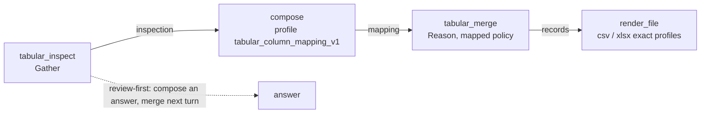

# V2 File Merge — Phase 2: Reconciling Different Structures

Version: **0.261.219**

Implemented in version: **0.261.219**, recorded in `application/single_app/config.py`.

GitHub issue: [#1619](https://github.com/microsoft/simplechat/issues/1619). Umbrella document:
[V2 File Merge](V2_FILE_MERGE.md). Builds on
[Phase 1](V2_FILE_MERGE_PHASE_1_SPREADSHEETS.md).

Dependencies: no new packages. The engine uses the standard library plus the existing
`openpyxl` and `xlrd` readers; the column mapping uses the existing compose step and its
prepared-content profile validator.

## Overview

Phase 1 merged only files with the same columns. Real exports drift: a column is renamed
(`cust_id` becomes `Customer ID`), a file gains a column, a workbook has a title above its
headers, or one sheet in a workbook holds notes instead of data. Phase 2 lets a merge
reconcile those differences while staying deterministic:

- **Inspect first.** A new Gather capability, `tabular_inspect`, reads each file's sheets,
  headers, row counts and sample rows and reports how the files line up, including near
  matches and a suggested policy.
- **Choose a policy.** `union` keeps every column; `mapped` keeps exactly a requested
  column list; `column_aliases` renames other header names to one column under any policy.
- **Let a model suggest the mapping, but not perform it.** A compose step prepares a
  `tabular_column_mapping_v1` value from the inspection. The merge validates it again and
  code applies it, so a model never copies or rewrites rows.
- **Leave out what doesn't fit.** `on_incompatible: exclude` reports and skips files or
  sheets whose columns don't fit instead of failing, and the result says so.
- **Shape the table.** `header_row`, `sheets: all` with a **Source Sheet** column, duplicate
  removal by exact row or key columns, and a bounded multi-column sort.

## Technical specifications

### Architecture



The one-shot recipe is inspect → compose mapping → merge → render. The review-first recipe
composes an answer from the inspection and merges in a later turn, with explicit
`columns` and `column_aliases`. Both recipes are offered to the planner only when
`tabular_inspect`, `tabular_merge`, `compose` and `render_file` are available.

### Components

| File | Change |
| --- | --- |
| `functions_tabular_merge.py` | Union and mapped policies, aliases, header row, all-sheets mode, exclusion, duplicate removal, bounded sort, inspection, the mapping profile schema and validator, and the shared argument-to-options conversion used by plan validation and the adapter. |
| `functions_orchestration_merge.py` | Inspection persistence (Gather role), nullable record columns, the mapping recorded in the merge report, step summaries, and the inspection failure-code map. |
| `functions_orchestration_adapters.py` | `run_tabular_inspect`; `run_tabular_merge` reads and re-validates a bound `mapping` input. Both share `_tabular_step_failure`. |
| `functions_orchestration_registry.py` | The `tabular_inspect` descriptor and the extended `tabular_merge` inputs and `mapping` input kind. |
| `functions_orchestration_schema.py` | Plan rules for inspect sources, merge option combinations, the mapping producer, tabular-only sources for inspect, and new failure messages. |
| `functions_orchestration_services.py` | Registers `tabular_column_mapping_v1` in `composition_profiles()` and validates it in `validate_composition_profile`. |
| `functions_orchestration_executor.py` | Binds a search's source set into inspect steps, as for merge and analyze. |
| `functions_orchestration_deliverables.py`, `functions_orchestration_planner.py` | The reconciliation recipe and planner guidance. |
| `application/v2_ui/src/lib/orchestrationMerge.ts`, `OrchestrationRunView.tsx` | The plan review states merge and inspection settings in words. |
| `admin_settings_fields.py` | **Inspect spreadsheets** in the orchestration Capabilities list. |

### `tabular_inspect` (Gather)

| Input | Meaning |
| --- | --- |
| `document_ids` (1 or more) or bound `inputs.sources` | The files, in order. |
| `sheet` / `sheets` (`first` or `all`) | Which sheets to read. |
| `header_row` (1–1000) | The row holding the headers; omitted means the first nonblank row. |
| `sample_rows` (0–10, default 3) | Sample rows kept per sheet. |

It retains `inspection` (`structured-v1`, `tabular-inspection-v1`, contract
`tabular-inspect-v1`): per file its format, encoding and delimiter, every sheet with its
visibility, and per inspected sheet the header row used, columns, non-blank row count
(capped at the chat row limit), samples clipped to 80 characters, and warnings such as a
likely title row with the suggested `header_row`. A file that can't be read is reported
with its problem instead of failing the step. `compatibility` holds identical-column
groups, every column with how many sheets have it, near matches (names equal after
ignoring case, spaces, punctuation and underscores) and a suggested policy: `by_name`
when every sheet has the same columns, `mapped` when near matches exist, otherwise
`union`. The value is kept under 96 KB by dropping samples first.

Inspection is gated by the Merge document action and uses its chat file limit.

### `tabular_merge` inputs added in Phase 2

| Input | Meaning |
| --- | --- |
| `schema_policy` | `by_name` (default), `exact_order`, `union` or `mapped`. |
| `columns` | `mapped` only: the output columns in order (up to 255). |
| `column_aliases` | `{column: [other header names]}`, up to 256 columns and 32 names each. An alias may not be another column's name or belong to two columns. |
| `mapping` input | A compose step's `tabular_column_mapping_v1` output. It makes the policy `mapped` and can't be combined with `columns` or `column_aliases`. |
| `header_row`, `sheet`, `sheets` | As for inspection. `sheets: all` adds a **Source Sheet** column when the file name column is on. |
| `on_incompatible` | `fail` (default) or `exclude`. |
| `dedupe`, `dedupe_columns`, `dedupe_keep` | `none` (default), `exact_rows` or `key_columns` (1–16 columns); keep `first` (default) or `last`. |
| `sort_by` | Up to three `{column, descending, value_type}` keys; `value_type` is `text`, `number` or `date`. |

The new inputs have no schema defaults, so a plan only lists what the planner chose and
the plan review stays short. Plan validation builds the same engine options the adapter
builds, so a combination the engine would refuse is refused at planning with
`merge_options_invalid`. A bound `mapping` must come from a compose step whose output is
`structured-v1` with profile `tabular_column_mapping_v1` (`mapping_profile_required`); a
retained-result alias is checked when the merge runs.

### Policy semantics

- **union**: the first file's columns, then each new column in the order a later file
  introduces it. Rows from files without a column hold `null`. A later column whose name
  collides with the file or sheet name column is renamed with a numeric suffix and a
  warning.
- **mapped**: exactly `columns`. Headers that match a column or one of its aliases fill
  it; other headers are left out and listed per source as `ignored_columns`. A file that
  fills none of the columns is incompatible.
- **by_name / exact_order** keep Phase 1 behavior, with aliases applied first.
- **Exclusion** applies to files or sheets whose columns differ (`columns_differ`), that
  fill none of the mapped columns (`no_matching_columns`), that have no header row, or
  that lack a named sheet. Unreadable or encrypted files still fail the merge.
- **all sheets** skips hidden sheets and sheets without a header row; each is listed in
  the report with its reason.

### Duplicates and sort

Duplicate detection compares the data columns, never the file or sheet name columns, using
a 128-bit BLAKE2b digest of the values. Missing and empty values compare equal and
trailing blanks are ignored, so a row read before a later file added a column matches the
same row read after it. Rows whose key values are all blank are never duplicates.
Keeping the first copy drops later copies as they are read; keeping the last copy records
the last position of each key and filters on read-back, adjusting each source's row
count.

Sorting is stable and multi-key. Numbers accept thousands separators and a leading `$`,
`€`, `£` or `¥`; dates accept ISO 8601 (Excel dates are already ISO). Values that aren't
the requested type sort after typed values as case-insensitive text, and blanks sort
last in either direction. Only the sort keys and byte offsets stay in memory, and rows are
read back from the spool in order; sorting is limited to 250,000 rows
(`sort_limit_exceeded`).

### Column mapping profile

`tabular_column_mapping_v1` is offered through `composition_profiles()` like the slide
deck profile:

```json
{
  "columns": ["Customer ID", "Name", "Amount"],
  "mappings": [
    {"source_column": "cust_id", "target_column": "Customer ID", "confidence": "high"},
    {"source_column": "Total", "target_column": "Amount", "confidence": "low"},
    {"source_column": "Notes", "target_column": null, "confidence": "high"}
  ],
  "notes": "Lined up the customer columns."
}
```

The validator refuses unknown fields, repeated columns or headers, targets that aren't
listed columns, and a header that is itself a different listed column. Compose asks the
model once more when a reply breaks the profile (`result_schema_invalid`), then fails the
step. The merge validates the retained value again, converts it to `columns` and
`column_aliases`, and records in the report which headers were explicitly left out,
which mappings were low confidence, and the notes.

### Result changes

- `records` columns are `nullable` when some merged file or sheet doesn't have them.
- The report adds `nullable_columns`, `sheet_column`, per-source `header_row`, `reason`,
  `ignored_columns`, `renamed_columns` and `duplicates_removed`, and totals
  `tables_merged`, `duplicates_removed` and `excluded`. A bound mapping adds `mapping`.
- Limitations, in application-owned words, note left-out files, blank-filled columns and
  left-out columns. The result stays complete: exclusion is a requested choice and is
  disclosed rather than hidden.

### Failure codes

| Code | When |
| --- | --- |
| `merge_nothing_to_merge` | Every file or sheet was skipped or left out. |
| `merge_columns_not_found` | A duplicate key or sort column isn't in the merged table. |
| `merge_options_invalid` | Settings that can't be combined reached the engine. |
| `merge_mapping_invalid` | A bound mapping fails the profile at merge time. |
| `inspect_sources_invalid`, `inspect_limit_exceeded` | Inspection was asked for non-spreadsheet files, too many files, or more columns than fit the inspection size. |

`merge_schema_mismatch` now suggests keeping every column, lining up names or leaving out
files. Engine messages, which can contain file and column names, are never shown as
failure text.

## Usage

Administrators need nothing new: **Inspect spreadsheets** and the new merge settings are
available wherever **Merge spreadsheets** is, and the Merge document action switch and
limits govern both. A narrowed orchestration Capabilities list must include **Inspect
spreadsheets** for the inspect recipes.

Users ask in a V2 chat, for example:

- "Merge these exports and keep every column."
- "Merge them and treat `cust_id` as `Customer ID`."
- "What columns do these files have? Then merge the ones that match into Excel."
- "Merge every sheet in these workbooks, remove duplicate order numbers keeping the
  latest, and sort by date."

See [Merge files in chat](../../guides/merge-files.md).

## Testing and validation

| Test | Covers |
| --- | --- |
| `functional_tests/test_tabular_merge_reconciliation.py` | Union, aliases and their validation, mapped columns, exclusion, nothing-to-merge, header rows, all-sheets mode, missing named sheets, duplicates (first, last, blank keys, union padding), sorting (numbers, dates, stability, bound), and inspection (compatibility, problems, title rows, size budget). |
| `functional_tests/test_orchestration_tabular_reconciliation.py` | The inspect descriptor and gating, plan rules for every option combination and the mapping producer, inspection without a model, inspect → compose mapping → merge through the real executor, the compose retry for an invalid mapping, nullable union columns rendered as blank CSV cells, exclusion summaries, failure codes, the profile validator and the planner recipe. |
| `functional_tests/test_v2_orchestration_merge_arguments.mjs` | Plan-card wording for every merge and inspection setting, defaults left out, refused values not worded, names kept as data. |
| `ui_tests/test_v2_orchestration_merge_arguments.py` | The real plan card and review in Chromium, light and narrow dark layouts, with a hostile column name. |
| `functional_tests/test_orchestration_workflow_*_off_golden.py` | Planner payload goldens regenerated and audited for the new descriptor, inputs, profile, recipe and guidance. |

### Performance

Merging stays single-pass. Union and mapped policies add no extra pass over the files;
rows written before a later column appears are padded on read-back. Duplicate removal
holds one 16-byte digest per distinct row; sorting holds one key tuple and one offset per
row up to 250,000 rows. Inspection reads every row once to count it.

### Known limitations

- Aliases apply to every file; a header that means different things in different files
  can't be mapped per file.
- Sorting understands ISO dates only, and numbers without locale-specific decimal commas.
- Excluding a file is all or nothing; individual rows are never dropped for not fitting.
- Merge still appends rows; key-based joins remain out of scope.
