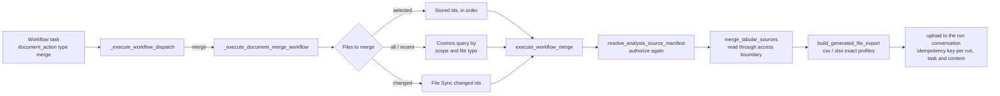

# V2 File Merge — Phase 3: Merges as Workflow Tasks

Version: **0.261.220**

Implemented in version: **0.261.220**, recorded in `application/single_app/config.py`.

GitHub issue: [#1619](https://github.com/microsoft/simplechat/issues/1619). Umbrella document:
[V2 File Merge](V2_FILE_MERGE.md). Builds on
[Phase 1](V2_FILE_MERGE_PHASE_1_SPREADSHEETS.md) and
[Phase 2](V2_FILE_MERGE_PHASE_2_RECONCILIATION.md).

Dependencies: no new packages. A workflow merge reuses the Phase 1 and 2 merge engine, the
shared generated-file export framework, and the workflow runner's existing source
authorization, cancellation and artifact upload paths.

## Overview

A chat merge suits a handful of files the user has in front of them. Two common needs don't
fit a chat turn:

- **Many files.** A year of weekly exports is 52 files; a national rollup can be hundreds.
  Chat merges stop at 10 files by default so a turn stays fast.
- **Repeated merges.** The same merge every Monday, or every time a synced folder gets a
  new export, shouldn't need someone to ask for it each time.

Phase 3 makes merging a workflow task. In the V2 workflow editor, a task's **Document
action** can be **Merge files**. The task merges CSV and Excel files with code, without a
model, and attaches one CSV or Excel file to the run. It accepts the same column, sheet,
duplicate and sort settings as a chat merge, and up to 100 files and 1,000,000 rows by
default.

A merge task takes its files from one of four places:

| Files to merge | Which files | Order |
| --- | --- | --- |
| **Selected files, in this order** | Two or more files chosen in the editor. | The order the owner set. |
| **All matching files in scope** | Every current CSV and Excel file in the workflow's workspace when the run starts. | By file name. |
| **Recently added or updated files** | Those added or changed within the recent window before the run (60 minutes by default, 1 to 1,440). | By file name. |
| **Files changed by File Sync** | The files the run's File Sync added or changed. Needs a File Sync trigger or pre-run sync that uses changed documents. | By file name. |

Chat can also propose a workflow with a merge task when a user asks for a recurring merge,
for example "every Monday, merge the regional sales files into one Excel file".

## Technical specifications

### Architecture



A merge task replaces the model or agent call for that task. The dispatcher checks the
task's document action before choosing a runner, so a merge task never loads a model,
an agent or a search step.

### Task contract

A merge is stored as the task's `document_action`:

| Field | Values | Notes |
| --- | --- | --- |
| `type` | `merge` | |
| `merge_kind` | `tabular` | `workbook`, `pdf`, `docx` and `pptx` are reserved for Phases 4–6 and refused until then. |
| `target_mode` | `selected`, `all`, `recent`, `changed` | |
| `document_ids` | Ordered ids | Two or more for `selected`. Empty for the other modes; ids found at run time are never stored with the task. |
| `doc_scope`, `active_group_ids`, `active_public_workspace_id` | As for Analyze | A group workflow is always forced to its own group. |
| `recent_window_minutes` | 1–1,440 | `recent` only; defaults to 60. |
| `output_format` | `csv` (default), `xlsx` | |
| `output_file_name` | Up to 100 characters | Optional base name, without an extension. It must not start with a dot or contain path, wildcard or quote characters (listed below). Defaults to `merged`. |
| `merge_options` | The chat merge settings | `schema_policy`, `columns`, `column_aliases`, `sheet`, `sheets`, `header_row`, `include_source_column`, `source_column_name`, `on_incompatible`, `dedupe`, `dedupe_columns`, `dedupe_keep`, `sort_by`. Unset values are dropped, unknown keys are refused, and the combination is checked with the engine's own rules when the workflow is saved. |

`normalize_document_action_config` accepts `merge` only from callers that ask for it:
`get_enabled_document_action_types(settings, include_merge=True)`. Personal and group
workflow saves and the runner ask for it; classic chat payloads do not, so a classic chat
request can never carry a merge.

The characters an output file name can't contain are `/`, `\`, `:`, `*`, `?`, `"`, `<`, `>`
and the vertical bar, plus control characters.

A `changed` merge is refused at save time unless the workflow's File Sync uses changed
documents ("Merging the files a sync changed needs a File Sync trigger that uses changed
documents.").

A save that breaks one of these rules says why. The contract raises `MergeActionError`, a
`ValueError` whose text never repeats the caller's input, and workflow saves turn it into a
`WorkflowPublicValidationError` that names the task by position, for example "Workflow task
2: Select at least two files to merge." Spreadsheet option errors from the merge engine can
quote column names, so they keep the save route's generic message; the editor checks those
combinations before saving.

The limit on selected files applies when the task is saved. Files found at run time are
counted by the merge itself, so a sync that brings more files than the limit fails with the
count and the limit rather than a generic error.

### Editor options

The editor options route adds `document_actions.merge`: `enabled`, whether an
administrator has Merge on, and `workflow_max_documents`, the file limit a save checks. The
editor doesn't offer **Merge files** while Merge is off, warns on a task that already merges,
and checks the selected-file limit before saving. A server that doesn't send these options
leaves Merge offered, and the save still decides.

The classic workflow editor has no Merge files action, so it doesn't open a workflow with a
merge task and points to V2 instead, as it does for calendar schedules.

### Run behavior

1. **Find the files.** `selected` uses the stored ids. `all` and `recent` query the
   workflow's authorized scopes for current documents whose file names end in `.csv`,
   `.xlsx`, `.xlsm` or `.xls`; `recent` adds a `_ts` cutoff. A personal workflow reads the
   owner's personal workspace plus any group and public workspace ids on the action that
   the owner can still use. A group workflow checks the owner's group role and reads only
   its group. `changed` uses the ids File Sync reported for this run, through
   `_apply_file_sync_changed_documents_to_action`, which marks them `merge_targets_resolved`.
2. **Refuse rather than truncate.** More files than the workflow file limit fail the task
   with the count and the limit; a merge never quietly merges only some of them.
3. **Authorize again.** `resolve_analysis_source_manifest` authorizes every id as the
   workflow owner. For `selected`, a file that's unavailable or isn't a spreadsheet fails
   the task. For the other modes, those files are skipped and named in the reply, and one
   remaining file is enough.
4. **Merge.** Each file's bytes are read through
   `content_screening.access.read_available_document_bytes`, one file at a time, by the
   same engine chat uses. Progress is reported per file as `file_merge` run activity.
5. **Render and attach.** `build_generated_file_export` renders the merged rows with the
   `exact_tabular_records_v1` (CSV) or `exact_tabular_workbook_v1` (XLSX) profile, and the
   file is uploaded to the run's conversation with the idempotency key
   `workflow-merge:{run_id}:{task_id}:{content_sha256}`.
6. **Reply.** The task's reply is a short summary: rows, files and columns, removed
   duplicates, files or sheets left out, skipped files, and columns some files lacked.
   Later tasks read this reply like any task output, and a CSV result is also offered as
   a tabular output. The runner does not create any other file from a merge task's reply,
   even when its instructions mention a file type.

When nothing matches — no file in scope, nothing recent, or a sync that changed no
spreadsheets — the task succeeds with a reply saying there was nothing to merge, and no
file is created.

#### Cancellation and recovery

Cancellation is checked before each stage and every 1,000 rows inside the engine. The
runner reads the persisted cancellation flag at most once every two seconds, and once
cancelled the merge stops before anything is uploaded.

A merge task keeps no per-file checkpoint. A merge only reads files and attaches its file
under an idempotency key, so the runner marks the task replay-safe: a durable run that
resumes repeats the merge from its first file instead of pausing for a review of external
actions, and a merge failure fails the task rather than pausing the run. A repeat over the
same files produces the same bytes and reuses the file already attached. The key includes
the file's SHA-256, so a repeat over files that changed in between attaches its own file
rather than colliding with the earlier one.

#### Failures

A merge task's failure is shown to the workflow owner on the failed task, so the engine's
messages, which can name the owner's own files and columns, are kept. The runner raises
them as `WorkflowInputError`, so the task shows the message as written and isn't retried:
the same files would fail the same way. Unexpected errors, such as a storage outage, keep
the runner's generic task message and its retry setting. Rendering and access failures use
fixed text:

| Cause | Message |
| --- | --- |
| More rows than a CSV export allows | The merged table has more rows than one file can hold. Merge fewer files per run. |
| Larger than an Excel file allows | The merged table is too large for an Excel file (at most 1,048,575 rows, 5,000,000 cells and 32 MB). Choose CSV output instead. |
| More files than the workflow limit | *N* files match this merge; at most *limit* can be merged in one workflow run. Narrow the files or ask an administrator to raise the Merge workflow file limit. |
| A selected file isn't a spreadsheet | *name* isn't a CSV or Excel file (.csv, .xlsx, .xlsm or .xls), so it can't be merged. |
| A selected file is no longer available | A file selected for this merge is no longer available to the workflow's owner. |

### Workflows proposed from chat

The workflow blueprint gains an optional task field (alternatives separated by `|`):

```text
"merge": {
  "files": "inputs" | "changed" | "all" | "recent",
  "output_format": "csv" | "xlsx",
  "file_name": "Regional sales",
  "recent_window_minutes": 60,
  "options": { "schema_policy": "union", "column_aliases": [{"column": "Amount", "aliases": ["Total"]}] }
}
```

- `inputs` merges the task's input document handles, in order; it needs two or more.
- `changed` needs a `file_sync` trigger.
- `all` and `recent` read the requester's personal workspace, because chat-created
  workflows are personal.
- `column_aliases` is a list of closed objects so every object in the blueprint schema
  stays closed; the saved task uses the editor's column-to-names map.
- A merge task has no agent runner and needs no `task_actions`.

Draft checks add stable, repairable codes that never echo the blueprint's text:
`merge_unavailable` (Merge is turned off), `merge_inputs_required`,
`merge_trigger_required`, `merge_options_invalid` and `merge_runner_invalid`. A merge
task's files are never added as reference documents. The proposal summary carries
`merge: {files, output_format}` for each merge task, and a merge task never needs the
default model, so a default model that can't run workflows doesn't block it.

The proposal card says, for example, "Merges the input files below, in order, into one
Excel file with code. No model runs." and lists the inputs under "Files to merge, in
order".

### Components

| File | Change |
| --- | --- |
| `functions_document_actions.py` | Merge kinds, target modes and output formats; `MergeActionError`; `normalize_merge_output_file_name`; `_normalize_merge_options` and `_normalize_merge_action`; `include_merge` on `get_enabled_document_action_types`. |
| `functions_workflow_merge.py` | New. `execute_workflow_merge`, `collect_merge_candidates`, `build_merge_reply`, the merged-records export source, `WorkflowMergeError` and `WorkflowMergeAccessError`, and the failure maps. |
| `functions_workflow_runner.py` | Merge dispatch, `_collect_merge_workflow_documents`, `_query_merge_candidate_documents`, `_throttled_cancellation_check`, `_execute_document_merge_workflow` (merge failures become `WorkflowInputError`), replay-safe merge tasks, `changed` merges in `_apply_file_sync_changed_documents_to_action`, and no extra generated file for merge results. |
| `functions_personal_workflows.py` | Workflow saves accept Merge, require File Sync for `changed` merges, and show a merge's reviewed reasons by task position. |
| `functions_workflow_editor.py` | `document_actions.merge` in the editor options. |
| `static/js/workspace/workspace_workflows.js` | The classic editor routes workflows with a merge task to V2 and lists them as **Merge files**. |
| `functions_tabular_merge.py` | `merge_tabular_sources(..., min_sources=1)` for files found at run time. |
| `functions_workflow_drafts.py` | The blueprint `merge` schema, its draft checks, and the merge action a blueprint task builds. |
| `functions_orchestration_workflows.py`, `functions_orchestration_workflow_proposals.py`, `functions_orchestration_planner.py` | The proposal summary's `merge` field, the default-model rule, the accept-time status of the merge draft codes, and the planner's merge task instructions. |
| `application/v2_ui/src/lib/workflowEditor.ts`, `components/workflows/WorkflowTaskFields.tsx`, `lib/workflowFlow.ts` | The **Merge files** document action: files to merge, merge order, output format and file name, recent window, and **More merge options**. |
| `application/v2_ui/src/lib/workflowProposals.ts`, `components/chat/WorkflowProposalCard.tsx` | Parsing and wording for proposed merge tasks. |

### Limits

| Limit | Default | Where |
| --- | --- | --- |
| Files per workflow merge | 100 (2–1,000) | `document_action_capabilities.merge.workflow_max_documents` |
| Rows per workflow merge | 1,000,000 (1,000–1,000,000) | `document_action_capabilities.merge.workflow_max_rows` |
| Recent window | 60 minutes (1–1,440) | The task's `recent_window_minutes` |
| Output file name | 100 characters | `MERGE_OUTPUT_FILE_NAME_MAX_CHARS` |
| Generated file size | 500 MB | `max_generated_chat_artifact_size_mb` |

The Phase 1 engine and rendering limits still apply: CSV exports hold at most 1,000,000
records, and Excel files at most 1,048,575 rows, 5,000,000 cells and 32 MB.

### Security

- Files are authorized as the workflow owner when the run starts and again as each file
  is read, with document access, screening holds and source revisions enforced by the
  same boundary as chat merges.
- Run-time discovery queries only the owner's personal documents, group and public
  workspaces the owner can still use, or, for a group workflow, its own group after a
  role check.
- No model reads or writes rows, and no file name or header from a merged file reaches a
  model or a planner.
- Draft errors for proposed merges are fixed text and never repeat blueprint content.

## Usage

Open a workflow in the V2 editor, add a task, and choose **Merge files** as its
**Document action**. See [Create a workflow](../../guides/create-a-workflow.md) and
[Merge files](../../guides/merge-files.md). Administrators control merging under
[Document Action Capabilities](../../admin/agents-actions.md#document-action-capabilities-card).

## Testing and validation

| Test | Covers |
| --- | --- |
| `functional_tests/test_workflow_merge_task.py` | The task contract and its refusals, workflow-only acceptance, run-time candidate ordering, CSV and Excel results, skipped and unavailable files, nothing to merge, fail-closed selected merges, the file limit, failure messages and how the task shows them, cancellation, the merge reply, the runner's File Sync, discovery, cancellation and upload glue, the File Sync save rule, and blueprint merge tasks through the real draft service. |
| `functional_tests/test_orchestration_workflow_propose_capability.py` | Merge rules when a plan is validated, the proposal summary's `merge` field, and the default-model rule. |
| `functional_tests/test_v2_workflow_merge_task.mjs`, `ui_tests/test_v2_workflow_merge_task.py` | The editor's merge action builder, option cleanup, alias parsing, validation and editor options, and the editor in a browser, including Merge turned off. |
| `functional_tests/test_v2_workflow_proposal_merge.mjs`, `ui_tests/test_v2_orchestration_workflow_proposal_card.py` | Parsing and wording of proposed merge tasks. |
| `functional_tests/test_workflow_editor_options.py`, `ui_tests/test_workflow_classic_advanced_guard.py` | The editor options' merge settings, and the classic editor routing merge workflows to V2. |
| `functional_tests/test_workflow_file_sync_prompt_context.py`, `functional_tests/test_workflow_task_document_actions.py` | Runner helpers loaded with the merge constants. |

## Known limitations

- Phase 3 merges only spreadsheet rows in workflows. From **0.261.221**, PDF and workbook
  merges run too ([Phase 4](V2_FILE_MERGE_PHASE_4_PDF_WORKBOOKS.md)); Word and PowerPoint
  arrive in Phases 5 and 6.
- A resumed run repeats the whole merge rather than continuing from the last file.
- Files found at run time are merged in file-name order. To control the order, select the
  files instead.
- Chat-proposed merges of all or recent files read only the requester's personal
  workspace. Edit the workflow to merge files from a group.
