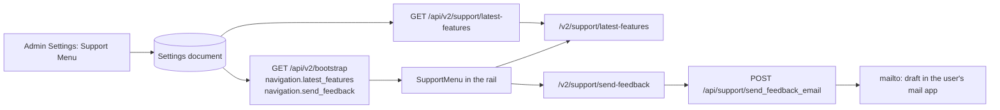

# V2 Support Menu

**Implemented in version: 0.261.296**

## Overview

Administrators configure the Support menu in Admin Settings: whether it appears, its name,
the Send Feedback destination and its recipient mailbox, and which Latest Features
announcements users see. The classic interface offers the menu to users as a collapsible
section in its sidebar and top navigation, with server-rendered **Latest Features** and
**Send Feedback** pages.

V2 had none of the user side. Its navigation rail carried a single Latest Features link that
left V2 for the classic page, and there was no way to send feedback at all.

| Capability | V2 before this change | V2 after this change |
| --- | --- | --- |
| Support menu in the navigation | A lone Latest Features link | A collapsible group under the configured menu name |
| Latest Features page | Classic page only | V2 page with search, release groups, and in-place details |
| Send Feedback page | Missing | V2 page that prepares the same email draft as the classic page |
| Announcement shortcuts | Classic pages | The matching V2 page where one exists |
| Menu open or closed | Not remembered | Shared with the classic interface |

## Dependencies

- `support_menu_config.py`: the user release catalogue, visibility defaults, and shortcut
  filtering. Unchanged.
- `functions_support_latest_features.py`: serializes the catalogue for V2. Gains the
  user payload builder.
- `route_backend_settings.py`: the existing `POST /api/support/send_feedback_email`, reused
  unchanged.
- React/TypeScript V2 UI with local `lucide-react` icons. No new packages or browser asset
  sources are added.

## Technical specifications

### Architecture

### Navigation entries in the bootstrap payload

`_build_navigation` in `route_backend_v2.py` reports both destinations, already narrowed to
the caller:

| Entry | Available when | Fields |
| --- | --- | --- |
| `navigation.latest_features` | Admin or User role, `enable_support_menu`, `enable_support_latest_features`, at least one announcement shared | `available`, `hidden_by_development`, `url`, `menu_name` (unchanged) |
| `navigation.send_feedback` | Admin or User role, `enable_support_menu`, `enable_support_send_feedback` (default on), and a recipient containing `@` | `available`, `url`, `menu_name` |

The recipient address is not sent with the navigation entry. The browser learns it only in
the reply to a submission, as the classic page does. The `@` check matches what the
submission endpoint accepts, so V2 never offers a form whose submissions would all fail.

### API endpoints

| Endpoint | Purpose |
| --- | --- |
| `GET /api/v2/support/latest-features` | New. Returns `{version, groups}` with only the shared announcements. |
| `POST /api/support/send_feedback_email` | Existing. Records the submission in the activity log and returns the recipient and subject line. |

`GET /api/v2/support/latest-features` is registered on the `backend_v2` blueprint with
`@swagger_route(security=get_auth_security())`, `@login_required`, `@user_required`, and
`@enabled_required("enable_support_menu")`. Like the classic route, it re-checks for the
Admin or User role. It returns 404 when `enable_support_latest_features` is off. Errors
return a generic message; exception text is logged under `[SUPPORT_LATEST_FEATURES]` and
never returned.

`build_user_latest_features_payload` reads `get_visible_support_latest_feature_groups`,
which:

- applies the administrator's visibility choices over the catalogue defaults;
- drops shortcuts whose `requires_settings` are off in the stored settings;
- applies the application title once;
- normalizes screenshots.

A release with nothing shared is omitted. Each group goes through the same `_serialize_group`
as the admin payload. Shortcuts are therefore resolved with `url_for`, and only same-origin
paths or http(s) addresses reach the browser. The endpoint resolver,
`_latest_feature_endpoint_url`, now lives at module level and is shared by the admin and user
routes.

Hiding the rail shortcut until the next release does not gate the page, as it does not on
the classic page.

### Shortcut translation

The catalogue's shortcuts name classic pages. `lib/latestFeatureShortcuts.ts` translates each
one to a V2 route when V2 has rebuilt the page:

| Classic link | V2 destination |
| --- | --- |
| `/chats` (any fragment or `feature_action`), `/conversations` | `/chat`, arriving at an empty chat as the rail's Chats link does |
| `/chats#chat-tutorial-launch` | `/chat`, starting the chat guided tour |
| `/workspace#documents-tab`, `#prompts-tab`, `#agents-tab`, `#plugins-tab`, `#workflows-tab`, `#identities-tab`, `#endpoints-tab`, `#sync-tab` | The matching `/workspace/<section>` |
| `/workspace?feature_action=document_tag_system`, `workspace_folder_view`, `file_sync` | `/workspace/tags`, `/workspace/documents`, `/workspace/sync` |
| `/workspace#workspace-tutorial-launch` | `/workspace`, starting the workspace guided tour |
| `/profile` | `/settings`, or `/settings?tab=stats` and `?tab=violations` for those tabs |
| `/group_workspaces`, `/public_workspaces`, `/public_directory`, `/approvals` | `/groups`, `/public`, `/public/directory`, `/approvals` |
| `/support/latest-features`, `/support/send-feedback` | The V2 Support pages |

Anything else on the site, such as the agent catalogue or workflow activity, opens as written
in the classic interface. http(s) links open in a new tab. Every V2 destination is a constant
from an allowlist, so a router target can never be built from catalogue data (#1698).
Classic and external links go through `safeLatestFeatureHref`, which refuses script URLs,
`//host`, backslashes, and dot segments.

### Configuration

No new settings. The feature reads the existing Support Menu settings documented in
[Help settings](../../admin/help.md) and two existing per-user settings:

| Per-user setting | Use |
| --- | --- |
| `latestFeaturesHiddenVersion` | Hides the rail's Latest Features entry until the next release. Shared with the classic interface. |
| `sidebarMenuState.support` | Whether the Support group is open. Shared with the classic sidebar. The whole object is written back so the classic interface's other menus are kept. If preferences fail to load, the group still opens and closes, but the choice is not saved: writing it from an empty store would replace the stored object. |

### File structure

| File | Role |
| --- | --- |
| `application/single_app/route_backend_v2.py` | `_build_send_feedback_nav`, the shared endpoint resolver, and the new route |
| `application/single_app/functions_support_latest_features.py` | `build_user_latest_features_payload` |
| `application/v2_ui/src/lib/supportMenu.ts` | V2 paths and the rail's visibility rules |
| `application/v2_ui/src/lib/latestFeatureShortcuts.ts` | Shortcut translation and the route allowlist |
| `application/v2_ui/src/components/layout/SupportMenu.tsx` | The rail group, replacing `LatestFeaturesLink.tsx` |
| `application/v2_ui/src/components/support/SupportAnnouncements.tsx` | Release groups, announcement rows, and shortcuts |
| `application/v2_ui/src/components/support/SupportFeedbackForm.tsx` | The feedback form |
| `application/v2_ui/src/pages/SupportLatestFeaturesPage.tsx` | The Latest Features page |
| `application/v2_ui/src/pages/SupportSendFeedbackPage.tsx` | The Send Feedback page |

## Usage

### Enable it

Turn on **Enable Support Menu for End Users** in **Admin Settings → Help → Support Menu**. To offer
Send Feedback, keep its destination on and set **Support Recipient Email**. To offer Latest
Features, keep its destination on and share announcements under **User-Facing Latest
Features**. V2 and classic users see the same menu.

### User workflows

- **Rail.** The Support group sits below any custom pages and external links. Its heading
  collapses it. Latest Features carries a **New** badge and a hide button. In the collapsed
  rail, both destinations show as named icons. Latest Features uses a lightning bolt, as in
  the classic menu, rather than the sparkle Agents uses.
- **Latest Features.** A search box filters every release. The current release starts open
  and older ones start closed. If nothing in the current release is shared, the first shared
  release opens instead. Each announcement opens in place to show its details, why it
  matters, how to try it, enlargeable screenshots, and shortcuts. An announcement with no
  shortcut carries the classic page's note about behind-the-scenes improvements. The page
  also explains its unavailable, empty, and failed states, with a retry for a failed load.
- **Send Feedback.** One form with a choice of **Bug Report** or **Feature Request**, instead
  of the classic page's two forms. Name and email are prefilled from the account, and each
  kind keeps its own details. Validation names the missing fields before anything is posted.
  After a successful post the mail app opens a text-only draft with the same subject and body
  as the classic page. An **open the draft** link stays on screen in case the mail app does
  not open. A report in progress survives leaving the page until the browser reloads.
- **Preferences.** The Latest Features card's **Open Latest Features** link opens the V2 page.

## Testing and validation

- `functional_tests/test_v2_support_menu.py` checks:
  - the user payload's visibility, shortcut filtering, URL safety, and title handling;
  - the route's decorators and gates;
  - the shared resolver;
  - the SPA wiring;
  - the TypeScript checks in `test_v2_support_menu_logic.ts`: rail rules, shortcut
    translation and unsafe inputs, static renders, and a cross-check that every shortcut in
    the real catalogue can be followed from V2.
- `functional_tests/test_v2_bootstrap_branding_and_navigation.py` checks the
  `send_feedback` gate.
- `functional_tests/test_v2_user_settings_tutorials_latest_features.py` checks that the rail
  and the Preferences card open the V2 page.
- `functional_tests/route_tests/test_route_blueprint_policy_inventory.py` records the route's
  policy.
- `ui_tests/test_v2_support_menu.py` serves the built SPA behind a closed API and checks:
  - the rail and its shared menu state, which is kept local when preferences fail to load;
  - hiding Latest Features;
  - listing, details, search, and in-app shortcuts;
  - the unavailable, failed, and retry states;
  - feedback validation and the prepared draft;
  - phone layout.

### Known limitations

- Classic-only behaviour carried in a shortcut, such as `feature_action` opening a dialog,
  has no V2 counterpart. The shortcut lands on the closest V2 page.
- The agent catalogue and workflow activity are not rebuilt in V2, so their shortcuts open
  the classic interface.
- No email is sent by the server. The user sends the draft from their own mail app, as on
  the classic page.
