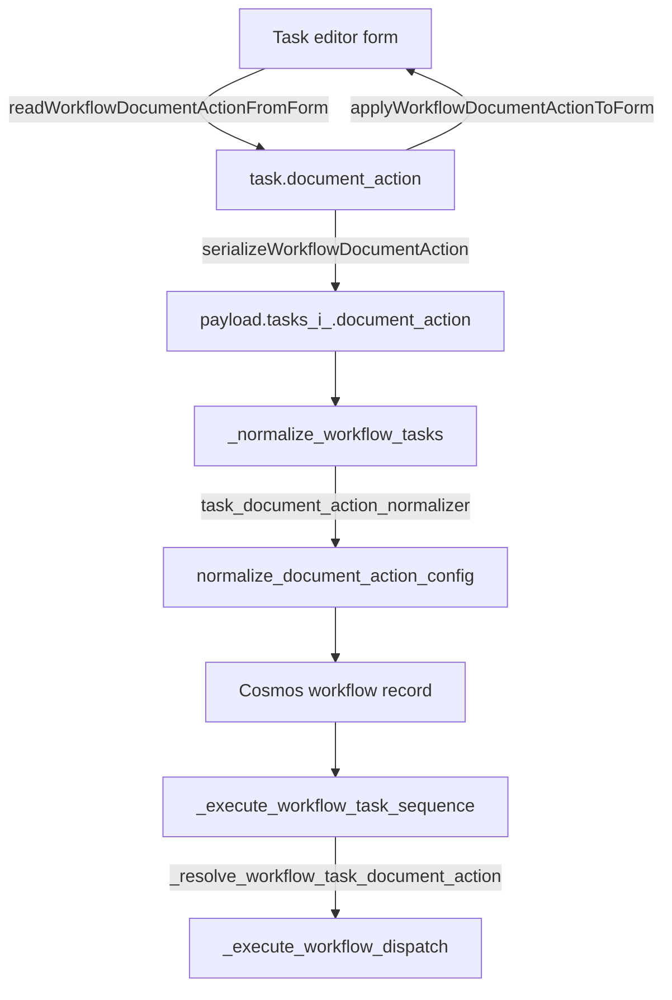

# Workflow Per-Task Workspace Documents

**Implemented in version: 0.250.225**
**Issue:** [microsoft/simplechat#1282](https://github.com/microsoft/simplechat/issues/1282)

## Overview

Workflow tasks are now self-contained. Each task in a workflow owns its own **Workspace
documents** configuration — document action, document target, picker selection, compare
source and targets, analysis mode, and windowing — instead of sharing a single workflow-level
document action.

This makes sequenced document work possible. For example, task 1 can analyze an intake set,
task 2 can compare a different pair of document versions, and task 3 can run with no document
context at all, passing each task's response forward as bounded context.

### Why

Before this change, `document_action` was stored on the workflow. The builder's Workspace
documents card lived inside the Tasks step but was bound to the workflow, so it did not reset
when you added a task or restore when you switched back to a previously configured task. At
run time, `_execute_workflow_task_sequence()` passed `include_document_action=task_index == 0`,
so only task 1 ever received the document action and tasks 2..N always executed with
`{'type': 'none'}`.

### Dependencies

- Workflows (personal and group) must be enabled by an administrator.
- `Analyze` and `Compare` require their respective document action capabilities to be enabled
  in Admin Settings; `Search` is always available.
- Depends on the workflow document picker fix documented in
  `docs/explanation/fixes/WORKFLOW_TASK_DOCUMENT_PICKER_FIX.md`.

## Technical Specifications

### Architecture



### Data Model

Each stored task gains a normalized `document_action`:

```json
{
  "id": "task-1",
  "type": "instructions",
  "name": "Analyze intake",
  "instructions": "Analyze the intake documents.",
  "order": 1,
  "runner": { "type": "inherit" },
  "document_action": {
    "type": "analyze",
    "document_ids": ["doc-a", "doc-b"],
    "left_document_id": "",
    "right_document_ids": [],
    "analysis_mode": "combined",
    "doc_scope": "all",
    "active_group_ids": [],
    "active_public_workspace_id": [],
    "window_unit": "pages",
    "window_size": null,
    "window_percent": null,
    "max_retries_per_window": 1,
    "target_mode": "selected",
    "recent_window_minutes": 10
  }
}
```

The workflow record keeps a top-level `document_action` and `analyze` block, mirrored from the
first task whose action type is not `none` (falling back to task 1). This keeps the workflow
list summary, the run-resume path in `route_backend_workflows.py`, and existing API consumers
working unchanged.

### Backward Compatibility

| Scenario | Behavior |
|---|---|
| Workflow saved before 0.250.225, opened in the builder | Its workflow-level `document_action` hydrates **task 1 only**, matching how it actually executed |
| Workflow saved before 0.250.225, executed without being re-saved | `_resolve_workflow_task_document_action()` falls back to the workflow-level action for task index 0 and `none` afterwards |
| Workflow re-saved through the builder | Every task persists its own `document_action`; task 1 keeps the inherited configuration |
| `tasks` omitted from a save payload | Stored tasks are returned untouched, so legacy records are not silently rewritten |

### File Structure

| File | Responsibility |
|---|---|
| `application/single_app/static/js/workspace/workspace_workflows.js` | Per-task model, form binding, serialization, validation, review and task-card summaries |
| `application/single_app/templates/workspace.html` | Personal workflow builder markup and copy |
| `application/single_app/templates/group_workspaces.html` | Group workflow builder markup and copy |
| `application/single_app/functions_personal_workflows.py` | `_normalize_workflow_tasks()` per-task normalization, `_normalize_task_document_action_config()` |
| `application/single_app/functions_group_workflows.py` | `_apply_group_document_action_scope()` group scoping per task |
| `application/single_app/functions_workflow_runner.py` | `_resolve_workflow_task_document_action()`, per-task File Sync target rewriting |

### Key Frontend Functions

| Function | Purpose |
|---|---|
| `createDefaultWorkflowTaskDocumentAction()` | Empty configuration used by new tasks |
| `normalizeWorkflowTaskDocumentAction(raw)` | Normalize a stored or inherited action into the builder model |
| `readWorkflowDocumentActionFromForm()` | Capture the live form and picker state into the active task |
| `applyWorkflowDocumentActionToForm(action)` | Restore a task's configuration into the form and picker |
| `serializeWorkflowDocumentAction(action)` | Convert the builder model into the save payload shape |
| `validateWorkflowTaskDocumentAction(payload, taskLabel, usesDynamicFileSyncTargets)` | Per-task validation with task-numbered messages |

### Key Backend Functions

`_normalize_workflow_tasks()` accepts two new optional parameters, following the existing
injectable-callable style used for task runners:

```python
tasks = _normalize_workflow_tasks(
    workflow_data,
    existing_workflow=existing_workflow,
    task_runner_normalizer=...,
    max_tasks=get_workflow_max_tasks(settings),
    task_document_action_normalizer=lambda action_payload: _normalize_task_document_action_config(
        action_payload,
        allow_empty_file_sync_targets=allow_empty_file_sync_targets,
        settings=settings,
    ),
    default_document_action=document_action,
)
```

`save_personal_workflow()` and `save_group_workflow()` now compute `file_sync` and the
workflow-level `document_action` **before** normalizing tasks, because both are inputs to the
per-task normalizer.

Group workflows wrap the normalizer with `_apply_group_document_action_scope()`, so every task
action is forced to `doc_scope='group'`, `active_group_ids=[group_id]`, and
`active_public_workspace_id=[]`. Tasks cannot widen scope beyond the owning group workspace.

### Runner Behavior

`_resolve_workflow_task_document_action()` decides what each task executes with:

1. If the task has a `document_action` dict, use it.
2. Otherwise, if this is task index 0 of a legacy record, use the workflow-level action.
3. Otherwise, use `{'type': 'none'}`.

`_build_workflow_task_execution_workflow()` sets both `document_action` and `analyze` on the
prepared per-task workflow, so `_execute_workflow_dispatch()` routes each task independently
through search, analyze, comparison, agent, or direct-model execution.

It is called from **inside** the per-attempt `try` block in `_execute_workflow_task_sequence()`.
Normalizing a task's action can raise (for example when an administrator later disables the
Analyze or Compare capability, or lowers the workflow document limit), and building inside the
attempt means that failure retries and honors the workflow's failure strategy, and is recorded
as a failed task run item, instead of aborting the whole run.

### Run History

Document run item ids are scoped by task (`{run_id}:task:{task_id}:document:{document_id}`)
because two tasks in the same run can now target the same document. Without task scoping the
second task's status would overwrite the first task's, masking a failure. Each item also
records `task_id` and `task_name`. Legacy single-dispatch runs, which have no active task,
keep the original `{run_id}:document:{document_id}` id.

**Resume failed items** narrows every task-level analyze action to the failed documents
attributed to that task. A task with an analyze action but no failed documents is downgraded to
`none` so it does not re-run its whole set, and run items recorded before task scoping existed
fall back to the full failed set.

### File Sync Interaction

When File Sync runs with **Use changed documents**, `_apply_file_sync_context_to_workflow()`
now rewrites every task-level `analyze` action with the changed document ids and the configured
source scopes, in addition to the workflow-level action. If no documents changed, those analyze
actions become `{'type': 'none'}` so the task runs without document context rather than
analyzing a stale set.

Saving is relaxed the same way: when File Sync supplies dynamic targets, an analyze task may be
saved with no explicit document selection.

## Usage Instructions

### Configuring documents per task

1. Open a workspace and go to the **Workflows** tab, then create or edit a workflow.
2. Advance to the **Tasks** step.
3. Select the task you want to configure in the **Task sequence** list (or click **Add Task**).
4. In **Workspace documents**, choose a **Document action** for that task. The picker loads the
   documents available in scope.
5. Choose the documents (or configure **Compare** source and targets) for that task.
6. Select another task. The Workspace documents fields reset for an unconfigured task, or
   restore that task's saved configuration.

Each task card in the sequence shows a `Documents:` summary, and the **Review** step lists the
document action for every task plus how many tasks use workspace documents.

### Example: analyze then compare

| Task | Document action | Documents |
|---|---|---|
| 1. Analyze intake | Analyze | The three intake PDFs |
| 2. Compare revisions | Compare | Contract v1 as source, v2 and v3 as targets |
| 3. Draft summary | No document action | — (receives task 2's response as context) |

### Validation messages

Per-task validation failures name the offending task and select it in the editor, for example:

```
Task 2 (Compare revisions): Select at least two document versions for compare.
```

## Testing and Validation

### Test Coverage

`functional_tests/test_workflow_task_document_actions.py` covers:

- The document picker load wiring and refresh contract.
- The frontend per-task model, serialization, and payload mirroring.
- `_normalize_workflow_tasks()` storing an action per task.
- Legacy workflow-level configuration inheriting to task 1 only.
- Task-numbered validation errors for invalid per-task actions.
- Group task actions being forced into group scope.
- The runner executing each task with its own action, and the legacy fallback.
- File Sync changed documents reaching task-level analyze actions.

`functional_tests/test_workflow_task_sequence.py` was extended for the new runner helper and
now asserts the app version with `assert_app_version_at_least` instead of exact equality.

### Performance Considerations

Changing a task's document action or switching tasks reloads the picker scope, documents, and
tags. A load token guards against overlapping reloads so only the newest result is applied.

### Known Limitations

- The builder has one physical document picker, so it always reflects the selected task. Switching
  tasks always syncs the current editor state first, but two tasks cannot be configured side by side.
- Group workflows cannot target personal or public workspace documents from any task; scope is
  forced to the owning group.
- The workflow list summary and run-resume path still describe the mirrored primary action rather
  than the full per-task set.

## Coupled Fixes Included

Making tasks self-contained surfaced four issues that only became reachable once more than one
task could carry a document action. All four are fixed here:

- A task document action that no longer normalizes (capability disabled by an admin, document
  limit lowered) previously aborted the whole run. It is now built inside the retry attempt so it
  fails that task through the normal retry and failure strategy.
- Two tasks targeting the same document overwrote each other's run-history status. Document run
  item ids are now task-scoped.
- **Resume failed items** narrowed only the workflow-level action, which tasks now override.
  It narrows task-level actions as well, and group resumes re-force group scope on each task.
- A saved `max_retries_per_window` of `0` on a task other than the one being edited was rewritten
  to `1` on save, because `normalizeText()` coerces numeric `0` to an empty string.

## Related

- Fix: `docs/explanation/fixes/WORKFLOW_TASK_DOCUMENT_PICKER_FIX.md`
- Tests: `functional_tests/test_workflow_task_document_actions.py`, `functional_tests/test_workflow_task_sequence.py`
