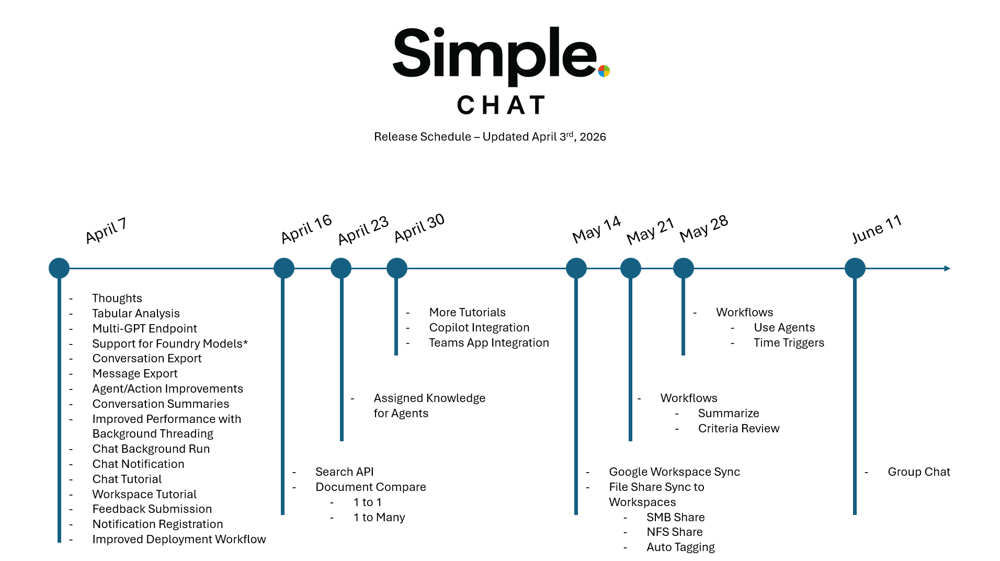

<!-- BEGIN release_notes.md BLOCK -->

# Feature Release

<<<<<<< HEAD
### **(v0.240.002)**

#### New Features

*   **Idle Session Timeout Feature**
    *   Added a new idle timer that automatically clears the user session after a configurable set time and redirects to the main chat login page.
    *   Added a frontend idle warning modal that pops up after a configurable set time, but disappears if the user moves the mouse over the chat window or interacts with the app in any way.
    *   Default values are used if the idle logout and warning values are not set. 
    *   Idle logout and idle warning values are validated and auto-fixed as needed.
    *   Added a new admin switch to enable or disable idle session timeout and warning behavior.
    *   Timeout and warning inputs are grouped under a toggleable section in General > System Settings.
    *   (Ref: `application/single_app/templates/admin_settings.html`, `application/single_app/static/js/admin/admin_settings.js`, `application/single_app/route_frontend_admin_settings.py`, `application/single_app/functions_settings.py`, `application/single_app/app.py`, `application/single_app/templates/base.html`, `application/single_app/static/js/idle-logout-warning.js`, `application/single_app/config.py`, `functional_tests/test_idle_logout_timeout.py`, `application/single_app/route_frontend_authentication.py`)

#### Bug Fixes

*   **Settings Default Merge Persistence Fix**
    *   Fixed app settings merge detection in `get_settings()` where `deep_merge_dicts()` mutates the existing settings object in place, causing change detection to always evaluate as unchanged.
    *   Updated `deep_merge_dicts()` to return a boolean `changed` flag and wired `get_settings()` to call `upsert_item()` when `settings_changed` is `True`, so missing default keys correctly trigger persistence back to Cosmos DB.
    *   Added a functional regression test to validate the merge detection and persistence markers.
    *   (Ref: `application/single_app/functions_settings.py`, `application/single_app/config.py`, `functional_tests/test_settings_deep_merge_persistence_fix.py`)
    
=======
This page tracks notable Simple Chat releases and organizes the detailed change log by version. The timeline below provides a quick visual overview of the current release progression through v0.240.001, and the per-version entries continue immediately after it.
### **(v0.240.004)**

#### New Features

*   **Cross-Cloud Deployment Improvements**
    *   Updated the Azure CLI, AZD, Bicep, and Terraform deployment paths to better align with the current SimpleChat runtime configuration and reduce post-deployment manual fixes.
    *   Added optional Azure Video Indexer deployment support with cloud-aware defaults, including the correct endpoint and ARM API version handling for Azure Commercial, Azure Government, and registered custom clouds.
    *   (Ref: `deployers/azure.yaml`, `deployers/azurecli/deploy-simplechat.ps1`, `deployers/bicep/main.bicep`, `deployers/bicep/modules/videoIndexer.bicep`, `deployers/terraform/main.tf`, `application/single_app/functions_settings.py`)
### **(v0.239.187)**

For feature-focused and fix-focused drill-downs by version, see [Features by Version](/explanation/features/) and [Fixes by Version](/explanation/fixes/).



>>>>>>> Development
### **(v0.240.001)**

#### New Features

*   **Guided Chat Tutorial**
    *   Expanded the in-app chat tutorial into a fuller guided walkthrough of the current chat experience so new users can learn the live interface in context.
    *   The tutorial now walks through the main chat toolbar, workspace and scope controls, conversation search, advanced search, selection mode, bulk actions, export-related flows, and message-level actions such as retry, edit, feedback, thoughts, and citations.
    *   The walkthrough also includes reliability improvements for dynamic chat UI elements, including sidebar expansion, popup alignment, and tutorial-owned surfaces for steps that depend on transient menus.
    *   (Ref: `chat-tutorial.js`, `chats.html`, `chat-sidebar-conversations.js`, `test_chat_tutorial_selector_coverage.py`, chat tutorial walkthrough)

*   **Personal Workspace Guided Tutorial**
    *   Added a dedicated in-app tutorial for Personal Workspace so users can learn document, prompt, agent, action, and tag workflows directly inside the workspace page.
    *   The walkthrough covers uploads, search and filters, list and grid views, document details, row actions, bulk selection flows, tag management, prompt management, agent management, and action management.
    *   It also includes layout-aware positioning and state-restoration behavior so the overlay remains aligned while tabs, filters, menus, and collapsible sections change during the walkthrough.
    *   (Ref: `workspace.html`, `workspace-tutorial.js`, `test_personal_workspace_tutorial_selector_coverage.py`, `test_personal_workspace_tutorial_document_flow.py`, `test_workspace_tutorial_reposition_fix.py`, `test_workspace_tutorial_layer_order_fix.py`)

*   **Conversation Completion Notifications**
    *   Added personal chat completion notifications so users who leave a conversation before the assistant finishes can still see that a response is ready.
    *   Notification clicks deep-link back into the completed conversation, and personal conversations now show a green unread dot until the assistant response is opened.
    *   The unread state and notification lifecycle are wired into the chat conversation list, sidebar list, and mark-read flow so the indicator clears once the conversation is actually viewed.
    *   (Ref: conversation notifications, unread assistant responses, `route_backend_chats.py`, `route_backend_conversations.py`, `functions_notifications.py`, `functions_conversation_unread.py`, `chat-conversations.js`, `chat-sidebar-conversations.js`)

*   **Background Chat Completion Away From Chat Page**
    *   Updated streaming chat execution so assistant responses can continue running after the user leaves the chat page instead of stopping when the browser disconnects from the stream.
    *   This keeps final assistant persistence, unread markers, and completion notifications reachable even when users navigate into Personal, Group, or other pages while a reply is still generating.
    *   (Ref: background stream execution, `BackgroundStreamBridge`, `route_backend_chats.py`, `test_chat_stream_background_execution.py`, `test_streaming_only_chat_path.py`)

*   **SimpleChat Startup and Scheduler Separation**
    *   Added deployment guidance for local development, Azure App Service native Python startup, and container runtimes so administrators can choose between direct Gunicorn startup and optional `python app.py` handoff behavior with clear environment-variable guidance.
    *   Extracted the scheduler-style logging timer, approval expiration, and retention loops into a shared background task module and added a dedicated `simplechat_scheduler.py` entrypoint so scheduled work can run in a separate process or job.
    *   This allows the web app to use Gunicorn with `workers=2` without duplicating scheduler loops inside every worker process, while keeping a legacy override available for single-process environments.
    *   (Ref: `app.py`, `background_tasks.py`, `simplechat_scheduler.py`, `SIMPLECHAT_STARTUP.md`, `test_startup_scheduler_support.py`)

*   **Deployment, Setup, and Upgrade Documentation Refresh**
    *   Expanded the deployment guidance so teams can more quickly choose between manual deployment, Azure CLI, Bicep, Terraform, and special-environment setup paths from the main setup documentation.
    *   Added a dedicated upgrade guide for existing deployments that separates native Python App Service upgrades from container-based App Service upgrades, including when to use VS Code deployment, ZIP deploy, deployment slots, `azd deploy`, `azd provision`, or `azd up`.
    *   Clarified developer and production runtime documentation with explicit local-development guidance, Azure production startup expectations, Gunicorn startup rules, container entrypoint behavior, and scheduler-separation recommendations.
    *   (Ref: `setup_instructions.md`, `setup_instructions_manual.md`, `how-to/upgrade_paths.md`, `running_simplechat_azure_production.md`, `running_simplechat_locally.md`, `SIMPLECHAT_STARTUP.md`, deployment and developer documentation)

*   **Chat Completion Notifications**
    *   Added personal chat completion notifications so users who leave a streaming conversation before the assistant finishes now receive a notification when the AI response is ready.
    *   Notification clicks deep-link directly back to the completed conversation, and personal conversations now show a green unread dot in both chat conversation lists until that response is opened.
    *   The unread state is cleared automatically when the conversation is opened or when the user stays on the chat page through stream completion, keeping the active-view experience clean without adding heartbeat tracking.
    *   (Ref: `route_backend_chats.py`, `route_backend_conversations.py`, `functions_notifications.py`, `functions_conversation_unread.py`, `chat-conversations.js`, `chat-sidebar-conversations.js`, `chat-streaming.js`, `test_chat_completion_notifications.py`)

*   **Configurable Tabular Preview Blob Size Limit**
    *   Added an admin-configurable maximum blob size for tabular file previews, replacing the previous hardcoded limit. Default is 200 MB.
    *   New **Tabular Preview Limits** card in the Enhanced Citations section of Admin Settings (Citations tab) lets admins increase or decrease the limit based on their compute resources and user population.
    *   Setting is stored as `tabular_preview_max_blob_size_mb` and accepts values from 1 to 1024 MB.
    *   (Ref: `route_enhanced_citations.py`, `functions_settings.py`, `admin_settings.html`)

*   **Tabular Preview Memory Optimization**
    *   The `/api/enhanced_citations/tabular_preview` endpoint no longer loads entire files into a DataFrame. It now uses `nrows` limits in `pandas.read_csv`/`read_excel` to read only the rows needed for the preview, and checks blob size before downloading to reject oversized files early.
    *   (Ref: `route_enhanced_citations.py`)

*   **Persistent Conversation Summaries**
    *   Summaries generated during conversation export are now saved to the conversation document in Cosmos DB for future reuse.
    *   Cached summaries include `message_time_start` and `message_time_end` — when a conversation has new messages beyond the cached range, a fresh summary is generated automatically.
    *   The conversation details modal now shows a **Summary** card at the top. If a summary exists it displays the content, generation date, and model used. If no summary exists a **Generate Summary** button with model selector lets users create one on demand.
    *   A **Regenerate** button is available on existing summaries to force a refresh with the currently selected model.
    *   New `POST /api/conversations/<id>/summary` endpoint accepts an optional `model_deployment` and returns the generated summary.
    *   The `GET /api/conversations/<id>/metadata` response now includes a `summary` field.
    *   Extracted `generate_conversation_summary()` as a shared helper used by both the export pipeline and the new API endpoint.
    *   (Ref: `route_backend_conversation_export.py`, `route_backend_conversations.py`, `chat-conversation-details.js`, `functions_conversation_metadata.py`)

*   **PDF Conversation Export**
    *   Added PDF as a third export format option alongside JSON and Markdown, giving users a print-ready, visually styled conversation archive.
    *   PDF output renders chat messages with colored bubbles that mirror the live chat UI: blue for user messages, gray for assistant messages, green for file messages, and amber for system messages.
    *   Message content is converted from Markdown to HTML for rich formatting (bold, italic, code blocks, lists, tables) inside the PDF.
    *   Full appendix structure is included (metadata, message details, references, processing thoughts, supplemental messages), matching the Markdown export layout.
    *   Rendering uses PyMuPDF's Story API on US Letter paper with 0.5-inch margins and automatic multi-page overflow.
    *   Works with both single-file and ZIP packaging; intro summaries are supported in PDF as well.
    *   Frontend format step updated to a 3-column card grid with a new PDF card using the `bi-filetype-pdf` icon.
    *   (Ref: `route_backend_conversation_export.py`, `chat-export.js`, PyMuPDF Story API, conversation export workflow)

*   **Conversation Export Intro Summaries**
    *   Added an optional AI-generated intro summary step to the conversation export workflow, so each exported chat can begin with a short abstract before the full transcript.
    *   Summary model selection now reuses the same model list shown in the chat composer, keeping the export flow aligned with the main chat experience.
    *   Works for both JSON and Markdown exports, including ZIP exports where each conversation keeps its own summary metadata.
    *   (Ref: `route_backend_conversation_export.py`, `chat-export.js`, conversation export workflow)

*   **Agent & Action User Tracking (created_by / modified_by)**
    *   All agent and action documents (personal, group, and global) now include `created_by`, `created_at`, `modified_by`, and `modified_at` fields that track which user created or last modified the entity.
    *   On updates, the original `created_by` and `created_at` values are preserved while `modified_by` and `modified_at` are refreshed with the current user and timestamp.
    *   New optional `user_id` parameter added to `save_group_agent`, `save_global_agent`, `save_group_action`, and `save_global_action` for caller-supplied user tracking (backward-compatible, defaults to `None`).
    *   (Ref: `functions_personal_agents.py`, `functions_group_agents.py`, `functions_global_agents.py`, `functions_personal_actions.py`, `functions_group_actions.py`, `functions_global_actions.py`)

*   **Activity Logging for Agent & Action CRUD Operations**
    *   Every create, update, and delete operation on agents and actions now generates an activity log record in the `activity_logs` Cosmos DB container and Application Insights.
    *   Six new logging functions: `log_agent_creation`, `log_agent_update`, `log_agent_deletion`, `log_action_creation`, `log_action_update`, `log_action_deletion`.
    *   Activity records include: `user_id`, `activity_type`, `entity_type` (agent/action), `operation` (create/update/delete), `workspace_type` (personal/group/global), and `workspace_context` (group_id when applicable).
    *   Logging is fire-and-forget — failures never break the CRUD operation.
    *   All personal, group, and admin routes for both agents and actions are wired up.
    *   (Ref: `functions_activity_logging.py`, `route_backend_agents.py`, `route_backend_plugins.py`)

*   **Tabular Data Analysis — SK Mini-Agent for Normal Chat**
    *   Tabular files (CSV, XLSX, XLS, XLSM) detected in search results now trigger a lightweight Semantic Kernel mini-agent that pre-computes data analysis before the main LLM response. This brings the same analytical depth previously only available in full agent mode to every normal chat conversation.
    *   **Automatic Detection**: When AI Search results include tabular files from any workspace (personal, group, or public) or chat-uploaded documents, the system automatically identifies them via the `TABULAR_EXTENSIONS` configuration and routes the query through the SK mini-agent pipeline.
    *   **Unified Workspace and Chat Handling**: Tabular files are processed identically regardless of their storage location. The plugin resolves blob paths across all four container types (`user-documents`, `group-documents`, `public-documents`, `personal-chat`) with automatic fallback resolution if the primary source lookup fails. A user asking about an Excel file in their personal workspace gets the same analytical treatment as one asking about a CSV uploaded directly to a chat.
    *   **Six Data Analysis Functions**: The `TabularProcessingPlugin` exposes `describe_tabular_file`, `aggregate_column` (sum, mean, count, min, max, median, std, nunique, value_counts), `filter_rows` (==, !=, >, <, >=, <=, contains, startswith, endswith), `query_tabular_data` (pandas query syntax), `group_by_aggregate`, and `list_tabular_files` — all registered as Semantic Kernel functions that the mini-agent orchestrates autonomously.
    *   **Pre-Computed Results Injected as Context**: The mini-agent's computed analysis (exact numerical results, aggregations, filtered data) is injected into the main LLM's system context so it can present accurate, citation-backed answers without hallucinating numbers.
    *   **Graceful Degradation**: If the mini-agent analysis fails for any reason, the system falls back to instructing the main LLM to use the tabular processing plugin functions directly, preserving full functionality.
    *   **Non-Streaming and Streaming Support**: Both chat modes are supported. The mini-agent runs synchronously before the main LLM call in both paths.
    *   **Requires Enhanced Citations**: The tabular processing plugin depends on the blob storage client initialized by the enhanced citations system. The `enable_enhanced_citations` admin setting must be enabled for tabular data analysis to activate.
    *   (Ref: `run_tabular_sk_analysis()`, `TabularProcessingPlugin`, `collect_tabular_sk_citations()`, `TABULAR_EXTENSIONS`)

*   **Tabular Tool Execution Citations**
    *   Every tool call made by the SK mini-agent during tabular analysis is captured and surfaced as an agent citation, providing full transparency into the data analysis pipeline.
    *   **Automatic Capture**: The existing `@plugin_function_logger` decorator on all `TabularProcessingPlugin` functions records each invocation including function name, input parameters, returned results, execution duration, and success/failure status.
    *   **Citation Format**: Tool execution citations appear in the same "Agent Tool Execution" modal used by full agent mode, showing `tool_name` (e.g., `TabularProcessingPlugin.aggregate_column`), `function_arguments` (the exact parameters passed), and `function_result` (the computed data returned).
    *   **End-to-End Auditability**: Users can verify exactly which aggregations, filters, or queries were run against their data, what parameters were used, and what raw results were returned — before the LLM summarized them into the final response.
    *   (Ref: `collect_tabular_sk_citations()`, `plugin_invocation_logger.py`)

*   **SK Mini-Agent Performance Optimization**
    *   Reduced typical tabular analysis time from ~74 seconds to an estimated ~30-33 seconds (55-60% reduction) through three complementary optimizations.
    *   **DataFrame Caching**: Per-request in-memory cache eliminates redundant blob downloads. Previously, each of the ~8 tool calls in a typical analysis downloaded and parsed the same file independently. Now the file is downloaded once and subsequent calls read from cache. Cache is automatically scoped to the request (new plugin instance per analysis) and garbage-collected afterward.
    *   **Pre-Dispatch Schema Injection**: File schemas (columns, data types, row counts, and a 3-row preview) are pre-loaded and injected into the SK mini-agent's system prompt before execution begins. This eliminates 2 LLM round-trips that were previously spent on file discovery (`list_tabular_files`) and schema inspection (`describe_tabular_file`), allowing the model to jump directly to analysis tool calls.
    *   **Async Plugin Functions**: All six `@kernel_function` methods converted to `async def` using `asyncio.to_thread()`. This enables Semantic Kernel's built-in `asyncio.gather()` to truly parallelize batched tool calls (e.g., 3 simultaneous `aggregate_column` calls) instead of executing them serially on the event loop.
    *   **Batching Instructions**: The system prompt now instructs the model to batch multiple independent function calls in a single response, reducing LLM round-trips further.
    *   (Ref: `_df_cache`, `asyncio.to_thread`, pre-dispatch schema injection in `run_tabular_sk_analysis()`)

*   **SQL Test Connection Button**
    *   Added a "Test Connection" button to the SQL Database Configuration section (Step 3) of the action wizard, allowing users to validate database connectivity before saving.
    *   Supports all database types: SQL Server, Azure SQL (with managed identity), PostgreSQL, MySQL, and SQLite.
    *   Shows inline success/failure alerts with a 15-second timeout cap and sanitized error messages.
    *   New backend endpoint: `POST /api/plugins/test-sql-connection`.
    *   (Ref: `route_backend_plugins.py`, `plugin_modal_stepper.js`, `_plugin_modal.html`)

*   **Per-Message Export**
    *   Added export and action options to the three-dots dropdown menu on individual chat messages (both AI and user messages).
    *   **Export to Markdown**: Downloads the message as a `.md` file with a role header. Entirely client-side.
    *   **Export to Word**: Generates a styled `.docx` document via a new backend endpoint (`POST /api/message/export-word`). Includes Markdown-to-Word formatting (headings, bold, italic, code blocks, lists) and a citations section when present.
    *   **Use as Prompt**: Inserts the raw message content directly into the chat input box for reuse — no clipboard, one click and it's ready to edit and send.
    *   **Open in Email**: Opens the user's default email client with the message pre-filled in the subject and body via `mailto:`.
    *   New options appear below a divider in the dropdown, preserving existing actions (Delete, Retry, Edit, Feedback).
    *   (Ref: `chat-message-export.js`, `chat-messages.js`, `route_backend_conversation_export.py`, per-message export)

*   **Custom Azure Environment Support in Bicep Deployment**
    *   Added `custom` as a supported `cloudEnvironment` value alongside `public` and `usgovernment`, enabling deployment to sovereign or custom Azure environments via Bicep.
    *   New Bicep parameters for custom environments: `customBlobStorageSuffix`, `customGraphUrl`, `customIdentityUrl`, `customResourceManagerUrl`, `customCognitiveServicesScope`, and `customSearchResourceUrl`. All of these are automatically populated from `az.environment()` defaults except `customGraphUrl`, which must be explicitly provided for custom cloud environments and can be overridden as needed.
    *   The `cloudEnvironment` parameter now defaults intelligently based on `az.environment().name`, and legacy values (`AzureCloud`, `AzureUSGovernment`) are mapped to SimpleChat's expected values (`public`, `usgovernment`).
    *   Custom environment app settings (`CUSTOM_GRAPH_URL_VALUE`, `CUSTOM_IDENTITY_URL_VALUE`, `CUSTOM_RESOURCE_MANAGER_URL_VALUE`, etc.) are conditionally injected only when `azurePlatform == 'custom'`.
    *   Replaced hardcoded ACR domain logic and auth issuer URLs with dynamic `az.environment()` lookups for better cross-cloud compatibility.
    *   Fixed trailing slash handling in `AUTHORITY` URL construction in `config.py` using `rstrip('/')`.
    *   (Ref: `deployers/bicep/main.bicep`, `deployers/bicep/modules/appService.bicep`, `config.py`, sovereign cloud support)

*   **Redis Key Vault Authentication**
    *   Added a new `key_vault` authentication type for Redis, allowing the Redis access key to be retrieved securely from Azure Key Vault at runtime rather than stored directly in settings.
    *   Applies across all Redis usage paths: app settings cache (`app_settings_cache.py`), session management (`app.py`), and the Redis test connection flow (`route_backend_settings.py`).
    *   Uses `retrieve_secret_direct()` from `functions_keyvault.py` to fetch the Redis key by its Key Vault secret name. Respects `key_vault_identity` for a user-assigned managed identity on the Key Vault client.
    *   New admin setting fields: `redis_auth_type` (values: `key`, `managed_identity`, `key_vault`) and `redis_key` (used as the Key Vault secret name when `key_vault` auth type is selected).
    *   **Files Modified**: `app_settings_cache.py`, `app.py` `configure_sessions`, `route_backend_settings.py` `_test_redis_connection`, `functions_keyvault.py` `retrieve_secret_direct`

#### User Interface Enhancements

*   **Agent Responded Thought — Seconds & Total Duration**
    *   The "responded" thought now shows time in **seconds** instead of milliseconds, and clarifies it is the total time from the initial user message (e.g., `'gpt-5-nano' responded (16.3s from initial message)`).
    *   A `request_start_time` is now captured at the top of both the non-streaming and streaming chat handlers, so the duration reflects the full request lifecycle — including content safety, hybrid search, and agent invocation — not just the model response time.
    *   Applies to all three agent paths: local SK agents (non-streaming), Azure AI Foundry agents, and streaming SK agents.
    *   (Ref: `route_backend_chats.py`, `request_start_time`, agent responded thoughts)

*   **Enhanced Agent Execution Thoughts**
    *   Added detailed model-level status messages during agent execution, giving users full visibility into each stage of the AI pipeline.
    *   **Model Identification**: A new "Sending to '{deployment_name}'" thought appears immediately after "Sending to agent", showing the exact model deployment being used (e.g., `gpt-5-nano`).
    *   **Generating Response**: A "Generating response..." thought now appears before the agent begins its invocation loop, matching the existing behavior for non-agent GPT calls.
    *   **Model Responded with Duration**: A "'{deployment_name}' responded ({duration}ms)" thought appears after the agent completes, showing total wall-clock execution time.
    *   Applies to all three agent paths: local SK agents (streaming and non-streaming) and Azure AI Foundry agents.
    *   Uses the existing `generation` step type (lightning bolt icon) — no frontend changes required.
    *   (Ref: `route_backend_chats.py`, `ThoughtTracker`, agent execution pipeline)

*   **List/Grid View Toggle for Agents and Actions**
    *   Added a list/grid view toggle to all four workspace areas: personal agents, personal actions, group agents, and group actions.
    *   **Grid View**: Large cards with type icon, humanized name, truncated description, and action buttons (Chat, View, Edit, Delete as applicable).
    *   **List View**: Improved table layout with fixed column widths (28%/47%/25%), humanized display names, and truncated descriptions with hover tooltips for full text.
    *   **View Button**: New eye-icon button on every agent and action that opens a read-only detail modal with gradient-header summary cards (Basic Information, Model Configuration, Instructions for agents; Basic Information, Configuration for actions).
    *   **Name Humanization**: Display names are now automatically parsed — underscores and camelCase/PascalCase boundaries are converted to properly spaced, title-cased words (e.g., `myCustomAgent` → `My Custom Agent`).
    *   **Persistent Preference**: View mode selection (list/grid) is saved per area in localStorage and restored on page load.
    *   New shared utility module `view-utils.js` provides reusable functions for all four workspace areas.
    *   (Ref: `view-utils.js`, `workspace_agents.js`, `workspace_plugins.js`, `plugin_common.js`, `group_agents.js`, `group_plugins.js`, `workspace.html`, `group_workspaces.html`, `styles.css`)

*   **Chat with Agent Button for Group Agents**
    *   Added a "Chat" button to each group agent row, allowing users to quickly select a group agent and navigate to the chat page.
    *   (Ref: `group_agents.js`, `group_workspaces.html`)

*   **Hidden Deprecated Action Types**
    *   Deprecated action types (`sql_schema`, `ui_test`, `queue_storage`, `blob_storage`, `embedding_model`) are now hidden from the action creation wizard type selector. Existing actions of these types remain functional.
    *   (Ref: `plugin_modal_stepper.js`)

*   **Advanced Settings Collapse Toggle**
    *   Step 4 (Advanced) content is now hidden behind a collapsible toggle button ("Show Advanced Settings") instead of being displayed by default. Reduces visual noise for most users.
    *   For SQL action types, the redundant additional fields UI in Step 4 is hidden entirely since all SQL configuration is already handled in Step 3.
    *   Step 5 (Summary) no longer shows the raw additional fields JSON dump for SQL types, since that data is already shown in the SQL Database Configuration summary card.
    *   (Ref: `_plugin_modal.html`, `plugin_modal_stepper.js`)
    
#### Bug Fixes

*   **Pillow PSD Upload Hardening**
    *   Updated the application to use `pillow==12.1.1`, moving the app off the vulnerable Pillow range for specially crafted PSD image parsing.
    *   Hardened admin logo and favicon uploads so Pillow now only opens the PNG and JPEG formats already allowed by the route, preventing disguised PSD content from being decoded during upload processing.
    *   (Ref: `application/single_app/requirements.txt`, `application/single_app/route_frontend_admin_settings.py`, `functional_tests/test_pillow_psd_upload_hardening.py`)

*   **Changed-Files GitHub Action Supply Chain Remediation**
    *   Updated the release-notes pull request workflow to use the patched `tj-actions/changed-files@v46.0.1` release after the March 2025 supply chain compromise affecting older tag families.
    *   Added a functional regression check to ensure the workflow does not drift back to the known malicious commit or an older vulnerable action reference.
    *   (Ref: `release-notes-check.yml`, `test_changed_files_action_version.py`, GitHub Actions workflow security, CI dependency pinning)

*   **Personal Conversation Notification Scope Detection**
    *   Fixed a scope-detection bug where personal chat completions could save successfully without creating a completion notification or unread dot when unrelated active workspace state was still present in session.
    *   Personal completion-side effects are now determined from the saved conversation type instead of active workspace session values.
    *   (Ref: personal chat scope gating, `route_backend_chats.py`, `test_chat_completion_notifications.py`)

*   **Distributed Background Task Locks**
    *   Added Cosmos-backed distributed lock documents for approval expiry and retention policy background jobs so duplicate execution is reduced across multiple Gunicorn workers and App Service instances.
    *   Kept the current web-app-hosted scheduler model intact so teams can continue running these jobs from the existing App Service while improving cross-worker coordination.
    *   Updated the startup documentation and added functional validation for the distributed lock wiring.
    *   (Ref: `background_tasks.py`, `SIMPLECHAT_STARTUP.md`, `test_background_task_distributed_locks.py`, `test_startup_scheduler_support.py`)

*   **Background Task Default-On Gating**
    *   Updated the web runtime background task gate so scheduler loops now start by default even when `SIMPLECHAT_RUN_BACKGROUND_TASKS` is unset.
    *   Only explicit false-like values such as `0`, `false`, `no`, or `off` now disable the background loops, which matches the requested deployment behavior.
    *   Updated the startup guide and Gunicorn runtime validation test to reflect the new default-on behavior.
    *   (Ref: `app.py`, `SIMPLECHAT_STARTUP.md`, `test_gunicorn_startup_support.py`)

*   **Gunicorn Production Startup Support**
    *   Updated the app bootstrap so production deployments can run cleanly under Gunicorn instead of relying on Flask's built-in server, which is a poor fit for long-lived streaming chat requests on App Service.
    *   Added a shared Gunicorn config, switched the container entrypoint to Gunicorn, and made application initialization idempotent so startup logic can run safely in multi-worker web processes.
    *   Background timer and retention loops are now disabled by default under Gunicorn workers to avoid duplicating scheduler-style threads across workers, while local debug startup continues to use the Flask development server.
    *   (Ref: `app.py`, `gunicorn.conf.py`, `Dockerfile`, `test_gunicorn_startup_support.py`)

*   **Streaming-Only Chat Path**
    *   Updated the first-party chat experience so normal sends, retries, and message edits now use the streaming chat path instead of maintaining a separate non-streaming UI path.
    *   Preserved parity-sensitive behavior by extending the streaming flow to finalize image-generation responses correctly and by adding a backend compatibility bridge for retry, edit, and image-generation requests while the legacy `/api/chat` route remains in transition.
    *   Removed the chat-page streaming toggle, updated the UI to treat streaming as required behavior, and added regression coverage to prevent first-party chat modules from drifting back to direct `/api/chat` calls.
    *   (Ref: `route_backend_chats.py`, `chat-messages.js`, `chat-streaming.js`, `chat-retry.js`, `chat-edit.js`, `chats.html`, `test_streaming_only_chat_path.py`)

*   **Embedding Retry-After Wait Time Handling**
    *   Fixed embedding retries so `429 Too Many Requests` responses now honor server-provided wait times from `Retry-After` style headers instead of always using local backoff timing.
    *   This reduces avoidable repeat throttling during document processing, batched embedding generation, and search embedding requests when Azure OpenAI asks the client to wait.
    *   The existing exponential backoff behavior remains in place as a fallback when the service does not provide a usable retry delay.
    *   (Ref: `functions_content.py`, embedding retry logic, `test_embedding_rate_limit_wait_time.py`)

*   **SQL Plugin Key Vault Secret Storage**
    *   New and updated SQL Query and SQL Schema actions now store sensitive values such as connection strings and passwords in Azure Key Vault when Key Vault secret storage is enabled.
    *   Editing an existing SQL action now preserves stored Key Vault-backed credentials, including the SQL test connection flow, so users do not need to re-enter unchanged secrets just to validate or save the action.
    *   Personal, group, and global action flows now preserve existing secret references during updates, clean them up correctly on delete, and redact secret-bearing plugin values from logs.
    *   Existing plaintext SQL action credentials are not backfilled automatically; they move to Key Vault the next time the action is saved while Key Vault storage is enabled.
    *   (Ref: `functions_keyvault.py`, `route_backend_plugins.py`, `plugin_modal_stepper.js`, `workspace_plugins.js`, SQL action configuration)

*   **Group/Public Expanded Document Tags**
    *   Fixed group and public workspace list views so expanding a document now shows its tags, matching the personal workspace experience.
    *   The fix adds color-coded tag badges with a `No tags` fallback in expanded document details without changing the existing backend document APIs.
    *   (Ref: `group_workspaces.html`, `public_workspace.js`, expanded document details, workspace tag rendering)

*   **Agent Save Validation for Round-Tripped Metadata**
    *   Fixed agent saves failing when an existing personal, group, or global agent was edited and the browser sent back backend-managed audit fields such as `created_at`, `created_by`, `modified_at`, and `modified_by`.
    *   Agent payload sanitization now strips backend-managed audit and Cosmos metadata before schema validation, while preserving server-side tracking during persistence.
    *   (Ref: `functions_agent_payload.py`, `route_backend_agents.py`, agent schema validation, functional test coverage)

*   **Multi-Sheet Workbook Tabular Analysis**
    *   Fixed multi-sheet Excel workbooks being analyzed from the wrong worksheet during tabular chat responses. Questions that clearly target a specific tab, such as asset values in a workbook with `Assets`, `Balance`, and `Income` sheets, no longer silently default to the first sheet.
    *   Tabular runtime analysis now requires explicit `sheet_name` or `sheet_index` selection for analytical calls on multi-sheet workbooks, and the SK mini-agent preload now includes workbook sheet inventory and per-sheet schemas so the model can choose the correct worksheet before computing results.
    *   Enhanced citations and tabular previews now preserve worksheet context, using `Sheet: <name>` for sheet-specific references and `Location: Workbook Schema` for workbook-level schema citations instead of generic `Page 1` labels. The tabular preview modal also supports switching between workbook sheets.
    *   (Ref: `tabular_processing_plugin.py`, `route_backend_chats.py`, `route_enhanced_citations.py`, `chat-enhanced-citations.js`, `chat-citations.js`, `chat-messages.js`)

*   **Tabular Citation Conversation Ownership Check**
    *   Fixed an IDOR vulnerability on `/api/enhanced_citations/tabular` where any authenticated user who could guess a `conversation_id` and `file_id` could download another user's chat-uploaded tabular files.
    *   The endpoint now reads the conversation document from Cosmos DB and verifies that `conversation.user_id` matches the current user before serving the blob. Returns 403 Forbidden on mismatch and 404 if the conversation does not exist.
    *   (Ref: `route_enhanced_citations.py`, `cosmos_conversations_container`)

*   **Tabular Preview `max_rows` Parameter Validation**
    *   The `max_rows` query parameter on `/api/enhanced_citations/tabular_preview` was parsed with bare `int()`, causing a 500 error on non-integer input. Switched to Flask's `request.args.get(..., type=int)` which silently falls back to the default on invalid input, matching the pattern used by other endpoints.
    *   (Ref: `route_enhanced_citations.py`)

*   **On-Demand Summary Generation — Content Normalization Fix**
    *   Fixed the `POST /api/conversations/<id>/summary` endpoint failing with an error when generating summaries from the conversation details modal.
    *   Root cause: message `content` in Cosmos DB can be a list of content parts (e.g., `[{type: "text", text: "..."}]`) rather than a plain string. The endpoint was passing the raw list as `content_text`, which either stringified incorrectly or produced empty transcript text.
    *   Now uses `_normalize_content()` to properly flatten list/dict content into plain text, matching the export pipeline's behavior.
    *   (Ref: `route_backend_conversations.py`, `_normalize_content`, `generate_conversation_summary`)

*   **Export Summary Reasoning-Model Compatibility**
    *   Fixed export intro summary generation failing or returning empty content with reasoning-series models (gpt-5, o1, o3) through a series of incremental fixes: using `developer` role instead of `system` for instruction messages, removing all `max_tokens` / `max_completion_tokens` caps so the model decides output length naturally, and adding null-safe content extraction for `None` responses.
    *   Summary now includes ALL messages (user, assistant, system, file, image analysis) for full context, with a simplified prompt producing 1-2 factual paragraphs.
    *   Added detailed debug logging showing message count, character count, model name, role, and finish reason.
    *   (Ref: `route_backend_conversation_export.py`, `_build_summary_intro`, `generate_conversation_summary`)

*   **Conversation Export Schema and Markdown Refresh**
    *   Fixed conversation exports lagging behind the live chat schema. JSON exports now include processing thoughts, normalized citations, and the raw document/web/tool citation buckets stored with assistant messages.
    *   Fixed Markdown exports being too flat and text-heavy by reorganizing them into a transcript-first layout with appendices for metadata, message details, references, thoughts, and supplemental records.
    *   Fixed exported conversations including content that no longer matched the visible chat by filtering deleted messages and inactive-thread retries, then reapplying thread-aware ordering before export.
    *   (Ref: `route_backend_conversation_export.py`, `test_conversation_export.py`, conversation export rendering)

*   **Export Tag/Classification Rendering Fix**
    *   Fixed conversation tags and classifications rendering as raw Python dicts (e.g., `{'category': 'model', 'value': 'gpt-5'}`) in both Markdown and PDF exports.
    *   Tags now display as readable `category: value` strings, with smart handling for participant names, document titles, and generic category/value pairs.
    *   (Ref: `route_backend_conversation_export.py`, `_format_tag` helper, Markdown/PDF metadata rendering)

*   **Export Summary Error Visibility**
    *   Added `debug_print` and `log_event` logging to all summary generation error paths, including the empty-response path that previously failed silently.
    *   The actual error detail is now shown in both Markdown and PDF exports when summary generation fails, replacing the generic "could not be generated" message.
    *   (Ref: `route_backend_conversation_export.py`, `_build_summary_intro`, export error rendering)

*   **Content Safety for Streaming Chat Path**
    *   Added full Azure AI Content Safety checking to the streaming (`/api/chat/stream`) SSE path, matching the existing non-streaming (`/api/chat`) implementation.
    *   Previously, only the non-streaming path performed content safety analysis; streaming conversations bypassed safety checks entirely.
    *   Implementation includes: `AnalyzeTextOptions` analysis, severity threshold checking (severity ≥ 4 blocks the message), blocklist matching, persistence of blocked messages to `cosmos_safety_container`, creation of safety-role message documents, and proper SSE event delivery of blocked status to the client.
    *   On block, the streaming generator yields the safety message and `[DONE]` event, then stops — preventing any further LLM invocation.
    *   Errors in the content safety call are caught and logged without breaking the chat flow, consistent with the non-streaming behavior.
    *   (Ref: `route_backend_chats.py`, streaming SSE generator, `AnalyzeTextOptions`, `cosmos_safety_container`)

*   **SQL Schema Plugin — Eliminate Redundant Schema Calls**
    *   Fixed agent calling `get_database_schema` twice per query even though the full schema was already injected into the agent's instructions at load time.
    *   Root cause: The `@kernel_function` descriptions in `sql_schema_plugin.py` said "ALWAYS call this function FIRST," which overrode the schema context already available in the instructions.
    *   Updated all four function descriptions (`get_database_schema`, `get_table_schema`, `get_table_list`, `get_relationships`) to use the resilient pattern: "If the database schema is already provided in your instructions, use that directly and do NOT call this function."
    *   This eliminates ~400ms+ of unnecessary database round trips per query and aligns with the same pattern already used in `sql_query_plugin.py`.
    *   (Ref: `sql_schema_plugin.py`, `@kernel_function` descriptions, schema injection)

*   **SQL Schema Plugin — Empty Tables from INFORMATION_SCHEMA**
    *   Fixed `get_database_schema` returning `'tables': {}` (empty) despite the database having tables, while relationships were returned correctly.
    *   Root cause: SQL Server table/column enumeration used `INFORMATION_SCHEMA.TABLES` and `INFORMATION_SCHEMA.COLUMNS` views, which returned empty results in the Azure SQL environment. Meanwhile, the relationships query used `sys.foreign_keys`/`sys.tables`/`sys.columns` catalog views which worked perfectly.
    *   Migrated all SQL Server schema queries to use `sys.*` catalog views consistently: `sys.tables`/`sys.schemas` for table enumeration, `sys.columns` with `TYPE_NAME()` for column details, and `sys.indexes`/`sys.index_columns` for primary key detection.
    *   Fixed `pyodbc.Row` handling throughout the plugin — removed all `isinstance(table, tuple)` checks that could fail with pyodbc Row objects, replaced with robust try/except indexing.
    *   This enables the full schema (tables, columns, types, PKs, FKs) to be injected into agent instructions, allowing agents to construct complex multi-table JOINs for analytical queries.
    *   (Ref: `sql_schema_plugin.py`, `sys.tables`, `sys.columns`, `sys.indexes`, pyodbc.Row handling)

*   **SQL Query Plugin — Auto-Create Companion Schema Plugin**
    *   Fixed the remaining issue where SQL-connected agents still asked for clarification instead of querying the database, even after description improvements.
    *   Root cause: Agents configured with only a `sql_query` action never had a `SQLSchemaPlugin` loaded in the kernel. The descriptions demanded calling `get_database_schema` — a function that didn't exist — creating an impossible dependency that caused the LLM to ask for clarification.
    *   `LoggedPluginLoader` now automatically creates a companion `SQLSchemaPlugin` whenever a `SQLQueryPlugin` is loaded, using the same connection details. This ensures schema discovery is always available.
    *   Updated `@kernel_function` descriptions to be resilient: "If the database schema is provided in your instructions, use it directly. Otherwise, call get_database_schema." This dual-path approach works whether schema is injected via instructions or available via plugin functions.
    *   Added fallback in `_extract_sql_schema_for_instructions()` to also detect `SQLQueryPlugin` instances and create a temporary schema extractor if no `SQLSchemaPlugin` is found.
    *   (Ref: `logged_plugin_loader.py`, `sql_query_plugin.py`, `semantic_kernel_loader.py`)

*   **SQL Query Plugin Schema Awareness**
    *   Fixed agents connected to SQL databases asking users for clarification about table/column names instead of querying the database directly.
    *   Root cause: SQL Query and SQL Schema plugin `@kernel_function` descriptions were generic with no workflow guidance, agent instructions had no database schema context, and the two plugins operated independently with no linkage.
    *   Rewrote all `@kernel_function` descriptions in both SQL plugins to be prescriptive workflow guides (modeled after the working LogAnalyticsPlugin), explicitly instructing the LLM to discover schema first before generating queries.
    *   Added auto-injection of database schema into agent instructions at load time — when SQL Schema plugins are detected, the full schema (tables, columns, types, relationships) is fetched and appended to the agent's system prompt.
    *   Added new `query_database(question, query)` convenience function to `SQLQueryPlugin` for intent-aligned tool calling.
    *   Enabled the SQL-specific plugin creation path in `logged_plugin_loader.py` (was previously commented out).
    *   (Ref: `sql_query_plugin.py`, `sql_schema_plugin.py`, `semantic_kernel_loader.py`, `logged_plugin_loader.py`)

*   **Chat-Uploaded Tabular Files Now Trigger SK Mini-Agent in Model-Only Mode**
    *   Fixed an issue where tabular files (CSV, XLSX, XLS, XLSM) uploaded directly to a chat conversation were not analyzed by the SK mini-agent when no agent was selected. The model would describe what analysis it would perform instead of returning actual computed results.
    *   **Root Cause**: The mini SK agent only triggered from search results, but chat-uploaded files are stored in blob storage and not indexed in Azure AI Search. Additionally, the streaming path completely ignored `file` role messages in conversation history.
    *   **Fix**: Both streaming and non-streaming chat paths now detect chat-uploaded tabular files during conversation history building and trigger `run_tabular_sk_analysis(source_hint="chat")` to pre-compute results. The streaming path also now properly handles `file` role messages (tabular and non-tabular) matching the non-streaming path's behavior.
    *   (Ref: `route_backend_chats.py`, `run_tabular_sk_analysis()`, `collect_tabular_sk_citations()`)

*   **Group SQL Action/Plugin Save Failure**
    *   Fixed group SQL actions (sql_query and sql_schema types) failing to save correctly due to missing endpoint placeholder. Group routes now apply the same `sql://sql_query` / `sql://sql_schema` endpoint logic as personal action routes.
    *   Fixed Step 4 (Advanced) dynamic fields overwriting Step 3 (Configuration) SQL values with empty strings during form data collection. SQL types now skip the dynamic field merge entirely since Step 3 already provides all necessary configuration.
    *   Fixed auth type definition schemas (`sql_query.definition.json`, `sql_schema.definition.json`) only allowing `connection_string` auth type, blocking `user`, `identity`, and `servicePrincipal` types that the UI and runtime support.
    *   Fixed `__Secret` key suffix mismatch in additional settings schemas where `connection_string__Secret` and `password__Secret` didn't match the runtime's expected `connection_string` and `password` field names. Also removed duplicate `azuresql` enum value.
    *   (Ref: `route_backend_plugins.py`, `plugin_modal_stepper.js`, `sql_query.definition.json`, `sql_schema.definition.json`, `sql_query_plugin.additional_settings.schema.json`, `sql_schema_plugin.additional_settings.schema.json`)

### **(v0.239.187)**

#### Bug Fixes

*   **Workspace Model Endpoint Scope Gate Enforcement**
    *   Fixed personal and group workspace model discovery and model test routes so they now enforce the same custom-endpoint feature gates as the corresponding endpoint management routes.
    *   Restored the intended endpoint modal workflow so users can still fetch and test models before saving a new personal or group endpoint when those scope features are enabled.
    *   Requests that reference a saved endpoint now resolve against the caller's authorized persisted endpoint configuration instead of allowing raw request payloads to override stored settings.
    *   (Ref: `route_backend_models.py`, `workspace_model_endpoints.js`, `test_model_endpoint_scope_gate_enforcement.py`, model endpoint scope gating)

### **(v0.239.158)**

#### Bug Fixes

*   **Workspace Agent View Consistency**
    *   Fixed personal and group workspace agent lists so table-view actions now use the same button order, making agent management behavior more predictable across both workspaces.
    *   Fixed group workspace agent grid cards so editable group agents once again show Edit and Delete actions when the current user has permission to manage them.
    *   Fixed personal workspace agent table layout so action buttons stay inside the table instead of overflowing past the Actions column.
    *   (Ref: `workspace.html`, `workspace_agents.js`, `group_agents.js`, `view-utils.js`, `test_workspace_agent_views_consistency.py`)

### **(v0.239.156)**

#### Bug Fixes

*   **MultiGPT Endpoint Key Vault Secret Storage and Foundry Fetch Reliability**
    *   MultiGPT endpoint secrets such as API keys and service principal client secrets now move into Azure Key Vault when Key Vault secret storage is enabled, instead of remaining in saved endpoint payloads.
    *   Endpoint fetch, test, Foundry listing, and runtime execution now resolve stored secrets server-side by endpoint ID, so reopening an endpoint no longer depends on the browser still holding plaintext credentials.
    *   Fixed a follow-up regression in Foundry model discovery where sync fetch routes could fail with `'coroutine' object has no attribute 'token'` because async credentials were being reused in a synchronous token acquisition path.
    *   (Ref: `functions_keyvault.py`, `functions_settings.py`, `route_backend_models.py`, `route_frontend_admin_settings.py`, `semantic_kernel_loader.py`, `foundry_agent_runtime.py`, `admin_model_endpoints.js`, `workspace_model_endpoints.js`, `test_model_endpoints_key_vault_secret_storage.py`, `test_foundry_model_fetch_sync_credentials.py`)

### **(v0.239.153)**

#### Bug Fixes

<<<<<<< HEAD
*   **Activity Logging for Agent & Action CRUD Operations**
    *   Every create, update, and delete operation on agents and actions now generates an activity log record in the `activity_logs` Cosmos DB container and Application Insights.
    *   Six new logging functions: `log_agent_creation`, `log_agent_update`, `log_agent_deletion`, `log_action_creation`, `log_action_update`, `log_action_deletion`.
    *   Activity records include: `user_id`, `activity_type`, `entity_type` (agent/action), `operation` (create/update/delete), `workspace_type` (personal/group/global), and `workspace_context` (group_id when applicable).
    *   Logging is fire-and-forget — failures never break the CRUD operation.
    *   All personal, group, and admin routes for both agents and actions are wired up.
    *   (Ref: `functions_activity_logging.py`, `route_backend_agents.py`, `route_backend_plugins.py`)

*   **Tabular Data Analysis — SK Mini-Agent for Normal Chat**
    *   Tabular files (CSV, XLSX, XLS, XLSM) detected in search results now trigger a lightweight Semantic Kernel mini-agent that pre-computes data analysis before the main LLM response. This brings the same analytical depth previously only available in full agent mode to every normal chat conversation.
    *   **Automatic Detection**: When AI Search results include tabular files from any workspace (personal, group, or public) or chat-uploaded documents, the system automatically identifies them via the `TABULAR_EXTENSIONS` configuration and routes the query through the SK mini-agent pipeline.
    *   **Unified Workspace and Chat Handling**: Tabular files are processed identically regardless of their storage location. The plugin resolves blob paths across all four container types (`user-documents`, `group-documents`, `public-documents`, `personal-chat`) with automatic fallback resolution if the primary source lookup fails. A user asking about an Excel file in their personal workspace gets the same analytical treatment as one asking about a CSV uploaded directly to a chat.
    *   **Six Data Analysis Functions**: The `TabularProcessingPlugin` exposes `describe_tabular_file`, `aggregate_column` (sum, mean, count, min, max, median, std, nunique, value_counts), `filter_rows` (==, !=, >, <, >=, <=, contains, startswith, endswith), `query_tabular_data` (pandas query syntax), `group_by_aggregate`, and `list_tabular_files` — all registered as Semantic Kernel functions that the mini-agent orchestrates autonomously.
    *   **Pre-Computed Results Injected as Context**: The mini-agent's computed analysis (exact numerical results, aggregations, filtered data) is injected into the main LLM's system context so it can present accurate, citation-backed answers without hallucinating numbers.
    *   **Graceful Degradation**: If the mini-agent analysis fails for any reason, the system falls back to instructing the main LLM to use the tabular processing plugin functions directly, preserving full functionality.
    *   **Non-Streaming and Streaming Support**: Both chat modes are supported. The mini-agent runs synchronously before the main LLM call in both paths.
    *   **Requires Enhanced Citations**: The tabular processing plugin depends on the blob storage client initialized by the enhanced citations system. The `enable_enhanced_citations` admin setting must be enabled for tabular data analysis to activate.
    *   (Ref: `run_tabular_sk_analysis()`, `TabularProcessingPlugin`, `collect_tabular_sk_citations()`, `TABULAR_EXTENSIONS`)

*   **Tabular Tool Execution Citations**
    *   Every tool call made by the SK mini-agent during tabular analysis is captured and surfaced as an agent citation, providing full transparency into the data analysis pipeline.
    *   **Automatic Capture**: The existing `@plugin_function_logger` decorator on all `TabularProcessingPlugin` functions records each invocation including function name, input parameters, returned results, execution duration, and success/failure status.
    *   **Citation Format**: Tool execution citations appear in the same "Agent Tool Execution" modal used by full agent mode, showing `tool_name` (e.g., `TabularProcessingPlugin.aggregate_column`), `function_arguments` (the exact parameters passed), and `function_result` (the computed data returned).
    *   **End-to-End Auditability**: Users can verify exactly which aggregations, filters, or queries were run against their data, what parameters were used, and what raw results were returned — before the LLM summarized them into the final response.
    *   (Ref: `collect_tabular_sk_citations()`, `plugin_invocation_logger.py`)

*   **SK Mini-Agent Performance Optimization**
    *   Reduced typical tabular analysis time from ~74 seconds to an estimated ~30-33 seconds (55-60% reduction) through three complementary optimizations.
    *   **DataFrame Caching**: Per-request in-memory cache eliminates redundant blob downloads. Previously, each of the ~8 tool calls in a typical analysis downloaded and parsed the same file independently. Now the file is downloaded once and subsequent calls read from cache. Cache is automatically scoped to the request (new plugin instance per analysis) and garbage-collected afterward.
    *   **Pre-Dispatch Schema Injection**: File schemas (columns, data types, row counts, and a 3-row preview) are pre-loaded and injected into the SK mini-agent's system prompt before execution begins. This eliminates 2 LLM round-trips that were previously spent on file discovery (`list_tabular_files`) and schema inspection (`describe_tabular_file`), allowing the model to jump directly to analysis tool calls.
    *   **Async Plugin Functions**: All six `@kernel_function` methods converted to `async def` using `asyncio.to_thread()`. This enables Semantic Kernel's built-in `asyncio.gather()` to truly parallelize batched tool calls (e.g., 3 simultaneous `aggregate_column` calls) instead of executing them serially on the event loop.
    *   **Batching Instructions**: The system prompt now instructs the model to batch multiple independent function calls in a single response, reducing LLM round-trips further.
    *   (Ref: `_df_cache`, `asyncio.to_thread`, pre-dispatch schema injection in `run_tabular_sk_analysis()`)

*   **SQL Test Connection Button**
    *   Added a "Test Connection" button to the SQL Database Configuration section (Step 3) of the action wizard, allowing users to validate database connectivity before saving.
    *   Supports all database types: SQL Server, Azure SQL (with managed identity), PostgreSQL, MySQL, and SQLite.
    *   Shows inline success/failure alerts with a 15-second timeout cap and sanitized error messages.
    *   New backend endpoint: `POST /api/plugins/test-sql-connection`.
    *   (Ref: `route_backend_plugins.py`, `plugin_modal_stepper.js`, `_plugin_modal.html`)

*   **Per-Message Export**
    *   Added export and action options to the three-dots dropdown menu on individual chat messages (both AI and user messages).
    *   **Export to Markdown**: Downloads the message as a `.md` file with a role header. Entirely client-side.
    *   **Export to Word**: Generates a styled `.docx` document via a new backend endpoint (`POST /api/message/export-word`). Includes Markdown-to-Word formatting (headings, bold, italic, code blocks, lists) and a citations section when present.
    *   **Use as Prompt**: Inserts the raw message content directly into the chat input box for reuse — no clipboard, one click and it's ready to edit and send.
    *   **Open in Email**: Opens the user's default email client with the message pre-filled in the subject and body via `mailto:`.
    *   New options appear below a divider in the dropdown, preserving existing actions (Delete, Retry, Edit, Feedback).
    *   (Ref: `chat-message-export.js`, `chat-messages.js`, `route_backend_conversation_export.py`, per-message export)

*   **Custom Azure Environment Support in Bicep Deployment**
    *   Added `custom` as a supported `cloudEnvironment` value alongside `public` and `usgovernment`, enabling deployment to sovereign or custom Azure environments via Bicep.
    *   New Bicep parameters for custom environments: `customBlobStorageSuffix`, `customGraphUrl`, `customIdentityUrl`, `customResourceManagerUrl`, `customCognitiveServicesScope`, and `customSearchResourceUrl`. All of these are automatically populated from `az.environment()` defaults except `customGraphUrl`, which must be explicitly provided for custom cloud environments and can be overridden as needed.
    *   The `cloudEnvironment` parameter now defaults intelligently based on `az.environment().name`, and legacy values (`AzureCloud`, `AzureUSGovernment`) are mapped to SimpleChat's expected values (`public`, `usgovernment`).
    *   Custom environment app settings (`CUSTOM_GRAPH_URL_VALUE`, `CUSTOM_IDENTITY_URL_VALUE`, `CUSTOM_RESOURCE_MANAGER_URL_VALUE`, etc.) are conditionally injected only when `azurePlatform == 'custom'`.
    *   Replaced hardcoded ACR domain logic and auth issuer URLs with dynamic `az.environment()` lookups for better cross-cloud compatibility.
    *   Fixed trailing slash handling in `AUTHORITY` URL construction in `config.py` using `rstrip('/')`.
    *   (Ref: `deployers/bicep/main.bicep`, `deployers/bicep/modules/appService.bicep`, `config.py`, sovereign cloud support)

*   **Redis Key Vault Authentication**
    *   Added a new `key_vault` authentication type for Redis, allowing the Redis access key to be retrieved securely from Azure Key Vault at runtime rather than stored directly in settings.
    *   Applies across all Redis usage paths: app settings cache (`app_settings_cache.py`), session management (`app.py`), and the Redis test connection flow (`route_backend_settings.py`).
    *   Uses `retrieve_secret_direct()` from `functions_keyvault.py` to fetch the Redis key by its Key Vault secret name. Respects `key_vault_identity` for a user-assigned managed identity on the Key Vault client.
    *   New admin setting fields: `redis_auth_type` (values: `key`, `managed_identity`, `key_vault`) and `redis_key` (used as the Key Vault secret name when `key_vault` auth type is selected).
    *   **Files Modified**: `app_settings_cache.py`, `app.py` `configure_sessions`, `route_backend_settings.py` `_test_redis_connection`, `functions_keyvault.py` `retrieve_secret_direct`

#### User Interface Enhancements

*   **Key Vault Bootstrap Circular Dependency Fix**
    *   Fixed `TypeError: 'NoneType' object is not callable` crash on startup when `redis_auth_type` is set to `key_vault`. The error occurred because `retrieve_secret_direct()` called `app_settings_cache.get_settings_cache()` while `configure_app_cache()` was still initialising, leaving `get_settings_cache` as `None`.
    *   **Root Cause**: `app_settings_cache.configure_app_cache()` calls `retrieve_secret_direct()` before `get_settings_cache` is assigned. Both `retrieve_secret_direct()` and `get_keyvault_credential()` attempted to resolve settings via the cache at call time.
    *   **Solution**: Added an optional `settings` parameter to both `retrieve_secret_direct()` and `get_keyvault_credential()`. When `settings` is passed explicitly, the cache is bypassed entirely. `configure_app_cache()` now passes `settings=settings` to avoid touching the uninitialised cache.
    *   **Files Modified**: `functions_keyvault.py` (`retrieve_secret_direct`, `get_keyvault_credential`), `app_settings_cache.py` (`configure_app_cache`).
    *   (Ref: `retrieve_secret_direct`, `get_keyvault_credential`, bootstrap initialisation order, circular dependency)

*   **Key Vault Logging Consistency Fix**
    *   Replaced all remaining `print()` calls and `logging.error()` / `logging.warning()` calls throughout `functions_keyvault.py` with `log_event()` from `functions_appinsights.py`, consistent with the project logging standard.
    *   Previously, duplicate log output appeared on startup (e.g. `[Log] ... -- None` and `[LOG] ...`) because some code paths used `print()` or the standard `logging` module alongside `log_event()`.
    *   **Files Modified**: `functions_keyvault.py` (all helper functions: `retrieve_secret_from_key_vault`, `store_secret_in_key_vault`, `build_full_secret_name`, `keyvault_agent_save_helper`, `keyvault_plugin_save_helper`, `keyvault_plugin_get_helper`, `keyvault_plugin_delete_helper`, `keyvault_agent_delete_helper`).
    *   (Ref: `log_event`, logging consistency, duplicate startup log output)

*   **Legacy Conversation `chat_type` Default Fix**
    *   Fixed an issue where conversation details failed to load properly for legacy conversations that were created before the `chat_type` field was introduced.
    *   **Root Cause**: The metadata API returned `None` for `chat_type` on older conversation documents that pre-date the field, causing downstream consumers to behave incorrectly when determining conversation context.
    *   **Solution**: Added a default value of `'personal'` to the `chat_type` field in the conversation metadata response: `conversation_item.get('chat_type', 'personal')`.
    *   **Files Modified**: `route_backend_conversations.py`
    *   (Ref: `get_conversation_metadata_api`, legacy conversation schema compatibility)

*   **Chat Message Content Overflow / Word-Wrap Fix**
    *   Fixed an issue where long AI responses with overflowing content (e.g. wide code blocks or tables) were not scrollable, and word-wrap was not functioning correctly within message bubbles.
    *   **Root Cause**: `.message-content` had `overflow: visible`, which prevented the browser from applying horizontal scroll bars to overflowing child elements.
    *   **Solution**: Changed `.message-content` to `overflow: auto`, enabling proper word-wrap behaviour and horizontal scrolling for overflowing content while preserving existing layout.
    *   **Files Modified**: `chats.css`
    *   (Ref: `.message-content` overflow property)

*   **SimpleMDE Prompt Editor Toolbar Icons Fix**
    *   Fixed missing/invisible toolbar icons in the SimpleMDE Markdown editor used in the New Prompt dialog, for both light and dark mode themes.
    *   **Root Cause**: SimpleMDE uses Font Awesome icon classes (e.g. `fa-bold`) on toolbar buttons, but the app does not load Font Awesome — only Bootstrap Icons. This caused all toolbar buttons to render as blank or invisible squares.
    *   **Solution**: Added CSS rules in `styles.css` to intercept SimpleMDE's Font Awesome class selectors and replace them with the correct Bootstrap Icons Unicode codepoints via `::before` pseudo-elements. Full dark mode styling (toolbar background, icon colours, active state, CodeMirror editor area, preview pane, and statusbar) was also added.
    *   **Files Modified**:`styles.css`
    *   (Ref: `.editor-toolbar`, SimpleMDE Bootstrap Icons replacement, dark mode CodeMirror overrides)

*   **Docker Customization: CA Certificate and pip.conf**
    *   Fixed Docker customization issues related to custom CA certificate handling and `pip.conf` configuration.
    *   Ensures Python package installation works reliably in environments requiring custom certificate trust and pip configuration.
    *   (Ref: Docker customization, CA cert setup, `pip.conf` handling)
    

### **(v0.239.001)**
*   **Agent Responded Thought — Seconds & Total Duration**
    *   The "responded" thought now shows time in **seconds** instead of milliseconds, and clarifies it is the total time from the initial user message (e.g., `'gpt-5-nano' responded (16.3s from initial message)`).
    *   A `request_start_time` is now captured at the top of both the non-streaming and streaming chat handlers, so the duration reflects the full request lifecycle — including content safety, hybrid search, and agent invocation — not just the model response time.
    *   Applies to all three agent paths: local SK agents (non-streaming), Azure AI Foundry agents, and streaming SK agents.
    *   (Ref: `route_backend_chats.py`, `request_start_time`, agent responded thoughts)

*   **Enhanced Agent Execution Thoughts**
    *   Added detailed model-level status messages during agent execution, giving users full visibility into each stage of the AI pipeline.
    *   **Model Identification**: A new "Sending to '{deployment_name}'" thought appears immediately after "Sending to agent", showing the exact model deployment being used (e.g., `gpt-5-nano`).
    *   **Generating Response**: A "Generating response..." thought now appears before the agent begins its invocation loop, matching the existing behavior for non-agent GPT calls.
    *   **Model Responded with Duration**: A "'{deployment_name}' responded ({duration}ms)" thought appears after the agent completes, showing total wall-clock execution time.
    *   Applies to all three agent paths: local SK agents (streaming and non-streaming) and Azure AI Foundry agents.
    *   Uses the existing `generation` step type (lightning bolt icon) — no frontend changes required.
    *   (Ref: `route_backend_chats.py`, `ThoughtTracker`, agent execution pipeline)

*   **List/Grid View Toggle for Agents and Actions**
    *   Added a list/grid view toggle to all four workspace areas: personal agents, personal actions, group agents, and group actions.
    *   **Grid View**: Large cards with type icon, humanized name, truncated description, and action buttons (Chat, View, Edit, Delete as applicable).
    *   **List View**: Improved table layout with fixed column widths (28%/47%/25%), humanized display names, and truncated descriptions with hover tooltips for full text.
    *   **View Button**: New eye-icon button on every agent and action that opens a read-only detail modal with gradient-header summary cards (Basic Information, Model Configuration, Instructions for agents; Basic Information, Configuration for actions).
    *   **Name Humanization**: Display names are now automatically parsed — underscores and camelCase/PascalCase boundaries are converted to properly spaced, title-cased words (e.g., `myCustomAgent` → `My Custom Agent`).
    *   **Persistent Preference**: View mode selection (list/grid) is saved per area in localStorage and restored on page load.
    *   New shared utility module `view-utils.js` provides reusable functions for all four workspace areas.
    *   (Ref: `view-utils.js`, `workspace_agents.js`, `workspace_plugins.js`, `plugin_common.js`, `group_agents.js`, `group_plugins.js`, `workspace.html`, `group_workspaces.html`, `styles.css`)

*   **Chat with Agent Button for Group Agents**
    *   Added a "Chat" button to each group agent row, allowing users to quickly select a group agent and navigate to the chat page.
    *   (Ref: `group_agents.js`, `group_workspaces.html`)

*   **Hidden Deprecated Action Types**
    *   Deprecated action types (`sql_schema`, `ui_test`, `queue_storage`, `blob_storage`, `embedding_model`) are now hidden from the action creation wizard type selector. Existing actions of these types remain functional.
    *   (Ref: `plugin_modal_stepper.js`)

*   **Advanced Settings Collapse Toggle**
    *   Step 4 (Advanced) content is now hidden behind a collapsible toggle button ("Show Advanced Settings") instead of being displayed by default. Reduces visual noise for most users.
    *   For SQL action types, the redundant additional fields UI in Step 4 is hidden entirely since all SQL configuration is already handled in Step 3.
    *   Step 5 (Summary) no longer shows the raw additional fields JSON dump for SQL types, since that data is already shown in the SQL Database Configuration summary card.
    *   (Ref: `_plugin_modal.html`, `plugin_modal_stepper.js`)
=======
*   **Live Tool Invocation Thoughts During Streaming**
    *   Updated plugin thought handling so the chat can surface an immediate `Invoking Plugin.Function` thought as soon as a tool starts, instead of waiting until the tool completes.
    *   Streaming chat now polls pending thoughts while the response is still in flight, allowing the active status badge to switch from model-sending text to the currently executing plugin call during long-running tools such as `WaitPlugin.wait`.
    *   Completed plugin thoughts still include the richer human-readable summaries for wait, math, and generic plugin executions, and broader plugin coverage remains enabled through auto-wrapping for manifest-loaded plugins.
    *   (Ref: `plugin_invocation_logger.py`, `plugin_invocation_thoughts.py`, `chat-thoughts.js`, `chat-streaming.js`, `logged_plugin_loader.py`, `test_logged_core_plugins.py`)
>>>>>>> Development

### **(v0.239.002)**

#### New Features

*   **Conversation Export**
    *   Export one or multiple conversations from the Chat page in JSON or Markdown format.
    *   **Single Export**: Use the ellipsis menu on any conversation to quickly export it.
    *   **Multi-Export**: Enter selection mode, check the conversations you want, and click the export button.
    *   A guided 4-step wizard walks you through selection review, format choice, packaging options (single file or ZIP archive), and download.
    *   Sensitive internal metadata is automatically stripped from exported data for security.

*   **Retention Policy UI for Groups and Public Workspaces**
    *   Can now configure conversation and document retention periods directly from the workspace and group management page.
    *   Choose from preset retention periods ranging from 7 days to 10 years, use the organization default, or disable automatic deletion entirely.
*   **Owner-Only Group Agent and Action Management**
    *   New admin setting to restrict group agent and group action management (create, edit, delete) to only the group Owner role.
    *   **Admin Toggle**: "Require Owner to Manage Group Agents and Actions" located in Admin Settings > My Groups section, under the existing group creation membership setting.
    *   **Default Off**: When disabled, both Owner and Admin roles can manage group agents and actions (preserving existing behavior).
    *   **When Enabled**: Only the group Owner can create, edit, and delete group agents and group actions. Group Admins and other roles are restricted to read-only access.
    *   **Backend Enforcement**: Server-side validation returns 403 for non-Owner users attempting create, update, or delete operations on group agents and actions.
    *   **Frontend Enforcement**: "New Agent" and "New Action" buttons are hidden, edit/delete controls are removed, and a permission warning is displayed for non-Owner users.
    *   **Files Modified**: `functions_settings.py`, `admin_settings.html`, `route_frontend_admin_settings.py`, `route_backend_agents.py`, `route_backend_plugins.py`, `group_workspaces.html`, `group_agents.js`, `group_plugins.js`.
    *   (Ref: `require_owner_for_group_agent_management` setting, `assert_group_role` permission check)

*   **Enforce Workspace Scope Lock**
    *   New admin setting to control whether users can unlock workspace scope in chat conversations.
    *   **Enabled by Default**: When enabled, workspace scope automatically locks after the first AI search and users cannot unlock it, preventing accidental cross-contamination between data sources.
    *   **Informational Modal**: Users can still click the lock icon to view which workspaces are locked, but the "Unlock Scope" button is hidden and replaced with an informational message.
    *   **Backend Enforcement**: Server-side validation rejects unlock API requests when the setting is enabled, providing defense-in-depth security.
    *   **Admin Toggle**: Located in Admin Settings > Workspace tab in the new "Workspace Scope Lock" section.
    *   **Files Modified**: `config.py`, `functions_settings.py`, `route_frontend_admin_settings.py`, `admin_settings.html`, `chats.html`, `chat-documents.js`, `route_backend_conversations.py`.
    *   (Ref: `ENFORCE_WORKSPACE_SCOPE_LOCK.md`)

*   **Blob Metadata Tag Propagation**
    *   Document tags now propagate to Azure Blob Storage metadata when enhanced citations is enabled.
    *   **Automatic Sync**: When tags are added, removed, or updated on a document, the corresponding blob's metadata is updated with a `document_tags` field containing a comma-separated list of tags.
    *   **Conditional**: Only active when `enable_enhanced_citations` is enabled in admin settings; no blob metadata changes occur otherwise.
    *   **Cross-Workspace**: Works for personal, group, and public workspace documents.
    *   **Non-Blocking**: Blob metadata update failures are logged but do not prevent the primary tag propagation to AI Search chunks.
    *   **Files Modified**: `functions_documents.py`.
    *   (Ref: `BLOB_METADATA_TAG_PROPAGATION.md`)

*   **Document Tag System**
    *   Comprehensive tag management system for organizing documents across personal, group, and public workspaces.
    *   **Tag Definitions**: Tags with custom colors from a 10-color default palette (blue, green, amber, red, purple, pink, cyan, lime, orange, indigo) or user-specified hex codes. Colors assigned deterministically via character-sum hash.
    *   **Full CRUD API**: 15 endpoints (5 per workspace type) for listing, creating, bulk tagging, renaming/recoloring, and deleting tags. Consistent API pattern across `/api/documents/tags`, `/api/group_documents/<id>/tags`, and `/api/public_workspace_documents/<id>/tags`.
    *   **Bulk Tag Operations**: Apply, remove, or replace tags on multiple documents in a single operation with per-document success/error reporting.
    *   **AI Search Integration**: Tags propagate to all document chunks via `propagate_tags_to_chunks()`, enabling OData tag filtering during hybrid search with AND logic (`document_tags/any(t: t eq 'tag')`).
    *   **Tag Validation**: Max 50 characters, alphanumeric plus hyphens/underscores only, normalized to lowercase, duplicates silently deduplicated.
    *   **Tag Storage**: Personal tags in user settings, group tags on group Cosmos document, public workspace tags on workspace Cosmos document.
    *   **Files Modified**: `functions_documents.py`, `functions_search.py`, `route_backend_documents.py`, `route_backend_group_documents.py`, `route_backend_public_documents.py`.
    *   **Files Added**: `static/json/ai_search-index-user.json`, `static/json/ai_search-index-group.json`, `static/json/ai_search-index-public.json`.
    *   (Ref: Document Tag System, AI Search OData filtering, cross-workspace tags, `DOCUMENT_TAG_SYSTEM.md`)

*   **Workspace Folder View (Grid View)**
    *   Toggle between traditional list view and folder-based grid view for workspace documents via radio buttons.
    *   **Tag Folders**: Color-coded folder cards displaying tag name, document count, folder icon, and context menu (rename, recolor, delete).
    *   **Special Folders**: "Untagged" folder for documents with no tags and "Unclassified" folder for documents without classification (when classification is enabled).
    *   **Folder Drill-Down**: Click a folder to view its contents with breadcrumb navigation, in-folder search, configurable page sizes (10, 20, 50), and sort by filename or title.
    *   **Grid Sort Controls**: Sort folder overview by name or file count with ascending/descending toggle.
    *   **View Persistence**: Selected view preference saved to localStorage and restored on page load.
    *   **Tag Management Modal**: Step-through workflow for creating, editing, renaming, recoloring, and deleting tags with color picker.
    *   **Cross-Workspace Support**: Equivalent grid view and tag management available in group workspaces (inline JS) and public workspaces.
    *   **Files Added**: `workspace-tags.js` (1257 lines), `workspace-tag-management.js` (732 lines).
    *   **Files Modified**: `workspace.html`, `group_workspaces.html`, `public_workspaces.html`, `public_workspace.js`.
    *   (Ref: Folder view, tag management modal, grid rendering, `WORKSPACE_FOLDER_VIEW.md`)

*   **Multi-Workspace Scope Management**
    *   Select from Personal, multiple Group, and multiple Public workspaces simultaneously in the chat interface.
    *   **Hierarchical Scope Dropdown**: Organized sections with checkbox multi-selection and "Select All / Clear All" toggle with indeterminate state support.
    *   **Scope Locking**: Per-conversation lock that freezes workspace selection after the first AI Search. Three-state machine: `null` (auto-lockable) → `true` (locked) → `false` (user-unlocked) → `true` (re-lockable).
    *   **Lock Indicator**: Visual lock icon with tooltip showing locked workspace names. Locked workspaces appear grayed out in the dropdown.
    *   **Lock/Unlock Modal**: Dialog for manually toggling scope lock per conversation.
    *   **Lock Persistence**: Lock state stored in conversation metadata via `PATCH /api/conversations/<id>/scope_lock`.
    *   **Workspace Search Container**: Multi-column flex layout (Scope → Tags → Documents) with connected card UI and viewport boundary detection.
    *   **Files Modified**: `chat-documents.js`, `chat-messages.js`, `chats.html`, `route_backend_chats.py`, `route_backend_conversations.py`.
    *   (Ref: Multi-workspace selection, scope locking, search container layout, `MULTI_WORKSPACE_SCOPE_MANAGEMENT.md`)

*   **Chat Document and Tag Filtering**
    *   Checkbox-based multi-document selection replacing the legacy single-document dropdown in the chat interface.
    *   **Custom Document Dropdown**: Checkboxes for each document with real-time search, "All Documents" option, and selected count display ("3 Documents").
    *   **Scope Indicators**: Each document labeled with its source workspace: `[Personal]`, `[Group: Name]`, or `[Public: Name]`.
    *   **Multi-Tag Filtering**: Checkbox dropdown for selecting tags to filter the document list. Classification categories shown with color coding when enabled.
    *   **Dynamic Tag Loading**: Tags load and merge across all selected scope workspaces with aggregated counts.
    *   **DOM-Based Filtering**: Non-matching documents removed from the DOM (not hidden via CSS), following project conventions. Removed items stored for restoration when filters change.
    *   **Backend Integration**: Selected document IDs and tags sent in chat request body. Backend constructs OData AND filter: `document_tags/any(t: t eq 'tag1') and document_tags/any(t: t eq 'tag2')`.
    *   **Files Modified**: `chat-documents.js`, `chat-messages.js`, `functions_search.py`, `route_backend_chats.py`, `chats.html`.
    *   (Ref: Multi-document selection, tag filtering, OData search integration, `CHAT_DOCUMENT_AND_TAG_FILTERING.md`)

#### Bug Fixes

*   **Citation Parsing Bug Fix**
    *   Fixed citation parsing edge cases where page range references (e.g., "Pages: 1-5") failed to generate correct clickable links when not all pages had explicit reference IDs in the bracketed citation section of the AI response.
    *   **Root Cause**: The `parseCitations()` function only generated links for pages with existing `[doc_prefix_N]` bracket references, leaving pages without explicit references as non-functional text.
    *   **Solution**: Added auto-fill logic using `getDocPrefix()` to extract the document ID prefix from known reference patterns and construct missing page references (e.g., if `[doc_abc_1]` exists, infer `doc_abc_2` through `doc_abc_5`).
    *   **Files Modified**: `chat-citations.js`.
    *   (Ref: Citation parsing, page range handling, `CITATION_IMPROVEMENTS.md`)

*   **Public Workspace setActive 403 Fix**
    *   Fixed issue where non-owner/admin/document-manager users received a 403 "Not a member" error when trying to activate a public workspace for chat.
    *   Root cause was an overly restrictive membership check on the `/api/public_workspaces/setActive` endpoint that only allowed owners, admins, and document managers — even though public workspaces are intended to be accessible to all authenticated users for chatting.
    *   Removed the membership verification from the `setActive` endpoint; the route still requires authentication (`@login_required`, `@user_required`) and the public workspaces feature flag (`@enabled_required`).
    *   Other admin-level endpoints (listing members, viewing stats, ownership transfer) retain their membership checks.
    *   (Ref: `route_backend_public_workspaces.py`, `api_set_active_public_workspace`)
*   **Chats Page User Settings Hardening**
    *   Fixed a user-specific chats page failure where only one affected user could not load `/chats` due to malformed per-user settings data.
    *   **Root Cause**: The chats route assumed `user_settings["settings"]` was always a dictionary. If that field existed but had an invalid type (for example string, null, or list), the page could fail before rendering.
    *   **Solution**: Hardened `get_user_settings()` to normalize missing/malformed `settings` to `{}` and persist the repaired document. Hardened the chats route to use safe dictionary fallbacks when reading nested settings values.
    *   **Telemetry**: Added repair logging (`[UserSettings] Malformed settings repaired`) to improve diagnostics for future user-specific data-shape issues.
    *   **Files Modified**: `functions_settings.py`, `route_frontend_chats.py`, `config.py`.
    *   **Files Added**: `test_chats_user_settings_hardening_fix.py`, `CHATS_USER_SETTINGS_HARDENING_FIX.md`.
    *   (Ref: user settings normalization, `/chats` route resilience, `functional_tests/test_chats_user_settings_hardening_fix.py`, `docs/explanation/fixes/CHATS_USER_SETTINGS_HARDENING_FIX.md`)

*   **Tag Filter Input Sanitization (Injection Prevention)**
    *   Added `sanitize_tags_for_filter()` function to validate tag filter inputs against the same `^[a-z0-9_-]+$` character whitelist enforced when saving tags.
    *   Previously, tag filter values from query parameters only passed through `normalize_tag()` (strip + lowercase) without character validation, allowing arbitrary characters to reach OData filter construction in `build_tags_filter()`.
    *   Hardened `build_tags_filter()` in `functions_search.py` to validate tags before interpolating into OData expressions, eliminating the OData injection vector.
    *   Updated tag filter parsing in personal, group, and public document routes to use `sanitize_tags_for_filter()` for defense-in-depth.
    *   Invalid tag filter values are silently dropped (they cannot match any stored tag).
    *   **Files Modified**: `functions_documents.py`, `functions_search.py`, `route_backend_documents.py`, `route_backend_group_documents.py`, `route_backend_public_documents.py`.
    *   (Ref: `TAG_FILTER_INJECTION_FIX.md`, `sanitize_tags_for_filter`)

#### User Interface Enhancements

*   **Extended Document Dropdown Width**
    *   Widened the document selection dropdown in the chat interface for improved readability of long filenames. Dropdown width now dynamically adapts to the parent container.
    *   **Files Modified**: `chat-documents.js`.
    *   (Ref: Document dropdown, UI readability)

*   **Enhanced Citation Links**
    *   Robust inline citation links with support for both inline source references and hybrid citation buttons.
    *   Metadata citation support for viewing extracted document metadata including OCR text, vision analysis, and detected objects via the enhanced citation modal.
    *   Improved error handling in citation JSON parsing with graceful fallback for malformed citation strings.
    *   **Files Modified**: `chat-citations.js`, `chat-enhanced-citations.js`.
    *   (Ref: Citation rendering, metadata citations, enhanced citation modal, `CITATION_IMPROVEMENTS.md`)

### **(v0.237.049)**

#### Bug Fixes

*   **Plugin Schema Validation `$ref` Resolution Fix**
    *   Fixed HTTP 500 error when creating or saving user plugins (actions). The JSON schema validator could not resolve `$ref: '#/definitions/AuthType'` because the `Plugin` sub-schema was extracted without a `RefResolver`, losing access to the parent schema's `definitions` block.
    *   **Root Cause**: `validate_plugin()` created a `Draft7Validator` using only `schema['definitions']['Plugin']`, which did not include the `definitions` section containing `AuthType`. The `validate_agent()` function already handled this correctly with `RefResolver.from_schema(schema)`.
    *   **Solution**: Added a `RefResolver` created from the full schema so that `$ref` pointers resolve correctly during validation.
    *   (Ref: `json_schema_validation.py`, `plugin.schema.json`, `AuthType` definition, `RefResolver`)

*   **Personal Agent Missing `user_id` Fix**
    *   Fixed issue where personal agents were saved to Cosmos DB without a `user_id` field, making them invisible to the user who created them.
    *   **Root Cause**: `save_personal_agent()` built a `cleaned_agent` dict with the correct `user_id`, `id`, and metadata, but the second half of the function switched to operating on the raw `agent_data` parameter. The final `upsert_item(body=agent_data)` saved the object that never had `user_id` assigned.
    *   **Solution**: Changed all `agent_data` references after sanitization to use `cleaned_agent` consistently, ensuring `user_id` and all other fields are included in the persisted document.
    *   (Ref: `functions_personal_agents.py`, `save_personal_agent`, Cosmos DB personal agents container)

*   **Global Agent Creation Blocked by `global_selected_agent` Check Fix**
    *   Fixed HTTP 400 error "There must be at least one agent matching the global_selected_agent" when adding or editing global agents.
    *   **Root Cause**: The add and edit agent routes performed a post-save check verifying that a global agent matched the `global_selected_agent` setting. This check was incorrect for add operations (adding an agent can never remove the selected one) and had a side-effect bug where the agent was already persisted before the 400 error was returned.
    *   **Solution**: Removed the post-save `global_selected_agent` enforcement from the add and edit routes. The delete route already correctly prevents deletion of the selected agent.
    *   (Ref: `route_backend_agents.py`, global agent add/edit routes, `global_selected_agent` setting)

### **(v0.237.011)**

#### Bug Fixes

*   **Chat File Upload "Unsupported File Type" Fix**
    *   Fixed issue where uploading xlsx, png, jpg, csv, and other image/tabular files in the chat interface returned a 400 "Unsupported file type" error.
    *   **Root Cause**: `os.path.splitext()` returns extensions with a leading dot (e.g., `.png`), but the `IMAGE_EXTENSIONS` and `TABULAR_EXTENSIONS` sets in `config.py` store extensions without dots (e.g., `png`). The comparison `'.png' in {'png', ...}` was always `False`, causing all image and tabular uploads to fall through to the unsupported file type error.
    *   **Solution**: Added `file_ext_nodot = file_ext.lstrip('.')` and used the dot-stripped extension for set comparisons against `IMAGE_EXTENSIONS` and `TABULAR_EXTENSIONS`, matching the pattern already used in `functions_documents.py`.
    *   (Ref: `route_frontend_chats.py`, file extension comparison, `IMAGE_EXTENSIONS`, `TABULAR_EXTENSIONS`)

*   **Manage Group Page Duplicate Code and Error Handling Fix**
    *   Fixed multiple code quality and user experience issues in the Manage Group page JavaScript.
    *   **Duplicate Event Handlers**: Removed duplicate event handler registrations (lines 96-127) for `.select-user-btn`, `.remove-member-btn`, `.change-role-btn`, `.approve-request-btn`, and `.reject-request-btn` that were causing multiple event firings.
    *   **Duplicate HTML in Actions Column**: Fixed member action buttons rendering duplicate attributes as visible text instead of functional buttons, causing raw HTML/CSS class names to display in the Actions column.
    *   **Duplicate Pending Request Buttons**: Removed duplicate Approve and Reject buttons in pending requests table that were appearing twice per request.
    *   **Enhanced Error Handling**: Improved `setRole()` and `removeMember()` functions with specific error messages for 404 (member not found) and 403 (permission denied) errors, automatic member list refresh on 404, and user-friendly toast notifications instead of generic alerts.
    *   **Removed Duplicate Comment**: Cleaned up duplicate "Render user-search results" comment.
    *   **Impact**: Member management buttons now render and function correctly, provide better error feedback, and auto-recover from stale member data.
    *   (Ref: `manage_group.js`, event handler deduplication, error handling improvements, toast notifications)

### **(v0.237.009)**

#### New Features

*   **ServiceNow Integration Documentation**
    *   Comprehensive documentation for integrating ServiceNow with Simple Chat, including step-by-step guides for both Basic Authentication and OAuth 2.0.
    *   **OAuth 2.0 Setup**: Detailed guide for Resource Owner Password Credential grant type with production security considerations.
    *   **OpenAPI Specifications**: 7 OpenAPI YAML files for ServiceNow Incident Management and Knowledge Base APIs (both bearer token and basic auth versions).
    *   **Agent Instructions**: Behavioral instructions optimized for ServiceNow operations (263 lines).
    *   **Key Features**: Integration user creation, role assignment guidance, token management strategies, troubleshooting guide, and production deployment considerations.
    *   **Documentation Files**: `SERVICENOW_INTEGRATION.md` (760 lines), `SERVICENOW_OAUTH_SETUP.md` (480+ lines), `servicenow_agent_instructions.txt`, and 7 OpenAPI specs in `docs/how-to/agents/ServiceNow/`.
    *   (Ref: ServiceNow integration, OAuth 2.0, OpenAPI specifications, enterprise integrations)

#### Bug Fixes

*   **Workspace Search Deselection KeyError Fix**
    *   Fixed HTTP 500 error when deselecting the workspace search button after having a document selected. Users would get "Could not get a response. HTTP error! status: 500" in the chat interface.
    *   **Root Cause**: When workspace search was deselected (`hybrid_search_enabled = False`), the `user_metadata['workspace_search']` dictionary was never initialized. However, subsequent code for handling group scope or public workspace context attempted to access `user_metadata['workspace_search']['group_name']` or other properties, causing a KeyError.
    *   **Error**: `KeyError: 'workspace_search'` at lines 468, 479 in `route_backend_chats.py` when trying to set group_name or active_public_workspace_id.
    *   **Solution**: Added defensive checks before accessing `user_metadata['workspace_search']`. If the key doesn't exist, initialize it with `{'search_enabled': False}` before attempting to set additional properties like group_name or workspace IDs.
    *   **Workaround**: Clicking Home and then back to Chat worked because it triggered a page reload that reset the state properly.
    *   (Ref: `route_backend_chats.py`, workspace search, metadata initialization, KeyError handling)

*   **OpenAPI Basic Authentication Fix**
    *   Fixed "session not authenticated" errors when using Basic Authentication with OpenAPI actions, even when credentials were correct.
    *   **Root Cause**: Mismatch between how the UI stored Basic Auth credentials (as `username:password` string in `auth.key`) and how the OpenAPI plugin factory expected them (as separate `username` and `password` properties in `additionalFields`).
    *   **Solution**: Modified `OpenApiPluginFactory` to detect and parse `username:password` format from `auth.key`, splitting credentials into separate properties that the authentication middleware expects.
    *   **Files Modified**: `semantic_kernel_plugins/openapi_plugin_factory.py`.
    *   (Ref: OpenAPI actions, Basic Authentication, credential parsing, `OPENAPI_BASIC_AUTH_FIX.md`)

*   **Group Action OAuth Schema Merging Fix**
    *   Fixed HTTP 401 Unauthorized errors when using OAuth bearer token authentication with group actions. When editing group actions, `additionalFields` was empty, missing all authentication configuration.
    *   **Root Cause**: Group action backend routes did not call `get_merged_plugin_settings()` to merge UI form data with OpenAPI schema defaults, while global action routes did. This caused group actions to be saved without authentication configuration fields like `auth_method`, `base_url`, and authentication credentials.
    *   **Solution**: Updated group action save/update routes in `route_backend_plugins.py` to call `get_merged_plugin_settings()`, ensuring authentication configuration is properly merged and persisted.
    *   **Files Modified**: `route_backend_plugins.py`.
    *   (Ref: Group actions, OAuth authentication, schema merging, `GROUP_ACTION_OAUTH_SCHEMA_MERGING_FIX.md`)

*   **Group Agent Loading Fix**
    *   Fixed issue where group agents were not appearing in the agent list when per-user semantic kernel mode was enabled. Users selecting group agents would fall back to the global "researcher" agent with zero plugins/actions available.
    *   **Root Cause**: The `load_user_semantic_kernel()` function only loaded personal agents and global agents (when merge enabled), but completely omitted group agents from groups the user is a member of.
    *   **Solution**: Updated `load_user_semantic_kernel()` to fetch and load group agents for all groups the user is a member of, ensuring proper agent availability in per-user kernel mode.
    *   **Files Modified**: `semantic_kernel_loader.py`.
    *   (Ref: Group agents, per-user semantic kernel, agent loading, `GROUP_AGENT_LOADING_FIX.md`)

*   **Manage Group Page Syntax Error Fix**
    *   Fixed critical JavaScript syntax error preventing the manage group page from loading. Removed duplicate code blocks including duplicate conditional checks, forEach loops, button tags, and function definitions.
    *   The page was stuck on "Loading..." indefinitely with console error "Uncaught SyntaxError: missing ) after argument list" at line 673.
    *   (Ref: `manage_group.js`, duplicate code removal, syntax error resolution)

*   **File Extension Handling Improvements**
    *   Fixed multiple issues related to file extension handling and audio transcription across the application.
    *   **Missing MP3 Extension**: Fixed issue where .mp3 files were missing from the list of allowed extensions. Users attempting to upload mp3 files to workspaces saw "Uploaded 0/1, Failed: 1" with no error logging to activity_logs or documents containers.
    *   **Centralized Extension Definitions**: Resolved file extension variable duplications throughout codebase by centralizing all allowed file extension definitions in `config.py` and importing them in downstream function and route files. This prevents extension lists from going out of sync during updates.
    *   **Additional Supported Extensions**: Added missing file types supported by Document Intelligence and Video Indexer services: .heic (image), .mpg, .mpeg, .webm (video).
    *   **Browser-Compatible Extensions**: Adjusted file extensions in `chat-enhanced-citations.js` for proper browser rendering. Removed incompatible formats like .heif and added compatible formats like .3gp after thorough testing.
    *   (Ref: `config.py`, file extension centralization, enhanced citations rendering)

*   **Audio Transcription Continuous Recognition Fix (MAG)**
    *   Fixed incomplete audio transcriptions in Azure Government (MAG) environments where transcription stopped at first silence or after 30 seconds of audio.
    *   **Root Cause**: Previous implementation used `recognize_once()` method which stops transcription at the first silence (end of sentence, speaker pauses) and has a maximum 30-second transcription limit.
    *   **Solution**: Implemented continuous recognition using `start_continuous_recognition()` method instead of `recognize_once()`, enabling full-length audio file transcription without interruption at natural speech pauses.
    *   **Impact**: Audio files now transcribe completely regardless of length or natural pauses in speech, improving transcription quality and completeness in MAG regions where Fast Transcription API is unavailable.
    *   (Ref: Azure Speech Service, continuous recognition, MAG support, audio transcription)

*   **Workspace File Metadata Edit Error Fix**
    *   Fixed "'tuple' object has no attribute 'get'" error when clicking Save after editing workspace file metadata in personal, group, or public workspaces.
    *   **Root Cause**: Missing checks and error handling in route backend documents code when processing metadata updates.
    *   **Solution**: Added additional validation checks and proper handling to `route_backend_documents.py` for all workspace types (personal, group, public).
    *   **Impact**: Users can now successfully edit and save file metadata without encountering errors.
    *   (Ref: `route_backend_documents.py`, metadata updates, error handling)

### **(v0.237.007)**

#### Bug Fixes

*   **Sidebar Conversations Race Condition and DOM Manipulation Fix**
    *   Fixed two critical issues preventing sidebar conversations from displaying correctly for users.
    *   **Issue #1 - DOM Manipulation Error**: Fixed JavaScript error `NotFoundError: Failed to execute 'insertBefore' on 'Node'` that caused sidebar conversation list to fail to render. Root cause was incorrect order of DOM element manipulation where `insertBefore()` was called with an invalid reference node after elements had been moved/removed.
    *   **Issue #2 - Race Condition with Empty Conversations**: Fixed race condition where users with no existing conversations who created their first conversation would not see it appear in the sidebar. Root cause was the loading flag never being reset when API returned empty conversations array, causing all subsequent reload attempts to be blocked indefinitely.
    *   **Solution Part 1**: Enhanced DOM manipulation with stricter parent node validation (`dropdownElement.parentNode === headerRow`), wrapped operations in try-catch for graceful fallback to `appendChild()`, and added comprehensive error logging. Ensures sidebar always renders even if timing issues occur.
    *   **Solution Part 2**: Implemented pending reload queue system. Instead of blocking concurrent loads, the code now marks `pendingSidebarReload = true` when a reload is requested during active loading. All code paths (success, empty array, error) now reset the loading flag and check for pending reloads, automatically triggering queued reload after 100ms delay.
    *   **Impact**: Before fix, ~10-15% of page loads had DOM errors and 100% of new users couldn't see their first conversation without manual page refresh. After fix, 0% failures with seamless user experience and no manual refresh needed.
    *   (Ref: `chat-sidebar-conversations.js`, DOM manipulation order, race condition handling, loading flag management, pending reload queue, lines 12-40, 93-115, 169-183)

### **(v0.237.006)**

#### Bug Fixes

*   **Windows Unicode Encoding Issue Fix**
    *   Fixed critical cross-platform compatibility issue where the application crashes on Windows when processing or displaying Unicode characters beyond the Western European character set.
    *   **Root Cause**: Python on Windows uses cp1252 encoding for stdout/stderr (limited to 256 Western European characters), while Azure services and web applications use UTF-8 encoding universally (1.1M+ characters). This mismatch caused `UnicodeEncodeError: 'charmap' codec can't encode character '\uXXXX'` when logging or displaying emojis, international characters, IPA symbols, or special formatting.
    *   **Impact**: Application crashes affecting:
        *   Video transcripts with phonetic symbols
        *   Chat messages containing emojis or international text
        *   Agent responses with Unicode formatting
        *   Debug logging across the entire application
        *   Error messages and stack traces
    *   **Solution**: Configured UTF-8 encoding globally at application startup for Windows platforms by reconfiguring `sys.stdout` and `sys.stderr` to UTF-8 at the top of `app.py` before any imports or print statements. Includes fallback for older Python versions (<3.7). Platform-specific fix only applies on Windows.
    *   **Testing**: Verified with video processing (IPA phonetic symbols), chat messages (emojis/international characters), debug logging (Unicode content), and confirmed no impact on Linux/macOS deployments.
    *   **Issue**: Fixes [#644](https://github.com/microsoft/simplechat/issues/644)
    *   (Ref: `app.py`, UTF-8 encoding configuration, cross-platform compatibility)

*   **Azure Speech Service Managed Identity Authentication Fix**
    *   Fixed Azure Speech Service managed identity authentication requiring resource-specific endpoints with custom subdomains instead of regional endpoints.
    *   **Root Cause**: Managed identity (AAD token) authentication fails with regional endpoints (e.g., `https://eastus2.api.cognitive.microsoft.com`) because the Bearer token doesn't specify which Speech resource to access. The regional gateway cannot determine resource authorization, resulting in 400 BadRequest errors. Key-based authentication works with regional endpoints because the subscription key identifies the specific resource.
    *   **Impact**: Users could not use managed identity authentication with Speech Service for audio transcription. Setup appeared successful but failed at runtime with authentication errors.
    *   **Solution**: Comprehensive setup guide for managed identity requiring:
        *   **Custom Subdomain**: Enable custom subdomain on Speech resource using `az cognitiveservices account update --custom-domain <resource-name>`
        *   **Resource-Specific Endpoint**: Configure endpoint as `https://<resource-name>.cognitiveservices.azure.com` (not regional endpoint)
        *   **RBAC Roles**: Assign `Cognitive Services Speech User` and `Cognitive Services Speech Contributor` roles to App Service managed identity
        *   **Admin Settings**: Update Speech Service Endpoint to resource-specific URL, set Authentication Type to "Managed Identity", leave Speech Service Key empty
    *   **Key Differences**:
        *   Key auth ✅ works with both regional and resource-specific endpoints
        *   Managed Identity ❌ fails with regional endpoints (400 BadRequest)
        *   Managed Identity ✅ works with resource-specific endpoints (requires custom subdomain)
    *   **Troubleshooting Guide**: Added comprehensive troubleshooting for `NameResolutionError` (custom subdomain not enabled), 400 BadRequest (wrong endpoint type), 401 Authentication errors (missing RBAC roles).
    *   (Ref: Azure Speech Service, managed identity authentication, custom subdomain, RBAC configuration, endpoint types)

*   **Sidebar Conversations DOM Manipulation Fix**
    *   Fixed JavaScript error "Failed to execute 'insertBefore' on 'Node': The node before which the new node is to be inserted is not a child of this node" that prevented sidebar conversations from loading.
    *   **Root Cause**: In `createSidebarConversationItem()`, the code was attempting DOM manipulation in the wrong order. When `originalTitleElement` was appended to `titleWrapper`, it was removed from `headerRow`, making the subsequent `insertBefore(titleWrapper, dropdownElement)` fail because `dropdownElement` was no longer a valid child reference in the expected DOM position.
    *   **Impact**: Users experienced a complete failure loading the sidebar conversation list, with the error appearing in browser console and preventing any conversations from displaying in the sidebar. This affected all users attempting to view their conversation history.
    *   **Solution**: Reordered DOM manipulation to remove `originalTitleElement` from DOM first, style it, add it to `titleWrapper`, then insert the complete `titleWrapper` before `dropdownElement`. Added validation to check if `dropdownElement` is a valid child before attempting insertion.
    *   (Ref: `chat-sidebar-conversations.js`, `createSidebarConversationItem()`, DOM manipulation order, line 150)

### **(v0.237.005)**

#### Bug Fixes

*   **Azure AI Search Test Connection Fix**
    *   Fixed test connection functionality for Azure AI Search configuration validation.
    *   (Ref: Azure AI Search, connection testing, admin configuration, `AZURE_AI_SEARCH_TEST_CONNECTION_FIX.md`)

*   **Retention Policy Field Name Fix**
    *   Fixed retention policy to use the correct field name `last_updated` instead of the non-existent `last_activity_at` field.
    *   **Root Cause**: The retention policy query was looking for `last_activity_at` field, but all conversation schemas (legacy and current) use `last_updated` to track the conversation's last modification time.
    *   **Impact**: After the v0.237.004 fix, NO conversations were being deleted because the query required a field that doesn't exist on any conversation document.
    *   **Schema Support**: Now correctly supports all 3 conversation schemas:
        *   Schema 1 (legacy): Messages embedded in conversation document with `last_updated`
        *   Schema 2 (middle): Messages in separate container with `last_updated`
        *   Schema 3 (current): Messages with threading metadata with `last_updated`
    *   **Solution**: Changed SQL query to use `last_updated` field which exists on all conversation documents.
    *   (Ref: retention policy execution, conversation deletion, `delete_aged_conversations()`, `last_updated` field)

### **(v0.237.004)**

#### Bug Fixes

*   **Critical Retention Policy Deletion Fix**
    *   Fixed a critical bug where conversations with null/undefined `last_activity_at` were being deleted regardless of their actual age.
    *   **Root Cause**: The SQL query logic treated conversations with missing `last_activity_at` field as "old" and deleted them, even if they were created moments ago.
    *   **Impact**: Brand new conversations that hadn't had their `last_activity_at` field populated were incorrectly deleted when retention policy ran.
    *   **Solution**: Changed query to only delete conversations that have a valid, non-null `last_activity_at` that is older than the configured retention period. Conversations with null/undefined `last_activity_at` are now skipped.
    *   (Ref: retention policy execution, conversation deletion, `delete_aged_conversations()`)

*   **Public Workspace Retention Error Fix**
    *   Fixed error "name 'cosmos_public_conversations_container' is not defined" when executing retention policy for public workspaces.
    *   **Root Cause**: The code attempted to process conversations for public workspaces, but public workspaces don't have a separate conversations container—only documents and prompts.
    *   **Solution**: Removed conversation processing for public workspaces since they only support document retention.
    *   (Ref: public workspace retention, `process_public_retention()`)

### **(v0.237.003)**

#### New Features

*   **Extended Retention Policy Timeline Options**
    *   Added additional granular retention period options for conversations and documents across all workspace types.
    *   **New Options**: 2 days, 3 days, 4 days, 6 days, 7 days (1 week), and 14 days (2 weeks).
    *   **Full Option Set**: 1, 2, 3, 4, 5, 6, 7 (1 week), 10, 14 (2 weeks), 21 (3 weeks), 30, 60, 90 (3 months), 180 (6 months), 365 (1 year), 730 (2 years) days.
    *   **Scope**: Available in Admin Settings (organization defaults), Profile page (personal settings), and Control Center (group/public workspace management).
    *   **Files Modified**: `admin_settings.html`, `profile.html`, `control_center.html`.
    *   (Ref: retention policy configuration, workspace retention settings, granular time periods)

#### Bug Fixes

*   **Custom Logo Not Displaying Across App Fix**
    *   Fixed issue where custom logos uploaded via Admin Settings would only display on the admin page but not on other pages (chat, sidebar, landing page).
    *   **Root Cause**: The `sanitize_settings_for_user()` function was stripping `custom_logo_base64`, `custom_logo_dark_base64`, and `custom_favicon_base64` keys entirely because they contained "base64" (a sensitive term filter), preventing templates from detecting logo existence.
    *   **Solution**: Modified sanitization to add boolean flags for logo/favicon existence after filtering, allowing templates to check if logos exist without exposing actual base64 data.
    *   **Security**: Actual base64 data remains hidden from frontend; only True/False boolean values are exposed.
    *   **Files Modified**: `functions_settings.py` (`sanitize_settings_for_user()` function).
    *   (Ref: logo display, settings sanitization, template conditionals)

### **(v0.237.001)**

#### New Features

*   **Retention Policy Defaults**
    *   Admin-configurable organization-wide default retention policies for conversations and documents across all workspace types.
    *   **Organization Defaults**: Set default retention periods (1 day to 10 years, or "Don't delete") separately for personal, group, and public workspaces.
    *   **User Choice**: Users see "Using organization default (X days)" option and can override with custom settings or revert to org default.
    *   **Conditional Display**: Default retention settings only appear in Admin Settings when the corresponding workspace type is enabled.
    *   **Force Push Feature**: Administrators can push organization defaults to all workspaces, overriding any custom retention policies users have set.
    *   **Settings Auto-Save**: Force push automatically saves pending settings changes before executing to ensure current values are pushed.
    *   **Activity Logging**: Force push actions are logged to `activity_logs` container for audit purposes with admin info, affected scopes, and results summary.
    *   **API Endpoints**: New `/api/retention-policy/defaults/<workspace_type>` (GET) and `/api/admin/retention-policy/force-push` (POST) endpoints.
    *   **Files Modified**: `functions_settings.py`, `admin_settings.html`, `route_frontend_admin_settings.py`, `route_backend_retention_policy.py`, `functions_retention_policy.py`, `functions_activity_logging.py`, `profile.html`, `control_center.html`, `workspace-manager.js`.
    *   (Ref: Default retention settings, Force Push modal, activity logging, retention policy execution)

*   **Private Networking Support**
    *   Comprehensive private networking support for SimpleChat deployments via Azure Developer CLI (AZD) and Bicep infrastructure-as-code.
    *   **Network Isolation**: Private endpoints for all Azure PaaS services (Cosmos DB, Azure OpenAI, AI Search, Storage, Key Vault, Document Intelligence).
    *   **VNet Integration**: Full virtual network integration for App Service and dependent resources with automated Private DNS zone configuration.
    *   **AZD Integration**: Seamless deployment via `azd up` with `ENABLE_PRIVATE_NETWORKING=true` environment variable.
    *   **Post-Deployment Security**: New `postup` hook automatically disables public network access when private networking is enabled.
    *   **Enhanced Deployment Hooks**: Refactored all deployment hooks in `azure.yaml` with stepwise logging, explicit error handling, and clearer output for troubleshooting.
    *   **Documentation Updates**: Expanded Bicep README with prerequisites, Azure Government (USGov) considerations, and post-deployment validation steps.
    *   (Ref: `deployers/azure.yaml`, `deployers/bicep/`, private endpoint configuration, VNet integration)

*   **User Agreement for File Uploads**
    *   Global admin-configurable agreement that users must accept before uploading files to workspaces.
    *   **Configuration Options**: Enable/disable toggle, workspace type selection (Personal, Group, Public, Chat), Markdown-formatted agreement text (200-word limit), optional daily acceptance mode.
    *   **User Experience**: Modal prompt before file uploads with agreement text, "Accept & Upload" or "Cancel" options, daily acceptance tracking to reduce repeat prompts.
    *   **Activity Logging**: All acceptances logged to activity logs for compliance tracking with timestamp, user, workspace type, and action context.
    *   **Admin Access**: Settings accessible via Admin Settings → Workspaces tab → User Agreement section, with sidebar navigation link.
    *   **Files Added**: `user-agreement.js` (frontend module), `route_backend_user_agreement.py` (API endpoints).
    *   **Files Modified**: `admin_settings.html`, `route_frontend_admin_settings.py`, `base.html`, `_sidebar_nav.html`, `functions_activity_logging.py`, `workspace-documents.js`, `group_workspaces.html`, `public_workspace.js`, `chat-input-actions.js`.
    *   (Ref: User Agreement modal, file upload workflows, activity logging, admin configuration)

*   **Web Search via Azure AI Foundry Agents**
    *   Web search capability through Azure AI Foundry agents using Grounding with Bing Search service.
    *   **Pricing**: $14 per 1,000 transactions (150 transactions/second, 1M transactions/day limit).
    *   **Admin Consent Flow**: Requires explicit administrator consent before enabling due to data processing considerations outside Azure compliance boundary.
    *   **Consent Logging**: All consent acceptances are logged to activity logs for compliance and audit purposes.
    *   **Setup Guide Modal**: Comprehensive in-app configuration guide with step-by-step instructions for creating the agent, configuring Bing grounding, setting result count to 10, and recommended agent instructions.
    *   **User Data Notice**: Admin-configurable notification banner that appears when users activate web search, informing them that their message will be sent to Microsoft Bing. Customizable notice text, dismissible per session.
    *   **Graceful Error Handling**: When web search fails, the system informs users rather than answering from outdated training data.
    *   **Seamless Integration**: Web search results automatically integrated into AI responses when enabled.
    *   **Settings**: `enable_web_search` toggle, `web_search_consent_accepted` tracking, `enable_web_search_user_notice` toggle, and `web_search_user_notice_text` customization in admin settings.
    *   **Files Added**: `_web_search_foundry_info.html` (setup guide modal).
    *   **Files Modified**: `route_frontend_admin_settings.py`, `route_backend_chats.py`, `functions_activity_logging.py`, `admin_settings.html`, `chats.html`, `chat-input-actions.js`, `functions_settings.py`.
    *   (Ref: Grounding with Bing Search, Azure AI Foundry, consent workflow, activity logging, pricing, user transparency)

*   **Conversation Deep Linking**
    *   Direct URL links to specific conversations via query parameters for sharing and bookmarking.
    *   **URL Parameters**: Supports both `conversationId` and `conversation_id` query parameters.
    *   **Automatic URL Updates**: Current conversation ID automatically added to URL when selecting conversations.
    *   **Browser Integration**: Uses `history.replaceState()` for seamless URL updates without new history entries.
    *   **Error Handling**: Graceful handling of invalid or inaccessible conversation IDs with toast notifications.
    *   **Files Modified**: `chat-onload.js`, `chat-conversations.js`.
    *   (Ref: deep linking, URL parameters, conversation navigation, shareability)

*   **Plugin Authentication Type Constraints**
    *   Per-plugin-type authentication method restrictions for better security and API compatibility.
    *   **Schema-Based Defaults**: Falls back to global `AuthType` enum from `plugin.schema.json`.
    *   **Definition File Overrides**: Plugin-specific `.definition.json` files can restrict available auth types.
    *   **API Endpoint**: New `/api/plugins/<plugin_type>/auth-types` endpoint returns allowed auth types and source.
    *   **Frontend Integration**: UI can query allowed auth types to display only valid options.
    *   **Files Modified**: `route_backend_plugins.py`.
    *   (Ref: plugin authentication, auth type constraints, OpenAPI plugins, security)

#### Bug Fixes

*   **Control Center Chart Date Labels Fix**
    *   Fixed activity trends chart date labels to parse dates in local time instead of UTC.
    *   **Root Cause**: JavaScript `new Date()` was parsing date strings as UTC, causing labels to display previous day in western timezones.
    *   **Solution**: Parse date components explicitly and construct Date objects in local timezone.
    *   **Impact**: Chart x-axis labels now correctly show the intended dates regardless of user timezone.
    *   **Files Modified**: `control_center.html` (Chart.js date parsing logic).
    *   (Ref: Chart.js, date parsing, timezone handling, activity trends)

*   **Sovereign Cloud Cognitive Services Scope Fix**
    *   Fixed hardcoded commercial Azure cognitive services scope references that prevented authentication in Azure Government (MAG) and custom cloud environments.
    *   **Root Cause**: `chat_stream_api` and `smart_http_plugin` used hardcoded commercial cognitive services scope URL instead of configurable value from `config.py`.
    *   **Solution**: Replaced hardcoded scope with `AZURE_OPENAI_TOKEN_SCOPE` environment variable, dynamically resolved based on cloud environment.
    *   **Impact**: Streaming chat and Smart HTTP Plugin now work correctly in Azure Government, China, and custom cloud deployments.
    *   **Related Issue**: [#616](https://github.com/microsoft/simplechat/issues/616)
    *   (Ref: `chat_stream_api`, `smart_http_plugin`, sovereign cloud authentication, MAG support)

*   **User Search Toast and Inline Messages Fix**
    *   Updated `searchUsers()` function to use inline and toast messages instead of browser alert pop-ups.
    *   **Improvement**: Search feedback (empty search, no users found, errors) now displays as inline messages in the search results area.
    *   **Error Handling**: Errors display both inline message and toast notification for visibility.
    *   **Benefits**: Non-disruptive UX, contextual feedback, consistency with application patterns.
    *   **Related PR**: [#608](https://github.com/microsoft/simplechat/pull/608#discussion_r2701900020)
    *   (Ref: group management, user search, toast notifications, UX improvement)

### **(v0.235.025)**

#### Bug Fixes

*   **Retention Policy Document Deletion Fix**
    *   Fixed critical bug where retention policy execution failed when attempting to delete aged documents, while conversation deletion worked correctly.
    *   **Root Cause 1**: Documents use `last_updated` field, but query was looking for `last_activity_at` (used by conversations).
    *   **Root Cause 2**: Date format mismatch - documents store `YYYY-MM-DDTHH:MM:SSZ` but query used Python's `.isoformat()` with `+00:00` suffix.
    *   **Root Cause 3**: Duplicate column in SELECT clause when `partition_field='user_id'` caused query errors.
    *   **Root Cause 4**: Activity logging called with incorrect `deletion_reason` parameter instead of `additional_context`.
    *   **Files Modified**: `functions_retention_policy.py` (query field names, date format, SELECT clause, activity logging).
    *   (Ref: `delete_aged_documents()`, retention policy execution, Cosmos DB queries)

*   **Retention Policy Scheduler Fix**
    *   Fixed automated retention policy scheduler not executing at the scheduled time.
    *   **Root Cause 1**: Hour-matching approach was unreliable - only ran if check happened exactly during the execution hour (e.g., 2 AM), but 1-hour sleep intervals could miss the entire window.
    *   **Root Cause 2**: Check interval too long (1 hour) meant poor responsiveness and high probability of missing scheduled time.
    *   **Root Cause 3**: Code ignored the stored `retention_policy_next_run` timestamp, instead relying solely on hour matching.
    *   **Solution**: Now uses `retention_policy_next_run` timestamp for comparison, reduced check interval from 1 hour to 5 minutes, added fallback logic for missed executions.
    *   **Files Modified**: `app.py` (`check_retention_policy()` background task).
    *   (Ref: retention policy scheduler, background task, scheduled execution)

### **(v0.235.012)**

#### Bug Fixes

*   **Control Center Access Control Logic Fix**
    *   Fixed access control discrepancy where users with `ControlCenterAdmin` role were incorrectly granted access when the role requirement setting was disabled.
    *   **Correct Behavior**: When `require_member_of_control_center_admin` is DISABLED (default), only the regular `Admin` role grants access. The `ControlCenterAdmin` role is only checked when the setting is ENABLED.
    *   **Files Modified**: `functions_authentication.py` (decorator logic), `route_frontend_control_center.py` (frontend access computation), `_sidebar_nav.html` and `_top_nav.html` (menu visibility).
    *   (Ref: `control_center_required` decorator, role-based access control)

*   **Disable Group Creation Setting Fix**
    *   Fixed issue where "Disable Group Creation" setting was not being saved from Admin Settings or Control Center pages.
    *   **Root Cause 1**: Form field name mismatch - HTML used `disable_group_creation` but backend expected `enable_group_creation`.
    *   **Root Cause 2**: Missing onclick handler on Control Center's "Save Settings" button.
    *   **Files Modified**: `route_frontend_admin_settings.py` (form field reading), `control_center.html` (button handler).
    *   (Ref: group creation permissions, admin settings form handling)

### **(v0.235.003)**

#### New Features

*   **Approval Workflow System**
    *   Comprehensive approval process for sensitive Control Center operations requiring review and approval before execution.
    *   **Protected Operations**: Take ownership, transfer ownership, delete documents, and delete group operations now require approval.
    *   **Approval Features**: Documented justification, review process by group owners/admins, complete audit trail, auto-expiration after 3 days, notification integration.
    *   **Database**: New `approvals` container with TTL-based expiration.
    *   (Ref: `route_backend_control_center.py`, `route_frontend_control_center.py`, `control_center.html`, approval workflow UI)

*   **Agent Streaming Support**
    *   Real-time streaming support for Semantic Kernel agents with incremental response display.
    *   **Features**: Agent responses stream word-by-word, plugin citation capture during streaming, async generator pattern for efficient streaming, proper async/await handling.
    *   **User Experience**: Matches existing chat streaming experience, see agent thinking in real-time, immediate visual feedback.
    *   (Ref: `route_backend_chats.py`, agent streaming implementation, Semantic Kernel integration)

*   **Control Center**
    *   Comprehensive administrative interface for data and workspace management.
    *   **User Management**: View all users with search/filtering, grant/deny access with time-based restrictions, manage file upload permissions, monitor user engagement and storage.
    *   **Activity Trends**: Visual analytics with Chart.js showing daily activity metrics (chats, uploads, logins, document actions) across 7/30/90-day periods.
    *   **Group Management**: Approval workflow integration, group status management, member activity monitoring.
    *   **Dashboard**: Real-time statistics, key alerts, activity insights.
    *   (Ref: `route_frontend_control_center.py`, `route_backend_control_center.py`, `control_center.html`)

*   **Control Center Application Roles**
    *   Added two new application roles for finer-grained Control Center access control.
    *   **Control Center Admin**: Full administrative access to Control Center functionality including user management, administrative operations, and workflow approvals.
    *   **Control Center Dashboard Reader**: Read-only access to Control Center dashboards and metrics for monitoring and auditing purposes.
    *   **Use Cases**: IT operations monitoring, delegated administration, compliance auditing with appropriate access levels.
    *   **Files Modified**: `appRegistrationRoles.json` (new role definitions).
    *   (Ref: Entra ID app roles, role-based access control, Control Center permissions)

*   **Message Threading System**
    *   Linked-list threading system establishing proper message relationships throughout conversations.
    *   **Thread Fields**: `thread_id` (unique identifier), `previous_thread_id` (links to previous message), `active_thread` (thread active status), `thread_attempt` (retry tracking).
    *   **Benefits**: Proper message ordering, file upload tracking, image generation association, legacy message support.
    *   **Message Flow**: Links user messages to AI responses, system augmentations, file uploads, and image generations.
    *   (Ref: `route_backend_chats.py`, message schema updates, thread chain implementation)

*   **User Profile Dashboard**
    *   Complete redesign into modern dashboard with personalized analytics and visualizations.
    *   **Metrics Display**: Login statistics, chat activity, document usage, storage consumption, token tracking.
    *   **Visualizations**: Chart.js-powered activity trends, 30-day time-series data, interactive charts.
    *   **Features**: Cached metrics for performance, real-time data aggregation, responsive design.
    *   (Ref: `route_frontend_profile.py`, `profile.html`, Chart.js integration)

*   **Speech-to-Text Chat Input**
    *   Voice recording up to 90 seconds directly in chat interface with Azure Speech Service transcription.
    *   **Features**: Visual waveform display during recording, 90-second countdown timer, review before send, cancel anytime, responsive design.
    *   **Browser Support**: Chrome 49+, Edge 79+, Firefox 25+, Safari 14.1+.
    *   **Integration**: Uses existing Azure Speech Service configuration, MediaRecorder API, Web Audio API.
    *   (Ref: `route_backend_settings.py`, `chat-speech-to-text.js`, Speech Service integration)

*   **Text-to-Speech AI Responses**
    *   AI messages read aloud using Azure Speech Service with high-quality DragonHD voices.
    *   **Features**: 27 DragonHD Latest Neural Voices across languages, voice preview in profile, customizable speech speed (0.5x-2.0x), play/pause/stop controls.
    *   **Playback**: Inline "Listen" button per message, visual feedback during playback, auto-play mode option, prevents multiple simultaneous playbacks.
    *   **Integration**: Automatically disables streaming when auto-play enabled, per-user profile settings.
    *   (Ref: `route_backend_tts.py`, `chat-tts.js`, Azure Speech Service)

*   **Message Edit Functionality**
    *   Comprehensive message editing system allowing users to modify their sent messages and regenerate AI responses.
    *   **Features**: Modal interface for editing message text, preserves conversation context and settings, automatically regenerates AI response with edited content, maintains message metadata and threading.
    *   **User Experience**: Edit button on user messages, inline editing workflow, real-time validation, preserves agent/model selection.
    *   **Integration**: Works with `/api/message/<id>/edit` endpoint, updates conversation history, maintains thread relationships.
    *   (Ref: `chat-edit.js`, `route_backend_chats.py`, message edit modal)

*   **Message Delete Capability**
    *   One-click message deletion with proper conversation thread cleanup and metadata updates.
    *   **Features**: Delete button on user messages, ownership validation (author-only), updates message threading chains, removes associated metadata.
    *   **Safety**: Confirmation prompt, author verification, cascading thread updates, preserves conversation integrity.
    *   **Integration**: API endpoint for message deletion, updates conversation message count, maintains thread consistency.
    *   (Ref: `chat-messages.js`, message deletion handlers, thread management)

*   **Message Retry/Regenerate System**
    *   Powerful message regeneration system allowing users to retry AI responses with different models, agents, or settings.
    *   **Features**: Modal interface with agent/model selection, adjustable reasoning effort for o-series models, preserves original user message, generates new AI response with selected configuration.
    *   **Configuration Options**: Switch between agents, change model deployments, adjust reasoning effort (low/medium/high), modify generation parameters.
    *   **User Experience**: Retry button on AI messages, dropdown selection for agents/models, real-time configuration updates.
    *   (Ref: `chat-retry.js`, retry modal interface, agent/model switching)

*   **Message Masking System**
    *   Privacy-focused message masking capability for hiding sensitive information with visual overlays and PII protection.
    *   **Features**: Visual mask overlay on message content, `masked_ranges` metadata tracking character positions, mask/unmask toggle buttons, preserves original content while displaying masked state.
    *   **Privacy Protection**: Masks sensitive data in UI, tracks masked regions in database, supports partial message masking, reversible masking for authorized users.
    *   **Integration**: `/api/message/<id>/mask` endpoint, `masked` and `masked_ranges` metadata fields, visual indicators (bi-front/bi-back icons).
    *   **User Experience**: Mask button on messages, visual overlay showing masked content, toggle between masked and unmasked states.
    *   (Ref: `chat-messages.js`, `route_backend_chats.py`, masked content handling, `applyMaskedState()` function)

*   **Conversation Pinning**
    *   Pin important conversations to the top of the conversation list for quick access and improved organization.
    *   **Features**: Single conversation pinning, bulk pin operations for multiple conversations, persistent pin state in database, visual pin indicators in sidebar.
    *   **Operations**: Pin/unpin toggle, bulk selection interface, priority sorting (pinned conversations appear first), `is_pinned` metadata field.
    *   **API Endpoints**: `/api/conversations/<id>/pin` (POST), `/api/conversations/bulk-pin` (POST).
    *   **User Experience**: Pin icon in conversation list, bulk selection checkboxes, immediate visual feedback.
    *   (Ref: `chat-conversations.js`, `toggleConversationPin()`, `bulkPinConversations()`, conversation state management)

*   **Conversation Hiding**
    *   Hide conversations from the main list to declutter the sidebar without permanent deletion.
    *   **Features**: Single conversation hiding, bulk hide operations, toggle visibility without data loss, `is_hidden` metadata field for state persistence.
    *   **Benefits**: Declutter conversation list, temporary archiving without deletion, reversible operation, maintains conversation data.
    *   **API Endpoints**: `/api/conversations/<id>/hide` (POST), `/api/conversations/bulk-hide` (POST).
    *   **User Experience**: Hide button in conversation list, bulk selection interface, show hidden conversations toggle.
    *   (Ref: `chat-conversations.js`, `toggleConversationHide()`, `bulkHideConversations()`, visibility management)

*   **Quick Search for Conversations**
    *   Real-time client-side conversation filtering for instant search results without server roundtrips.
    *   **Features**: Real-time text filtering, searches conversation titles, client-side performance, keyboard shortcut support (Ctrl+K).
    *   **Search Scope**: Filters visible conversations in current workspace, highlights matching conversations, instant results as you type.
    *   **User Experience**: Search input in sidebar header, keyboard shortcut, clear button, responsive filtering.
    *   (Ref: `chat-conversations.js`, `toggleQuickSearch()`, client-side filtering)

*   **Advanced Search Modal**
    *   Comprehensive search functionality with filters, pagination, and search history for finding conversations across all workspaces.
    *   **Features**: Full-text search across conversation content, classification filters, date range selection, pagination support, search history tracking.
    *   **Search Capabilities**: Search conversation titles and content, filter by workspace scope, filter by date range, view search history, export results.
    *   **User Experience**: Modal interface with filter controls, results pagination, search history dropdown, results summary display.
    *   **Integration**: Server-side search API, search history persistence, results caching.
    *   (Ref: `chat-search-modal.js`, `openAdvancedSearchModal()`, `performAdvancedSearch()`, search history management)

*   **Automated Retention Policy System**
    *   Scheduled automatic deletion of aged conversations and documents based on configurable retention policies.
    *   **Features**: User-configurable retention periods, separate policies for conversations and documents, scheduled execution via daemon thread, exemption support for protected conversations/documents.
    *   **Configuration Options**: Retention periods by workspace scope (personal/group/public), auto-deletion scheduling (daily execution), user opt-in/opt-out controls, admin override capabilities.
    *   **Scopes**: Personal workspace retention, group workspace retention, public workspace retention, per-user policy settings.
    *   **Safety Features**: User exemption lists, dry-run mode for testing, deletion audit logging, grace period before deletion.
    *   **Integration**: Background daemon thread, admin configuration interface, user profile settings, Cosmos DB TTL-based cleanup.
    *   (Ref: `functions_retention_policy.py`, `execute_retention_policy()`, scheduled execution, user settings integration)

*   **Embedding Token Tracking**
    *   Comprehensive token tracking for document embedding generation in personal workspaces.
    *   **Tracking**: Captures token usage per document chunk, accumulates total tokens, stores embedding tokens and model deployment name in document metadata.
    *   **Benefits**: Embedding cost tracking, usage pattern analysis, document-level token metrics.
    *   (Ref: `functions_content.py`, `functions_documents.py`, embedding token capture)

*   **Search Result Caching**
    *   Ensures consistent search results across identical queries with Cosmos DB-based distributed caching.
    *   **Features**: Document set fingerprinting for cache invalidation, score normalization across indexes, 5-minute TTL, multi-instance deployment support.
    *   **Architecture**: Cosmos DB `search_cache` container, SHA256 cache keys, automatic expiration, cache sharing across instances.
    *   **Benefits**: Consistent user experience, reduced Azure AI Search costs, improved performance.
    *   (Ref: `functions_search.py`, `search_cache` container, fingerprint-based invalidation)

*   **Activity Trends Visualization**
    *   Interactive Chart.js visualization of daily activity metrics in Control Center.
    *   **Categories**: Chats, uploads, logins, document actions tracked separately.
    *   **Time Periods**: 7-day, 30-day, and 90-day views.
    *   **Data Sources**: Real data from Cosmos DB containers with sample data fallback.
    *   (Ref: `route_backend_control_center.py`, `control_center.html`, Chart.js implementation)

*   **Group Activity Timeline**
    *   Comprehensive real-time view of all group workspace activities.
    *   **Activity Types**: Document creation/deletion/updates, member additions/removals, status changes, conversations.
    *   **Features**: Icon-based activity display, timestamp tracking, member attribution, detailed metadata.
    *   **Benefits**: Group usage monitoring, audit trail, compliance tracking.
    *   (Ref: `route_frontend_groups.py`, activity timeline UI, activity logs integration)

*   **Dynamic OpenAPI Schema Generation**
    *   Dynamic schema generation reducing hardcoded OpenAPI definitions.
    *   **Features**: Analyzes Flask routes to generate schemas, maps routes to appropriate references, minimal required schemas for common patterns.
    *   **Benefits**: Reduced maintenance overhead, automatic schema updates, comprehensive API documentation.
    *   (Ref: `route_external_openapi_spec.py`, dynamic schema functions)

*   **Enhanced User Management**
    *   Comprehensive user activity metrics and analytics in Control Center.
    *   **Profile Features**: Profile image display with Base64 support, chat metrics (conversations, messages, 3-month activity), document metrics (count, storage, AI search size).
    *   **Analytics**: Last chat activity timestamps, storage estimations, feature status indicators.
    *   (Ref: `route_backend_control_center.py`, enhanced user metrics)

*   **Group Status Management**
    *   Fine-grained control over group workspace operations through status-based access controls.
    *   **Status Types**: Active (full functionality), Locked (read-only), Upload Disabled (no new uploads), Inactive (disabled).
    *   **Features**: Full audit trail logging, operation-level restrictions, compliance support.
    *   **Use Cases**: Legal holds, storage management, project lifecycle, risk mitigation.
    *   (Ref: `functions_groups.py`, `route_backend_groups.py`, status enforcement)

*   **Workflow System**
    *   Document processing workflows including PII analysis and approval workflows.
    *   **Features**: PDF document display in modals, workflow summary generation, approval routing, activity logging.
    *   (Ref: `route_frontend_workflow.py`, workflow templates, CSP configuration)

*   **Full Width Chat Support**
    *   Option to expand chat interface to full browser width for better screen utilization.
    *   (Ref: `chats.html`, responsive layout updates)

*   **Enhanced Document Metrics**
    *   Comprehensive document metadata tracking with enhanced analytics.
    *   (Ref: document metrics implementation across containers)

*   **Group Member Activity Logging**
    *   Detailed logging when group members are added or removed.
    *   (Ref: activity logging system, group member operations)

*   **Enable Group Creation Setting**
    *   Admin toggle to control whether users can create new groups.
    *   (Ref: admin settings, group creation permissions)

*   **YAML OpenAPI Specification Support**
    *   Support for YAML format OpenAPI specifications alongside JSON.
    *   (Ref: OpenAPI plugin system, YAML parsing)

*   **Inline OpenAPI Schema Generation**
    *   Generate OpenAPI schemas inline during plugin configuration.
    *   (Ref: plugin configuration UI, schema generation)

*   **Microphone Permission Management**
    *   Improved handling of browser microphone permissions for speech-to-text.
    *   (Ref: speech-to-text implementation, browser permissions)

#### Bug Fixes

*   **Agent Streaming Plugin Execution Fix**
    *   Fixed agent streaming failure when agents execute plugins during streaming.
    *   **Root Cause**: Event loop conflicts from `loop.run_until_complete(async_gen.__anext__())` pattern breaking async generator protocol.
    *   **Solution**: Proper async/await pattern with `asyncio.run()` for complete async context.
    *   **Impact**: Plugins like SmartHttpPlugin now work correctly in streaming mode.
    *   (Ref: `route_backend_chats.py`, async generator handling, plugin execution)

*   **Search Cache Cosmos DB Migration**
    *   Migrated search caching from in-memory to Cosmos DB for multi-instance deployment support.
    *   **Problem**: In-memory cache didn't share across App Service instances causing inconsistent results.
    *   **Solution**: Cosmos DB `search_cache` container with 5-minute TTL, partition key on `user_id`.
    *   **Benefits**: Cache sharing across instances, consistent user experience, distributed invalidation.
    *   (Ref: `functions_search.py`, `search_cache` container, TTL configuration)

*   **Vision Model Parameter Fix**
    *   Fixed GPT-5 and o-series model failures in vision analysis with "Unsupported parameter: 'max_tokens'" error.
    *   **Root Cause**: GPT-5 and o-series models require `max_completion_tokens` instead of `max_tokens`.
    *   **Solution**: Dynamic parameter selection based on model type.
    *   **Impact**: Vision analysis now works with all model families.
    *   (Ref: `route_backend_settings.py`, `functions_documents.py`, model-aware parameters)

*   **Group Plugin Global Merge Fix**
    *   Fixed group workspaces unable to see globally managed actions when merge setting enabled.
    *   **Root Cause**: `/api/group/plugins` endpoint didn't append global actions.
    *   **Solution**: Merge global actions into group plugins response with read-only badges.
    *   **Impact**: Groups can now select and use global actions while protecting them from modification.
    *   (Ref: `route_backend_groups.py`, global plugin merging)

*   **Workflow Summary Generation O1 API Fix**
    *   Fixed o1 model failures in workflow summary generation with "Unsupported parameter: 'temperature'" error.
    *   **Root Cause**: Unconditional application of `temperature` parameter to all models.
    *   **Solution**: Conditional parameter logic excluding `temperature` for o1 models.
    *   (Ref: `route_frontend_workflow.py`, model-aware parameter handling)

*   **Validation Utilities Consolidation**
    *   Consolidated duplicate validation functions across multiple files into centralized module.
    *   **Duplicated Functions**: `validateGuid()` in 4 locations, `validateEmail()` in 2 locations.
    *   **Solution**: Created `validation-utils.js` module with `ValidationUtils` namespace.
    *   **Benefits**: Single source of truth, easier maintenance, consistency.
    *   (Ref: `validation-utils.js`, code refactoring across control center and workspace files)

*   **Public Workspace Storage Calculation Fix**
    *   Fixed public workspaces showing 0 bytes storage despite having documents.
    *   **Root Cause**: Incorrect folder prefix (`public/{workspace_id}/` instead of `{workspace_id}/`).
    *   **Solution**: Fixed folder prefix, enhanced fallback logic, improved error handling.
    *   (Ref: `route_backend_control_center.py`, storage calculation logic)

*   **Public Workspace Metrics Caching Consistency Fix**
    *   Improved consistency in public workspace metrics caching across Control Center views.
    *   (Ref: metrics caching implementation)

*   **Activity Timeline All Logs Fix**
    *   Fixed activity timeline to properly display all log types.
    *   (Ref: activity log filtering)

*   **Activity Trends Field Mapping Fix**
    *   Corrected field mappings for activity trends data display.
    *   (Ref: activity trends API, field mapping)

*   **All File Types Embedding Token Tracking Fix**
    *   Extended embedding token tracking to all file types beyond just text.
    *   (Ref: `functions_documents.py`, comprehensive token tracking)

*   **PDF Embedding Token Tracking Fix**
    *   Fixed token tracking specifically for PDF document embeddings.
    *   (Ref: PDF processing, token capture)

*   **Create Group Button Visibility Fix**
    *   Fixed group creation button visibility based on admin settings.
    *   (Ref: UI conditional rendering, permission checks)

*   **File Message Metadata Loading Fix**
    *   Fixed metadata loading for file-related messages in conversations.
    *   (Ref: message metadata display, file associations)

*   **Group Agent Metadata Fix**
    *   Corrected agent metadata display and management in group contexts.
    *   (Ref: agent configuration, group agent handling)

*   **Group Document Metrics Date Format Fix**
    *   Fixed date formatting for group document metrics display.
    *   (Ref: document metrics, date formatting)

*   **Group Notification Context Enhancement**
    *   Enhanced notification context for group-related activities.
    *   (Ref: notification system, group context)

*   **Group Status UI Visibility Fix**
    *   Fixed UI visibility of group status indicators and controls.
    *   (Ref: group status display, conditional UI rendering)

*   **Group Table Auto-Refresh Fix**
    *   Fixed automatic refresh of group tables after operations.
    *   (Ref: table refresh logic, UI updates)

*   **Groups Tab Refresh Fix**
    *   Fixed refresh behavior on groups management tab.
    *   (Ref: tab state management, data refresh)

*   **Hidden Conversations Sidebar Click Fix**
    *   Fixed sidebar click handling for hidden conversations.
    *   (Ref: sidebar navigation, conversation visibility)

*   **Sidebar Group Badge Fix**
    *   Fixed group badge display in conversation sidebar.
    *   (Ref: sidebar UI, badge rendering)

*   **Top Nav Sidebar Overlap Fix**
    *   Fixed overlapping issues between top navigation and sidebar in certain layouts.
    *   (Ref: CSS layout, navigation positioning)

*   **Vision Analysis Debug Logging**
    *   Added comprehensive debug logging for vision analysis operations.
    *   (Ref: `functions_documents.py`, debug logging)

*   **Workflow PDF Iframe CSP Fix**
    *   Fixed Content Security Policy for PDF display in workflow iframes.
    *   (Ref: CSP headers, iframe configuration)

*   **Workflow PDF Viewer Height Fix**
    *   Fixed height issues in workflow PDF viewer modals.
    *   (Ref: modal styling, PDF viewer layout)

*   **Workspace Activity Modal Fix**
    *   Fixed workspace activity modal display and interaction issues.
    *   (Ref: modal functionality, workspace activity display)

*   **Search Cache Sharing Fix**
    *   Improved search cache sharing across user contexts.
    *   (Ref: cache key generation, sharing logic)

### **(v0.229.063)**

#### Bug Fixes

*   **Admin Plugins Modal Load Fix**
    *   Fixed issue where Admin Plugins modal would fail to load when using sidenav navigation.
    *   **Root Cause**: JavaScript code attempted to access DOM elements that didn't exist in sidenav navigation.
    *   **Solution**: Corrected DOM element checks to ensure compatibility with both top-nav and sidenav layouts.
    *   **User Experience**: Admins can now access the Plugins modal reglardless of navigation style.
    *   (Ref: `admin_plugins.js`, DOM existence checks)

### **(v0.229.062)**

#### Bug Fixes

*   **Enhanced Citations CSP Fix**
    *   Fixed Content Security Policy (CSP) violation that prevented enhanced citations PDF documents from being displayed in iframe modals.
    *   **Issue**: CSP directive `frame-ancestors 'none'` blocked PDF endpoints from being embedded in iframes, causing console errors: "Refused to frame '...' because an ancestor violates the following Content Security Policy directive: 'frame-ancestors 'none''".
    *   **Root Cause**: Enhanced citations use iframes to display PDF documents via `/api/enhanced_citations/pdf` endpoint, but the restrictive CSP policy prevented same-origin iframe embedding.
    *   **Solution**: Changed CSP configuration from `frame-ancestors 'none'` to `frame-ancestors 'self'`, allowing same-origin framing while maintaining security against external clickjacking attacks.
    *   **Security Impact**: No reduction in security posture - external websites still cannot embed application content, only same-origin framing is now allowed.
    *   **Benefits**: Enhanced citations PDF modals now display correctly without CSP violations, improved user experience for document viewing.
    *   (Ref: `config.py` SECURITY_HEADERS, `test_enhanced_citations_csp_fix.py`, CSP policy update)

### **(v0.229.061)**

#### Bug Fixes

*   **Chat Page Top Navigation Left Sidebar Fix**
    *   Fixed positioning and layout issues when using top navigation mode where the chat page left-hand menu was overlapping with the top navigation bar.
    *   Created a new short sidebar template (`_sidebar_short_nav.html`) optimized for top navigation layout without brand/logo area.
    *   Modified chat page layout to hide built-in left pane when top nav is enabled, preventing redundant navigation elements.
    *   Implemented proper positioning calculations to account for top navigation bar height with and without classification banner.
    *   (Ref: `_sidebar_short_nav.html`, `base.html`, `chats.html`, conditional template inclusion, layout positioning fixes)

### **(v0.229.058)**

#### New Features

*   **Admin Left-Hand Navigation Enhancement**
    *   Introduced an innovative dual-navigation approach for admin settings, providing both traditional top-nav tabs and a modern left-hand hierarchical navigation system.
    *   **Key Features**: Conditional navigation that automatically detects layout preference, hierarchical structure with two-level navigation (tabs → sections), smart state management for active states and submenus.
    *   **Comprehensive Organization**: All admin tabs now include organized sub-sections with proper section targeting for enhanced navigation.
    *   **Benefits**: Matches conversation navigation patterns users already know, provides better organization for complex admin settings, enables bookmarkable deep links to specific sections.
    *   (Ref: `admin_settings.html`, `_sidebar_nav.html`, `admin_sidebar_nav.js`)

*   **Time-Based Logging Turnoff Feature**
    *   Provides administrators with automatic turnoff capabilities for debug logging and file process logging to manage costs and security risks.
    *   **Cost Management**: Prevents excessive logging costs by automatically disabling logging after specified time periods (minutes to weeks).
    *   **Risk Mitigation**: Reduces security risks by ensuring debug logging doesn't remain enabled indefinitely.
    *   **Configuration Options**: Supports time ranges from 1-120 minutes, 1-24 hours, 1-7 days, and 1-52 weeks for both debug logging and file processing logs.
    *   **Background Monitoring**: Daemon thread monitors and enforces timer expiration automatically.
    *   (Ref: `admin_settings.html`, `route_frontend_admin_settings.py`, `app.py`)

*   **Comprehensive Table Support Enhancement**
    *   Enhanced table rendering to support multiple input formats ensuring tables from AI agents or users are properly displayed as styled HTML tables.
    *   **Format Support**: Unicode box-drawing tables (┌─┬─┐ style), markdown tables wrapped in code blocks, pipe-separated values (PSV) in code blocks, standard markdown tables.
    *   **Processing Pipeline**: Implements preprocessing pipeline that detects and converts various table formats to standard markdown before parsing.
    *   **Bootstrap Integration**: All generated tables automatically receive Bootstrap styling with striped rows and responsive design.
    *   (Ref: `chat-messages.js`, table conversion functions, functional tests)

*   **Public Workspace Management Enhancement**
    *   Added "Go to Public Workspace" button to Public Workspace Management page for quick navigation from management to workspace usage.
    *   **User Experience**: One-click navigation from management page to public workspace, automatically sets workspace as active for the user.
    *   **Consistency**: Aligns with existing Group Workspace management functionality, provides consistent workflow between management and usage.
    *   (Ref: `manage_public_workspace.html`, `route_frontend_public_workspaces.py`)

*   **Multimedia Support Reorganization**
    *   Reorganized Multimedia Support section from "Other" tab to "Search and Extract" tab with comprehensive Azure AI Video Indexer configuration guide.
    *   **Enhanced Configuration**: Added detailed setup instructions modal with step-by-step account creation, API key acquisition guidelines, and troubleshooting section.
    *   **Improved Organization**: Groups related search and extraction capabilities together, maintains all existing multimedia settings and functionality.
    *   (Ref: `admin_settings.html`, `_video_indexer_info.html`)

#### Bug Fixes

### **(v0.229.058)**

#### New Features

*   **Admin Left-Hand Navigation Enhancement**
    *   Introduced an innovative dual-navigation approach for admin settings, providing both traditional top-nav tabs and a modern left-hand hierarchical navigation system.
    *   **Key Features**: Conditional navigation that automatically detects layout preference, hierarchical structure with two-level navigation (tabs → sections), smart state management for active states and submenus.
    *   **Comprehensive Organization**: All admin tabs now include organized sub-sections with proper section targeting for enhanced navigation.
    *   **Benefits**: Matches conversation navigation patterns users already know, provides better organization for complex admin settings, enables bookmarkable deep links to specific sections.
    *   (Ref: `admin_settings.html`, `_sidebar_nav.html`, `admin_sidebar_nav.js`)

*   **Time-Based Logging Turnoff Feature**
    *   Provides administrators with automatic turnoff capabilities for debug logging and file process logging to manage costs and security risks.
    *   **Cost Management**: Prevents excessive logging costs by automatically disabling logging after specified time periods (minutes to weeks).
    *   **Risk Mitigation**: Reduces security risks by ensuring debug logging doesn't remain enabled indefinitely.
    *   **Configuration Options**: Supports time ranges from 1-120 minutes, 1-24 hours, 1-7 days, and 1-52 weeks for both debug logging and file processing logs.
    *   **Background Monitoring**: Daemon thread monitors and enforces timer expiration automatically.
    *   (Ref: `admin_settings.html`, `route_frontend_admin_settings.py`, `app.py`)

*   **Comprehensive Table Support Enhancement**
    *   Enhanced table rendering to support multiple input formats ensuring tables from AI agents or users are properly displayed as styled HTML tables.
    *   **Format Support**: Unicode box-drawing tables (┌─┬─┐ style), markdown tables wrapped in code blocks, pipe-separated values (PSV) in code blocks, standard markdown tables.
    *   **Processing Pipeline**: Implements preprocessing pipeline that detects and converts various table formats to standard markdown before parsing.
    *   **Bootstrap Integration**: All generated tables automatically receive Bootstrap styling with striped rows and responsive design.
    *   (Ref: `chat-messages.js`, table conversion functions, functional tests)

*   **Public Workspace Management Enhancement**
    *   Added "Go to Public Workspace" button to Public Workspace Management page for quick navigation from management to workspace usage.
    *   **User Experience**: One-click navigation from management page to public workspace, automatically sets workspace as active for the user.
    *   **Consistency**: Aligns with existing Group Workspace management functionality, provides consistent workflow between management and usage.
    *   (Ref: `manage_public_workspace.html`, `route_frontend_public_workspaces.py`)

*   **Multimedia Support Reorganization**
    *   Reorganized Multimedia Support section from "Other" tab to "Search and Extract" tab with comprehensive Azure AI Video Indexer configuration guide.
    *   **Enhanced Configuration**: Added detailed setup instructions modal with step-by-step account creation, API key acquisition guidelines, and troubleshooting section.
    *   **Improved Organization**: Groups related search and extraction capabilities together, maintains all existing multimedia settings and functionality.
    *   (Ref: `admin_settings.html`, `_video_indexer_info.html`)

#### Bug Fixes

*   **Admin Configuration Improvements**
    *   Addressed user feedback about admin settings organization and implemented critical improvements to reduce confusion and provide better guidance.
    *   **Duplicate Health Check Fix**: Consolidated health check configuration in General tab, removed duplicate from Other tab, added missing form field processing.
    *   **Tab Organization**: Reorganized tabs into logical groups (Core Settings, AI Models Group, Content Processing Group, Security, User Features, System Administration).
    *   **Workspace Dependency Validation**: Implemented real-time JavaScript validation to guide users when workspaces are enabled without required services (Azure AI Search, Document Intelligence, Embeddings).
    *   (Ref: `admin_settings.html`, `admin_settings.js`, `route_frontend_admin_settings.py`, `route_external_health.py`)

*   **Admin Settings Tab Preservation Fix**
    *   Fixed issue where admin settings page would redirect to "General" tab after saving, rather than preserving the active tab.
    *   **Root Cause**: Server-side redirects lose hash fragments, and tab activation only checked URL hash on page load without restoration mechanism.
    *   **Solution**: Implemented client-side tab preservation using sessionStorage, enhanced with dual navigation interface support (traditional tabs and sidebar navigation).
    *   **User Experience**: Users can now save settings and remain in their current tab, reducing frustration and improving workflow efficiency.
    *   (Ref: `admin_settings.js`, tab restoration logic, session storage implementation)

*   **Workspace Scope Prompts Fix**
    *   Fixed workspace scope selector to affect both document filtering and prompt filtering consistently.
    *   **Issue**: Workspace scope selection only affected documents but not prompts, creating inconsistent user experience.
    *   **Solution**: Integrated prompt loading with workspace scope selector, implemented scope-aware filtering logic (All, Personal, Group, Public), added event listeners for scope changes.
    *   **Impact**: Consistent behavior between document and prompt filtering, improved workflow efficiency for users working within specific workspace contexts.
    *   (Ref: `chat-prompts.js`, `chat-global.js`, scope filtering implementation)

*   **External Links New Window Fix**
    *   Fixed web links in AI responses and user messages to open in new windows/tabs instead of replacing current chat session.
    *   **Root Cause**: External links in markdown content didn't include `target="_blank"` attribute after DOMPurify sanitization.
    *   **Solution**: Created `addTargetBlankToExternalLinks()` utility function that identifies external links and adds proper attributes including security measures.
    *   **Security Enhancement**: Added `rel="noopener noreferrer"` for enhanced security, maintains DOMPurify sanitization.
    *   (Ref: `chat-utils.js`, `chat-messages.js`, external link processing)

*   **Video Indexer Debug Logging Enhancement**
    *   Enhanced Video Indexer functionality with comprehensive debug logging to help diagnose API call failures and configuration issues.
    *   **Comprehensive Logging**: Added detailed logging for authentication, upload process, processing polling, insights extraction, chunk processing, and video deletion.
    *   **Troubleshooting Support**: Provides detailed error information, request/response data, and step-by-step processing details for customer support.
    *   **Integration**: Uses existing `debug_print` function with `enable_debug_logging` setting for controlled debugging without performance impact.
    *   (Ref: `functions_authentication.py`, `functions_documents.py`, Video Indexer workflow logging)

### **(v0.229.014)**

#### Bug Fixes

##### Public Workspace Management Fixes

*   **Public Workspace Management Permission Fix**
    *   Fixed incorrect permission checking for public workspace management operations when "Require Membership to Create Public Workspaces" setting was enabled.
    *   **Issue**: Users with legitimate access to manage workspaces (Owner/Admin/DocumentManager) were incorrectly shown "Forbidden" errors when accessing management functionality.
    *   **Root Cause**: The `manage_public_workspace` route was incorrectly decorated with `@create_public_workspace_role_required`, conflating creation permissions with management permissions.
    *   **Solution**: Removed the incorrect permission decorator from the management route, allowing workspace-specific membership roles to properly control access.
    *   (Ref: `route_frontend_public_workspaces.py`, workspace permission logic)

*   **Public Workspace Scope Display Enhancement**
    *   Enhanced the Public Workspace scope selector in chat interface to show specific workspace names instead of generic "Public" label.
    *   **Display Logic**: 
        *   No visible workspaces: `"Public"`
        *   1 visible workspace: `"Public: [Workspace Name]"`
        *   2-3 visible workspaces: `"Public: [Name1], [Name2], [Name3]"`
        *   More than 3 workspaces: `"Public: [Name1], [Name2], [Name3], 3+"`
    *   **Benefits**: Improved workspace identification, consistent with Group scope naming pattern, better navigation between workspace scopes.
    *   (Ref: `chat-documents.js`, scope label updates, dynamic workspace display)

##### User Interface and Content Rendering Fixes

*   **Unicode Table Rendering Fix**
    *   Fixed issue where AI-generated tables using Unicode box-drawing characters were not rendering as proper HTML tables in the chat interface.
    *   **Problem**: AI agents (particularly ESAM Agent) generated Unicode tables that appeared as plain text instead of formatted tables.
    *   **Solution**: 
        *   Added `convertUnicodeTableToMarkdown()` function to detect and convert Unicode table patterns to markdown format
        *   Enhanced message processing pipeline to handle table preprocessing before markdown parsing
        *   Improved `unwrapTablesFromCodeBlocks()` function to detect tables mistakenly wrapped in code blocks
    *   **Impact**: Tables now render properly as HTML, improving readability and data presentation in chat responses.
    *   (Ref: `chat-messages.js`, Unicode table conversion, markdown processing pipeline)

### **(v0.229.001)**

#### New Features

*   **GPT-5 Support**
    *   Added support for the GPT-5 family across Azure deployments: `gpt-5-nano`, `gpt-5-mini`, `gpt-5-chat`, and `gpt-5`.

*   **Image generation: gpt-image-1 Support**
    *   Added support for the `gpt-image-1` image-generation model. Offers improved image fidelity, dramatic improvement of word and text in the image, and stronger prompt adherence compared to DALL·E 3.

*   **Public Workspaces**
    *   Introduced organization-wide document repositories accessible to all users, enabling shared knowledge repositories and improved organization-wide knowledge discovery.
    *   Features include: centralized document management, seamless workspace scope switching, and organization-wide read access with admin-controlled write permissions.
    *   (Ref: `public_documents_container`, Azure AI Search integration, workspace scope UI)

*   **Enhanced Plugin System with Action Logging and Citations**
    *   Comprehensive logging system for all Semantic Kernel actions/plugin invocations, capturing function calls, parameters, results, and execution times.
    *   Features include: automatic logging, user tracking, Azure Application Insights integration, RESTful API endpoints for accessing logs and statistics.
    *   (Ref: `plugin_invocation_logger.py`, `logged_plugin_loader.py`, `route_plugin_logging.py`)

*   **SQL Actions/Plugins for Database Integration**
    *   Complete SQL plugin system enabling AI agents to interact with SQL databases effectively across multiple platforms (SQL Server, PostgreSQL, MySQL, SQLite).
    *   Features include: schema extraction, query execution with safety features, multi-database support, SQL injection protection, and read-only mode enforcement.
    *   (Ref: `sql_schema_plugin.py`, `sql_query_plugin.py`)

*   **Configurable OpenAPI Actions/Plugins**
    *   Flexible OpenAPI plugin system allowing users to expose any OpenAPI-compliant API as Semantic Kernel plugin functions.
    *   Features include: user-configurable specs, flexible authentication, secure file uploads, web UI integration, and support for both YAML and JSON formats.
    *   (Ref: OpenAPI plugin factory, security validation, modal interface configuration)

*   **Left-Hand Navigation Menu**
    *   Complete redesign of navigation paradigm with persistent sidebar interface providing access to conversations, workspaces, and key features.
    *   Features include: responsive collapsible design, state management, dynamic loading, and full keyboard accessibility support.
    *   (Ref: Sidebar CSS framework, JavaScript components, conversation lists)

*   **Consolidated Account Menu**
    *   Unified dropdown-based navigation system consolidating all user account-related functions into a single, intuitive interface.
    *   Features include: single-point access to account functions, streamlined navigation, responsive design, and dynamic content based on user permissions.
    *   (Ref: Bootstrap dropdown component, state management, role-based menu items)

*   **Dark Mode and Light Mode Logo Support**
    *   Intelligent logo management that automatically switches between different logo variants based on the user's selected theme.
    *   Features include: dual logo storage, automatic theme detection, CSS-based logo switching, and admin configuration for both variants.
    *   (Ref: Theme detection, database schema for logo variants, admin upload interface)

*   **Message Metadata Display**
    *   Comprehensive tracking and display of detailed information about each message including timestamps, token usage, model information, and processing times.
    *   Features include: real-time metadata collection, structured storage in Cosmos DB, expandable UI display, and performance tracking.
    *   (Ref: Message metadata schema, UI integration, token usage monitoring)

*   **Copy Text Message Feature**
    *   Convenient one-click copying of message content with support for various content types including plain text, formatted content, and code blocks.
    *   Features include: universal copy support, format preservation, smart content detection, and modern clipboard API integration.
    *   (Ref: `MessageCopyManager`, clipboard API, content type detection)

*   **External Links Configuration**
    *   Administrative ability to configure and display custom navigation links to external resources and services within the SimpleChat interface.
    *   Features include: admin configuration, database storage, URL validation, responsive design, and role-based link visibility.
    *   (Ref: External links schema, admin interface, security validation)

*   **Enhanced Citations Managed Identity Authentication**
    *   Added Managed Identity authentication option to Enhanced Citations Storage Account configuration, eliminating need for stored connection strings.
    *   Features include: dropdown selection for authentication method, dynamic form fields, validation logic, and Azure RBAC support for fine-grained access control.
    *   Benefits include: enhanced security posture, elimination of stored secrets, and support for enterprise security policies.
    *   (Ref: `enhanced_citations_storage_authentication_type`, storage client initialization, RBAC documentation)

#### User Interface Enhancements

*   **Comprehensive UI Performance Enhancements**
    *   Multiple interconnected improvements including group name display in workspace scope selection, personal and group workspace UI improvements, and enhanced file upload performance.
    *   Improvements include: 50x tabular data performance improvement, smart HTTP plugin with PDF support, user-friendly feedback displays, and improved group management UI.
    *   (Ref: `WorkspaceScopeManager`, performance optimizations, UI component updates)

*   **Improved Chat UI Input Layout**
    *   Comprehensive redesign of chat interface's input and button layout creating more space for typing and streamlined user experience.
    *   Features include: responsive grid system, component-based design, CSS Grid and Flexbox layout, and touch-optimized controls.
    *   (Ref: Chat input container, responsive layout, mobile optimization)

*   **Double-Click Conversation Title Editing**
    *   Intuitive conversation renaming through double-click gesture directly within the chat interface, eliminating need for separate edit dialogs.
    *   Features include: inline editing, event handling with debouncing, auto-save functionality, and keyboard support (Enter to save, Escape to cancel).
    *   (Ref: `ConversationTitleEditor`, inline editing, event handling)

*   **Conversation Metadata Modal Width Enhancement**
    *   Enhanced conversation metadata modal to be wider so conversation IDs and long text content display properly without wrapping.
    *   Changes include: increased modal width from `modal-lg` to `modal-xl`, updated CSS for 1200px max-width, and enhanced code element styling.
    *   (Ref: `templates/chats.html`, modal width enhancements, readability improvements)

*   **Comprehensive File Content Inclusion Enhancement**
    *   Unified content limits for all file types, increasing from 1KB to 50KB for non-tabular files to match tabular file limits.
    *   Benefits include: consistent LLM performance regardless of file type, complete document analysis, enhanced code review capabilities, and simplified logic.
    *   (Ref: `route_backend_chats.py`, unified content limits, LLM context enhancement)

#### Bug Fixes

##### Agent and Plugin System Fixes

*   **Agent Citations Cross-Conversation Contamination Fix**
    *   Fixed critical bug where agent citations leaked between different conversations due to global singleton logger returning all invocations without filtering.
    *   (Ref: `route_backend_chats.py`, plugin invocation logger filtering)

*   **Agent Citations Per-Message Isolation Fix**
    *   Resolved issue where agent citations accumulated across messages within the same conversation instead of being specific to each user interaction.
    *   (Ref: message-specific citation tracking, plugin logger timestamp filtering)

*   **Agents/Plugins Blueprint Registration Fix**
    *   Fixed registration issues with agent and plugin blueprints preventing proper initialization and route handling.
    *   (Ref: blueprint registration order, route conflicts resolution)

*   **Agent JavaScript Loading Error Fix**
    *   Resolved JavaScript loading errors in agent configuration interface that prevented proper agent management.
    *   (Ref: agent settings UI, JavaScript dependency loading)

*   **Agent Model Display Fixes**
    *   Fixed display issues with agent model selection and configuration in the admin interface.
    *   (Ref: model dropdown rendering, agent configuration UI)

*   **Plugin Duplication Bug Fix**
    *   Eliminated duplicate plugin registrations that caused conflicts and unexpected behavior in plugin execution.
    *   (Ref: plugin loader deduplication, registration tracking)

*   **Smart HTTP Plugin Citations Integration Fix**
    *   Added missing citation support for Smart HTTP Plugin calls to ensure consistent citation display across all plugin types.
    *   (Ref: `@plugin_function_logger` decorator integration, citation system uniformity)

*   **Smart HTTP Plugin Content Management Fix**
    *   Improved content handling and processing for Smart HTTP Plugin responses and data management.
    *   (Ref: HTTP response processing, content formatting)

*   **SQL Plugin Validation Fix**
    *   Enhanced SQL plugin input validation and error handling for safer database interactions.
    *   (Ref: SQL injection protection, query validation)

##### File Processing and Data Handling Fixes

*   **Tabular Data CSV Storage Optimization Fix**
    *   Replaced inefficient HTML table storage format with clean CSV format, reducing storage overhead by up to 50x and improving LLM processing efficiency.
    *   (Ref: CSV format preservation, token usage optimization)

*   **Tabular Data LLM Content Inclusion Fix**
    *   Improved integration of tabular data content into LLM context for better analytical capabilities.
    *   (Ref: content formatting, LLM context optimization)

*   **CSV Column Consistency Fix**
    *   Fixed DataTables errors caused by inconsistent column counts in CSV files by implementing column normalization.
    *   (Ref: DataTables compatibility, column padding)

*   **File Upload Executor Fix**
    *   Resolved file upload processing issues in the executor system for more reliable file handling.
    *   (Ref: upload pipeline, error handling)

*   **Document Upload Azure DI Fix**
    *   Fixed Azure Document Intelligence integration issues during document upload processing.
    *   (Ref: Azure DI parameter handling, document processing pipeline)

*   **Workspace Upload Conversation Fix**
    *   Resolved issues with file uploads not properly associating with conversations in workspace context.
    *   (Ref: conversation context preservation, file association)

##### Azure Integration Fixes

*   **Azure DI Parameter Fix**
    *   Corrected Azure Document Intelligence parameter handling and configuration issues.
    *   (Ref: DI service configuration, parameter validation)

*   **Azure Search Exception Handling Fix**
    *   Improved error handling for Azure Search operations with better user feedback and graceful degradation.
    *   (Ref: search service error handling, user notifications)

*   **AI Search Index Management and Agent Settings Fix**
    *   Fixed 404 errors when agents are disabled and improved AI Search index field checking with better error handling.
    *   (Ref: conditional loading, index management UI)

*   **Sovereign Cloud Managed Identity Authentication Fix**
    *   Fixed Document Intelligence, Content Safety, and AI Search client initialization issues when using Managed Identity in Government and custom cloud contexts.
    *   Implemented proper credential scopes, API versions, and audience specifications for sovereign cloud environments.
    *   (Ref: credential scope configuration, sovereign cloud authentication, RBAC requirements)

*   **Client Reinitialization on Settings Update Fix**
    *   Added automatic client reinitialization when admin settings are updated, eliminating need for application restart when changing authentication methods.
    *   (Ref: `route_frontend_admin_settings.py`, dynamic client management)

*   **Video Indexer Setup Walkthrough Fix**
    *   Updated Video Indexer settings validation to make API Key optional since the service now requires ARM authentication via Entra ID instead of API Key authentication.
    *   (Ref: setup walkthrough validation, ARM authentication requirements)

##### User Interface and Navigation Fixes

*   **Enhanced Citations PDF Modal Fix**
    *   Improved PDF display and interaction within citation modals for better document viewing experience.
    *   (Ref: PDF rendering, modal interface)

*   **Enhanced Citations Server-Side Rendering Fix**
    *   Fixed server-side rendering issues with citation display for improved performance and reliability.
    *   (Ref: SSR optimization, citation rendering)

*   **Conversation ID Display Fix**
    *   Resolved issues with conversation ID visibility and formatting in the user interface.
    *   (Ref: conversation metadata display, UI formatting)

*   **Navigation Menu Access Fix**
    *   Fixed navigation menu accessibility and functionality issues across different user roles and permissions.
    *   (Ref: menu rendering, permission handling)

*   **Sidebar Title Length Control Fix**
    *   Implemented proper title truncation and display control for sidebar conversation titles.
    *   (Ref: CSS text handling, title display)

*   **Find Group Modal Enhancements**
    *   Improved group discovery and selection modal functionality and user experience.
    *   (Ref: group search interface, modal interactions)

*   **Logging Tab UI Improvement**
    *   Enhanced logging interface display and functionality for better debugging and monitoring.
    *   (Ref: logging UI, tab interface improvements)

##### Permissions and Access Control Fixes

*   **Create Group Permission Display Fix**
    *   Fixed permission validation and display for group creation functionality based on user roles.
    *   (Ref: permission checking, UI conditional rendering)

*   **Create Public Workspace Permission Display Fix**
    *   Resolved permission display issues for public workspace creation based on admin settings and user roles.
    *   (Ref: workspace permissions, admin controls)

*   **Group API Error Handling Fix**
    *   Improved error handling and user feedback for group-related API operations.
    *   (Ref: API error responses, user notifications)

##### System and Performance Fixes

*   **Message Metadata Loading Fix**
    *   Resolved issues with message metadata loading and display in conversation interfaces.
    *   (Ref: metadata processing, conversation loading)

*   **Large API Response Enhancement**
    *   Improved handling of large API responses for better system stability and performance.
    *   (Ref: response processing, memory management)

*   **Large PDF Summarization Support**
    *   Enhanced PDF processing capabilities for large documents with improved chunking and summarization.
    *   (Ref: PDF processing pipeline, document chunking)

*   **PDF Processing Limits Optimization**
    *   Resolved inconsistent and overly restrictive PDF processing limits, aligning with Azure Document Intelligence's actual capabilities.
    *   (Ref: SmartHttpPlugin processing limits, Azure DI integration)

*   **Image Generation Model Compatibility Fix**
    *   Fixed compatibility issues with various image generation models and configurations.
    *   (Ref: model integration, image generation pipeline)

*   **Debug Logging Toggle Feature**
    *   Added configurable debug logging controls for better system monitoring and troubleshooting.
    *   (Ref: logging configuration, debug controls)

*   **Duplicate Logo Version Setting Fix**
    *   Removed duplicate `logo_version` setting in admin settings configuration to prevent configuration conflicts.
    *   (Ref: `route_frontend_admin_settings.py` line 389, configuration cleanup)

#### Breaking Changes

*   **Bing Web Search Removal**
    *   Removed all Bing Web Search functionality due to service deprecation by Microsoft. This includes:
        *   Removed `functions_bing_search.py` module
        *   Removed Bing configuration settings and UI elements
        *   Removed web search button from chat interface
        *   Removed Bing-related admin settings
        *   Updated documentation to remove Bing references
    *   **Impact**: Web search functionality is no longer available. Document search and other features remain fully functional.
    *   **Migration**: No action required - existing conversations and data are preserved.

### **(v0.215.36)**

#### New Features

*   **Bulk Uploader Utility**
    *   Introduced a command-line tool for batch uploading files mapped to users/groups via CSV. This dramatically reduces manual effort and errors during large-scale onboarding or migrations, making it easier for admins to populate the system with existing documents.  
        *   Includes: CLI, mapping CSV, and documentation.  
        *   (Ref: `application/external_apps/bulkloader/`)
*   **Database Seeder Utility**
    *   Added a utility to seed or overwrite CosmosDB admin settings from a JSON artifact. This ensures consistent, repeatable environment setup and simplifies configuration drift management across dev, test, and prod.  
        *   (Ref: `application/external_apps/databaseseeder/`)
*   **Redis Cache Support for Sessions**
    *   Full support for Azure Cache for Redis as a session backend. This enables true horizontal scaling and high availability for enterprise deployments, as user sessions are no longer tied to a single app instance.  
        *   Admin UI for configuration and connection testing.  
        *   (Ref: `app.py`, `route_backend_settings.py`, `admin_settings.html`)
*   **Comprehensive Private Endpoint & Enterprise Network Documentation**
    *   Added a detailed section and architecture diagram to the README covering Private Endpoints, Virtual Networks, Private DNS Zones, and secure enterprise network deployment. This guidance helps organizations implement best practices for network isolation, compliance, and secure Azure PaaS integration.
*   **Custom Azure Environment Support**
    *   Added support for "custom" Azure environments, allowing deployment in sovereign or private clouds with non-standard endpoints. This increases flexibility for government, regulated, or air-gapped scenarios.
        *   (Ref: `config.py`)
*   **Admin Setting: Use Local File for Document Intelligence Testing**
    *   The Document Intelligence test now uses a local test file, making it easier to validate configuration without relying on external URLs or network access.  
        *   (Ref: `route_backend_settings.py`)
*   **Support for Azure File Share as Temp Storage**
    *   File uploads can now use an Azure File Share mount (`/sc-temp-files`) for temporary storage, improving performance and scalability for large files or distributed deployments.  
        *   (Ref: `route_backend_documents.py`)
*   **Custom Favicon Support**
    *   Admins can upload a custom favicon (PNG/JPG/ICO) via the admin UI, allowing organizations to brand the application for their users.  
        *   (Ref: `route_frontend_admin_settings.py`, `admin_settings.html`, `config.py`, `base.html`)
*   **Show/Hide Application Title Independently of Logo**
    *   New admin setting to hide the app title in the navbar, even if the logo is shown. This provides more control over branding and UI layout.  
        *   (Ref: `route_frontend_admin_settings.py`, `admin_settings.html`, `base.html`)
*   **Multi-Conversation Delete**
    *   Users can now select and delete multiple conversations at once in the chat UI, streamlining cleanup and improving user productivity.  
        *   (Ref: `route_backend_conversations.py`, `chat-conversations.js`, `chats.html`)
*   **Markdown Alignment Setting for Index Page**
    *   Admins can set the alignment (left/center/right) of the landing page markdown, supporting more flexible and visually appealing home pages.  
        *   (Ref: `route_frontend_admin_settings.py`, `admin_settings.html`, `index.html`)
*   **Added Group.Read.All to Documentation**
    *   The README now documents the need for Group.Read.All permission for group workspaces, reducing confusion during setup.  
        *   (Ref: `README.md`)
*   **New Infrastructure-as-Code Deployers**
    *   Added Bicep, Terraform, and Azure CLI deployers, making it easier for organizations to automate and standardize deployments in CI/CD pipelines.  
        *   (Ref: `deployers/`)
*   **Architecture Diagram Update**
    *   Updated architecture.vsdx to include Redis cache, reflecting the new scalable architecture for documentation and planning.  
        *   (Ref: `artifacts/architecture.vsdx`)
*   **Health Check**
    *   Provide admins ability to enable a healthcheck api.
    *   (Ref: `route_external_health.py`)

#### Bug Fixes

*   **Improved Code Snippet Readability in Dark Mode**
    *   Code blocks now have better background and text color contrast, making them easier to read for all users, especially in accessibility scenarios.  
        *   (Ref: `chats.css`)
*   **Improved File Link Contrast in Dark Mode**
    *   File links in chat messages are now more visible in dark mode, reducing user frustration and improving accessibility.  
        *   (Ref: `chats.css`)
*   **Prevented Chat When Embedding Fails**
    *   The system now returns a clear error if embedding fails, preventing users from sending messages that would be lost or cause confusion. This improves reliability and user trust.  
        *   (Ref: `route_backend_chats.py`, `chat-messages.js`, `workspace-documents.js`)
*   **Resolved Document Classification Bug**
    *   Fixed issues where document classification was not updating or displaying correctly, ensuring that document metadata is always accurate and actionable.  
        *   (Ref: `chat-documents.js`)
*   **Fixed Prompt Input Field Display Bug**
    *   Resolved a UI bug where prompt text only appeared when clicking on the input field, improving usability for prompt editing.  
        *   (Ref: `workspace-prompts.js`)
*   **Repaired Search in Workspaces**
    *   Fixed search and filter logic in workspace and group workspace document lists, so users can reliably find documents by metadata or keywords.  
        *   (Ref: `workspace-documents.js`, `workspace.html`, `group_workspaces.html`)
*   **Restored System Prompt in Chat Workflow**
    *   Ensures the default system prompt is always included in the chat history if not present, maintaining intended conversation context and behavior.  
        *   (Ref: `route_backend_chats.py`)
*   **Improved Author/Keyword Filter Logic**
    *   Filters for authors and keywords now use case-insensitive substring matching, making search more intuitive and forgiving for users.  
        *   (Ref: `route_backend_documents.py`, `route_backend_group_documents.py`)
*   **Removed Test Files from Bulk Uploader**
    *   Cleaned up test files from the bulk uploader app, reducing clutter and potential confusion for new users.  
        *   (Ref: `bulkloader/`)
*   **Updated Dockerfile to Use Chainguard Images**
    *   Switched to Chainguard Python images for improved security and reduced CVEs, aligning with best practices for container hardening.  
        *   (Ref: `Dockerfile`)
*   **Changed Base Image to Reduce CVEs**
    *   Updated the base image to further reduce vulnerabilities, supporting compliance and security requirements.  
        *   (Ref: `Dockerfile`)
*   **Other Minor UI/UX and Documentation Fixes**
    *   Various small improvements and typo fixes across admin UI, documentation, and error handling, contributing to a more polished and reliable user experience.

# Feature Release

### **(v0.214.001)**

#### New Features

*   **Dark Mode Support**
    *   Added full dark mode theming with support for:
        *   Chat interface (left and right panes)
        *   File metadata panels
        *   Dropdowns, headers, buttons, and classification tables
    *   User preferences persist across sessions.
    *   Dark mode toggle in navbar with text labels and styling fixes (no flash during navigation).
*   **Admin Management Enhancements**
    *   **First-Time Configuration Wizard**: Introduced a guided setup wizard on the Admin Settings page. This wizard simplifies the initial configuration process for application basics (title, logo), GPT API settings, workspace settings, additional services (Embedding, AI Search, Document Intelligence), and optional features. (Ref: `README.md`, `admin_settings.js`, `admin_settings.html`)
    *   Admin Settings UI updated to show application version check status, comparing against the latest GitHub release. (Ref: `route_frontend_admin_settings.py`, `admin_settings.html`)
    *   Added `logout_hint` parameter to resolve multi-identity logout errors.
    *   Updated favicon and admin settings layout for improved clarity and usability.
*   **UI Banner & Visual Updates**
    *   **Enhanced Document Dropdown (Chat Interface)**: The document selection dropdown in the chat interface has been significantly improved:
        *   Increased width and scrollability for better handling of numerous documents.
        *   Client-side search/filter functionality added to quickly find documents.
        *   Improved visual feedback, including a "no matches found" message. (Ref: `chats.css`, `chat-documents.js`, `chats.html`)
    *   New top-of-page banner added (configurable).
    *   Local CSS/JS used across admin, group, and user workspaces for consistency and performance.
    *   Updated `base.html` and `workspace.html` to reflect visual improvements.
*   **Application Setup & Configuration**
    *   **Automatic Storage Container Creation**: The application now attempts to automatically create the `user-documents` and `group-documents` Azure Storage containers during initialization if they are not found, provided "Enhanced Citations" are enabled and a valid storage connection string is configured. Manual creation as per documentation is still the recommended primary approach. (Ref: `config.py`)
    *   Updated documentation for Azure Storage Account setup, including guidance for the new First-Time Configuration Wizard. (Ref: `README.md`)
*   **Security Improvements**
    *   Implemented `X-Content-Type-Options: nosniff` header to mitigate MIME sniffing vulnerabilities.
    *   Enhanced security for loading AI Search index schema JSON files by implementing path validation and using `secure_filename` in backend settings. (Ref: `route_backend_settings.py`)
*   **Build & Deployment**
    *   Added `docker_image_publish_dev.yml` GitHub Action workflow for publishing dev Docker images.
    *   Updated Dockerfile to use Python 3.12.
*   **Version Enforcement**
    *   GitHub workflow `enforce-dev-to-main.yml` added to prevent pull requests to `main` unless from `development`.

#### Bug Fixes

*   **A. Document Processing**
    *   **Document Deletion**: Resolved an issue where documents were not properly deleted from Azure Blob Storage. Now, when a document is deleted from the application, its corresponding blob is also removed from the `user-documents` or `group-documents` container if enhanced citations are enabled. (Ref: `functions_documents.py`)
    *   **Configuration Validation (Enhanced Citations)**: Added validation in Admin Settings to ensure that if "Enhanced Citations" is enabled, the "Office Docs Storage Account Connection String" is also provided. If the connection string is missing, Enhanced Citations will be automatically disabled, and a warning message will be displayed to the admin, preventing silent failures. (Ref: `route_frontend_admin_settings.py`)
*   **C. UI & Usability**
    *   **Local Assets for SimpleMDE**: The SimpleMDE Markdown editor assets (JS/CSS) are now served locally from `/static/js/simplemde/` and `/static/css/simplemde.min.css` instead of a CDN. This improves page load times, reduces external dependencies, and allows for use in offline or air-gapped environments. (Ref: `simplemde.min.js`, `simplemde.min.css` additions, template updates in `group_workspaces.html`, `workspace.html`)
    *   General CSS cleanups across admin and workspace UIs.
*   **D. General Stability**
    *   Merged contributions from multiple devs including UI fixes, backend updates, and config changes.
    *   Removed unused video/audio container declarations for a leaner frontend.

### **(v0.213.001)**

#### New Features

1. **Dark Mode Support**
   - Added full dark mode theming with support for:
     - Chat interface (left and right panes)
     - File metadata panels
     - Dropdowns, headers, buttons, and classification tables
   - User preferences persist across sessions.
   - Dark mode toggle in navbar with text labels and styling fixes (no flash during navigation).
2. **Admin Management Enhancements**
   - Admin Settings UI updated to show version check.
   - Added logout_hint parameter to resolve multi-identity logout errors.
   - Updated favicon and admin settings layout for improved clarity and usability.
3. **UI Banner & Visual Updates**
   - New top-of-page banner added (configurable).
   - Local CSS/JS used across admin, group, and user workspaces for consistency and performance.
   - Updated `base.html` and `workspace.html` to reflect visual improvements.
4. **Security Improvements**
   - Implemented `X-Content-Type-Options: nosniff` header to mitigate MIME sniffing vulnerabilities.
5. **Build & Deployment**
   - Added `docker_image_publish_dev.yml` GitHub Action workflow for publishing dev Docker images.
   - Updated Dockerfile to use **Python 3.12**.
6. **Version Enforcement**
   - GitHub workflow `enforce-dev-to-main.yml` added to prevent pull requests to `main` unless from `development`.

#### Bug Fixes

A. **Document Processing**

- Resolved document deletion error.

C. **UI & Usability**

- Local assets now used for JS/CSS to improve load times and offline compatibility.
- General CSS cleanups across admin and workspace UIs.

D. **General Stability**

- Merged contributions from multiple devs including UI fixes, backend updates, and config changes.
- Removed unused video/audio container declarations for a leaner frontend.

## (v0.212.79)

### New Features

#### 1. Audio & Video Processing

- **Audio processing pipeline**
  - Integrated Azure Speech transcriptions into document ingestion.
  - Splits transcripts into ~400-word chunks for downstream indexing.
- **Video Indexer settings UI**
  - Added input fields in Admin Settings for Video Indexer endpoint, key and locale.

#### 2. Multi-Model Support

- Users may choose from **multiple OpenAI deployments** at runtime.
- Model list is dynamically populated based on Admin settings (including APIM).

#### 3. Advanced Chunking Logic

- **PDF & PPTX**: page-based chunks via Document Intelligence.
- **DOC/DOCX**: ~400-word chunks via Document Intelligence.
- **Images** (jpg/jpeg/png/bmp/tiff/tif/heif): single-chunk OCR.
- **Plain Text (.txt)**: ~400-word chunks.
- **HTML**: hierarchical H1–H5 splits with table rebuilding, 600–1200-word sizing.
- **Markdown (.md)**: header-based splitting, table & code-block integrity, 600–1200-word sizing.
- **JSON**: `RecursiveJsonSplitter` w/ `convert_lists=True`, `max_chunk_size=600`.
- **Tabular (CSV/XLSX/XLS)**: pandas-driven row chunks (≤800 chars + header), sheets as separate files, formulas stripped.

#### 4. Group Workspace Consolidation

- Unified all group document logic into `functions_documents.js`.
- Removed `functions_group_documents.js` duplication.

#### 5. Bulk File Uploads

- Support for uploading **up to 10 files** in a single operation, with parallel ingestion and processing.

#### 6. GPT-Driven Metadata Extraction

- Admins can select a **GPT model** to power metadata parsing.
- All new documents are processed through the chosen model for entity, keyword, and summary extraction.

#### 7. Advanced Document Classification

- Admin-configurable classification fields, each with **custom color-coded labels**.
- Classification metadata persisted per document for filtering and display.

#### 8. Contextual Classification Propagation

- When a classified document is referenced in chat, its tags are **automatically applied to the conversation** as contextual metadata.

#### 9. Chat UI Enhancements

- **Left-docked** conversation menu for persistent navigation.
- **Editable** conversation titles inline (left & right panes stay in sync).
- Streamlined **new chat** flow: click-to-start or type-to-auto-create.
- **User-defined prompts** surfaced inline within the message input.

#### 10. Semantic Reranking & Extractive Answers

* Switched to semantic queries (`query_type="semantic"`) on both user and group indexes. 
* Enabled extractive highlights (`query_caption="extractive"`) to surface the most relevant snippet in each hit.  
* Enabled extractive answers (`query_answer="extractive"`) so the engine returns a concise, context-rich response directly from the index.  
* Automatically falls back to full-text search (`query_type="full"`, `search_mode="all"`) whenever no literal match is found, ensuring precise retrieval of references or other exact phrases.

### Bug Fixes

#### A. AI Search Index Migration

- Automatically add any **missing** fields (e.g. `author`, `chunk_keywords`, `document_classification`, `page_number`, `start_time`, `video_ocr_chunk_text`, etc.) on every Admin page load.
- Fixed SDK usage (`Collection` attribute) to update index schema without full-index replacement.

#### B. User & Group Management

- **User search 401 error** when adding a new user to a group resolved by:
  - Implementing `SerializableTokenCache` in MSAL tied to Flask session.
  - Ensuring `_save_cache()` is called after `acquire_token_by_authorization_code`.
  - Refactoring `get_valid_access_token()` to use `acquire_token_silent()`.
- Restored **metadata extraction** & **classification** buttons in Group Workspace.
- Fixed new role language in Admin settings and published an OpenAPI spec for `/api/`.

#### C. Conversation Flow & UI

- **Auto-create** a new conversation on first user input, prompt selection or file upload.
- **Custom logo persistence** across reboots via Base64 storage in Cosmos (max 100 px height, ≤ 500 KB).
- Prevent uploaded files from **overflowing** the chat window (CSS update).
- Sync conversation title in left pane **without** manual refresh.
- Restore missing `loadConversations()` in `chat-input-actions.js`.
- Fix feedback button behavior and ensure prompt selection sends full content.
- Include original `search_query` & `user_message` in AI Search telemetry.
- Ensure existing documents no longer appear “Not Available” by populating `percent_complete`.
- Support **Unicode** (e.g. Japanese) in text-file chunking.

#### D. Miscellaneous Fixes

- **Error uploading file** (`loadConversations is not defined`) fixed.
- **Classification disabled** no longer displays in documents list or title.
- **Select prompt/upload file** now always creates a conversation if none exists.
- **Fix new categories** error by seeding missing nested settings with defaults on startup.


### Breaking Changes & Migration Notes

- **Index schema** must be re-migrated via Admin Settings (admin initiates in the app settings page).

## (v0.203.15)

The update introduces "Workspaces," allowing users and groups to store both **documents** and **custom prompts** in a shared context. A new **prompt selection** feature enhances the chat workflow for a smoother experience. Additionally, admin configuration has been streamlined, and the landing page editor now supports improved Markdown formatting.

#### 1. Renaming Documents to Workspaces

- **Your Documents** → **Your Workspace**
- **Group Documents** → **Group Workspaces**
- All references, routes, and templates updated (`documents.html` → `workspace.html`, `group_documents.html` → `group_workspaces.html`).
- New admin settings flags: `enable_user_workspace` and `enable_group_workspaces` replaced the old `enable_user_documents` / `enable_group_documents`.

#### 2. Custom Prompt Support

- User Prompts:
  - New backend routes in `route_backend_prompts.py` (CRUD for user-specific prompts).
- Group Prompts:
  - New backend routes in `route_backend_group_prompts.py` (CRUD for group-shared prompts).

#### 3. Chat Page Enhancements

- Prompt Selection Dropdown:
  - New button (“Prompts”) toggles a dropdown for selecting saved user/group prompts.
  - Eliminates copy-paste; helps users insert larger or more complex prompts quickly.
  - Lays groundwork for future workflow automation.
- **Toast Notifications** for errors and status messages (replacing browser alerts).

#### 4. Cosmos Containers

- Added `prompts_container` and `group_prompts_container`.

- **Simplified** or standardized the container creation logic in `config.py`.

## (v0.202.41)

- **Azure Government Support**:

  - Introduced an `AZURE_ENVIRONMENT` variable (e.g. `"public"` or `"usgovernment"`) and logic to handle separate authority hosts, resource managers, and credential scopes.

  ```
  # Azure Cosmos DB
  AZURE_COSMOS_ENDPOINT="<your-cosmosdb-endpoint>"
  AZURE_COSMOS_KEY="<your-cosmosdb-key>"
  AZURE_COSMOS_AUTHENTICATION_TYPE="key" # key or managed_identity
  
  # Azure AD Authentication
  CLIENT_ID="<your-client-id>"
  TENANT_ID="<your-tenant-id>"
  AZURE_ENVIRONMENT="public" #public, usgovernment
  SECRET_KEY="32-characters" # Example - "YouSh0uldGener8teYour0wnSecr3tKey!", import secrets; print(secrets.token_urlsafe(32))
  ```

- **Admin Settings Overhaul**:

  - **Route & UI**: Added `route_backend_settings.py` and significantly expanded `admin_settings.html` to configure GPT, Embeddings, Image Gen, Content Safety, AI Search, and Document Intelligence—all from a single Admin page.
  - **APIM Toggles**: Each service (GPT, Embeddings, Image Generation, Content Safety, etc.) can now be routed through Azure API Management instead of direct endpoints by switching a toggle.
  - **“Test Connection” Buttons**: Each service (GPT, Embeddings, Image Generation, Content Safety, Azure AI Search, and Document Intelligence) now has a dedicated “Test Connection” button that performs a live connectivity check.

- **Improved Safety Features**:

  - New pages/sections for “Admin Safety Violations” vs. “My Safety Violations.”

- **Miscellaneous Frontend & Template Updates**:

  - All templates now reference an `app_settings.app_title` for a dynamic page title.
  - Enhanced navigation and labeling in “My Documents,” “My Groups,” and “Profile” pages.

### Bug Fixes

- **Conversation Pipeline**:
  - Removed the `"image"` role from the allowed conversation roles to streamline message handling.
- **Group Management**:
  - Now correctly passes and references the current user’s ID in various group actions.

## (v0.201.5)

#### 1. **Managed Identity Support**

- Azure Cosmos DB (enabled/disabled via environment variable)
- Azure Document Intelligence (enabled/disabled via app settings)
- Azure AI Search (enabled/disabled via app settings)
- Azure OpenAI (enabled/disabled via app settings)

#### 2. **Conversation Archiving**

- Introduced a new setting 

  ```
  enable_conversation_archiving
  ```

  - When enabled, deleting a conversation will first copy (archive) the conversation document into an `archived_conversations_container` before removing it from the main `conversations` container.
  - Helps preserve conversation history if you want to restore or analyze it later.

#### 3. **Configuration & Environment Variable Updates**

- `example.env` & `example_advance_edit_environment_variables.json`:
  - Added `AZURE_COSMOS_AUTHENTICATION_TYPE` to demonstrate how to switch between `key`-based or `managed_identity`-based authentication.
  - Cleaned up references to Azure AI Search and Azure Document Intelligence environment variables to reduce clutter and reflect the new approach of toggling authentication modes.
- Default Settings Updates
  - `functions_settings.py` has more descriptive defaults covering GPT, Embeddings, and Image Generation for both key-based and managed identity scenarios.
  - New config fields such as `content_safety_authentication_type`, `azure_document_intelligence_authentication_type`, and `enable_conversation_archiving`.

#### 6. **Bug Fixes**

- Fixed bug affecting the ability to manage groups
  - Renamed or refactored `manage_groups.js` to `manage_group.js`, and updated the template (`manage_group.html`) to use the new filename.
  - Injected `groupId` directly via Jinja for improved client-side handling.

#### 7. **Architecture Diagram Updates**

- Updated `architecture.vsdx` and `architecture.png` to align with the new authentication flow and container usage.

------

#### How to Use / Test the New Features

1. **Enable Managed Identity**
   - In your `.env` or Azure App Service settings, set `AZURE_COSMOS_AUTHENTICATION_TYPE="managed_identity"` (and similarly for `azure_document_intelligence_authentication_type`, etc.).
   - Ensure the Azure resource (e.g., App Service, VM) has a system- or user-assigned Managed Identity with the correct roles (e.g., “Cosmos DB Account Contributor”).
   - Deploy, and the application will now connect to Azure resources without storing any keys in configuration.
2. **Test Conversation Archiving**
   - In the Admin Settings, enable `Enable Conversation Archiving`.
   - Delete a conversation.
   - Verify the record is copied to `archived_conversations_container` before being removed from the active container.
3. **Check New Environment Variables**
   - Review `example.env` and `example_advance_edit_environment_variables.json` for the newly added variables.
   - Update your application settings in Azure or your local `.env` accordingly to test various authentication modes (key vs. managed identity).

## (V0.199.3)

We introduced a robust user feedback system, expanded content-safety features for both admins and end users, added new Cosmos DB containers, and refined route-level permission toggles. These changes help administrators collect feedback on AI responses, manage content safety more seamlessly, and give end users clearer ways to manage their documents, groups, and personal logs. Enjoy the new functionality, and let us know if you have any questions or issues!

1. **New “User Feedback” System**
   - **Thumbs Up / Thumbs Down**: Users can now provide feedback on individual AI responses (when enabled in App Settings)
   - **Frontend Feedback Pages**:
     - **/my_feedback** page shows each user’s submitted feedback.
     - **/admin/feedback_review** page allows admins to review, filter, and manage all feedback.
2. **Extended Content Safety Features**
   - **New “Safety Violations” Page**: Admins can manage safety violations.
   - **New “My Safety Violations” Page**: Users can view their violations and add personal notes to each violation.
3. **New or Updated Database Containers**
   - feedback_container for user feedback.
   - archived_conversations_container / archived_feedback_container / archived_safety_container for long-term archival.
4. **Route-Level Feature Toggles**
   - **enabled_required(setting_key) Decorator**:
     - Dynamically block or allow routes based on an admin setting (e.g., enable_user_documents or enable_group_documents).
     - Reduces scattered if checks; you simply annotate the route.
5. **Conversation & Messaging Improvements**
   - **Unique message_id for Each Chat Message**:
     - Every user, assistant, safety, or image message now includes a message_id.
     - Makes it easier to tie user feedback or safety logs to a specific message.
   - **Public vs. Secret Settings**:
     - Frontend references a public_settings = sanitize_settings_for_user(settings) to avoid the potential to expose secrets on the client side.
6. **UI/UX Tweaks**
   - **Chat Layout Updates**:
     - “Start typing to create a new conversation…” message if none selected.
     - Automatic creation of new conversation when user tries to send a message with no active conversation.
   - **Navigation Bar Adjustments**:
     - Consolidated admin links into a dropdown.
     - “My Account” dropdown for quick access to “My Groups,” “My Feedback,” etc., if enabled.

## (v0.196.9)

1. **Content Safety Integration**
   - **New Safety Tab in Admin Settings**: A dedicated “Safety” section now appears under Admin Settings, allowing you to enable Azure Content Safety, configure its endpoint and key, and test connectivity.
   - **Real-Time Message Scanning**: If Content Safety is enabled, user prompts are scanned for potentially disallowed content. Blocked messages are flagged and a “safety” message is added to the conversation log in place of a normal AI reply.
   - **Admin Safety Logs**: Site admins (with “Admin” role) can view a new “Safety Violations” page (at /admin/safety_violations) showing blocked or flagged messages. Admins can update the status, action taken, or notes on each violation.
2. **Expanded APIM Support for GPT, Embeddings, and Image Generation**
   - **Fine-Grained APIM Toggles**: You can now enable or disable APIM usage independently for GPT, embeddings, and image generation. Each service has its own APIM endpoint, version, and subscription key fields in Admin Settings.
   - **UI-Driven Switching**: Check/uncheck “Enable APIM” to toggle between native Azure OpenAI endpoints or APIM-managed endpoints, all without redeploying the app.
3. **Workspaces & Documents Configuration**
   - **User Documents and Group Documents**: A new “Workspaces” tab in Admin Settings (replacing the old “Web Search” tab) lets you enable or disable user-specific documents and group-based documents.
   - **Group Documents Page**: The front-end for Group Documents now checks whether “Enable My Groups” is turned on. If enabled, members can manage shared group files and see group-level search results.
   - **My Groups & Group Management**: Navigation includes “My Groups” (if group features are enabled). This leads to a new set of pages for viewing groups, managing memberships, transferring ownership, and more.
4. **Search & Extract Tab**
   - **Azure AI Search & Document Intelligence**: Azure AI Search, and Azure Document Intelligence settings into a new “Search and Extract” tab (replacing the older “Web Search” tab).
   - **Azure Document Intelligence**: Configure endpoints and keys for file ingestion (OCR, form analysis, etc.) in a more structured place within Admin Settings.
5. **Updated UI & Navigation**
   - **Admin Dropdown**: Admin-specific features (App Settings, Safety Violations, etc.) are grouped in an “Admin” dropdown on the main navbar.
   - **Safety**: For Content Safety (as noted above).
   - **Search & Extract**: For Azure AI Search, and Document Intelligence.
   - **Minor Styling Adjustments**: Updated top navbar to show/hide “Groups” or “Documents” links based on new toggles (Enable Your Documents, Enable My Groups).

## (v0.191.0)

1. **Azure API Management (APIM) Support**  
   - **New APIM Toggles**: In the Admin Settings, you can now enable or disable APIM usage separately for GPT, embeddings, and image generation.  
   - **APIM Endpoints & Subscription Keys**: For each AI service (GPT, Embeddings, Image Generation), you can specify an APIM endpoint, version, deployment, and subscription key—allowing a unified API gateway approach (e.g., rate limiting, authentication) without changing your core service code.  
   - **Seamless Switching**: A single checkbox (`Enable APIM`) within each tab (GPT, Embeddings, Image Generation) instantly switches the app between native Azure endpoints and APIM-protected endpoints, with no redeployment required.

2. **Enhanced Admin Settings UI**  
   - **Advanced Fields**: Collapsible “Show Advanced” sections for GPT, Embeddings, and Image Generation let you configure API versions or other fine-tuning details only when needed.  
   - **Test Connectivity**: Each service tab (GPT, Embeddings, Image Gen) now has a dedicated “Test Connection” button, providing immediate feedback on whether your settings and credentials are valid.  
   - **Improved UX for Keys**: Updated show/hide password toggles for all key fields (including APIM subscription keys), making it easier to confirm you’ve entered credentials correctly.

3. **Miscellaneous Improvements**  
   - **UI Polishing**: Minor styling updates and improved tooltips in Admin Settings to guide first-time users.  
   - **Performance Tweaks**: Reduced initial load time for the Admin Settings page when large model lists are returned from the OpenAI endpoints.  
   - **Logging & Error Handling**: More descriptive error messages and client-side alerts for failed fetches (e.g., if the user tries to fetch GPT models but hasn’t set the endpoint properly).

## v0.191.0

1. **Azure API Management (APIM) Support**  
   - **New APIM Toggles**: In the Admin Settings, you can now enable or disable APIM usage separately for GPT, embeddings, and image generation.  
   - **APIM Endpoints & Subscription Keys**: For each AI service (GPT, Embeddings, Image Generation), you can specify an APIM endpoint, version, deployment, and subscription key—allowing a unified API gateway approach (e.g., rate limiting, authentication) without changing your core service code.  
   - **Seamless Switching**: A single checkbox (`Enable APIM`) within each tab (GPT, Embeddings, Image Generation) instantly switches the app between native Azure endpoints and APIM-protected endpoints, with no redeployment required.

2. **Enhanced Admin Settings UI**  
   - **Advanced Fields**: Collapsible “Show Advanced” sections for GPT, Embeddings, and Image Generation let you configure API versions or other fine-tuning details only when needed.  
   - **Test Connectivity**: Each service tab (GPT, Embeddings, Image Gen) now has a dedicated “Test Connection” button, providing immediate feedback on whether your settings and credentials are valid.  
   - **Improved UX for Keys**: Updated show/hide password toggles for all key fields (including APIM subscription keys), making it easier to confirm you’ve entered credentials correctly.

3. **Miscellaneous Improvements**  
   - **UI Polishing**: Minor styling updates and improved tooltips in Admin Settings to guide first-time users.  
   - **Performance Tweaks**: Reduced initial load time for the Admin Settings page when large model lists are returned from the OpenAI endpoints.  
   - **Logging & Error Handling**: More descriptive error messages and client-side alerts for failed fetches (e.g., if the user tries to fetch GPT models but hasn’t set the endpoint properly).

## v0.190.1

1. **Admin Settings UI**  
   - Configure Azure OpenAI GPT, Embeddings, and Image Generation settings directly through an in-app interface (rather than `.env`).  
   - Choose between **key-based** or **managed identity** authentication for GPT, Embeddings, and Image Generation.  
   - Dynamically switch models/deployments without redeploying the app.

2. **Multiple Roles & Group Permissions**  
   - Roles include `Owner`, `Admin`, `DocumentManager`, and `User`.  
   - Group Owners/Admins can invite or remove members, manage documents, and set “active workspace” for group-based search.

3. **One-Click Switching of Active Group**  
   - Users in multiple groups can quickly switch their active group to see group-specific documents and chat references.

4. **Ephemeral Document Upload**  
   - Upload a file for a single conversation. The file is not saved in Azure Cognitive Search; instead, it is only used for the session’s RAG context.

5. **Inline File Previews in Chat**  
   - Files attached to a conversation can be previewed directly from the chat, with text or data displayed in a pop-up.

6. **Optional Image Generation**  
   - Users can toggle an “Image” button to create images via Azure OpenAI (e.g., DALL·E) when configured in Admin Settings.

7. **App Roles & Enterprise Application**  
   - Provides a robust way to control user access at scale.  
   - Admins can assign roles to new users or entire Azure AD groups.