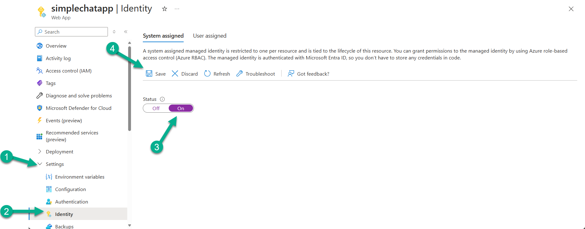
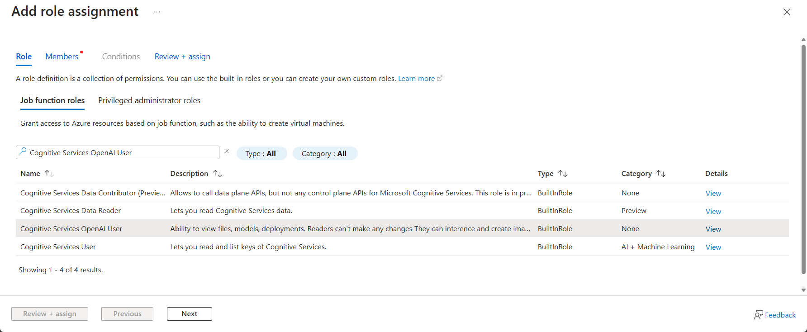

Managed identity works best when you treat it as an incremental migration. Enable the identity, assign the right RBAC roles, switch each service configuration over deliberately, and only then remove the old keys.

<section class="latest-release-card-grid">
      <article class="latest-release-card">
            <div class="latest-release-card-icon"><i class="bi bi-person-badge"></i></div>
            <h2>Enable the App Service identity</h2>
            <p>Everything starts with turning on system-assigned or user-assigned managed identity and confirming the principal exists before you assign roles.</p>
      </article>
      <article class="latest-release-card">
            <div class="latest-release-card-icon"><i class="bi bi-shield-check"></i></div>
            <h2>Grant RBAC per service</h2>
            <p>Azure OpenAI, Search, Cosmos DB, Storage, Speech, and other services each need the correct role assignment at the right scope.</p>
      </article>
      <article class="latest-release-card">
            <div class="latest-release-card-icon"><i class="bi bi-sliders"></i></div>
            <h2>Switch the app configuration</h2>
            <p>Use Admin Settings or application settings to move each dependency from keys or connection strings to managed-identity authentication.</p>
      </article>
      <article class="latest-release-card">
            <div class="latest-release-card-icon"><i class="bi bi-trash3"></i></div>
            <h2>Remove secrets last</h2>
            <p>Do not delete old credentials until you have validated the new path with connection tests and real workflows.</p>
      </article>
</section>

<div class="latest-release-note-panel">
      <h2>Not every service behaves the same way</h2>
      <p>Most services can move cleanly to managed identity, but Cosmos DB and Speech usually deserve extra attention because RBAC scope and endpoint details matter more there than they do with simpler key-based setups.</p>
</div>

## What is Managed Identity?

**Managed Identity** is an Azure feature that provides an automatically managed identity for your App Service to authenticate to Azure resources. It eliminates the need to store connection strings, API keys, or other secrets in your application.

### Benefits of Managed Identity

- 🔒 **Enhanced Security**: No secrets stored in configuration
- 🔄 **Automatic Management**: Azure handles credential rotation
- 🎯 **Least Privilege**: Granular role-based access control
- 📊 **Better Auditing**: Clear audit trail of access
- ✅ **Zero Trust**: Supports zero trust architecture

### Managed Identity vs App Registration

**Managed Identity (System-Assigned):**
- Tied to your App Service instance
- Used for Azure resource-to-resource authentication
- Automatically managed by Azure
- Cannot be used for user login

**App Registration:**
- Manual creation in Azure AD
- Used for user authentication flows  
- Can also authenticate to resources (but Managed Identity preferred)
- Required for user login functionality

## Prerequisites

- Simple Chat deployed to Azure App Service
- Admin access to Azure portal
- Permissions to assign roles on target Azure resources

## Step 1: Enable Managed Identity

### Enable System-Assigned Managed Identity

1. **Navigate** to your App Service in Azure Portal
2. Go to **Settings** → **Identity**  
3. Under **System assigned** tab:
   - Switch **Status** to **On**
   - Click **Save**
4. **Note the Object (principal) ID** - you'll need this for role assignments



### Verify Identity Creation

After enabling, Azure creates an identity for your App Service in Azure AD. You can verify this by:
- Checking the Object ID is displayed
- The identity will appear in Azure AD Enterprise Applications

## Step 2: Assign Required Roles

For each Azure service Simple Chat uses, assign the appropriate role to your Managed Identity.

### Role Assignment Process

1. **Go to target Azure resource** (e.g., Azure OpenAI)
2. Navigate to **Access control (IAM)**
3. Click **+ Add** → **Add role assignment**  
4. **Select appropriate role** (see table below)
5. **Assign access to**: Managed identity
6. **Members**: Click **+ Select members**
7. Choose your **subscription**
8. Select **App Service** as managed identity type
9. **Find and select your App Service**
10. Click **Select**, then **Review + assign**



### Required Roles by Service

| Azure Service | Required Role | Purpose |
|---------------|---------------|---------|
| **Azure OpenAI** | `Cognitive Services OpenAI User` | Generate completions, embeddings, images |
| **Azure AI Search** | `Search Index Data Contributor` | Read/write search indexes |
| **Azure Cosmos DB** | `Cosmos DB Built-in Data Contributor` | Read/write database operations |
| **Document Intelligence** | `Cognitive Services User` | Document analysis and OCR |
| **Content Safety** | `Cognitive Services User` | Content moderation |
| **Azure Storage** | `Storage Blob Data Contributor` | Enhanced citations file storage |
| **Speech Service** | `Cognitive Services User` | Audio transcription |

### Cosmos DB Special Considerations

For Cosmos DB, you have two options:

**Option A: Built-in Data Contributor (Recommended)**
```
Role: Cosmos DB Built-in Data Contributor
Scope: Cosmos DB Account level
Benefits: Proper RBAC, fine-grained permissions
```

**Option B: Custom Role (Advanced)**
```
Create custom role with specific permissions:
- Microsoft.DocumentDB/databaseAccounts/readMetadata
- Microsoft.DocumentDB/databaseAccounts/sqlDatabases/containers/items/*
- Microsoft.DocumentDB/databaseAccounts/sqlDatabases/containers/readChangeFeed
```

**Option C: Keep Key Authentication**
```
If RBAC is complex for your organization:
- Keep using connection string/key
- Focus Managed Identity on other services first
```

## Step 3: Configure Application Settings

Remove API keys and configure Managed Identity authentication.

### Method 1: Admin Settings UI (Recommended)

Most services can be configured through the Admin Settings interface:

**Azure OpenAI Services:**
1. Go to **Admin Settings** → **GPT** section
2. Select **Managed Identity** from authentication dropdown
3. Test connection using **Test** button
4. Repeat for **Embeddings** and **Image Generation** sections

**Azure AI Search:**
1. Go to **Admin Settings** → **Search & Extract**  
2. Select **Managed Identity** authentication
3. Test connection

**Content Safety:**
1. Go to **Admin Settings** → **Safety**
2. Choose **Managed Identity** authentication
3. Test connection

**Storage Account (Enhanced Citations):**
1. Go to **Admin Settings** → **Citations**
2. Enable **Enhanced Citations**  
3. Select **Managed Identity** for authentication
4. Remove connection string configuration

### Method 2: Application Settings (Advanced)

If UI configuration isn't available, use App Service Application Settings:

**Cosmos DB:**
```
Add:
AZURE_COSMOS_AUTHENTICATION_TYPE=managed_identity

Remove:
AZURE_COSMOS_KEY
AZURE_COSMOS_CONNECTION_STRING
```

**Azure OpenAI:**
```
Add:
AZURE_OPENAI_USE_MANAGED_IDENTITY=True

Remove:
AZURE_OPENAI_KEY
```

**Other services:**
Most other services should be configured via Admin Settings UI rather than environment variables.

## Step 4: Test Configuration

### Connection Testing

Test each service connection:

1. **Go to Admin Settings**
2. **For each configured service**:
   - Click **Test Connection** button
   - Verify success message
   - Check for any error messages

### Functional Testing

Test Simple Chat functionality:

1. **Upload a document** (tests Document Intelligence, AI Search, Cosmos DB)
2. **Start a chat conversation** (tests Azure OpenAI, embeddings)
3. **Try image generation** if enabled (tests DALL-E)
4. **Test content safety** if enabled
5. **Verify enhanced citations** if configured

### Troubleshooting Failed Tests

**"Access denied" errors:**
- Verify role assignments are complete
- Check role assignment scope (resource vs resource group)
- Wait 5-10 minutes for role propagation

**"Authentication failed" errors:**
- Verify Managed Identity is enabled
- Check App Service identity Object ID matches role assignments
- Restart App Service to refresh identity

**"Service not found" errors:**
- Verify endpoint URLs are correct
- Check if service is in different region/subscription
- Confirm service is accessible from App Service network

## Step 5: Remove API Keys

After confirming Managed Identity works, remove stored secrets:

### From App Service Application Settings

Remove these settings if present:
```
AZURE_COSMOS_KEY
AZURE_COSMOS_CONNECTION_STRING
AZURE_OPENAI_KEY
AZURE_SEARCH_KEY
AZURE_DOCUMENT_INTELLIGENCE_KEY
AZURE_CONTENT_SAFETY_KEY
AZURE_STORAGE_CONNECTION_STRING
AZURE_SPEECH_KEY
```

### From Key Vault (if used)

If using Azure Key Vault:
1. Update Key Vault references to use Managed Identity
2. Remove old API key secrets
3. Grant Key Vault access to App Service Managed Identity

### Update Deployment Scripts

Update your Infrastructure as Code:
- Remove API key parameters
- Add role assignments for Managed Identity
- Update application configuration

## Advanced Configuration

### User-Assigned Managed Identity

For more complex scenarios, consider User-Assigned Managed Identity:

**Benefits:**
- Shared across multiple App Services
- Survives App Service deletion/recreation
- Better for complex environments

**Setup:**
1. Create User-Assigned Managed Identity
2. Assign to App Service
3. Use same role assignment process
4. Configure application to use specific identity

### Network Integration

When using Private Endpoints:

**Managed Identity considerations:**
- Managed Identity works with Private Endpoints
- Ensure DNS resolution works correctly
- Test connectivity after network changes
- Monitor for authentication issues

### Multi-Region Deployments

For multi-region setups:

**Identity management:**
- Each App Service gets its own System-Assigned identity
- Role assignments needed in each region
- Consider User-Assigned identity for consistency
- Plan for cross-region failover scenarios

## Security Best Practices

### Least Privilege Access
- ✅ Assign minimum required roles only
- ✅ Scope roles to specific resources when possible
- ✅ Review role assignments regularly
- ✅ Remove unused role assignments

### Monitoring and Auditing  
- ✅ Enable Azure AD audit logs
- ✅ Monitor for authentication failures
- ✅ Set up alerts for suspicious access patterns
- ✅ Regular access reviews

### Credential Hygiene
- ✅ Remove all API keys after Managed Identity setup
- ✅ Rotate any remaining secrets regularly
- ✅ Use Key Vault for secrets that can't use Managed Identity
- ✅ Document authentication methods used

## Troubleshooting Common Issues

### Role Assignment Problems

**Issue**: Role assignment not working after 10+ minutes
**Solution**: 
- Verify correct Managed Identity Object ID
- Check role assignment scope
- Try removing and re-adding assignment
- Restart App Service

**Issue**: Can't find App Service in role assignment
**Solution**:
- Ensure Managed Identity is enabled
- Wait a few minutes after enabling
- Check you're in correct subscription
- Try using Object ID directly

### Authentication Failures

**Issue**: "Managed Identity is not enabled" error
**Solution**:
- Verify System-Assigned identity is On
- Check Application Settings for correct configuration
- Restart App Service
- Verify deployment region compatibility

**Issue**: Intermittent authentication failures  
**Solution**:
- Check for network connectivity issues
- Verify Private Endpoint configuration
- Monitor for service throttling
- Implement retry logic in application

### Service-Specific Issues

**Cosmos DB connection issues:**
```
Common problems:
- Using wrong authentication type setting
- Role assignment on wrong scope
- Firewall blocking App Service
- Account key still being used

Solutions:
- Verify AZURE_COSMOS_AUTHENTICATION_TYPE=managed_identity  
- Check role assignment is on Cosmos account
- Add App Service to Cosmos DB firewall
- Remove key-based settings completely
```

**Azure OpenAI access denied:**
```
Common problems:
- Missing Cognitive Services OpenAI User role
- Wrong Azure OpenAI resource
- Regional deployment model differences

Solutions:
- Verify role assignment on correct OpenAI resource
- Check model deployment names match
- Test with different deployment if available
```

## Migration Checklist

**Pre-migration:**
- [ ] Document current API key configuration
- [ ] Test current functionality works properly  
- [ ] Prepare rollback plan
- [ ] Schedule maintenance window

**Migration steps:**
- [ ] Enable Managed Identity on App Service
- [ ] Assign required roles to all target services
- [ ] Configure Managed Identity in Admin Settings
- [ ] Test each service connection
- [ ] Verify full application functionality
- [ ] Remove API keys from configuration

**Post-migration:**
- [ ] Monitor application for 24-48 hours
- [ ] Verify no authentication errors in logs
- [ ] Update documentation and runbooks
- [ ] Train team on new authentication model

This guide provides a comprehensive approach to implementing Managed Identity with Simple Chat. The enhanced security and reduced operational overhead make it the recommended authentication method for production deployments.
